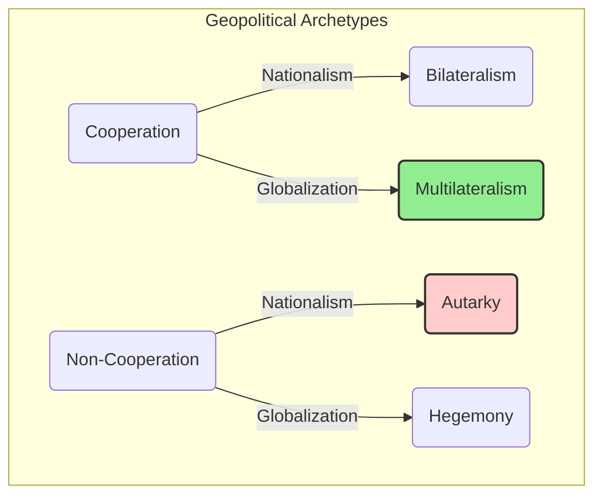

## Reading 16: Introduction to Geopolitics

### 🎯 Introduction

Welcome, future charterholder! Imagine the world is a giant chessboard, and each country is a player. ♟️ Some players work together, forming alliances and trading pieces freely. Others play a competitive game, trying to control the board and protect their own territory at all costs. **Geopolitics** is the study of this grand game—the interactions between nations, the strategies they use, and how geography itself shapes their moves.

This reading is your guide to understanding the rules of this global chessboard. You'll learn how cooperation, competition, and globalization shape the world we invest in, and how to spot the risks and opportunities that arise from these powerful international forces.

-----

### Part 1: The Two Spectrums - Cooperation & Globalization 🌐

To understand geopolitics, we can place a country's behavior on two key spectrums.

#### 1.1 Key Spectrums

* **Cooperation vs. Non-Cooperation:** This axis measures how willing a country is to work with other nations on shared goals, from military alliances to economic agreements.
* **Globalization vs. Nationalism:** This axis measures a country's focus. **Globalization** is about economic and cultural integration with the rest of the world. **Nationalism** is about prioritizing a country's own interests and self-reliance, independent of others.

Combining these two spectrums gives us four main archetypes of geopolitical behavior.

* **Autarky (Non-Cooperation + Nationalism):** The hermit kingdom. This country aims for complete self-sufficiency, closing itself off from international trade and cooperation. Think of North Korea.
* **Hegemony (Non-Cooperation + Globalization):** The powerful influencer. 💪 This country is open to globalization but is large and powerful enough to influence global rules and outcomes without needing to cooperate closely with others.
* **Bilateralism (Cooperation + Nationalism):** The one-on-one dealmaker. 🤝 This country prefers to make agreements with individual countries one at a time, rather than joining large, multi-country groups.
* **Multilateralism (Cooperation + Globalization):** The team player. 🌍 This country actively engages in international trade and is a member of many international organizations, working with many other nations on shared goals. Most modern developed economies fall into this category.

-----

### Part 2: The Global Referees - IMF, World Bank, and WTO 🏛️

To facilitate global cooperation and trade, several key international organizations were created. They act as the referees and support staff for the global economy.

#### 2.1 Key Organizations

| Organization | Primary Mission | Key Functions |
| :--- | :--- | :--- |
| **International Monetary Fund (IMF)** | To ensure the stability of the international monetary system. | • Promotes exchange rate stability. • Provides financial assistance to countries facing balance of payments crises. • Acts as a global lender of last resort. |
| **World Bank** | To reduce poverty and support development in emerging economies. | • Provides low-interest loans, grants, and technical assistance to developing countries for projects like infrastructure, education, and healthcare. |
| **World Trade Organization (WTO)** | To supervise and liberalize international trade. | • Administers trade agreements. • Acts as a forum for trade negotiations. • Settles trade disputes between member countries. |

**💡 CFA Exam Tip ✍️:** A simple way to remember the difference: **IMF** = Financial Stability (the world's emergency fund). **World Bank** = Development & Poverty Reduction (the world's development fund). **WTO** = Trade Rules (the world's trade referee).

-----

### Part 3: What Could Go Wrong? Understanding Geopolitical Risk 💣

**Geopolitical risk** is the risk that international events and conflicts will disrupt peaceful relations and negatively impact investments. There are three main types.

#### 3.1 Types of Geopolitical Risk

* **Event Risk:** Risks from events where we know the timing, but not the outcome.
  * *Example:* A national election in a major country like the U.S. or India. The outcome could lead to significant policy changes.
* **Exogenous Risk:** Risks from surprise events that are not easily predicted.
  * *Example:* The sudden outbreak of a war, a terrorist attack, or a revolution. These are "black swan" type events.
* **Thematic Risk:** Risks from long-term, evolving trends.
  * *Example:* Climate change, global migration patterns, the rise of cybersecurity threats. These are slow-moving but can have massive long-term impacts.

When analyzing these risks, an investor should consider:

* **Likelihood:** How probable is the event?
* **Impact:** How much would it affect asset values if it happened?
* **Velocity:** How quickly would the impact be felt in the markets?

-----

### Part 4: The Tools of the Game - How Nations Exert Influence 🛠️

Countries use a variety of tools to achieve their geopolitical goals.

#### 4.1 Tools of Influence

* **National Security Tools:** The most direct form of power. This includes military force, intelligence and espionage, and forming security alliances like NATO.
* **Economic Tools:** Using trade to influence others.
  * **Cooperative:** Forming free trade areas, common markets, and economic unions.
  * **Non-Cooperative:** Imposing tariffs, quotas, and **nationalization** (the state taking control of private companies or industries).
* **Financial Tools:** Using capital flows to exert influence.
  * **Cooperative:** Allowing free movement of foreign investment and currencies.
  * **Non-Cooperative:** Imposing capital controls or using **sanctions** to restrict a specific country's access to the global financial system.

**💡 CFA Exam Tip ✍️:** Be able to classify different actions. For example, if a country imposes tariffs on imports, you should recognize that as a non-cooperative economic tool. If two countries form a free trade area, that's a cooperative economic tool.

-----

### Global & Local Context 🌍

* **Global Example:** The European Union is a prime example of multilateralism, with member states cooperating on trade, security, and policy. The U.S.-China trade war illustrates non-cooperative economic tools (tariffs, sanctions).
* **Indian Example:** India's participation in the BRICS group and regional trade agreements (SAARC, ASEAN) shows both bilateral and multilateral approaches. India's use of tariffs and capital controls in certain sectors demonstrates non-cooperative tools.

-----

### 🧪 Formula Summary

This reading is entirely conceptual. There are **no formulas** you need to memorize. Your focus should be on understanding the frameworks and definitions.

-----

### 🎯 Quick Exam-Day Pointers

* **The 2x2 Framework is Key:**  
  * **Archetypes:** **Autarky**, **Hegemony**, **Bilateralism**, **Multilateralism**  
  * ✅ Be able to place a country's actions within this framework.
* **Know the "Big Three" Organizations:**  
  * **IMF:** Stability  
  * **World Bank:** Development  
  * **WTO:** Trade
* **Remember the 3 Types of Risk:**  
  * **Event** (elections)  
  * **Exogenous** (surprise attacks)  
  * **Thematic** (long-term trends like climate change)
* **Tools of Influence:**  
  * Categorize a country's actions into **National Security**, **Economic**, or **Financial** tools  
  * Recognize if they are cooperative or non-cooperative

