## 🚀 Reading 17: International Trade

### 🎯 Introduction

Welcome, future charterholder! Imagine you're a fantastic baker, famous for your bread. Your next-door neighbor has a magical garden that grows the best vegetables. You *could* spend half your day trying to grow your own mediocre vegetables, and your neighbor could spend their day baking a rock-hard loaf of bread. Or... you could both do what you're best at and trade! 🥖🥕

This is the essence of **international trade**. Countries, like people, are better at producing certain things. **Comparative advantage** is the idea that if every country specializes in in what it produces most efficiently and trades for the rest, the whole world gets more stuff, and everyone becomes wealthier. This reading is your world map, showing you the benefits of this global trade, the roadblocks countries sometimes put up, and the exclusive clubs (**trading blocs**) they form to trade even more freely.

-----

### Part 1: Why Do Countries Trade? The Good and The Bad 🤔

The fundamental reason for trade is that it increases overall economic welfare. When countries open their borders to trade, magic happens.

**The Benefits (The Good Stuff) ✅:**

  * **More for Everyone:** Specialization based on **comparative advantage** increases total global output of goods and services.
  * **Economies of Scale:** By producing for a global market, firms can achieve larger scale, which lowers their costs per unit.
  * **More Competition:** Increased competition from foreign firms pressures domestic companies to become more efficient, improve quality, and lower prices. This also reduces the pricing power of domestic monopolies.
  * **Greater Variety:** Consumers get access to a wider variety of goods and services from around the world.
  * **Global Growth:** Trade allows for a more efficient allocation of productive resources worldwide, boosting global economic growth.

**The Costs (The Not-So-Good Stuff) ❌:**

  * **Job Losses:** The biggest cost is borne by workers and firms in domestic industries that can't compete with cheaper imports. This can lead to significant job losses and lower wages in those specific sectors.
  * **Increased Inequality:** While the country as a whole benefits, the gains are not always distributed evenly. The costs are concentrated in specific industries, which can increase income inequality in the short run.

The core economic argument is that the gains from trade are greater than the losses. In theory, the winners could compensate the losers, and everyone would still be better off.

##### **Global & Local Context 🌍**

A perfect example is the global IT industry. India has a **comparative advantage** in IT services due to a large, skilled, English-speaking workforce and lower labor costs. India exports these services to the world. Meanwhile, Germany has a comparative advantage in high-precision engineering. India imports specialized German machinery for its factories. Both countries win by focusing on what they do best and trading for the rest.

-----

### Part 2: Building Walls - How Countries Restrict Trade 🧱

Despite the benefits of free trade, governments often impose **trade restrictions** for various reasons, such as protecting domestic industries or for national security.

| Type of Restriction | What It Is |
| :--- | :--- |
| **Tariff** | A tax imposed on imported goods. |
| **Quota** | A physical limit on the quantity of a good that can be imported. |
| **Export Subsidy** | A payment from the government to a domestic firm to encourage exports. |
| **Minimum Domestic Content** | A requirement that a certain percentage of a product's value must be sourced from domestic producers. |
| **Voluntary Export Restraint (VER)** | A limit on exports that an exporting country voluntarily agrees to, usually under pressure from an importing country to avoid a tariff or quota. |

#### **The Economic Impact of Tariffs and Quotas**

Both tariffs and quotas are designed to reduce imports and protect domestic producers. Their effects are very similar.

```mermaid
graph TD
    subgraph Market for an Imported Good
        A[Price Rises 📈] --> B(Domestic Quantity Supplied Increases);
        A --> C(Domestic Quantity Demanded Decreases);
        B & C --> D{Quantity of Imports Falls 📉};
        D --> E["Domestic Producers Win (Higher Price, More Sales)"];
        D --> F["Domestic Consumers Lose (Higher Price, Less Choice)"];
        E & F --> G{"Overall National Welfare Decreases (Deadweight Loss)"};
    end
```

  * **Who Wins?** Domestic producers (they get a higher price and sell more) and the domestic government (it collects tariff revenue).
  * **Who Loses?** Domestic consumers (they pay a higher price and get less of the good) and foreign exporters.
  * **The Bottom Line:** For the country as a whole, the loss to consumers is greater than the gains to producers and the government. This net loss is called a **deadweight loss**.

The main difference between a tariff and a quota is what happens to the extra money. With a tariff, the government gets it. With a quota, the extra profit created by the artificially high price goes to whoever holds the import licenses. This profit is called **quota rents**. If foreign exporters get these licenses for free, the loss to the importing country is even larger.

#### **Capital Restrictions**

Besides restricting goods, countries sometimes impose **capital restrictions** on the flow of money for investment. This can include taxes on foreign investment income or limits on foreign ownership in certain industries. While these are generally thought to decrease economic welfare, they are sometimes used by developing countries to prevent instability from rapid inflows and outflows of foreign money.

> [!TIP]
> **CFA Exam Tip ✍️:** The exam loves to test the effects of tariffs and quotas. Remember this simple framework: **Price ↑, Imports ↓, Domestic Production ↑**. The key winners are **domestic producers**, and the key losers are **domestic consumers**. The country as a whole almost always loses.

-----

### Part 3: Teaming Up - The World of Trading Blocs 🤝

Countries often form **trading blocs** (also called Regional Trading Agreements or RTAs) to increase trade and economic welfare among the members. There are different levels of economic integration.

1.  **Free Trade Area (FTA):** Members remove all trade barriers (like tariffs) among themselves, but each country keeps its own separate trade policies with non-member countries. Example: USMCA (formerly NAFTA).
2.  **Customs Union:** This is an FTA *plus* all members adopt a common set of trade barriers and tariffs with non-member countries.
3.  **Common Market:** This is a Customs Union *plus* members allow the free movement of labor and capital between their countries. Example: MERCOSUR in South America.
4.  **Economic Union:** This is a Common Market *plus* members coordinate their economic policies and institutions. Example: The European Union (EU).
5.  **Monetary Union:** This is the deepest form of integration—an Economic Union *plus* members adopt a common currency. Example: The Eurozone countries within the EU.

-----

### 🧪 Formula Summary

This reading is conceptual. There are **no key formulas** you need to memorize. The focus is on understanding the economic concepts and their implications.

-----

> [!IMPORTANT]
>
> ### 🎯 Quick Exam-Day Pointers
>
>   * **Comparative Advantage is the "Why":** The core benefit of trade is that it allows countries to specialize in what they do best, increasing global production and wealth.
>   * **Restrictions Hurt Consumers:** Tariffs and quotas always raise prices for domestic consumers and reduce the quantity available. Domestic producers are the primary beneficiaries.
>   * **Tariff vs. Quota:** A tariff generates revenue for the government. A quota generates **quota rents** for the holders of the import licenses.
>   * **Know the Hierarchy of Trading Blocs:** Memorize the levels of integration in order: Free Trade Area → Customs Union → Common Market → Economic Union → Monetary Union. Each step adds a new layer of integration.
