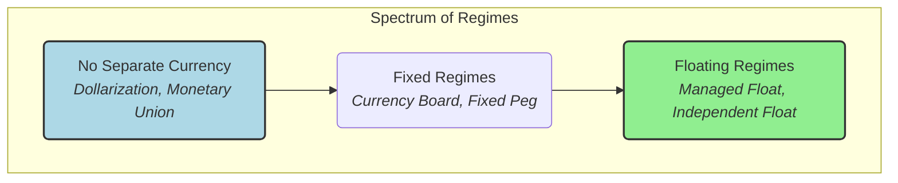

## Reading 18: Capital Flows and the FX Market

### 🎯 Introduction

Welcome, future charterholder! Imagine a massive, 24/7 global bazaar where instead of spices and silks, traders are buying and selling currencies: US dollars, Indian rupees, euros, and Japanese yen. This is the **foreign exchange (FX) market**, the largest and most liquid market in the world. 🌍

Why does this market exist? Because an Indian company that wants to buy German machinery needs euros, and a Japanese tourist visiting the Taj Mahal needs rupees. This reading is your passport to this global bazaar. You'll learn how currency prices (**exchange rates**) are quoted, what rules countries follow to manage their currencies, and how the flow of money for trade and investment shapes the global economic landscape.

-----

### Part 1: Welcome to the FX Bazaar 💰 (LOS 18.a)

The **foreign exchange market** is where currencies are traded. Its participants range from giant corporations and investment funds to central banks and individual tourists.

#### 1.1 Key Participants

* **Corporations:** Buy and sell foreign goods, requiring currency exchange.
* **Investment Accounts:**
  * **Real money accounts** (like mutual funds) invest directly in foreign stocks and bonds.
  * **Leveraged accounts** (like hedge funds) speculate on currency movements using derivatives.
* **Governments & Central Banks:** Intervene in the market to manage their currency's value.
* **Retail Market:** Individuals trading for tourism or small-scale speculation.

#### 1.2 Nominal vs. Real Exchange Rates

* **Nominal Exchange Rate:** This is the rate you see on the news. It's the straightforward price of one currency in terms of another.
  * Example: A quote of `USD/EUR 1.42` means 1 euro costs 1.42 US dollars. Here, the **EUR** is the **base currency** and the **USD** is the **price currency**.
* **Real Exchange Rate:** This tells the real story about purchasing power. It's the nominal rate adjusted for inflation in both countries. It answers the question: "How many baskets of Indian goods can I buy for one basket of American goods?"

$$\text{Real Exchange Rate} = S \times \left( \frac{CPI_f}{CPI_d} \right)$$

Where:

* $S$ is the nominal spot rate (domestic/foreign).
* $CPI_f$ is the Consumer Price Index of the foreign country.
* $CPI_d$ is the Consumer Price Index of the domestic country.

##### 1.2.1 Example 🧮

Let's say the nominal exchange rate is `USD/GBP 1.70`. The US CPI is 110, and the UK CPI is 112. The base period real rate was 1.0.

$$\text{Real Exchange Rate}_{\frac{USD}{GBP}} = 1.70 \times \left( \frac{112}{110} \right) = 1.73$$

An increase in the real exchange rate means that the purchasing power of the base currency (GBP) has increased in terms of the price currency's (USD) goods.

#### 1.3 Calculating Currency Appreciation and Depreciation

A change in the exchange rate means one currency got stronger (**appreciated**) and the other got weaker (**depreciated**).

* **Example:** The `USD/EUR` exchange rate moves from 1.42 to 1.39.
  * **For the EUR (the base currency):** It now costs fewer dollars to buy one euro. So, the euro has **depreciated**.
    * Percentage change = (1.39 / 1.42) - 1 = **-2.11%**.
  * **For the USD (the price currency):** We need to flip the quotes to `EUR/USD`.
    * Start: 1 / 1.42 = 0.7042 EUR/USD
    * End: 1 / 1.39 = 0.7194 EUR/USD
    * It now costs more euros to buy one dollar. The dollar has **appreciated**.
    * Percentage change = (0.7194 / 0.7042) - 1 = **+2.16%**.

Notice the percentages are not mirror images!

**💡 CFA Exam Tip ✍️:** The exam will test your ability to distinguish between nominal and real rates and to correctly calculate appreciation/depreciation. Always be clear about which currency is the base currency. If the `A/B` rate goes up, currency B has appreciated.

-----

### Part 2: Rules of the Road - Exchange Rate Regimes 🚦 (LOS 18.b)

An **exchange rate regime** is the framework a country adopts for its currency's exchange rate. This framework exists on a spectrum from rigidly fixed to freely floating.

#### 2.1 Categories of Regimes

* **Countries Without Their Own Currency:**
  * **Formal Dollarization:** A country gives up its currency and adopts the currency of another country (e.g., Ecuador uses the US dollar). It completely gives up monetary policy independence.
  * **Monetary Union:** Several countries share a common currency and a single central bank (e.g., the Eurozone).
* **Countries With Their Own Currency:**
  * **Fixed Regimes:**
    * **Currency Board:** A very rigid peg where the domestic currency is fully backed by a foreign currency at a fixed rate (e.g., Hong Kong's link to the USD).
    * **Conventional Fixed Peg:** The country pegs its currency to another currency or a basket of currencies within a narrow band of ±1%.
    * **Target Zone:** A fixed peg with a wider band (e.g., ±2%).
    * **Crawling Peg:** The peg is adjusted periodically, usually to account for inflation differences.
  * **Floating Regimes:**
    * **Managed Float:** The central bank actively intervenes to influence the exchange rate without a specific target. This is what countries like India and China practice.
    * **Independently Floating:** The exchange rate is determined purely by market forces of supply and demand. The central bank rarely intervenes (e.g., USD, JPY).

#### 2.2 Mnemonic for Exchange Rate Regimes

**💡 MNEMONIC: "Dogs Must Carry Cats To Catch Mice Individually"**
- **D**ogs = **D**ollarization
- **M**ust = **M**onetary Union
- **C**arry = **C**urrency Board
- **C**ats = **C**onventional Fixed Peg
- **T**o = **T**arget Zone
- **C**atch = **C**rawling Peg
- **M**ice = **M**anaged Float
- **I**ndividually = **I**ndependently Floating

-----

### Part 3: The Domino Effect - Exchange Rates and the Economy 💥 (LOS 18.c)

Changes in exchange rates have powerful effects on a country's trade and capital flows.

#### 3.1 The Elasticities and Absorption Approaches

* **Elasticities Approach:** This focuses on how a currency depreciation affects the **trade balance** (Exports - Imports). A weaker currency makes exports cheaper for foreigners and imports more expensive for locals. If demand for exports and imports is sufficiently elastic (responsive to price changes), a depreciation will improve the trade balance.
* **Absorption Approach:** This looks at the trade balance from a different angle: **`Trade Balance = National Income - National Absorption`** (where absorption is total spending). To improve the trade balance, a country must either increase its income (produce more) or decrease its absorption (spend less).

#### 3.2 The Link Between Trade and Capital Flows

This is a fundamental macroeconomic identity:

$$(\text{Exports} - \text{Imports}) = (\text{Private Savings} - \text{Investment}) + (\text{Tax Revenue} - \text{Gov't Spending})$$

* A **trade deficit** (Imports > Exports) means the left side is negative.
* This *must* be balanced by the right side. It implies that a country's domestic investment is greater than its domestic savings (`I > S`).
* How is this gap funded? By a **capital account surplus**—a net inflow of foreign capital.

In simple terms: **A country that runs a trade deficit is spending more than it produces, and it finances this by borrowing from the rest of the world.**

**💡 CFA Exam Tip ✍️:** The link between the current account (trade) and the capital account is a crucial, frequently tested concept. Remember: **Current Account Deficit = Capital Account Surplus**. They are two sides of the same coin.

#### 3.3 Global & Local Context 🌍

* **Global Example:** The U.S. has run persistent trade deficits, financed by capital inflows from countries like China and Japan.
* **Indian Example:** India's trade deficit is often financed by foreign investment in Indian stocks and bonds, as well as remittances from Indians working abroad.

-----

### Part 4: Building Fences for Money - Capital Restrictions 🚧 (LOS 18.d)

Governments sometimes impose **capital restrictions** to limit the flow of investment capital across their borders.

#### 4.1 Common Objectives

* **Reduce Volatility:** To prevent huge, destabilizing inflows or outflows of "hot money" that can cause domestic asset prices to bubble or crash.
* **Maintain Monetary Policy Control:** Unrestricted capital flows can make it difficult for a central bank to control its domestic interest rates and money supply.
* **Protect Strategic Industries:** To prevent foreign takeovers of industries deemed critical to national security.

-----

### 🧪 Formula Summary

**Real Exchange Rate (d/f):**

$$\text{Real Exchange Rate (d/f)} = \text{Nominal Rate (d/f)} \times \left( \frac{CPI_{f}}{CPI_{d}} \right)$$

**Percentage Change in Currency Value:**

$$\Delta = \left( \frac{Rate_{end}}{Rate_{begin}} \right) - 1$$

**Macroeconomic Balance Equation:**

$$X - M = (S - I) + (T - G)$$

-----

### 🎯 Quick Exam-Day Pointers

* **Base vs. Price:** Always identify the base and price currencies in a quote. If `USD/EUR` goes from 1.40 to 1.50, the euro (base) has appreciated.
* **Real vs. Nominal:** The **real exchange rate** is the **nominal rate adjusted for inflation**. It reflects true purchasing power.
* **Regime Spectrum:** Know the hierarchy of exchange rate regimes from most rigid (dollarization) to most flexible (independent float).
* **Two Sides of the Coin:** A **current account deficit** MUST be financed by a **capital account surplus**. A country that buys more than it sells must borrow from foreigners to pay for it.

