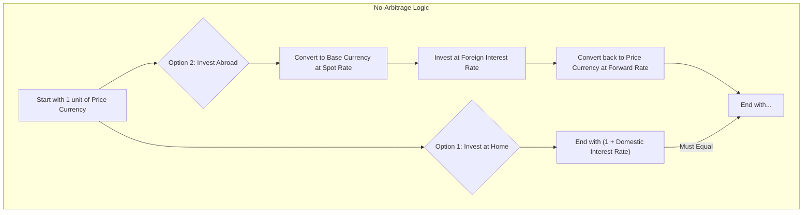

## 🚀 Reading 19: Exchange Rate Calculations

### 🎯 Introduction

Welcome, future charterholder! Imagine you're at a giant, chaotic airport currency exchange. You have Indian Rupees (INR) and want to buy Thai Baht (THB), but the booth only has prices for INR to USD and USD to THB. What do you do? You do a two-step trade! This is the essence of a **cross rate**.

Now, what if you need that Baht in 90 days, not today? You'd want to lock in a price now for a future exchange. That's a **forward rate**. This reading is your calculator and your rulebook for that currency exchange. You'll master the math of cross rates and learn the "no free lunch" principle that governs how forward rates are set, ensuring you can navigate the global currency markets like a pro.

-----

### Part 1: The Two-Step Trade - Calculating Cross Rates 💱

A **cross rate** is an exchange rate between two currencies that is derived from their individual exchange rates with a common third currency (usually the US dollar). It's how we price less common currency pairs.

The key is to set up the calculation so that the common currency "cancels out."

##### **Theory 🧠**

Let's say you have the following quotes:

  * `A/B` (Price of currency B in terms of A)
  * `B/C` (Price of currency C in terms of B)

To find the `A/C` cross rate, you just multiply them:
$$\left( \frac{A}{B} \right) \times \left( \frac{B}{C} \right) = \frac{A}{C}$$
The 'B' term cancels out!

##### **Example 🧮**

You are given the following quotes:

  * `MXN/USD` = 10.70 (10.70 Mexican pesos per US dollar)
  * `USD/AUD` = 0.60 (0.60 US dollars per Australian dollar)

What is the `MXN/AUD` cross rate?

$$\left( \frac{MXN}{USD} \right) \times \left( \frac{USD}{AUD} \right) = \frac{10.70 \text{ MXN}}{1 \text{ USD}} \times \frac{0.60 \text{ USD}}{1 \text{ AUD}} = 6.42 \frac{MXN}{AUD}$$

The cross rate is 6.42 Mexican pesos per Australian dollar.

> [!TIP]
> **CFA Exam Tip ✍️:** Getting the cross rate right is all about lining up the units. Write out the fractions like in the example above. If one of your quotes is "upside down" (e.g., you need `USD/AUD` but you're given `AUD/USD`), just take the inverse (1 / given rate) to flip it before you multiply.

-----

### Part 2: Pricing the Future - Forward Rates and the No-Arbitrage Rule ⚖️

A **forward exchange rate** is a rate agreed upon today for the exchange of two currencies at a specific future date. But how is this future rate determined? It's not a guess; it's set by a powerful force called the **no-arbitrage principle**.

This principle, also known as **Interest Rate Parity**, says that the forward exchange rate must be at a level that prevents traders from making a risk-free profit. It ensures that the return from investing in two different currencies is the same after accounting for the exchange rate.

#### **The Forward Rate Formula**

This logic leads to a crucial formula:

$$\frac{Forward}{Spot} = \frac{(1 + i_{\text{price currency}})}{(1 + i_{\text{base currency}})}$$

Which can be rearranged to:

$$Forward = Spot \times \frac{(1 + i_p)}{(1 + i_b)}$$

**Key takeaway:** The currency with the **higher interest rate** will trade at a **forward discount** (its forward price will be lower than its spot price). The currency with the **lower interest rate** will trade at a **forward premium**.

##### **Example 🧮**

Given:

  * Spot Rate (`ABE/DUB`) = 4.5671
  * 1-year risk-free rate in ABE (price currency) = 5%
  * 1-year risk-free rate in DUB (base currency) = 3%

What is the 1-year forward rate?

$$Forward = 4.5671 \times \frac{(1 + 0.05)}{(1 + 0.03)} = 4.5671 \times \frac{1.05}{1.03} = 4.6558$$

Because the ABE interest rate is higher, the DUB (base currency) must trade at a forward premium to prevent arbitrage.

> [!TIP]
> **CFA Exam Tip ✍️:** The logic is more important than memorizing the formula's p's and b's. Just remember: to prevent a free lunch, the higher interest rate currency *must* lose value in the forward market to offset its higher yield. So it will trade at a discount.

-----

### Part 3: Reading the Quotes - Points, Percentages, Premiums, and Discounts 📊

Forward rates are rarely quoted as an outright number. They are usually quoted as a difference from the spot rate.

#### **Forward Quotes in Points**

  * **Points** refer to the last decimal places of a spot quote. If a spot rate is quoted to 4 decimal places, 1 point = 0.0001.
  * The forward points are simply added to or subtracted from the spot rate.

**Example:**

  * `AUD/EUR` spot rate = 0.7313
  * 1-year forward quote = +3.5 points
  * The forward rate = 0.7313 + 0.00035 = **0.73165**

#### **Forward Quotes in Percentage**

  * The forward rate is given as a percentage deviation from the spot rate.

**Example:**

  * `AUD/EUR` spot rate = 0.7313
  * 120-day forward quote = –0.062%
  * The forward rate = 0.7313 × (1 - 0.00062) = **0.7308**

#### **Forward Premium vs. Forward Discount**

This simply describes whether the forward price of a currency is higher or lower than its spot price.

  * If **Forward > Spot**, the base currency is trading at a **forward premium**.
  * If **Forward < Spot**, the base currency is trading at a **forward discount**.

**Formula for the percentage premium/discount:**
$$\% \text{ Premium or Discount} = \left( \frac{Forward}{Spot} \right) - 1$$

**Example:**

  * Spot `USD/EUR` = 1.312
  * 90-day Forward `USD/EUR` = 1.320

The forward premium on the euro (the base currency) is:
$$\left( \frac{1.320}{1.312} \right) - 1 = 0.0061 = \boldsymbol{+0.61\%}$$
The euro is trading at a 0.61% forward premium for 90 days.

-----

### 🧪 Formula Summary

  * **Cross Rate:**
    $$\frac{A}{C} = \frac{A}{B} \times \frac{B}{C}$$
  * **No-Arbitrage Forward Rate (Interest Rate Parity):**
    $$Forward = Spot \times \frac{(1 + i_{\text{price currency}})}{(1 + i_{\text{base currency}})}$$
  * **Forward Premium/Discount (%):**
    $$\% \text{ Premium/Discount} = \left( \frac{Forward}{Spot} \right) - 1$$

-----

> [!IMPORTANT]
>
> ### 🎯 Quick Exam-Day Pointers
>
>   * **Cancel the Currency:** For cross rates, write out the fractions and make sure the middle currency cancels out. This will save you from making simple mistakes.
>   * **High Interest = Forward Discount:** The currency with the higher interest rate *must* depreciate in the forward market to prevent arbitrage. It will always trade at a discount.
>   * **Points are Decimals:** Remember that "points" refer to the final decimal places of the spot quote. If the spot is to 4 decimals, `+20` points means you add `0.0020`.
>   * **Premium/Discount is for the BASE currency:** When you calculate a percentage premium or discount, the result applies to the currency in the denominator (the base currency) of your `Forward/Spot` calculation.
