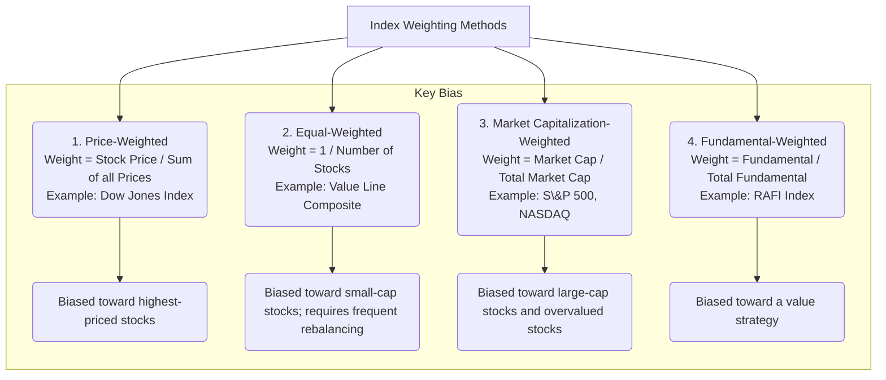

## Reading 40: Security Market Indexes 📊

### 🎯 Introduction

Welcome to the world of benchmarks\! Think of a security market index (like the S\&P 500) as a **ruler for the market**. It's a portfolio of securities that represents a *part* of the market, and its performance is the yardstick we use to measure everything else.

How is this "ruler" built? Does it measure every stock equally, or do giants like Apple and Microsoft have a bigger impact? This reading is crucial because it teaches you how indexes are constructed, their different weighting methods, and their uses. Mastering this will help you understand portfolio performance, index funds, and market movements.

-----

### Part 1: How to Build an Index (LOS 40.a, 40.b, 40.c, 40.d, 40.e)

Building an index involves several key choices, and each choice creates a different "ruler" with different properties.

#### 1.1 Price Return vs. Total Return (LOS 40.b)

This is a fundamental distinction. What are we measuring?

  * **Price Index:** This *only* measures the change in the prices of the component securities. This is the most commonly quoted type (e.g., "The S\&P 500 is up 10%").
  * **Total Return Index:** This measures both **price changes** AND **income** from the securities. For stocks, this means it **reinvests all dividends**.
      * A total return index value will *always* be higher than its corresponding price index value (assuming dividends are paid).
      * **CFA Exam Tip:** For performance evaluation, the **Total Return Index** is the *only* appropriate benchmark, as it reflects the true growth of an investment.

#### 1.2 Index Construction: The 3 Key Decisions (LOS 40.c, 40.d)

When an index provider (like S\&P or FTSE) creates an index, they must decide:

1.  **What is the Target Market?** (e.g., "U.S. Large-Cap Stocks" or "Emerging Market Government Bonds").
2.  **Which Securities are Included?** (e.g., all 500 of the largest, or just a sample?).
3.  **How Should the Securities be Weighted?** This is the most important part.

#### 1.3 The 4 Weighting Methods (LOS 40.d, 40.e)

This is the core of the reading. The weighting method determines how much impact each security has on the index's value.

**💡 MNEMONIC: "Price, Equal, Cap, Fund"**

  * **P**rice-Weighted: Highest **Price** has the most weight.
  * **E**qual-Weighted: All stocks have **Equal** weight (e.g., 1%).
  * **Cap**-Weighted: Highest **Market Cap** has the most weight.
  * **Fund**amental-Weighted: Highest **Fundamental** (e.g., Sales, EPS) has the most weight.

**1. Price-Weighted Index**

  * **How it works:** The weight of each stock is its *price* divided by the sum of all prices. It's like buying **one share** of each stock in the index.
  * **Calculation:** `Index Value = Sum of Stock Prices / Divisor`
  * **Key Issue:** A stock split *forces* the provider to change the divisor to keep the index value from jumping.
  * **Bias:** A stock trading at `$200` has 10x the impact of a stock trading at $20, regardless of the company's actual size. This is widely seen as a major flaw.

**2. Equal-Weighted Index**

  * **How it works:** The index invests the **same amount of money** in every single stock. If there are 100 stocks, each gets a 1% weight.
  * **Calculation:** Calculated as the simple arithmetic average of the returns of all index stocks.
  * **Bias:** It gives the same weight to Apple (multi-trillion cap) as it does to the smallest stock in the index. This means it's implicitly a **small-cap tilt**.
  * **Key Issue:** It must be **rebalanced** constantly. As some stocks rise and others fall, their weights drift. To get back to "equal," the manager must *sell winners* and *buy losers*, which creates transaction costs.

**3. Market Capitalization-Weighted Index (Most Common)**

  * **How it works:** The weight of each stock is its *market cap* (Price × Shares) divided by the *total market cap* of all stocks in the index.
  * **Calculation:** `Index Value = (Sum of Mkt Caps) / Divisor`
  * **Key Feature:** This is self-correcting. It requires **no rebalancing** *unless* new stocks are added/removed. If a stock's price doubles, its market cap doubles, and its weight in the index doubles automatically.
  * **Bias:** It is heavily biased toward the **largest companies**. It also has a "momentum" bias—as stocks get bigger and more expensive, they become a *bigger* part of the index.
  * **Float-Adjusted:** Most modern cap-weighted indexes (like the S\&P 500) are **float-adjusted**. This means they *only* use the number of shares available for public trading (the "market float") and exclude shares held by insiders or governments.

**4. Fundamental-Weighted Index**

  * **How it works:** This method tries to break the link between price and weight. It weights stocks based on a *fundamental* measure like sales, earnings, dividends, or book value.
  * **Bias:** This approach gives a higher weight to firms that are large fundamentally but "cheap" on a price basis. It is effectively a **value strategy**.

-----

### Part 2: Managing and Using Indexes (LOS 40.f, 40.g, 40.h, 40.j, 40.k)

#### 2.1 Rebalancing vs. Reconstitution (LOS 40.f)

This is a classic point of confusion.

  * **Rebalancing:** Adjusting the *weights* of the securities in the index back to their target levels.
      * **Price-Weighted & Cap-Weighted:** Rarely need rebalancing.
      * **Equal-Weighted:** Needs *constant* rebalancing.
  * **Reconstitution:** Changing the *list* of securities in the index.
      * This happens when a company is delisted (e.g., bankruptcy, merger) or no longer meets the index criteria (e.g., S\&P 500 committee drops one company and adds another).
      * When a stock is *added* to an index, its price tends to rise as all the index funds are forced to buy it.

#### 2.2 Uses of Market Indexes (LOS 40.g)

Indexes are used for much more than just a news report.

1.  **Reflection of Market Sentiment:** A quick gauge of investor confidence.
2.  **Benchmark for Performance:** The most important use. A "ruler" to judge an active manager's performance.
3.  **Measure of Market Return:** Used in models like the CAPM (Capital Asset Pricing Model).
4.  **Model for Index Funds:** The "recipe" for passive investment vehicles like ETFs and index funds.

#### 2.3 Types of Indexes (LOS 40.h, 40.j, 40.k)

  * **Equity Indexes (LOS 40.h):**

      * **Broad Market:** Covers 90%+ of the entire market (e.g., Wilshire 5000).
      * **Multi-Market:** Combines indexes from different countries (e.g., MSCI World).
      * **Sector:** Tracks a specific industry (e.g., a "Financials" or "Health Care" index).
      * **Style:** Tracks a specific style, like **Growth vs. Value** or **Small-Cap vs. Large-Cap**.

  * **Fixed-Income (Bond) Indexes (LOS 40.j):** These are far more complex than equity indexes.

      * **Key Issues:**
        1.  **Massive Universe:** There are *far* more bond issues than stocks, and they mature and disappear constantly, leading to high turnover.
        2.  **Dealer Market / Illiquidity:** Bonds trade over-the-counter (OTC) with dealers, not on a central exchange. Many bonds are illiquid and don't trade for days, so their prices must be *estimated*.
      * This complexity and illiquidity make it **very difficult and expensive** for a bond index fund to fully replicate its benchmark index.

  * **Alternative Investment Indexes (LOS 40.k):**

      * **Commodity Indexes:** Track futures contracts, not the physical goods.
      * **Real Estate Indexes (REITs):** Track publicly traded Real Estate Investment Trusts.
      * **Hedge Fund Indexes:** Suffer from *survivorship bias* (failed funds drop out, making performance look better) and *self-reporting bias* (only funds that *want* to report their (usually good) performance do so).

-----

### 🧪 Formula Summary

**Price Return (PR) of an Index Security:**

$$
PR_i = \frac{P_{i,end} - P_{i,start}}{P_{i,start}}
$$

**Total Return (TR) of an Index Security:**

$$
TR_i = \frac{P_{i,end} - P_{i,start} + Income_i}{P_{i,start}}
$$

**Price-Weighted Index Value:**

$$
\text{Index Value} = \frac{\sum_{i=1}^{N} P_i}{\text{Index Divisor}}
$$

**Market Capitalization-Weighted Index Value:**

$$
IndexValue_t = \frac{\sum_{i=1}^{N} (P_i \times Q_i)_t}{BaseValue} \times 100
$$

**Equal-Weighted Index Return (Arithmetic Mean):**

$$
\text{Index Return} = \frac{\sum_{i=1}^{N} TR_i}{N}
$$

-----

### 🎯 Quick Exam-Day Pointers

  * **Price vs. Total Return:** Total Return = Price Return + Income (e.g., dividends). Always use Total Return for performance.
  * **Weighting Methods are Key:**
      * **Price-Weighted:** Biased by high-priced stocks (e.g., DJIA). A stock split *changes the divisor*.
      * **Equal-Weighted:** Biased toward small-caps. Requires *frequent rebalancing* (selling winners, buying losers).
      * **Cap-Weighted:** Biased by large-caps (e.g., S\&P 500). It's *self-rebalancing*. Most are *float-adjusted*.
      * **Fundamental-Weighted:** A *value* strategy in disguise.
  * **Rebalancing vs. Reconstitution:** Rebalancing = adjusting *weights*. Reconstitution = changing the *list* of stocks.
  * **Fixed-Income Index Problems:** Know the big two: 1) The universe is **huge** and has high turnover, 2) Bonds are **illiquid** and trade OTC, so prices are often estimated.
  * **Hedge Fund Index Problems:** Know the big two: 1) **Survivorship bias** and 2) **Self-reporting bias**.

