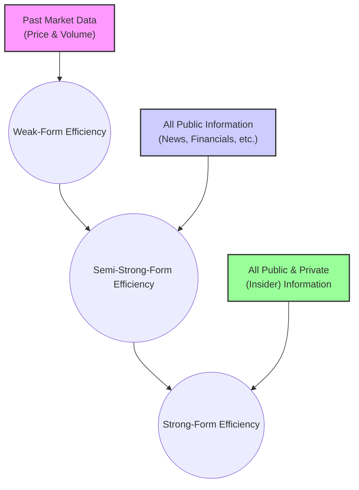

## Reading 41: Market Efficiency 🚀

### 🎯 Introduction

Imagine you're at a crowded fish market. If one stall suddenly offers a fantastic price on fresh pomfret, everyone will rush there instantly. Within seconds, either the price goes up or the fish is sold out. The "opportunity" vanishes as soon as it becomes known. **Market efficiency** is this very idea applied to financial markets. It suggests that a security's price reflects all available information almost immediately, making it incredibly difficult to find "bargain" stocks and consistently "beat the market." This reading explores how efficient markets really are and what that means for you as an investor.

-----

### Part 1: Value vs. Price - What's a Stock Really Worth? 🤔

There's a crucial difference between what a stock is worth and what it's selling for.

  * **Intrinsic Value (or Fundamental Value):** This is the "true" value of a stock based on a complete understanding of its characteristics, like future cash flows and risk. Think of it as the price a perfectly rational, all-knowing investor would pay. It’s an estimate, not a certainty!
  * **Market Value (or Price):** This is simply the current price at which the stock is trading in the market.

In a perfectly efficient market, **market value = intrinsic value**. Active investors make money by spotting differences between the two, buying undervalued stocks (Market Value < Intrinsic Value) and selling overvalued ones (Market Value > Intrinsic Value).

#### 1.1 What Makes a Market More Efficient? 📈

Several factors determine how quickly information gets baked into prices:

  * **Large Number of Participants:** More analysts and investors (like in the US or Indian markets) mean more eyes watching for mispricing, correcting it faster.
  * **Information Availability:** When information is widely and cheaply available (thanks, internet! 🌐), markets become more efficient.
  * **Low Trading Costs:** If it's cheap and easy to trade, investors can act on new information quickly, driving prices to their efficient levels.
  * **Fewer Restrictions:** Fewer barriers to trading, like restrictions on short selling, allow for more efficient price discovery.

-----

### Part 2: The Three Forms of Market Efficiency 🏛️

The Efficient Market Hypothesis (EMH) isn't an all-or-nothing concept. It's broken down into three forms, based on the type of information that is believed to be reflected in stock prices.

#### 2.1 Weak-Form Efficiency

  * **Information Set:** Prices reflect all **past market data** (historical prices and trading volumes).
  * **Implication:** You can't use past price patterns to predict future prices and earn abnormal profits.
  * **What it Defeats:** **Technical Analysis**. If the market is weak-form efficient, charting and looking for patterns is a waste of time.
  * **Evidence:** Most research supports weak-form efficiency. Technical trading rules generally do not produce consistent excess returns after accounting for transaction costs.

#### 2.2 Semi-Strong-Form Efficiency

  * **Information Set:** Prices reflect all **publicly available information**. This includes past market data PLUS information from financial statements, news reports, economic data, and analyst reports.
  * **Implication:** Once information becomes public (like an earnings announcement from Reliance Industries), the price adjusts so quickly that you can't trade on it to make abnormal profits.
  * **What it Defeats:** **Fundamental Analysis**. If the market is semi-strong form efficient, analyzing a company's financial health to find undervalued stocks won't consistently work.
  * **Evidence:** The evidence is mixed, but most studies show that even professional money managers struggle to consistently outperform a passive index strategy, which supports this form of efficiency.

#### 2.3 Strong-Form Efficiency

  * **Information Set:** Prices reflect **all information**, both public and private (insider information).
  * **Implication:** Not even company insiders with private information can earn abnormal profits. This is the most extreme version of the hypothesis.
  * **What it Defeats:** **Insider Trading**.
  * **Evidence:** This form is generally rejected. Studies show that insiders *can* earn abnormal profits by trading on their private information (which is why it's illegal!). Furthermore, even top-performing fund managers often fail to maintain their superior performance over long periods.

💡 CFA Exam Tip ✍️: Memorize the implications for each form!

  * Weak-Form Efficiency → **Technical Analysis** is useless.
  * Semi-Strong-Form Efficiency → **Fundamental Analysis** is useless.
  * Strong-Form Efficiency → Even **Insider Information** is useless.
  * Remember that semi-strong efficiency assumes weak-form holds, and strong-form assumes both semi-strong and weak-form hold.

-----

### Part 3: Glitches in the Matrix: Market Anomalies 📉📈

An **anomaly** is a pattern that seems to contradict the Efficient Market Hypothesis. While they suggest markets aren't perfectly efficient, they are often difficult to profit from after accounting for costs.

  * **The January Effect:** Stock returns tend to be higher in January than in other months, especially for small-cap stocks. One theory is that investors sell losing stocks in December for tax purposes (tax-loss selling) and then buy them back in January.
  * **Size Effect:** Small-cap stocks have historically outperformed large-cap stocks on a risk-adjusted basis.
  * **Value Effect:** **Value stocks** (those with low price-to-book ratios and high dividend yields) have historically outperformed **growth stocks**.
  * **Earnings Surprise:** When a company announces unexpectedly high earnings, its stock price doesn't just jump on that day; it tends to drift upward for some time afterward. This suggests the market is slow to incorporate the new information.
  * **Initial Public Offerings (IPOs):** IPOs are often underpriced, leading to huge returns on the first day of trading. However, they tend to underperform in the long run.

-----

### Part 4: The Human Factor: Behavioral Finance 🧠

So if markets aren't always perfectly rational, why not? **Behavioral finance** suggests that investors aren't the cold, calculating machines that traditional finance assumes. We are human, and our psychological biases can affect our decisions and create market anomalies.

  * **Loss Aversion:** We feel the pain of a loss more strongly than the pleasure of an equal gain. This might cause us to hold on to losing stocks for too long.
  * **Overconfidence:** We tend to overestimate our own abilities and the accuracy of our forecasts.
  * **Herding:** We have a tendency to follow the actions of a larger group, even if it's irrational. This can contribute to market bubbles and crashes.

While these biases exist, their impact on overall market efficiency is debated. For every irrational investor, there may be a rational one ready to trade against them, which helps keep prices efficient.

-----

### 4.1 Global & Local Context 🌍

* **Global Example:** U.S. equity markets are considered highly efficient due to large numbers of participants and rapid information dissemination. However, anomalies like the January Effect have been observed globally.
* **Indian Example:** Indian markets have become more efficient over time with increased analyst coverage and digital access, but behavioral biases and anomalies (e.g., IPO underpricing) still occur.

-----

### 🎯 Quick Exam-Day Pointers

* **Efficiency Hierarchy:** Strong-form includes semi-strong, which includes weak-form. Information is cumulative.
* **"Useless" Analysis:** If the market is weak-form efficient, technical analysis is pointless. If it's semi-strong-form efficient, fundamental analysis is also pointless for generating *abnormal* returns.
* **Anomalies vs. Inefficiency:** The existence of anomalies challenges the EMH but doesn't completely disprove it. Many anomalies disappear over time or are too small to profit from after transaction costs.
* **Active vs. Passive:** The evidence largely suggests that for most investors, a **passive strategy** (like buying an index fund like an S&P 500 or Nifty 50 ETF) is superior to an **active strategy** due to lower fees and the difficulty of consistently finding mispriced stocks.
* **The Analyst's Role:** Even in a perfectly efficient market, analysts and portfolio managers add value through **risk management, asset allocation, tax optimization**, and ensuring their clients' portfolios meet their specific needs.

