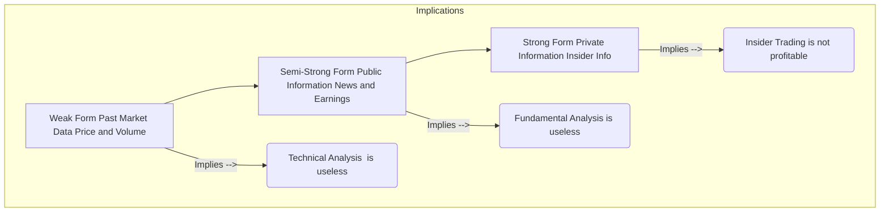

## Reading 41: Market Efficiency 🧠

### 🎯 Introduction

Welcome, truth-seeker\! This reading tackles one of the most debated and fundamental concepts in all of finance: **Market Efficiency**. The core question is simple: *Are market prices fair?* Do they instantly reflect all available information, making the market an unbeatable "perfect" pricing machine? Or are they driven by human psychology, creating patterns, anomalies, and opportunities for clever analysts (like you) to exploit?

Understanding this concept, known as the **Efficient Markets Hypothesis (EMH)**, will define your entire approach to investing. Do you try to beat the market (active) or just match it (passive)? Let's find out.

-----

### Part 1: The Efficient Markets Hypothesis (EMH) (LOS 41.a, 41.b, 41.c)

#### 1.1 What is Market Efficiency? (LOS 41.a)

An **informationally efficient market** is one where security prices **fully, quickly, and rationally** reflect all available information.

  * If a market is efficient, you **"can't beat the market"** on a risk-adjusted basis using the information that is already reflected in prices.
  * The "best" strategy in a perfectly efficient market is **passive investment** (like buying an index fund), as active trading just racks up transaction costs and management fees without adding value.

#### 1.2 Market Value vs. Intrinsic Value (LOS 41.b)

This is the central battle for an analyst.

  * **Market Value:** The current *price* at which an asset is trading in the market.
  * **Intrinsic Value (or Fundamental Value):** The "true" rational value an investor would place on an asset if they had **full knowledge** of its characteristics (e.g., future cash flows, risk).

An analyst's *entire job* is built on the belief that markets are *not* perfectly efficient. You are trying to find discrepancies:

  * If `Your Estimated Intrinsic Value > Market Value`, the stock is **undervalued** (a Buy).
  * If `Your Estimated Intrinsic Value < Market Value`, the stock is **overvalued** (a Sell).
  * In a highly efficient market, the market value will be the best available estimate of intrinsic value.

#### 1.3 Factors Affecting Market Efficiency (LOS 41.c)

Markets aren't just "efficient" or "inefficient"; it's a spectrum. Efficiency is driven by:

  * **Number of Participants:** More analysts, investors, and traders watching a stock = more efficiency. (e.g., Apple vs. a small-cap local bank).
  * **Information Availability:** Markets with better, more widely available information are more efficient.
  * **Trading Restrictions:** Restrictions like bans on short selling can *reduce* efficiency by allowing overvaluation to persist.
  * **Transaction and Information Costs:** If the cost to find information and trade on it is *higher* than the potential profit, investors won't bother. This "inefficiency" is what allows active managers to (in theory) get paid.

-----

### Part 2: The Three Forms of Efficiency (LOS 41.d & 41.e)

The EMH is broken into three "forms" based on what type of information is assumed to be in the price. This is one of the most testable parts of this reading.

**💡 MNEMONIC: The Three Forms of EMH**

  * **Weak Form** = **Past** Market Data (Price & Volume)
  * **Semi-Strong Form** = Past Data + All **Public** Information
  * **Strong Form** = Past Data + Public Info + All **Private** Information

1.  **Weak Form:** Prices reflect all **past market data** (price and volume history).

      * **Implication (LOS 41.e):** You cannot use **technical analysis** (studying charts and patterns) to earn abnormal returns. The patterns are already "in" the price. Most research supports the weak form.

2.  **Semi-Strong Form:** Prices reflect all **publicly available information**. This includes past market data *plus* all news, earnings reports, company announcements, analyst reports, etc.

      * **Implication (LOS 41.e):** You cannot use **fundamental analysis** (digging into financial statements) to earn abnormal returns. By the time you read the news, it's already "in" the price.
      * This is the most contentious form. If this is true, active portfolio management is a waste of time, and you should use a **passive strategy** (buy index funds). Most evidence suggests that, on average, active managers *do not* beat the market, which supports this form.

3.  **Strong Form:** Prices reflect **all information**—public and private (insider).

      * **Implication (LOS 41.e):** Not even insiders with private information can earn abnormal returns.
      * **Evidence:** This form is **rejected**. Insider trading laws exist precisely *because* private information is valuable and can be used to earn abnormal profits.

-----

### Part 3: Cracks in the Theory (LOS 41.f & 41.g)

If markets are so efficient, why do we see strange patterns? These are called **anomalies**.

#### 3.1 Market Anomalies (LOS 41.f)

An anomaly is something that deviates from the EMH—a seemingly predictable way to earn abnormal returns.

  * **Calendar Anomalies:**
      * **January Effect:** Stocks (especially small-caps) tend to have higher returns in January. This may be due to tax-loss selling at year-end, but the effect has weakened.
  * **Overreaction & Momentum:**
      * **Overreaction Effect:** Investors *overreact* to news. Firms with very poor stock returns over 3-5 years ("losers") tend to have better subsequent returns than "winners". This suggests a "reversion to the mean."
  * **Cross-Sectional Anomalies:**
      * **Size Effect:** Small-cap stocks tend to outperform large-cap stocks on a risk-adjusted basis.
      * **Value Effect:** Value stocks (low P/B, low P/E) tend to outperform growth stocks (high P/B, high P/E).
  * **Other Anomalies:**
      * **Earnings Surprise:** The market *slowly* adjusts to earnings news. You can (in theory) buy positive-surprise firms and sell negative-surprise firms and earn abnormal returns.
      * **IPOs:** IPOs are often underpriced (jump in price on day one) but then tend to underperform over the long run.

**Conclusion on Anomalies:** Most analysts believe these are not true violations of efficiency, but rather are **methodological errors** (like using the wrong risk model) or that **transaction costs** would wipe out any potential profits from trading on them.

#### 3.2 Behavioral Finance (LOS 41.g)

This is the *why* behind anomalies. Behavioral finance argues that investors are *not* perfectly rational. They are human and have biases.

  * **Loss Aversion:** Investors feel the pain of a loss much more than the pleasure of an equal gain. This can cause them to hold on to losing stocks for too long and sell winners too early.
  * **Herding:** Investors tend to follow the crowd, which can push prices away from their intrinsic values (creating bubbles or crashes).
  * **Overconfidence:** Investors overestimate their own abilities and the accuracy of their forecasts.
  * **Information Cascades:** Investors "follow the leader," assuming the person who acted first had better information. This can lead to herding.

Even with these biases, markets can *still* be efficient if rational traders step in and arbitrage away the mispricings.

-----

### 🧪 Key Concepts Summary

  * **Market Efficiency:** Prices reflect all available information.
  * **Intrinsic Value:** The "true" value of an asset based on its fundamentals.
  * **Market Value:** The current trading price of an asset.
  * **Weak Form:** Prices reflect all **past market data**.
  * **Semi-Strong Form:** Prices reflect all **public information**.
  * **Strong Form:** Prices reflect all **public & private information**.
  * **Technical Analysis:** Using past price/volume data to find patterns.
  * **Fundamental Analysis:** Using public information (e.g., financial statements) to find mispricings.
  * **Market Anomaly:** A seeming violation of the EMH; a pattern that suggests abnormal returns are possible.
  * **Behavioral Finance:** The study of how investor psychology and biases affect financial markets.

-----

### 🎯 Quick Exam-Day Pointers

  * **EMH vs. Analysis:**
      * If the market is **Weak-Form Efficient** → **Technical Analysis** is useless.
      * If the market is **Semi-Strong-Form Efficient** → **Fundamental Analysis** is useless.
      * If the market is **Strong-Form Efficient** → **Insider Trading** is useless.
  * **Active vs. Passive:** The stronger the form of efficiency you believe in, the more you should favor a **passive** (index fund) strategy.
  * **Which Form Holds?**
      * **Weak Form:** Mostly holds. Technical analysis generally does not produce abnormal profits.
      * **Semi-Strong Form:** Mostly holds. The *average* active manager fails to beat the market after fees.
      * **Strong Form:** Does **not** hold. Insider trading is illegal *because* it's profitable.
  * **Anomalies:** Know the **Size Effect** (small > large) and **Value Effect** (value > growth). But remember, most academics argue these are either risk premiums or transaction costs would eat the profit.
  * **Analyst's Job:** An analyst's role is to find assets where **Intrinsic Value ≠ Market Value**. This is only possible if the market is *not* perfectly efficient.

