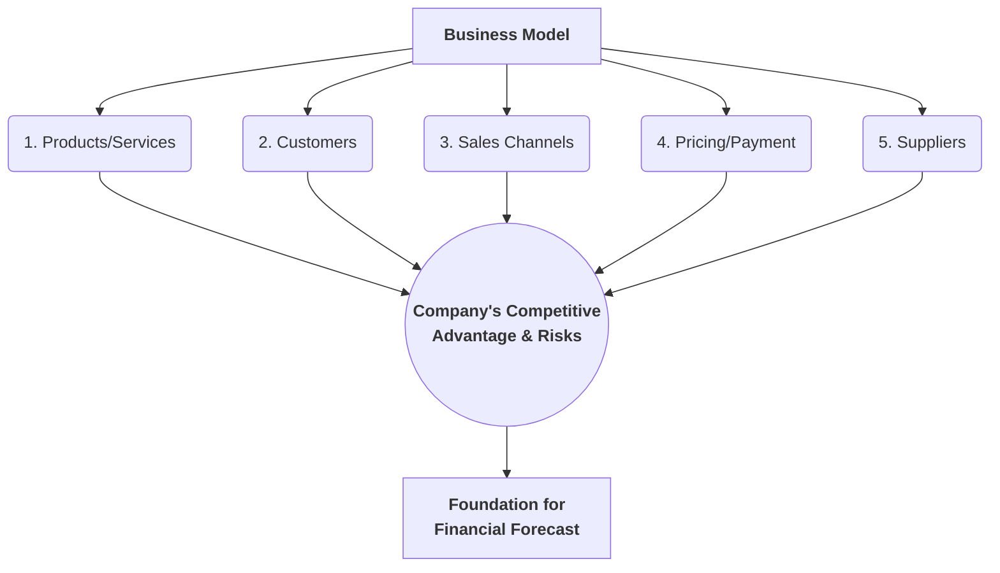

## Reading 43: Company Analysis: Past and Present 📈

### 🎯 Introduction

Welcome, future analyst\! Before you can predict a company's future (forecasting), you must first become a master of its past and present. This reading is your guide to dissecting a company from the ground up. We'll learn how to read an analyst's report, deconstruct a company's "blueprint" (its business model), and evaluate its actual performance using its financial statements.

Think of this as sharpening your katana before the battle: a thorough analysis of the "here and now" is the foundation for every valuation you'll ever do.

-----

### <span style="color: #1565C0;">Part 1: The Analyst's Toolkit (LOS 43.a & 43.b)</span>

First, we need to understand the tools of the trade: what a research report looks like and how to determine a company's core business model.

#### <span style="color: #6A1B9A;">1.1 The Company Research Report (LOS 43.a)</span>

A research report is the final product where an analyst presents their valuation and investment recommendation (e.g., Buy, Hold, Sell). The level of detail depends on whether it's an "initial" report or an "update."

  * **Initial Report (Initiating Coverage):** This is a thorough, deep-dive report. It must cover all the bases. Key elements include:

      * **Front Matter:** Recommendation, price target, and legal disclosures.
      * **Rationale:** The key reasons for the recommendation.
      * **Company Description:** Business model, strategy, and competitive position.
      * **Industry Overview:** A look at the competitive landscape (we'll cover this in Reading 44).
      * **Financial Analysis:** A detailed look at past and present performance.
      * **Valuation:** The analyst's valuation model and assumptions.
      * **ESG Factors:** Analysis of Environmental, Social, and Governance risks.
      * **Risks:** What could make the valuation wrong?

  * **Update Report:** These are shorter, more frequent reports published after new information (like quarterly earnings) is released. They focus on *changes*:

      * Analysis of the new information (e.g., "earnings were 5% above our estimate").
      * Changes to the valuation model or price target.
      * Updates on key risks.

#### <span style="color: #6A1B9A;">1.2 The Business Model (LOS 43.b)</span>

The business model is the company's blueprint. It explains how the company makes money and is the **foundation for determining an analyst's expectations**.

<div style="background-color: #E3F2FD; border-left: 5px solid #1976D2; padding: 12px; margin: 15px 0;">
<div style="color: #000000; font-weight: 500;">

**💡 MNEMONIC: The 5 Pillars of the Business Model (CP-SPS)**

To understand a business model, you must answer five key questions:

  * **C**ustomers: Who does the company sell to?
  * **P**roducts/Services: What does it sell?
  * **S**ales Channels: *How* does it sell (e.g., online, retail, distributors)?
  * **P**ricing & Payment: What are the pricing terms (e.g., subscription, one-time) and payment terms (e.g., cash, 30-day credit)?
  * **S**uppliers: Who are its key suppliers and what are its other key relationships?

</div>
</div>



-----

### <span style="color: #1565C0;">Part 2: Deconstructing Performance (LOS 43.c, 43.d, & 43.e)</span>

Once you understand the blueprint (business model), you use the financial statements to see how well that blueprint is working.

#### <span style="color: #6A1B9A;">2.1 Revenue & Revenue Drivers (LOS 43.c)</span>

Revenue is the lifeblood of a company. An analyst must understand *what drives revenue* using two main approaches:

1.  **Top-Down Analysis:** Starts at the "macro" level and works down.

      * You forecast **GDP growth**.
      * From that, you forecast the **total market size** for the industry.
      * Finally, you forecast the company's **market share** (its slice of the pie) to get its revenue.

    <!-- end list -->

    ```mermaid
    graph TD
        A(Macro Forecast<br/>e.g., GDP Growth) --> B(Industry Forecast<br/>e.g., Total Market Size);
        B --> C(Company Forecast<br/>e.g., Market Share);
        C --> D[<b>Company Revenue Forecast</b>];
    ```

2.  **Bottom-Up Analysis:** Starts at the company level and builds up.

      * Forecast **volume** (how many units it will sell) and **price** (the average price per unit).
      * Or, you can forecast revenue by **business segment** (e.g., "iPhone sales" + "Mac sales") or by **geography** (e.g., "US sales" + "Europe sales").

**Pricing Power**
A key part of revenue analysis is **pricing power**: the ability to raise prices without
a significant drop in sales. Companies with high pricing power are more profitable. Look for:

  * High **switching costs** for customers.
  * Strong brand loyalty.
  * **Lack of substitutes**.
  * Profit margins that rise even when costs are rising (this shows they are passing costs to customers).

#### <span style="color: #6A1B9A;">2.2 Operating Profitability & Working Capital (LOS 43.d)</span>

After revenue, you must analyze costs. The two big categories are **Variable Costs (VC)** (change with sales, like raw materials) and **Fixed Costs (FC)** (stay the same, like rent).

  * **Contribution Margin:** This is the profit from each unit sold *before* fixed costs are paid.
      * `Contribution Margin = Price (P) - Variable Costs (VC)` 
  * **Operating Profit:** `Operating Profit = [Quantity (Q) × (P − VC)] − Fixed Costs (FC)` 

**Operating Leverage**
This is a critical concept. **Operating leverage** comes from having **fixed operating costs**.

  * A company with *high* fixed costs (e.g., a steel mill) has *high* operating leverage. A small change in sales leads to a *huge* change in operating profit.
  * A company with *low* fixed costs (e.g., a consulting firm) has *low* operating leverage.

We measure this with the **Degree of Operating Leverage (DOL)**:

$$
\text{DOL} = \frac{\text{% Change in Operating Profit}}{\text{% Change in Sales}}
$$

<div style="background-color: #FFF9E6; border-left: 5px solid #F57C00; padding: 12px; margin: 15px 0;">
<div style="color: #000000; font-weight: 500;">

**💡 CFA Exam Tip ✍️: Leverage = Risk & Reward**

  * **High DOL** is a double-edged sword.
      * If sales **increase** 10%, profit might increase 50% (Good\!).
      * If sales **decrease** 10%, profit might decrease 50% (Bad\!).
  * **Economies of Scale:** When increasing output (higher Q) leads to *lower* unit costs. This happens because you spread your fixed costs over more units.
  * **Economies of Scope:** When adding new products/divisions leads to *lower* unit costs because they can *share* fixed costs (like one HR department for two divisions).

</div>
</div>

**Working Capital**
Finally, check the company's efficiency using the **Cash Conversion Cycle (CCC)**.

  * A **long or increasing** CCC is a red flag. It means cash is tied up in inventory and receivables, and the company may need external financing to pay its bills.

#### <span style="color: #6A1B9A;">2.3 Capital Investments & Capital Structure (LOS 43.e)</span>

This part of the analysis looks at the long-term assets and liabilities.

1.  **Capital Investments (The Assets):**

      * The key question: Is the company spending on **maintenance** or **growth**?
      * Look at **Capital Expenditures (Capex)** vs. **Depreciation Expense**.
      * If `Capex > Depreciation`, the company is likely in a **growth phase**.
      * If `Capex ≈ Depreciation`, the company is likely in a **maintenance phase** (just replacing old assets).
      * If `Capex < Depreciation`, the company might be shrinking or "disinvesting."

2.  **Capital Structure (The Liabilities & Equity):**

      * The key question: How is the company **financing** those assets?
      * Look at **leverage ratios** (like Debt/Equity or Debt/Assets) to see its reliance on debt.
      * Look at **coverage ratios** (like Interest Coverage) to see its ability to *pay* for that debt.
      * This analysis helps you understand the split between **unlevered returns** (like ROA or ROIC)  and **levered returns** (like ROE).

-----

### <span style="color: #1565C0;">🧪 Formula Summary</span>

<div style="background-color: #F5F5F5; padding: 15px; border-radius: 5px; margin: 10px 0;">

**Contribution Margin (CM) per Unit:**

$$
CM = \text{Price (P)} - \text{Variable Cost (VC)}
$$

</div>

<div style="background-color: #F5F5F5; padding: 15px; border-radius: 5px; margin: 10px 0;">

**Operating Profit:**

$$
\text{Operating Profit} = [\text{Quantity (Q)} \times (\text{P} - \text{VC})] - \text{Fixed Costs (FC)}
$$

</div>

<div style="background-color: #F5F5F5; padding: 15px; border-radius: 5px; margin: 10px 0;">

**Degree of Operating Leverage (DOL):**

$$
\text{DOL} = \frac{\text{% Change in Operating Profit}}{\text{% Change in Sales}}
$$

</div>

-----

<div style="background-color: #FFF9E6; border-left: 5px solid #F57C00; padding: 15px; margin: 20px 0;">

### 🎯 Quick Exam-Day Pointers

<div style="color: #000000; font-weight: 500;">

  * **Business Model is Foundation:** Know the 5 pillars: **C**ustomers, **P**roducts, **S**ales Channels, **P**ricing, **S**uppliers (CP-SPS).
  * **Revenue Analysis:** Know the two approaches:
      * **Top-Down:** Starts with GDP/Market Size and flows to Market Share.
      * **Bottom-Up:** Starts with Price x Volume or Segments.
  * **Pricing Power:** This is a key qualitative factor. It means a company can pass costs to customers. Look for high/stable gross margins.
  * **Operating Leverage (DOL):** Comes from **Fixed Operating Costs**. High DOL = high risk and high potential reward.
  * **Financial Leverage (DFL):** Comes from **Fixed Financing Costs** (i.e., interest).
  * **Working Capital:** A shorter **Cash Conversion Cycle (CCC)** is more efficient. A long or rising CCC is a warning sign.
  * **Capex vs. Depreciation:** This tells you if the company is in *growth* (`Capex > Dep.`) or *maintenance* (`Capex ≈ Dep.`) mode.

</div>
</div>
