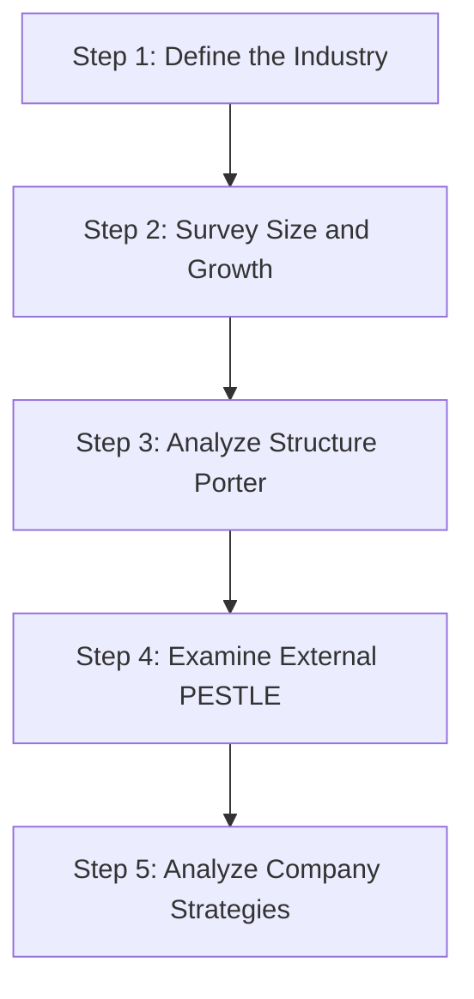
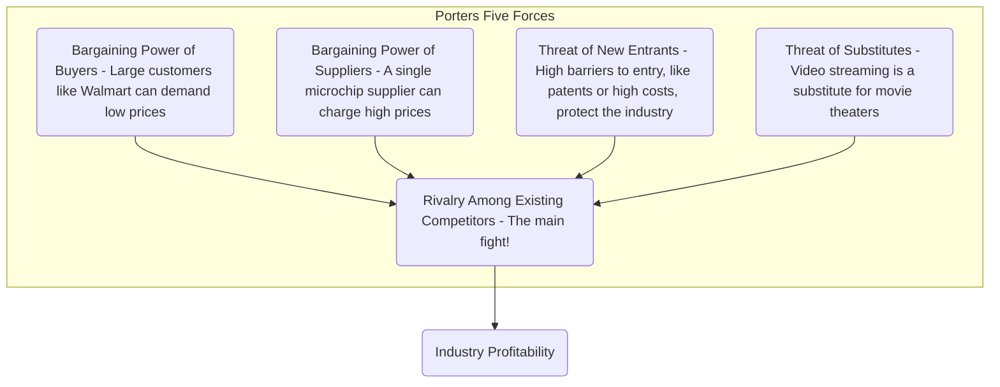

## Reading 44: Industry and Competitive Analysis 🗺️

### 🎯 Introduction

Welcome back, strategist\! In Reading 43, we put a single company under the microscope. But a company, like a samurai, doesn't exist in a vacuum. Its success is fundamentally shaped by the battlefield it fights on—its **industry**.

A brilliant company in a terrible industry (like one with cutthroat price wars and low barriers to entry) will struggle to be profitable. A mediocre company in a great industry (like one protected by high barriers and few competitors) can thrive. This reading gives you the frameworks to analyze that battlefield, understand the forces of competition, and identify where a company stands in the fight.

-----

### Part 1: Mapping the Battlefield (LOS 44.a, 44.b, & 44.c)

Before analyzing the fight, you must define the arena. What *is* the industry, who is in it, and what are its vital statistics?

#### 1.1 The 5 Steps of Industry Analysis (LOS 44.a)

A thorough industry and competitive analysis follows a clear 5-step process:

1.  **Define the Industry:** What is the industry we are analyzing?
2.  **Survey the Industry:** Look at its size, growth, profitability, and trends in the market shares of its participants.
3.  **Analyze the Industry Structure:** Use Porter’s five forces to find the key drivers of profitability.
4.  **Examine External Influences:** Use PESTLE analysis to see how macro-factors affect the industry.
5.  **Analyze Companies’ Competitive Strategies:** See how individual companies position themselves to compete.

<!-- end list -->

#### 1.2 How to Classify Industries (LOS 44.b)

Defining an industry can be tricky. Is a company that makes smartphones in the "Technology" or "Consumer Discretionary" industry?

  * **Commercial Classification Systems:** Analysts rely on standardized systems. The three main ones are:
      * **GICS** (Global Industry Classification Standard)
      * **ICB** (Industry Classification Benchmark)
      * **TRBC** (The Refinitiv Business Classification)
  * **How They Work:** These systems group companies hierarchically, starting broad (e.g., "Sector") and getting narrow (e.g., "Sub-Industry").
  * **Classifying Multi-Business Companies:** What about a company like Amazon, which does e-commerce, cloud computing, and groceries?
      * A firm with one main business (>60% of revenue) is classified in that line.
      * If no line meets the 60% test, it's classified by the line with >50% of revenue, profit, *or* assets.
      * If no line meets the 50% test, it's classified as a conglomerate or based on analyst judgment.
  * **Other Grouping Methods:** You can also group companies in other ways:
      * **Business Cycle Sensitivity:**
          * **Cyclical:** Earnings are highly dependent on the business cycle (e.g., auto-makers, energy).
          * **Non-Cyclical (Defensive):** Earnings are stable regardless of the cycle (e.g., utilities, consumer staples, health care).
      * **Financial Measures:** Grouping by size (e.g., market capitalization), valuation (value vs. growth), or profitability.
      * **ESG:** Grouping by Environmental, Social, and Governance scores.

#### 1.3 Surveying the Industry: The Vital Stats (LOS 44.c)

Once defined, you need data:

  * **Industry Size:** Typically measured by the total revenue of all participants.
  * **Growth Characteristics:** Is the industry growing? Is it cyclical or defensive? A "style box" can classify industries by their cycle sensitivity (cyclical/defensive) and growth (mature/growth).
  * **Profitability:** How profitable is the industry as a whole? Are profits trending up or down?
  * **Market Share & Concentration:** Is the industry dominated by a few giants or fragmented among many small players?
      * We use the **Herfindahl-Hirschman Index (HHI)** to measure concentration.
      * **Low Concentration (HHI < 1,500):** Highly competitive, less pricing power, lower profitability.
      * **Moderate (HHI 1,500 - 2,500):** 
      * **High Concentration (HHI > 2,500):** Less competitive (oligopoly), more pricing power, higher profitability.

-----

### Part 2: The Forces of Competition (LOS 44.d & 44.e)

This is the core of your analysis. *Why* are some industries more profitable than others? It comes down to two key frameworks.

#### 2.1 Framework 1: Porter's Five Forces (LOS 44.d)

This framework identifies the five forces that determine the intensity of competition and, therefore, the profitability of an industry.

1.  **Threat of New Entrants:** How easy is it for new companies to enter and compete? High **barriers to entry** (e.g., patents, high costs, economies of scale) protect existing firms and keep profitability high.
2.  **Threat of Substitutes:** Are there other products that do the same job? (e.g., trains vs. planes). Substitutes limit the prices an industry can charge.
3.  **Bargaining Power of Buyers:** How much power do customers have? If buyers are large and concentrated (e.g., Boeing and Airbus buying from engine makers), they can demand lower prices, reducing industry profit.
4.  **Bargaining Power of Suppliers:** How much power do suppliers have? If suppliers are concentrated or provide a critical component, they can charge higher prices, reducing industry profit.
5.  **Rivalry Among Existing Competitors:** This is the intensity of the fight for market share. High rivalry (e.g., through price wars) is the most damaging to profitability.

#### 2.2 Framework 2: PESTLE Analysis (LOS 44.d)

This framework analyzes the **external (macro) influences** on an industry. These are factors the industry can't control but must react to.

**🧠 Memory Aid: "PESTLE"**

  * **P**olitical: Government stability, tax policy, trade regulations.
  * **E**conomic: GDP growth, inflation, interest rates, exchange rates.
  * **S**ocial: Demographics, consumer preferences, cultural trends.
  * **T**echnological: Innovation, disruption, R\&D.
  * **L**egal: Laws, regulations, contract enforcement.
  * **E**nvironmental: Climate change, sustainability, "green" policies.

#### 2.3 Competitive Strategy (LOS 44.e)

After analyzing the industry, you look at how a *specific company* competes within it. There are two primary strategies for achieving a competitive advantage , 4115:

1.  **Cost Leadership (Low-Cost) Strategy:** The goal is to be the lowest-cost producer in the industry.

      * **How:** Ruthless focus on operational efficiency, economies of scale.
      * **Result:** Can offer the lowest prices and still earn a superior return *or* charge average prices and earn a higher-than-average profit margin.
      * **Example:** Walmart, Vanguard.

2.  **Differentiation Strategy:** The goal is to offer a unique product or service that customers are willing to pay a premium for.

      * **How:** Focus on quality, branding, customer service, or proprietary distribution.
      * **Result:** Can charge higher prices and build strong brand loyalty.
      * **Example:** Apple, Mercedes-Benz.

**Focus Strategy:** This isn't a third strategy, but rather a choice of *scope*. A company can be a cost leader or a differentiator in either a **broad market** or a **niche (focused) market**.

| Strategy | Competitive Advantage | Market Scope | How to Succeed |
| :--- | :--- | :--- | :--- |
| **Cost Leadership** | Lowest Cost | Broad | High volume, operational efficiency  |
| **Differentiation** | Unique Product/Service | Broad | Brand, Quality, Service  |
| **Focus (Cost)** | Lowest Cost | Niche | Serve a specific segment efficiently  |
| **Focus (Diff.)** | Unique Product/Service | Niche | Serve a specific segment's unique needs  |

-----

### 🧪 Key Ratios & Formulas Summary

**Herfindahl-Hirschman Index (HHI):**

$$
HHI = \sum_{i=1}^{n} (\text{Market Share}_i \times 100)^2
$$

*Where `n` is the number of firms in the industry*.

-----

### 🎯 Quick Exam-Day Pointers

  * **Porter's Five Forces:** This is a classic. Know all five forces and how they impact profitability. **High barriers to entry, low threat of substitutes, and low power of buyers/suppliers** are all good for industry profitability.
  * **PESTLE:** Know what each of the six letters stands for (Political, Economic, Social, Technological, Legal, Environmental).
  * **Competitive Strategies:** Be able to clearly distinguish between **Cost Leadership** (lowest cost)  and **Differentiation** (unique/premium product).
  * **Focus Strategy:** This is about competing in a **niche market**, not a separate strategy from cost/differentiation.
  * **HHI:** Know what it measures (industry concentration). A **high HHI** means high concentration, which usually means **higher profitability** for the firms in that industry.
  * **Cyclical vs. Defensive:** Cyclical firms follow the economy (e.g., cars); Defensive firms are stable (e.g., toothpaste).

