## Reading 44: Industry and Competitive Analysis 🚀

### 🎯 Introduction

Imagine you're deciding which sports league to play in. Your success depends not just on your personal skill, but also on the league itself. A local amateur league is easy to enter but has low prize money. The English Premier League is nearly impossible to get into but offers massive rewards. **Industry and competitive analysis** is the financial equivalent. It's about studying the "league" (the industry) to understand its structure, profitability, and competitive intensity *before* you decide which "player" (the company) to bet on. A great company in a terrible industry can be a poor investment, while an average company in a fantastic industry can be a winner.

-----

### Part 1: Sizing Up the Competition: Industry Analysis 101 🗺️

**Industry analysis** helps us understand the long-term profit potential of an industry. The process involves a few key steps: defining the industry, surveying its characteristics, and analyzing its structure.

#### How Are Industries Classified? 📂

Companies are grouped into industries to allow for comparison. While governments have systems, commercial providers offer more frequently updated classifications.

  * **Commercial Classifications:**
      * **Global Industry Classification Standard (GICS):** Developed by S\&P and MSCI.
      * **Thomson Reuters Business Classification (TRBC):** A system by Thomson Reuters.
      * **Industry Classification Benchmark (ICB):** Developed by FTSE Russell.

These systems group firms based on their **principal business activity**, usually determined by the source of the majority of their revenue. For example, both Maruti Suzuki and Tata Motors are in the "Automobiles" industry under GICS.

#### Measuring Industry Characteristics

  * **Industry Size:** Typically measured by the total revenue of all participating firms over a period (e.g., a year).

  * **Industry Growth:** Is the industry in its early growth phase (like AI development), a mature phase (like car manufacturing), or in decline (like print newspapers)?

  * **Industry Profitability:** How profitable are the companies in this industry, on average?

  * **Industry Concentration:** Is the industry dominated by a few large players (concentrated) or filled with many small players (fragmented)? We can measure this with the **Herfindahl-Hirschman Index (HHI)**.

    $HHI = \\sum_{i=1}^{n} (MS_i)^2 \\times 10,000$
    where $MS_i$ is the market share of firm *i*.

> **Example 🧮**
> An industry has three firms with market shares of 50%, 30%, and 20%.
> HHI = (0.50² + 0.30² + 0.20²) × 10,000
> HHI = (0.25 + 0.09 + 0.04) × 10,000 = **3,800**
> Since this is greater than 2,500, the industry is considered **highly concentrated**. High concentration often implies less competition and higher pricing power for the dominant firms.

-----

### Part 2: Who Holds the Power? Porter's Five Forces ⚖️

Developed by Michael Porter, this framework is the cornerstone of industry analysis. It helps identify the forces that determine the average profitability of an industry.

```mermaid
graph TD
    subgraph Porter's Five Forces
        A[Threat of New Entrants 🚪] --> C{Rivalry Among<br/>Existing Competitors 🔥};
        B[Threat of Substitute<br/>Products or Services 🔄] --> C;
        D[Bargaining Power<br/>of Buyers 🛒] --> C;
        E[Bargaining Power<br/>of Suppliers 🚚] --> C;
    end
    style C fill:#ff9999,stroke:#333,stroke-width:2px
```

1.  **Threat of New Entrants 🚪:** How easy is it for new companies to enter the industry? If **barriers to entry** are low (e.g., opening a coffee shop), competition is high and profits are low. If barriers are high (e.g., starting a new airline like IndiGo), existing firms are protected.
2.  **Threat of Substitutes 🔄:** Are there other products that can do the same job? Taxis face a substitute threat from ride-sharing apps like Uber and Ola. The more substitutes available, the less pricing power firms have.
3.  **Bargaining Power of Buyers 🛒:** How much power do customers have to drive down prices? If there are many sellers and few large buyers (e.g., Walmart buying from its suppliers), buyers have high power, which hurts industry profits.
4.  **Bargaining Power of Suppliers 🚚:** How much power do suppliers have to raise their prices? If there are only a few suppliers for a critical component (e.g., Intel for high-end CPUs), they have high power, which squeezes the industry's profits.
5.  **Rivalry Among Existing Competitors 🔥:** How intense is the competition between existing firms? Industries with many players, high fixed costs, and low product differentiation (like the global airline industry) tend to have intense rivalry, leading to price wars and lower profitability.

-----

### Part 3: Beyond the Industry: External Influences (PESTLE Analysis) 🌍

Industries don't exist in a vacuum. Broader, macro-level factors can have a huge impact. A **PESTLE analysis** is a framework for examining these external influences.

  * **P**olitical: Government stability, tax policy, trade regulations.
  * **E**conomic: GDP growth, inflation, interest rates, business cycles.
  * **S**ocial: Demographics, consumer trends, lifestyle changes.
  * **T**echnological: New innovations, disruption from technology.
  * **L**egal: Laws and regulations (e.g., labor laws, environmental regulations).
  * **E**nvironmental: Climate change, sustainability issues.

> **Example 🌍**
> The rise of **Electric Vehicles (EVs)** is a perfect example of PESTLE forces at work. **Political** pressure for cleaner energy, **Technological** advances in battery tech, **Social** demand for sustainability, and **Legal** regulations on emissions are all reshaping the global auto industry.

-----

### Part 4: What's the Winning Strategy? Cost, Quality, or Niche? 🎯

Within an industry, how does a company compete? Michael Porter identified three generic competitive strategies. A company must choose one to succeed; trying to do everything often leads to failure ("stuck in the middle").

| Strategy | How to Win | Key Requirements | Example |
| :--- | :--- | :--- | :--- |
| **Cost Leadership** 💸 | Be the lowest-cost producer. | High volume, operational efficiency, tight cost controls. | **Walmart (Global)**, **IndiGo Airlines (India)** |
| **Product Differentiation** ✨ | Offer a unique product or service that commands a premium price. | Strong brand, R\&D, superior quality, customer service. | **Apple (Global)**, **Taj Hotels (India)** |
| **Focus** 🎯 | Dominate a specific niche market, either through low cost or differentiation. | Deep understanding of a narrow market segment. | **Ferrari (Global - high-end sports cars)**, **A local organic food store (niche market)** |

> [\!TIP]
> **CFA Exam Tip ✍️:** Be able to identify a company's strategy based on a description of its operations. A company that invests heavily in branding and R\&D is likely pursuing **differentiation**. A company obsessed with process efficiency and scale is likely a **cost leader**.

-----

### 🧪 Formula Summary

  * **Herfindahl-Hirschman Index (HHI):**
    $HHI = \\sum_{i=1}^{n} (MS_i)^2 \\times 10,000$
    (Where $MS_i$ is the market share of firm *i* as a decimal)

-----

> [\!IMPORTANT]
>
> ### 🎯 Quick Exam-Day Pointers
>
>   * **Industry Matters:** A company's long-term profitability is heavily influenced by the structure and attractiveness of its industry.
>   * **Porter's Five Forces is Key:** Understand each of the five forces and how they impact industry profitability. Weak competitive forces mean higher profit potential.
>   * **Barriers to Entry are a Moat:** High barriers to entry protect existing firms from new competitors and are a sign of a potentially attractive industry.
>   * **Concentration & Profitability:** Highly concentrated industries (high HHI, dominated by a few firms) tend to be more profitable than fragmented industries (low HHI, many small firms).
>   * **Pick a Strategy, Any Strategy:** To succeed, a company needs a clear competitive strategy: be the cheapest (**cost leadership**), be unique (**differentiation**), or own a niche (**focus**). Being stuck in the middle is dangerous.