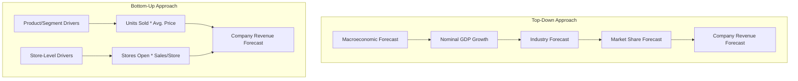

## Reading 45: Company Analysis: Forecasting 🔮

### 🎯 Introduction

Welcome to the crystal ball of financial analysis\! You've mastered how to read financial statements (Readings 27-35), analyze reporting quality (Reading 36), and calculate every ratio imaginable (Reading 37). Now, it's time to use those skills to look *forward*.

Forecasting is the bridge that connects your analysis of the *past* with the valuation of the *future* (which we'll hit hard in Reading 46). This is where you, the analyst, move from being a historian to a detective, building a comprehensive, pro-forma model of where you think the company is heading. This reading is your blueprint for building that model.

-----

### Part 1: The Forecasting Framework (LOS 45.a)

Before you start plugging numbers into Excel, you need a game plan. A good forecast is built on a solid foundation of principles and a clear understanding of your goals.

#### 1.1 Principles of Forecasting

  * **Don't Overcomplicate:** A model with 1,000 drivers isn't necessarily better than one with 10. A complex model is harder to maintain and can be less accurate than a simple, logical one.
  * **Use Available Data:** Base your forecasts on data that is readily available, frequent, and recurring. If a company doesn't provide a detailed breakdown, don't invent one.
  * **Check for Internal Consistency:** Your assumptions must link together. You can't forecast 30% revenue growth with 0% growth in CapEx and working capital. The financial statements must always balance.

#### 1.2 The Four Forecast Approaches

You have four main ways to generate a forecast. In practice, you'll use a mix of all four.

1.  **Historical Results:** The simplest approach. You assume historical trends (like a 3-year average growth rate) will continue. This is a good starting point but is unreliable for cyclical firms or those in a changing environment.
2.  **Base Rate Convergence:** Assumes that a company's performance will eventually revert to a "base rate," which could be its own long-term historical average or the industry average. This is useful for mature companies.
3.  **Management Guidance:** Using the targets and ranges provided by the company's own management. This is valuable because management has the best inside information, but it's crucial to...
4.  **Analyst Discretionary Forecast:** This is *your* forecast, where you use your judgment to modify historical trends, base rates, and management guidance based on your own analysis. This is essential for new companies, cyclical firms, or companies undergoing a major restructuring.

**🧠 Samurai Mnemonic: 4 Approaches to the Future**

Think of your forecast approaches as: "**H**ave **B**ets, **M**ake **A**djustments"

  * **H**istorical Results (What happened before?)
  * **B**ase Rate (What's the average?)
  * **M**anagement Guidance (What do they say?)
  * **A**nalyst Discretion (What do *I* think?)

#### 1.3 Forecast Horizon

How far out should you forecast?

  * **Holding Period:** For a buy-side analyst, the forecast horizon often matches the expected holding period of the stock.
  * **Cyclical Companies:** For a company in a cyclical industry (e.g., auto manufacturing), your horizon must be long enough to get to a "mid-cycle" point. This gives you **normalized earnings**—an estimate of earnings under average, sustainable economic conditions.
  * **Major Events:** If a firm has a restructuring or large acquisition, your horizon must be long enough to see the expected benefits of that event.

-----

### Part 2: Forecasting Revenue (LOS 45.b)

Everything starts with the top line. If you get revenue wrong, *everything* else in your model (costs, profits, assets) will be wrong. There are two main ways to build your revenue forecast.

#### 2.1 Top-Down vs. Bottom-Up

  * **Top-Down Revenue Forecast:** You start with the big picture (macro) and drill down. For example:
    1.  Forecast GDP growth = 4%
    2.  Forecast industry growth = 1.2x GDP = 4.8%
    3.  Forecast company's market share = 10% (and stable)
    4.  ...Therefore, company revenue will grow at 4.8%.
  * **Bottom-Up Revenue Forecast:** You start with the company's specific drivers and build up. For example:
    1.  Forecast company will open 50 new stores.
    2.  Forecast average sales per store = $2 million.
    3.  ...Therefore, revenue will grow by 50 \* $2M = $100 million.

💡 **CFA Exam Tip** ✍️

Neither method is "better." The best practice is to use a **hybrid approach**: build a bottom-up forecast (e.g., sales per store) and check it against a top-down forecast (e.g., industry growth). If your bottom-up model says the company will grow at 20% but the industry is only growing at 3%, you've either found a superstar or you need to re-check your assumptions.

  * **Recurring vs. Nonrecurring Items:** Your forecast should *only* include recurring, sustainable revenue. You must identify and exclude nonrecurring items (e.g., a one-time asset sale, a large special order, or FX gains/losses) from your forecast base.

-----

### Part 3: Forecasting Expenses & Working Capital (LOS 45.c)

Once you have revenue, you can forecast the key costs and balance sheet items that flow from it.

#### 3.1 Cost of Sales (COGS) & Gross Margin

  * **Forecast Method:** The most common approach is to forecast **COGS as a percentage of revenue** (or, equivalently, forecast a stable **gross margin**).
  * **Key Drivers:** Don't just assume the margin is stable. Ask:
      * **Market Share:** Is the company gaining market share by cutting prices (which lowers gross margin)? Or is it gaining share with a new, innovative product (which raises gross margin)?
      * **Input Costs:** Can the company "pass through" rising input costs (like raw materials) to its customers? If yes, the gross margin will be stable.

#### 3.2 SG\&A Expenses

  * **Forecast Method:** Unlike COGS, SG\&A (Selling, General & Administrative) has both **fixed and variable** components.
      * **Variable SG\&A:** Costs like sales commissions. These should be forecast as a **% of revenue**.
      * **Fixed SG\&A:** Costs like corporate headquarters rent or R\&D. These are not directly tied to this year's sales. They should be forecast with a **fixed growth rate** (e.g., inflation).

#### 3.3 Working Capital

  * **Forecast Method:** Forecast the key net working capital accounts (Receivables, Inventory, Payables) based on their relationship with Sales or COGS.
  * **Option 1 (% of Sales):** Forecast Accounts Receivable as a % of Sales, and Inventory as a % of Sales.
  * **Option 2 (Turnover Days):** Forecast Days Sales Outstanding (DSO), Days of Inventory on Hand (DOH), and Days of Payables Outstanding (DPO). This is often more precise.

-----

### Part 4: Forecasting CapEx, Capital Structure, & Scenarios (LOS 45.d, 45.e)

This is the final piece of the puzzle, where you build out the long-term assets and the liability/equity side of the balance sheet.

#### 4.1 Forecasting Capital Expenditures (CapEx)

This is one of the most important—and difficult—items to forecast. Analysts split CapEx into two types:

1.  **Maintenance CapEx:** The amount needed to maintain the company's existing assets and productivity.
      * **Best Estimate:** A good starting point for maintenance CapEx is the company's **historical depreciation expense** , adjusted for inflation.
2.  **Growth CapEx:** The amount spent on *new* assets to grow the business.
      * **Best Estimate:** This is not based on history, but on **management's strategy**. It should be directly linked to your revenue growth forecast.

#### 4.2 Forecasting Capital Structure

  * **Forecast Method:** You need to forecast how the company will fund its assets (both working capital and CapEx).
  * **The "Plug":** In many models, Debt is the "plug." You forecast all other assets and liabilities, and the "funding gap" is filled by new borrowing.
  * **A Better Way:** A better approach is to forecast based on a **target capital structure**, such as a stable Debt-to-Assets or Debt-to-Equity ratio, and assume the company manages its financing to stay near this target.

#### 4.3 Using Scenario Analysis (LOS 45.e)

Your model is built on assumptions, and assumptions can be wrong. **Scenario analysis** is how you test the sensitivity of your forecast. You should build a:

  * **Base Case:** Your most likely set of assumptions.
  * **Best Case:** Optimistic assumptions (e.g., high revenue growth, high margins).
  * **Worst Case:** Pessimistic assumptions (e.g., recession, lost market share).

This gives you a *range* of potential values for the company, which is far more useful than a single point estimate.

-----

### 🧪 Formula Summary

**Revenue (Top-Down):**

$$
\text{Revenue} = \text{Total Market Size} \times \text{Company Market Share}
$$

**Revenue (Bottom-Up):**

$$
\text{Revenue} = \text{Average Selling Price} \times \text{Units Sold}
$$

**COGS:**

$$
\text{COGS} = (1 - \text{Gross Margin \%}) \times \text{Revenue}
$$

**SG&A:**

$$
\text{SG&A} = (\text{Variable SG&A \%} \times \text{Revenue}) + (\text{Fixed SG&A} \times (1 + \text{Inflation \%}))
$$

**Working Capital:**

$$
\text{Net WC} = \frac{\text{DSO} + \text{DOH} - \text{DPO}}{365} \times \text{Revenue}
$$

**Total CapEx:**

$$
\text{CapEx} = \text{Maintenance CapEx} + \text{Growth CapEx}
$$

-----

### 🎯 Quick Exam-Day Pointers

  * **Top-Down vs. Bottom-Up:** Know the difference. Top-down starts with GDP/market size; bottom-up starts with company drivers (like stores or units).
  * **Strip Out the Junk:** Always remove **nonrecurring items** (like one-time sales or asset gains) before forecasting revenues.
  * **Cost Behavior:** Remember the difference\! **COGS** is mostly variable (forecast as % of sales). **SG\&A** is mixed (forecast fixed and variable parts separately).
  * **The CapEx Rule:** This is a classic. CapEx must be split into:
    1.  **Maintenance CapEx** (to replace old assets) → Your best guess is **historical depreciation**.
    2.  **Growth CapEx** (to expand) → Based on the company's growth strategy.
  * **Normalized Earnings:** For cyclical firms, you must forecast to a "mid-cycle" point to find an average, sustainable earnings level.
  * **Scenario Analysis:** The final step of any good forecast is to test your assumptions with a best/base/worst-case scenario analysis.

