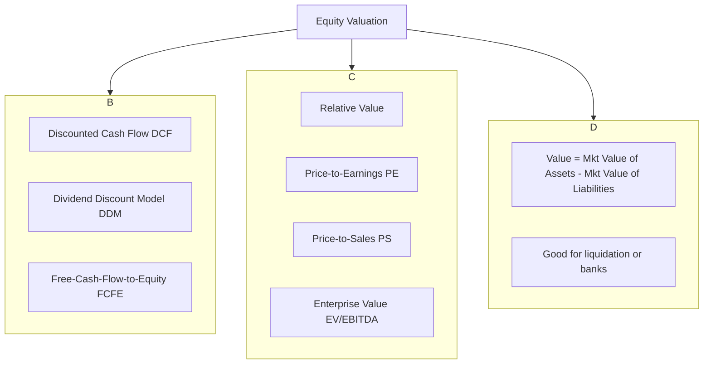

## Reading 46: Equity Valuation: Concepts and Basic Tools ⚔️

### 🎯 Introduction

Welcome to the heart of the dojo, samurai. You've spent weeks learning to read the scrolls (financial statements) and analyze your opponent's stance (ratio analysis). Now, you learn to *strike*. This reading is where it all comes together.

Valuation is the art and science of determining what a company is *truly* worth—its **intrinsic value**. Our core mission is to compare this intrinsic value to its **market price** and answer the most important question in finance: "Is this stock overvalued, undervalued, or fairly valued?".

This reading gives you your first set of "katas," or valuation models. Master them, and you'll be able to defend any investment thesis.

-----

### Part 1: The Valuation Mindset & Cash Distributions (LOS 46.a, 46.c, 46.d)

#### 1.1 Intrinsic Value vs. Market Price

  * **Intrinsic Value ($V_0$):** What an asset is *actually* worth based on a rational analysis of its future cash flows and risk. This is what *you* will calculate.
  * **Market Price ($P_0$):** What the market is willing to pay for the asset *right now*.
  * **The Analyst's Job:**
      * If $V_0 > P_0 \rightarrow$ The stock is **undervalued** (a "Buy").
      * If $V_0 < P_0 \rightarrow$ The stock is **overvalued** (a "Sell" or "Short").
      * If $V_0 \approx P_0 \rightarrow$ The stock is **fairly valued** (a "Hold").

An analyst must not only identify a mispricing but also believe that the market price will eventually move toward its intrinsic value.

#### 1.2 How Companies Distribute Cash to Owners

To value a company, you must understand the cash you, as an owner, can expect to receive.

  * **Regular Dividends:** A consistent payment, often quarterly, that signals financial stability.
  * **Special Dividends:** A one-time cash payment, often used by cyclical firms in good times.
  * **Share Repurchases:** The firm buys back its own stock in the open market. This is an alternative to dividends, reducing the share count and (hopefully) increasing the price of the remaining shares.
  * **Stock Dividends & Stock Splits:** The company gives you *more shares* instead of cash. A 2-for-1 stock split doubles your shares, but the company's total value is unchanged, so the price per share is cut in half. This is like cutting a pizza into 16 slices instead of 8—you have more slices, but the same amount of pizza.
  * **Reverse Stock Splits:** The opposite; the company reduces the number of shares outstanding to increase the share price.

#### 1.3 The Dividend Payment Timeline (LOS 46.d)

This chronology is a frequent exam topic.

**🧠 Samurai Mnemonic: "DERP"**

Remember the order of the dividend timeline. It's so easy, it's... DERP.

  * **D**eclaration Date: The Board of Directors declares the dividend.
  * **E**x-Dividend Date: The **critical date**. It's the first day the stock trades *without* the dividend. If you buy on or after this date, you *do not* get the dividend. The stock price typically drops by the dividend amount on this morning.
  * **R**ecord Date: The date the company checks its "records" to see who the official shareholders (holders of record) are.
  * **P**ayment Date: The day the cash is actually sent to the shareholders of record.

-----

### Part 2: The Three Paths to Value (LOS 46.b, 46.f)

There isn't just one way to value a stock. An analyst will use all three methods to see if they all point to the same conclusion.

**Pros & Cons of the Three Paths**

  * **1. Present Value Models:**
      * **Pro:** Based on finance theory (value = PV of future cash). Widely accepted.
      * **Con:** *Extremely* sensitive to inputs (like growth and risk rates). Garbage inputs = garbage value.
  * **2. Multiplier Models:**
      * **Pro:** Easy to calculate and find data for. Widely used. Great for comparing firms.
      * **Con:** Can be meaningless if the denominator is negative (e.g., negative EPS). Hard to compare firms with different accounting, size, or risk.
  * **3. Asset-Based Models:**
      * **Pro:** Provides a "floor" value for a company. Most reliable for firms with tangible, liquid assets (like banks).
      * **Con:** Market values of assets are difficult to find. Useless for service or tech firms where the main "assets" are people or code (intangibles).

-----

### Part 3: The Way of DCF: DDM & FCFE Models (LOS 46.e, 46.g, 46.h, 46.i)

This is the most fundamental valuation path. The value of an asset is the present value of all the cash flows it will produce for its owner, discounted back to today at a rate that reflects its risk ($k_e$).

$V_0 = \sum_{t=1}^{\infty} \frac{\text{Cash Flow}_t}{(1 + k_e)^t}$

The main question is: what "Cash Flow" should we use?

1.  **Dividend Discount Model (DDM):** The cash flow is the dividend.
2.  **Free-Cash-Flow-to-Equity (FCFE):** The cash flow is what's left over for equity holders after all expenses and reinvestment. This is better for firms that don't pay dividends.
      * $\text{FCFE} = \text{Cash Flow from Ops (CFO)} - \text{Fixed Capital Investment} + \text{Net Borrowing}$.

#### 3.1 Valuation of Preferred Stock (The Simplest DDM)

Preferred stock typically pays a fixed, indefinite dividend, making it a perpetuity.
$$V_p = \frac{D_p}{k_p}$$

  * $V_p$ = Value of preferred stock
  * $D_p$ = The fixed annual dividend
  * $k_p$ = The required rate of return for the preferred stock

#### 3.2 The Gordon Growth Model (Constant Growth DDM)

This is your **most important** valuation formula. It assumes dividends grow at a **constant rate ($g$) forever**.
$$V_0 = \frac{D_1}{k_e - g}$$

  * $V_0$ = Value of the stock today
  * $D_1$ = **Next year's** dividend ($D_1 = D_0 \times (1+g)$) -4250, 4254.
  * $k_e$ = Required return on equity
  * $g$ = The constant growth rate of dividends

**Critical Assumptions:**

1.  Dividends grow at a constant rate $g$.
2.  The required return $k_e$ must be greater than $g$.

This model is best for stable, mature, non-cyclical firms (e.g., utilities, large food companies).

#### 3.3 How to Estimate the Growth Rate ($g$)

The model is useless if you can't estimate $g$. The best way is to find the **sustainable growth rate ($g$)**:
$$g = \text{Retention Rate (RR)} \times \text{Return on Equity (ROE)}$$

  * $\text{Retention Rate (RR)} = 1 - \text{Dividend Payout Ratio}$.
  * This formula represents the growth the company can fund *internally* from its own retained earnings.

#### 3.4 The Multistage DDM (Non-Constant Growth)

What about a new, high-growth company? Growth won't be "constant." A multistage model assumes a firm grows fast for a few years and *then* settles into a constant growth rate.

**The 3-Step Kata for a Multistage DDM:**

1.  **Step 1:** Forecast all the dividends ($D_1, D_2, \dots, D_n$) individually during the high-growth period.
2.  **Step 2:** Calculate the **Terminal Value ($P_n$)** at the *end* of the high-growth period ($n$). This is the value of all remaining dividends from $n+1$ to infinity, calculated using the Gordon Growth Model.
      * $P_n = \frac{D_{n+1}}{k_e - g_c}$ (where $g_c$ is the new, constant growth rate).
3.  **Step 3:** Discount all the high-growth dividends (from Step 1) AND the terminal value (from Step 2) back to today ($t=0$) and add them all up. This is the stock's intrinsic value, $V_0$.

$$V_0 = \frac{D_1}{(1+k_e)^1} + \frac{D_2}{(1+k_e)^2} + \dots + \frac{D_n}{(1+k_e)^n} + \frac{P_n}{(1+k_e)^n}$$

This is best for firms in a high-growth phase (like tech) or older firms with a temporary surge.

-----

### Part 4: Multiplier & Asset-Based Models (LOS 46.j, 46.k, 46.l, 46.m)

#### 4.1 Price Multiples (Relative Valuation)

This path is about comparing, not discounting. We assume the "law of one price": similar assets should trade at similar prices. We compare a firm's multiple to its industry, its history, or the market.

**Key Multiples:**

  * **P/E:** Price-to-Earnings 
  * **P/S:** Price-to-Sales 
  * **P/B:** Price-to-Book Value 
  * **P/CF:** Price-to-Cash Flow 

#### 4.2 The "Justified" P/E (Linking DCF and Multiples)

We can use the Gordon model to *justify* a P/E ratio. By dividing the Gordon formula by next year's earnings ($E_1$), we get:
$$\frac{P_0}{E_1} = \frac{D_1/E_1}{k_e - g}$$

  * $P_0/E_1$ = The "justified" leading P/E ratio.
  * $D_1/E_1$ = The dividend payout ratio.

This brilliant formula tells us that a stock's P/E ratio is **positively related** to its **payout ratio** and **growth rate**, and **negatively related** to its **risk** ($k_e$). A high-growth, low-risk firm *deserves* a higher P/E.

#### 4.3 Enterprise Value (EV) Multiples

P/E is sensitive to a firm's debt load. A better "apples-to-apples" comparison uses **Enterprise Value (EV)**.

  * **What is EV?** It's the total value of the *entire company* (both debt and equity), minus the cash it already has.
  * **EV Formula:** $\text{EV} = (\text{Mkt Cap of Equity}) + (\text{Mkt Value of Debt}) + (\text{Mkt Value of Preferred}) - (\text{Cash & Investments})$.
  * **Key Multiple:** **EV/EBITDA**. This is the most common EV multiple. It's excellent for comparing firms with different capital structures, tax rates, or depreciation schedules.

#### 4.4 Asset-Based Valuation

This is the simplest, and often least useful, path.

  * **Concept:** Value of Equity = (Market Value of Assets) - (Market Value of Liabilities).
  * **Method:** You start with the balance sheet book values and must adjust every single asset and liability to its *fair market value*.
  * **Best Use:** Valuing holding companies, banks, or firms about to be liquidated, where assets are tangible and easy to value.

-----

### 🧪 Formula Summary

**Preferred Stock Value:**

$$
V_p = \frac{D_p}{k_p}
$$

**Gordon Growth (Constant Growth) DDM:**

$$
V_0 = \frac{D_1}{k_e - g}
$$

  * Where $D_1 = D_0 \times (1 + g)$

**Sustainable Growth Rate ($g$):**

$$
 g = \text{ROE} \times (1 - \text{Dividend Payout Ratio})
$$

**Justified Leading P/E Ratio:**

$$
\frac{P_0}{E_1} = \frac{D_1/E_1}{k_e - g}
$$

**Enterprise Value (EV):**

$$
\text{EV} = \text{Market Cap} + \text{MV(Debt)} + \text{MV(Preferred)} - \text{Cash}
$$

-----

### 🎯 Quick Exam-Day Pointers

  * **Value vs. Price:** Know the difference. Intrinsic Value ($V_0$) is what you calculate. Market Price ($P_0$) is what you see.
  * **DERP:** Know the dividend timeline: **D**eclaration, **E**x-Dividend, **R**ecord, **P**ayment. The stock price drops on the **Ex-Dividend Date**.
  * **$D_1$ vs. $D_0$:** This is the #1 mistake. $D_0$ is the dividend "just paid." $D_1$ is "next year's" dividend. The Gordon formula *always* uses $D_1$ in the numerator.
  * **Gordon Growth ($V_0 = D_1 / (k-g)$):** This is your most-used weapon. Know it cold. It's for *stable*, *mature*, *dividend-paying* firms.
  * **Multistage Steps:** 1. PV of high-growth dividends. 2. Calculate Terminal Value (using Gordon) at the *end* of high growth. 3. PV of the Terminal Value. 4. Add (1) and (3).
  * **Justified P/E:** Understand the "why." A high P/E is justified by high growth ($g$), high payout ($D_1/E_1$), and/or low risk ($k_e$).
  * **EV/EBITDA:** Use this multiple to compare firms with different debt levels or tax rates.
  * **FCFE:** This is the go-to model when a firm doesn't pay dividends.

