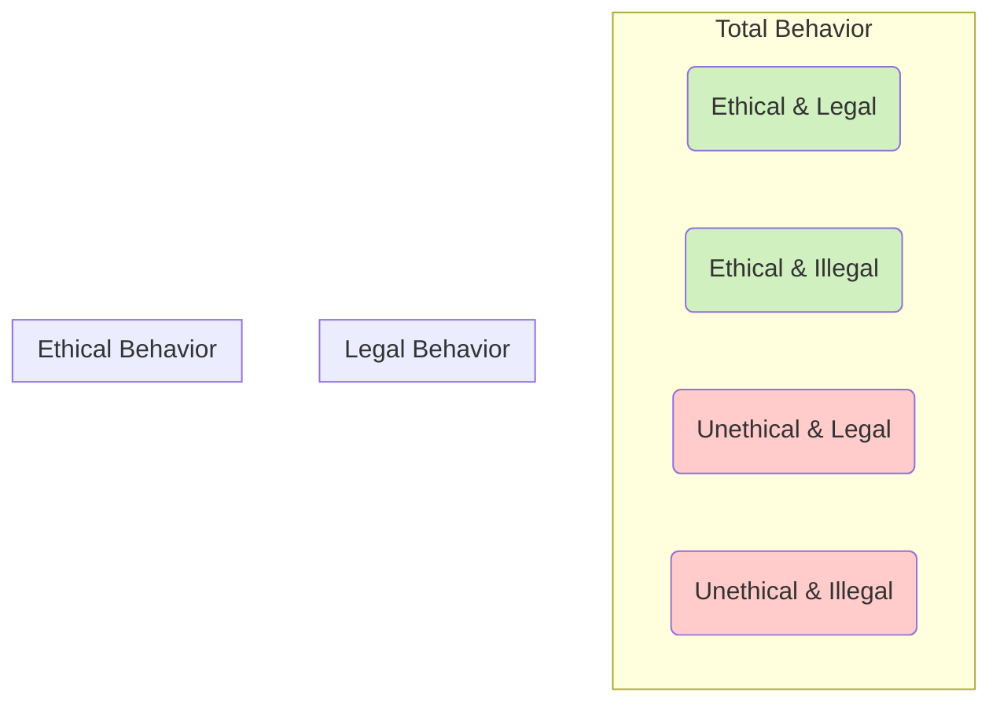
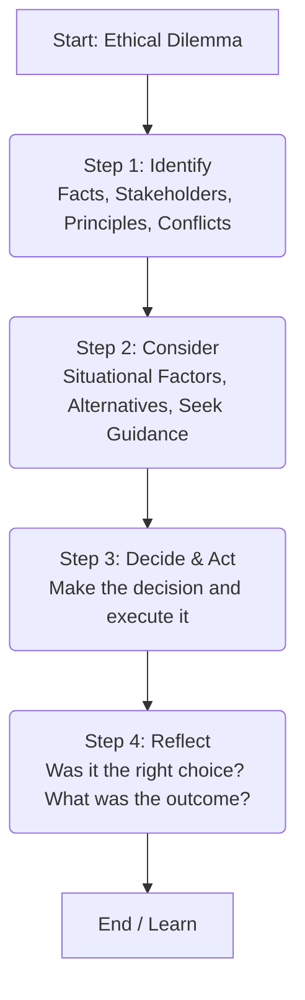

## Reading 89: Ethics and Trust in the Investment Profession 🏛️

### 🎯 Introduction

Alright, future CFA charterholder, let's lay the most important foundation of your entire CFA journey. Reading 89 isn't about complex formulas or valuation models. It's about the single most valuable asset in the financial industry: **trust**.

Think about it: as an investment professional, you're asking clients to give you their life savings, their retirement dreams, and their children's futures. They often don't have the specialized knowledge to judge your work directly. This creates a massive **information asymmetry**.

This reading explains *why* ethics are the bedrock of the investment profession, how they differ from laws, and provides a framework for you to use when you face a tough decision. Mastering this isn't just for the exam—it's for your entire career.

-----

### Part 1: The "What" and "Why" of Ethics (LOS 89.a, 89.d, 89.e)

First, let's get our definitions straight.

  * **Ethics:** A set of shared beliefs about what is good or acceptable behavior and what is bad or unacceptable behavior.
  * **Ethical Conduct:** Behavior that follows moral principles, balances your self-interest with the impact on others, and improves outcomes for **stakeholders**. Stakeholders aren't just clients; they include your employer, coworkers, and the integrity of the capital markets themselves.

#### Why High Ethical Standards are Critical

This is the core idea. The investment industry has unique characteristics that make trust essential:

1.  **Intangible Product:** You're selling expertise, judgment, and service—not a physical product. Clients can't "test drive" your advice.
2.  **Information Asymmetry:** You (the professional) will almost always have more knowledge than your client. This creates a power imbalance that can be exploited.
3.  **Impact on Society:** The investment industry is not a casino. It allocates capital. When that allocation is based on trust and accurate information, the most deserving companies get funded, leading to economic growth. When trust breaks down, capital is misallocated, markets become inefficient, and everyone suffers.

**Professionalism** in investment management means putting client interests first and adhering to these high ethical standards, precisely because clients are so reliant on your expertise and judgment.

-----

### Part 2: Ethics vs. The Law (LOS 89.g)

This is a classic exam trap. Many people assume "If it's legal, it's ethical." **This is incorrect.**

**💡 The CRITICAL Distinction: Ethics vs. Laws**

  * **Laws** are what you *must* do. They represent the **minimum standard** of behavior. New laws are often created *after* unethical behavior has already caused significant harm.
  * **Ethical Standards** are what you *should* do. They represent a **higher standard** based on moral principles.

You can be 100% compliant with the law and still be wildly unethical. Conversely, some illegal acts (like civil disobedience) might be considered ethical by some.

**The CFA Institute rule is simple:** You must always follow the *strictest* applicable rule—whether it's the Code and Standards or a local law.

Here's a simple way to visualize the relationship:

-----

### Part 3: What is a "Profession"? (LOS 89.b, 89.c)

The investment industry is a **profession**, just like medicine or law. A profession isn't just a "job." It's an occupational group defined by several key characteristics:

  * Requires **specialized expert knowledge**.
  * Has a **Code of Ethics** and Standards to guide behavior.
  * Has a **regulatory body** to monitor and enforce those standards.
  * Focuses on **client needs** and **puts client interests first**.
  * Focuses on **service to society**.

A **Code of Ethics** is the profession's promise to the public. It communicates the group's values and serves as a benchmark for behavior, which is the primary way a profession builds public trust.

-----

### Part 4: Challenges to Ethical Behavior (LOS 89.f)

If most people are good, why do they do unethical things? Research shows that the biggest driver isn't bad character, but **situational factors**.

  * **Situational Factors (External):** These are the most dangerous. They include things like:
      * Pressure for money or prestige.
      * Loyalty to an employer, supervisor, or coworker (e.g., "My boss told me to do it").
      * Seeing "everyone else" doing it.
  * **Internal Factors (Personal):** These are biases and blind spots, such as:
      * **Overconfidence:** People tend to overrate their own ethical character and believe they are immune to situational factors.
      * **Rationalization:** Finding excuses for bad behavior (e.g., "It's not a big deal," "I'm doing it for my family").

The biggest challenge is that people often fail to see the ethical dilemma in the first place because they are swayed by these situational factors.

-----

### Part 5: A Framework for Making the Right Call (LOS 89.h)

When you're facing a tough "grey area" decision, you need a process. This framework helps you move from an emotional reaction to a logical, defensible choice.

**🧮 The 4-Step Ethical Decision-Making Framework**

1.  **Identify:**
      * Relevant **Facts**.
      * **Stakeholders** (Who is affected? Clients, firm, coworkers, markets, you?).
      * Ethical **Principles** at stake.
      * **Conflicts of Interest**.
2.  **Consider:**
      * **Situational Influences** (Am I being pressured? Am I acting out of loyalty?).
      * **Alternative Actions** (What are all my options?).
      * **Seek Guidance** (Talk to a trusted mentor, your compliance officer, or legal counsel).
3.  **Decide and Act:**
      * Choose the best course of action based on your analysis.
      * Communicate your decision if necessary.
      * Take the action.
4.  **Reflect:**
      * Was the outcome what I expected?
      * Were there any unintended consequences?
      * What can I learn from this?

Here is a simple flowchart of the process:

**🧠 MNEMONIC: The "I-C-D-R" Framework**

A simple way to remember the 4-step framework:

  * **I** - **I**dentify
  * **C** - **C**onsider
  * **D** - **D**ecide
  * **R** - **R**eflect

-----

### 🎯 Quick Exam-Day Pointers

  * **Ethics > Law:** Ethical standards are *higher* than legal standards. Always follow the **strictest** rule.
  * **Trust is the Product:** The investment industry relies on trust to function because the product is **intangible** and there is high **information asymmetry**.
  * **Situational Factors are Key:** Unethical behavior is more often caused by **external pressures** (like money or loyalty) than by bad character.
  * **Stakeholders:** Your duty isn't just to clients. It extends to your employer, coworkers, and the integrity of the capital markets.
  * **Know the 4-Step Framework:** **Identify, Consider, Decide, Reflect.** This is your practical guide to navigating any ethical dilemma.

