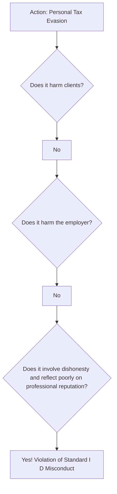

## Reading 89: Professionalism and Standard I(D) Misconduct 🚀

### 🎯 Introduction

Imagine you're a professional cricket umpire. Your job is to enforce the rules of the game fairly, both on and off the field. The CFA Code and Standards are like the rulebook for investment professionals. Standard I(D) Misconduct is the rule that says you can't bring the game into disrepute. It’s not just about your professional work; it’s about ensuring your personal actions—anything involving fraud, dishonesty, or deceit—don’t tarnish the reputation of the entire financial industry. This standard protects the integrity of the profession as a whole.

-----

### Part 1: Understanding Standard I(D) Misconduct 🤔

**Standard I(D) Misconduct** states that members and candidates must not engage in any professional conduct involving dishonesty, fraud, or deceit or commit any act that reflects adversely on their professional reputation, integrity, or competence.

Think of it as the "character clause." While other standards focus on specific professional duties (like loyalty to clients or employer), this one is about your fundamental honesty and integrity. It covers a wide range of behaviors, even those outside of your day-to-day job.

**🌍 Global & Local Context:**
A classic global example is Bernie Madoff. His massive Ponzi scheme was a clear violation of this standard, as his fraudulent actions destroyed client wealth and severely damaged public trust in the financial advisory profession.

In India, consider the case of Harshad Mehta. His fraudulent manipulation of the stock market in the early 1990s is a textbook example of misconduct. His actions not only broke the law but also brought disgrace to the stockbroking community and led to major regulatory reforms by the Securities and Exchange Board of India (SEBI).

#### What kind of behavior is covered? 📜

The standard is broad and covers any act that questions your fitness to be a financial professional. This can include:

  * **Criminal Behavior:** Cheating on your taxes, getting convicted of theft, or any crime involving fraud.
  * **Deception at Work:** Falsifying your credentials, hiding trading errors, or lying to clients or employers.
  * **Personal Misconduct:** Abusing alcohol to the point where it impairs your professional judgment. A personal bankruptcy might not be a violation, but if it was caused by fraudulent behavior, it would be.

#### **Theory in Action**

Let's break down a scenario.

An analyst, Raj, is an avid football fan and participates in a fantasy football league with his friends for cash. This is perfectly fine and not a violation.

However, if Raj were to act as a bookie and organize a large, illegal sports betting ring from his office, that would be a violation of Standard I(D). Even though it's not directly related to his investment work, the illegal activity and dishonesty reflect very poorly on his professional integrity.

#### **Example 🧮**

Priya, a CFA charterholder, is applying for a new job. On her resume, she claims to have an MBA from a prestigious university, but in reality, she only completed a few online courses. This is a direct violation of **Standard I(D) Misconduct**. She is being dishonest, which reflects on her professional integrity.

-----

### Part 2: How Does This Relate to Other Standards? 🔗

Standard I(D) often overlaps with other standards. For example, stealing a client's assets would violate both this standard and **Standard III(A) Loyalty, Prudence, and Care**.

However, **Standard I(D)** is unique because it can be violated even when no other standard is broken.

Consider this:
An analyst is found guilty of tax evasion in his personal life.

  * Does this violate his duty to clients? No.
  * Does it violate his duty to his employer? No.
  * But does it involve dishonesty and reflect poorly on his character as a financial professional? Absolutely. ✅ This is a clear violation of **Standard I(D) Misconduct**.

<!-- end list -->

> [\!TIP]
> **CFA Exam Tip ✍️:** The exam loves to test the gray areas. Remember that Standard I(D) applies to conduct *outside* the workplace. Look for keywords like **dishonesty, fraud, deceit, integrity, and reputation**. If an action involves these, even if it seems unrelated to finance, it's likely a violation of I(D).

-----

### Part 3: How to Stay Out of Trouble ✅

Compliance with Standard I(D) is straightforward. It's about being a good, honest person.

#### **Recommended Procedures for Members and Candidates:**

1.  **Know the Law:** Understand and obey all laws and regulations in the places you live and work.
2.  **Disclose and Dissociate:** If you suspect a client or colleague is engaged in illegal or unethical activities, you must dissociate from those activities and report them to your supervisor or compliance department.
3.  **Encourage Strong Policies:** Encourage your employer to adopt a code of ethics and conduct background checks on potential employees to screen for individuals with a history of misconduct.

> [\!TIP]
> **CFA Exam Tip ✍️:** For exam questions, the best course of action when you encounter misconduct is often to **report it to your supervisor or compliance department**. Simply stopping the activity isn't enough; you must take steps to dissociate and protect the integrity of the capital markets.

-----

### 🧪 Formula Summary

Great news\! This ethics reading is all about principles and judgment, so there are no formulas to memorize. 🎉

-----

> [\!IMPORTANT]
>
> ### 🎯 Quick Exam-Day Pointers
>
>   * **It’s Broader Than Your Job:** Standard I(D) Misconduct applies to your actions both inside and *outside* the office. Personal integrity matters.
>   * **The Three Magic Words:** The standard covers any conduct involving **dishonesty, fraud, or deceit**. If you see these on the exam, your Misconduct alarm should go off.
>   * **Reputation is Everything:** The core question to ask is: "Does this act damage my professional reputation, integrity, or competence?" If the answer is yes, it's a violation.
>   * **Action is Required:** If you see misconduct, you can't just ignore it. You must take steps to **dissociate** from the activity and report it internally.