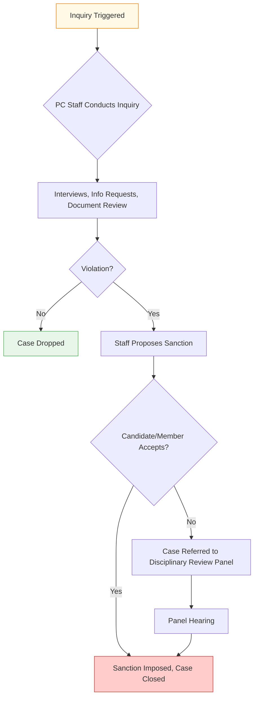

Here is a detailed summary of Reading 90.

## Reading 90: Code of Ethics and Standards of Professional Conduct ⚖️

### 🎯 Introduction

Welcome to the absolute core of the CFA Program. Reading 90 isn't just another topic—it's the **moral compass** for the entire investment profession. This is where you learn the rules of the road, the very principles that separate a true professional from just another person in finance.

This reading introduces the six components of the **Code of Ethics** (the high-level principles you must adopt) and the seven **Standards of Professional Conduct** (the specific, enforceable rules you must follow). We'll also cover how CFA Institute enforces these rules through the Professional Conduct Program.

Mastering this material is non-negotiable, not just for the exam, but for earning and keeping the trust that is the foundation of our industry. Let's dive in.

-----

### Part 1: How the Rules are Enforced (LOS 90.a)

CFA Institute isn't just a publisher of books; it's a professional body with a serious enforcement arm called the **Professional Conduct Program (PCP)**. Its job is to investigate potential violations of the Code and Standards.

The whole process is governed by the CFA Institute Bylaws and the Rules of Procedure for Professional Conduct. It's built on two key principles:

1.  **Fairness** to members and candidates.
2.  **Confidentiality** of the proceedings.

#### How Does an Inquiry Start?

An investigation isn't random. The Professional Conduct (PC) staff will start an inquiry based on several triggers:

  * **Self-Disclosure:** You report yourself on your annual Professional Conduct Statement (e.g., you were involved in a civil lawsuit or criminal investigation).
  * **Written Complaints:** Someone (like a client, coworker, or employer) submits a formal complaint.
  * **Public Information:** PC staff discovers potential misconduct through media reports or regulatory notices.
  * **Exam Proctors:** A proctor reports a possible violation during the CFA exam.

#### What Happens During the Inquiry?

Here's a simplified flowchart of the process:

If the PC staff believes a violation occurred, they may propose a **disciplinary sanction**. You have a choice:

1.  **Accept** the sanction.
2.  **Reject** the sanction. If you reject it, the case goes to a hearing with a **disciplinary review panel** composed of CFA Institute members.

Sanctions can range from a private condemnation all the way to **suspension of your membership and right to use the CFA designation**, or even suspension from the CFA Program for candidates.

-----

### Part 2: The Code of Ethics (LOS 90.b)

The Code of Ethics is the high-level, principle-based pledge that all members and candidates must adhere to. There are **six components**. Think of these as the fundamental ideals you must uphold.

**The Six Components of the Code of Ethics:**

Members and Candidates must:

1.  Act with **integrity, competence, diligence, respect,** and in an **ethical manner** with the public, clients, prospective clients, employers, employees, colleagues in the investment profession, and other participants in the global capital markets.
2.  Place the **integrity of the investment profession** and the **interests of clients** above their own personal interests.
3.  Use **reasonable care** and exercise **independent professional judgment** when conducting investment analysis, making investment recommendations, taking investment action, and engaging in other professional activities.
4.  **Practice and encourage others to practice** in a professional and ethical manner that will reflect credit on themselves and the profession.
5.  **Promote the integrity** and **viability of the global capital markets** for the ultimate benefit of society.
6.  **Maintain and improve** their **professional competence** and strive to maintain and improve the competence of other investment professionals.

**🧠 Memory Aid: The "I-P-R-P-P-M" Framework**

  * **I** - **I**ntegrity, Competence, Diligence, Respect
  * **P** - **P**rofession & Clients > Self
  * **R** - **R**easonable Care & Independent Judgment
  * **P** - **P**ractice & Encourage Ethical Behavior
  * **P** - **P**romote Market Integrity
  * **M** - **M**aintain & Improve Competence

-----

### Part 3: The Standards of Professional Conduct (LOS 90.b & 90.c)

If the Code of Ethics is the "why," the Standards of Professional Conduct are the "how." These are the **seven sets of rules** that provide specific guidance on your behavior. You *must* know all seven Standards and their sub-sections.

#### 🏛️ I. Professionalism

  * **A. Knowledge of the Law:** Obey the law. Always follow the **strictest** applicable rule (your local law, your client's local law, or the Code and Standards). You must not *knowingly* participate in or assist with a violation.
  * **B. Independence and Objectivity:** Use reasonable care to remain independent and objective. Do not offer or accept any gift or compensation that could reasonably be expected to compromise your (or someone else's) objectivity.
  * **C. Misrepresentation:** Don't lie. Do not knowingly make any misrepresentations about your work, analysis, or other professional activities.
  * **D. Misconduct:** Don't engage in any professional conduct involving dishonesty, fraud, or deceit. Also, don't commit any act that reflects adversely on your professional reputation, integrity, or competence.
  * **E. Competence:** Only provide services that you are competent and qualified to perform.

#### Markets II. Integrity of Capital Markets

  * **A. Material Nonpublic Information:** Do not act or cause others to act on material nonpublic information.
  * **B. Market Manipulation:** Do not engage in practices that distort prices or artificially inflate trading volume with the *intent* to mislead market participants.

#### Clients III. Duties to Clients

  * **A. Loyalty, Prudence, and Care:** You have a duty of loyalty to your clients. You must act with reasonable care and prudent judgment. You must **place your clients' interests before your employer's or your own interests**.
  * **B. Fair Dealing:** Deal fairly and objectively with *all* clients when providing analysis, making recommendations, or taking investment action.
  * **C. Suitability:**
    1.  When in an advisory role: Make a reasonable inquiry into the client's experience, risk/return objectives, and financial constraints. Update this information regularly. Only recommend investments that are suitable for the client. Judge suitability in the context of the *client's total portfolio*.
    2.  When managing to a mandate: Only take actions that are consistent with the stated objectives and constraints of the portfolio.
  * **D. Performance Presentation:** When communicating performance, make sure it is **fair, accurate, and complete**.
  * **E. Preservation of Confidentiality:** Keep information about *current, former, and prospective* clients confidential. Exceptions: (1) The info concerns illegal activities, (2) disclosure is required by law, or (3) the client gives you permission.

#### Employers IV. Duties to Employers

  * **A. Loyalty:** In matters related to your employment, act for the benefit of your employer and do not deprive them of your skill or divulge confidential information.
  * **B. Additional Compensation Arrangements:** Do not accept any gifts, benefits, or compensation that competes with, or might create a conflict of interest with, your employer's interest unless you get **written consent from all parties involved**.
  * **C. Responsibilities of Supervisors:** Make reasonable efforts to ensure that anyone you supervise complies with all applicable laws, rules, regulations, and the Code and Standards.

#### Analysis V. Investment Analysis, Recommendations, and Actions

  * **A. Diligence and Reasonable Basis:** Have a reasonable and adequate basis, supported by research and investigation, for any investment analysis, recommendation, or action.
  * **B. Communication with Clients and Prospective Clients:**
    1.  Disclose the basic format and principles of your investment process.
    2.  Promptly disclose any material changes to that process.
    3.  Identify significant limitations and risks of the process.
    4.  Use reasonable judgment to identify important factors in your analysis and include them in communications.
    5.  **Distinguish between fact and opinion**.
  * **C. Record Retention:** Develop and maintain appropriate records to support your analysis, recommendations, and other investment-related communications.

#### Conflicts VI. Conflicts of Interest

  * **A. Avoid or Disclose Conflicts:** **Avoid** conflicts where possible. When you can't, you must make **full and fair disclosure** of all matters that could impair your independence or objectivity. Make sure disclosures are prominent and in plain language.
  * **B. Priority of Transactions:** Investment transactions for **clients and employers must have priority** over transactions for your own benefit.
  * **C. Referral Fees:** Disclose to your employer, clients, and prospective clients, as appropriate, any compensation or benefit received for the recommendation of products or services.

#### CFA VII. Responsibilities as a CFA Institute Member or CFA Candidate

  * **A. Conduct as Participants in CFA Institute Programs:** Don't do anything that compromises the reputation or integrity of CFA Institute, the CFA designation, or the security of the exams.
  * **B. Reference to CFA Institute, the CFA Designation, and the CFA Program:** When referring to your designation, candidacy, or CFA Institute, do not misrepresent or exaggerate the meaning of being a charterholder or candidate.

-----

### 🎯 Quick Exam-Day Pointers

  * **PCP Process:** Know the triggers for an inquiry (self-disclosure is a big one) and that a member can *accept* a proposed sanction or *reject* it and go to a panel hearing.
  * **Six Code Components:** These are high-level principles. Know them.
  * **Seven Standards:** You MUST memorize the titles of all seven Standards (I-VII) and their main sub-sections. This is the only way to answer questions like, "This action violates which Standard?"
  * **Key Priorities:**
    1.  **Market Integrity** & **Clients** come *before*...
    2.  **Your Employer**, which comes *before*...
    3.  **Yourself** (Personal Interests).
  * **Strict Rule:** Always follow the strictest applicable law or standard.
  * **Confidentiality:** This applies to **current, former, AND prospective** clients.
  * **Consent vs. Disclosure:** You need *written consent* for Additional Compensation Arrangements (IV.B) but only *disclosure* for Conflicts of Interest (VI.A) and Referral Fees (VI.C).

