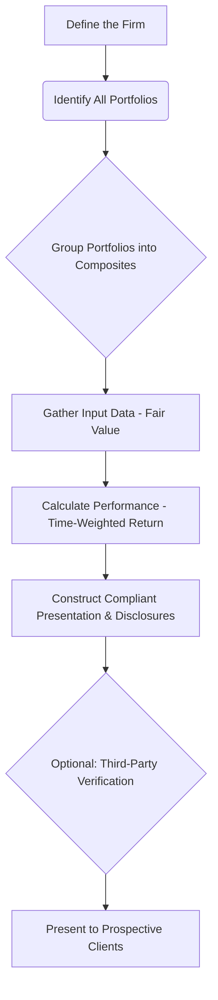

Of course\! Here is a final summary for Reading 91, consolidating the most important, exam-level concepts from the entire GIPS standard. Think of this as your ultimate "cheat sheet" for GIPS.

-----

## Reading 91: Global Investment Performance Standards (GIPS) 🚀

### **🎯 Introduction: Your GIPS Grand Finale**

You've made it through the intricate world of GIPS\! We've covered the *why* (the need for a fair, comparable standard), the *what* (the nine sections of the rulebook), and the *how* (compliance, verification, and advertising). This final module is your victory lap. 🏁 It synthesizes everything into the most crucial, high-level takeaways you need to walk into the exam with confidence. Let's lock in this knowledge\!

-----

### **Part 5: The Ultimate GIPS Review - Key Concepts Consolidated 🧠**

This is a high-level review of the most critical concepts from the entire GIPS reading.

#### **1. The Core Philosophy: Apples-to-Apples 🍎🍏**

If you remember one thing, it's this: **GIPS exists to ensure fair representation and full disclosure of investment performance.** It allows clients to make meaningful, apples-to-apples comparisons between different investment firms. It is a **voluntary** standard, but once a firm claims compliance, it must be applied on a **firm-wide** basis.

#### **2. The Five Pillars of GIPS Compliance**

Think of the entire GIPS framework as resting on five fundamental pillars:

  * **Pillar 1: Firm-Wide Compliance ✅:** You cannot pick and choose which parts of your firm comply. The firm must be defined as a distinct entity, and that entire entity must adhere to the standards.
  * **Pillar 2: Composites are Non-Negotiable 🧺:** Composites are the heart of GIPS. They prevent **survivorship bias** and **cherry-picking**. A composite *must* include all actual, fee-paying, discretionary portfolios for a given strategy. New portfolios must be added in a timely and consistent manner.
  * **Pillar 3: Calculation Integrity 🧮:** The standards mandate specific calculation methodologies to ensure uniformity. The most important is the use of **time-weighted rates of return** to eliminate the effect of external cash flows. Valuations must be based on **fair value**.
  * **Pillar 4: Full and Fair Disclosure 📄:** Transparency is paramount. Firms must disclose all the essential information needed to interpret the performance data correctly. This includes fee schedules, the firm's definition, and details about the composite.
  * **Pillar 5: Ethical Representation 📢:** Firms must present a track record of *at least* five years, building up to ten years. When advertising, they must follow the strict GIPS Advertising Guidelines, including the standardized compliance statement.

#### **Mermaid Chart: The GIPS Compliance Workflow 📊**

> [\!TIP]
> **CFA Exam Tip ✍️:** The CFA exam loves to test the nuances between what GIPS *requires* versus what it *recommends*. Verification is *recommended* but not required. Including non-fee-paying portfolios in a composite is *recommended* but not required. However, using time-weighted returns and applying compliance firm-wide are *required*.

-----

### **🧪 Formula Summary**

The GIPS standard is principles-based, not formula-heavy. The key conceptual formula to remember is the one for the **Time-Weighted Rate of Return (TWRR)**, which geometrically links the returns of sub-periods created by external cash flows.

  * $$TWRR = [(1+R_1) \times (1+R_2) \times ... \times (1+R_n)] - 1$$

-----

> [\!IMPORTANT]
>
> ### 🎯 Quick Exam-Day Pointers
>
>   * **"Compliance" not "Certification":** Firms claim compliance with GIPS; they are not "certified" or "approved" by GIPS or CFA Institute.
>   * **Verification Audits the Process:** A third-party verifier attests that a firm's *processes and procedures* are compliant, not that a specific performance number is correct.
>   * **GIPS 2020 Means More Flexibility:** The latest standards expanded GIPS to better serve asset owners and provided simpler reporting options for pooled funds.
>   * **If it's Not in Writing, It's Not a Disclosure:** Disclosures must be made clearly in the GIPS-compliant presentation.
>   * **The Goal is Client Protection:** At its core, GIPS is an ethical standard designed to protect investors from misleading performance presentations and to foster trust in the investment industry.