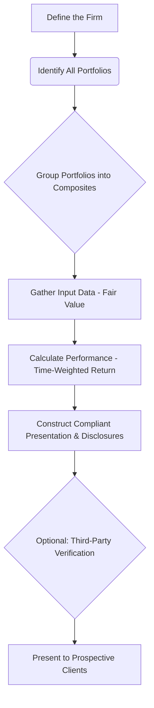

-----
### Part 5: The Ultimate GIPS Review - Key Concepts Consolidated 🧠

#### 5.1 Introduction: Your GIPS Grand Finale

You've made it through the intricate world of <b>GIPS</b>! We've covered the <b>why</b> (the need for a fair, comparable standard), the <b>what</b> (the nine sections of the rulebook), and the <b>how</b> (compliance, verification, and advertising). This final module is your victory lap. 🏁 It synthesizes everything into the most crucial, high-level takeaways you need to walk into the exam with confidence. Let's lock in this knowledge!

-----

#### 5.2 The Core Philosophy: Apples-to-Apples 🍎🍏

If you remember one thing, it's this: <b>GIPS exists to ensure fair representation and full disclosure of investment performance.</b> It allows clients to make meaningful, apples-to-apples comparisons between different investment firms. It is a <b>voluntary</b> standard, but once a firm claims compliance, it must be applied on a <b>firm-wide</b> basis.

-----

#### 5.3 The Five Pillars of GIPS Compliance

Think of the entire GIPS framework as resting on five fundamental pillars:

* <b>Pillar 1: Firm-Wide Compliance ✅</b>
  * You cannot pick and choose which parts of your firm comply. The firm must be defined as a distinct entity, and that entire entity must adhere to the standards.
* <b>Pillar 2: Composites are Non-Negotiable 🧺</b>
  * Composites are the heart of GIPS. They prevent <b>survivorship bias</b> and <b>cherry-picking</b>. A composite <b>must</b> include all actual, fee-paying, discretionary portfolios for a given strategy. New portfolios must be added in a timely and consistent manner.
* <b>Pillar 3: Calculation Integrity 🧮</b>
  * The standards mandate specific calculation methodologies to ensure uniformity. The most important is the use of <b>time-weighted rates of return</b> to eliminate the effect of external cash flows. Valuations must be based on <b>fair value</b>.
* <b>Pillar 4: Full and Fair Disclosure 📄</b>
  * Transparency is paramount. Firms must disclose all the essential information needed to interpret the performance data correctly. This includes fee schedules, the firm's definition, and details about the composite.
* <b>Pillar 5: Ethical Representation 📢</b>
  * Firms must present a track record of <b>at least</b> five years, building up to ten years. When advertising, they must follow the strict GIPS Advertising Guidelines, including the standardized compliance statement.

-----

#### 5.4 GIPS Compliance Workflow

💡 CFA Exam Tip ✍️:The CFA exam loves to test the nuances between what GIPS <b>requires</b> versus what it <b>recommends</b>. Verification is <b>recommended</b> but not required. Including non-fee-paying portfolios in a composite is <b>recommended</b> but not required. However, using time-weighted returns and applying compliance firm-wide are <b>required</b>.

-----

#### 5.5 🧪 Formula Summary

The GIPS standard is principles-based, not formula-heavy. The key conceptual formula to remember is the one for the <b>Time-Weighted Rate of Return (TWRR)</b>, which geometrically links the returns of sub-periods created by external cash flows.

$$TWRR = [(1+R_1) \times (1+R_2) \times ... \times (1+R_n)] - 1$$

-----

### 🎯 Quick Exam-Day Pointers

* <b>"Compliance" not "Certification" →</b> Firms claim compliance with GIPS; they are not "certified" or "approved" by GIPS or CFA Institute.
* <b>Verification Audits the Process ✅</b> A third-party verifier attests that a firm's <b>processes and procedures</b> are compliant, not that a specific performance number is correct.
* <b>GIPS 2020 Means More Flexibility ⬆️</b> The latest standards expanded GIPS to better serve asset owners and provided simpler reporting options for pooled funds.
* <b>If it's Not in Writing, It's Not a Disclosure ❌</b> Disclosures must be made clearly in the GIPS-compliant presentation.
* <b>The Goal is Client Protection ✅</b> At its core, GIPS is an ethical standard designed to protect investors from misleading performance presentations and to foster trust in the investment industry.

