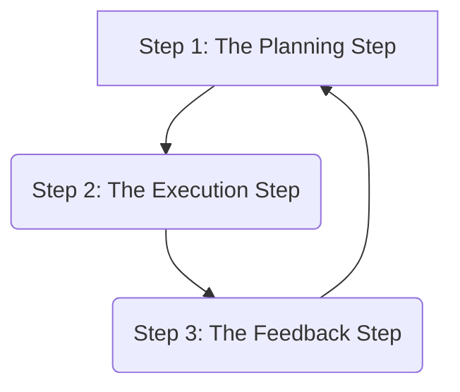

Of course\! Let's dive into the foundational concepts of managing investments with Reading 92.

-----

## Reading 92: Introduction to Portfolio Management 🚀

### **🎯 Introduction: Don't Put All Your Eggs in One Basket\!**

Welcome to the world of portfolio management\! 🧺 Think of your investments like a collection of different fruits in a basket. You wouldn't want to fill your basket with only bananas, because if they all ripen and go bad at the same time, you have nothing left\! Instead, you'd want a mix: some apples, some oranges, some grapes. This way, even if one type of fruit isn't doing well, the others can still be a healthy part of your diet.

This is the core idea of **portfolio management**. It’s the art and science of selecting and overseeing a group of investments (your "portfolio") to meet your long-term financial goals. This reading introduces you to this crucial process, moving you from a stock-picker to a strategic manager of your overall wealth.

-----

### **Part 1: The Portfolio Approach 🤔**

The **portfolio approach** means evaluating individual investments based on how they contribute to the overall risk and return of your entire portfolio, rather than judging them in isolation.

  * **Key Idea:** A single investment might seem risky on its own, but when combined with other assets, it can actually *reduce* the total risk of your portfolio. This is the magic of diversification\!
  * **Example 🧮:**
      * **Isolated View:** Investing in a small, volatile tech startup seems very risky.
      * **Portfolio View:** Adding that same tech stock to a large portfolio of stable, blue-chip companies (like Reliance Industries or HDFC Bank) could boost overall returns without adding much overall risk, because its performance is not perfectly correlated with the big companies.

#### **Diversification: The Only Free Lunch in Finance 🥗**

**Diversification** is the strategy of combining a variety of assets in a portfolio to reduce its overall risk. The goal is to own assets that don't all move in the same direction at the same time.

  * **Correlation is Key:**
      * If assets are **perfectly positively correlated** (+1), they move in lockstep. There is no diversification benefit.
      * If assets are **perfectly negatively correlated** (-1), they move in opposite directions. This provides the maximum diversification benefit.
      * In the real world, we look for assets with low positive correlation.
  * **🌍 Global & Local Context:** An Indian investor's portfolio might be heavily invested in the Indian stock market (e.g., via a Nifty 50 ETF). To diversify, they could add assets like US stocks (S\&P 500 ETF), gold, and Indian government bonds. When Indian stocks are down, US stocks or gold might be up, smoothing out the portfolio's overall return.

-----

### **Part 2: The Three Steps of the Portfolio Management Process ⚙️**

The portfolio management process is a continuous cycle with three key steps.

#### **1. The Planning Step: Creating the Blueprint 🗺️**

This is where you figure out the client's needs and create a roadmap.

  * **Understand the Client:** Identify their return objectives (how much growth do they need?) and risk tolerance (how much volatility can they handle?).
  * **Create the Investment Policy Statement (IPS):** The **Investment Policy Statement (IPS)** is the cornerstone of portfolio management. It's a written document that details the client's objectives and constraints. It's the constitution for the portfolio.
      * **Objectives:** Risk and Return
      * **Constraints:** Time Horizon, Liquidity, Taxes, Legal/Regulatory, and Unique Circumstances.

#### **2. The Execution Step: Building the Portfolio 🏗️**

This is the "doing" phase, where you put the plan into action.

  * **Asset Allocation:** Decide what percentage of the portfolio goes into different asset classes (e.g., 60% stocks, 30% bonds, 10% gold). This is often the most important decision determining a portfolio's returns.
  * **Security Selection:** Within each asset class, pick the specific securities (e.g., which stocks? which bonds?).

#### **3. The Feedback Step: Monitoring and Rebalancing ⚖️**

Markets change, and client circumstances change. This step is about staying on course.

  * **Monitoring:** Keep an eye on the portfolio and the capital markets.
  * **Rebalancing:** Over time, the portfolio's asset allocation will drift. If stocks have a great year, your 60% allocation might grow to 70%. **Rebalancing** is the process of periodically buying or selling assets to bring the portfolio back to its original target allocation.

-----

### **Part 3: Investment Objectives and Constraints (The IPS) 📝**

The IPS is critical for the exam. Let's break down its components.

[Tabs]
[Tab 🎯 Objectives]

  * **Return Objective:** What is the goal? This can be a specific target (e.g., "I need an 8% average annual return to fund my retirement") or a general goal (e.g., "capital appreciation").
  * **Risk Objective:** How much risk is the client willing and able to take? This is a function of both their psychological tolerance for volatility and their financial ability to withstand losses.
    [/Tab]
    [Tab 🚧 Constraints]
  * **Time Horizon:** When will the money be needed? A 30-year-old saving for retirement has a long time horizon; a couple saving for a down payment next year has a short one.
  * **Liquidity:** Are there any anticipated cash needs from the portfolio (e.g., paying for a child's university fees)?
  * **Taxes:** How is the investment income and capital gains taxed? A high-income individual in India might prefer investments with tax advantages.
  * **Legal & Regulatory:** Are there any legal restrictions (e.g., rules governing a trust or corporate pension plan)?
  * **Unique Circumstances:** Any other specific concerns? This could be a client's wish to avoid investing in certain industries (ESG concerns) or a large, concentrated stock position in their employer's company.
    [/Tab]
    [/Tabs]

> [\!TIP]
> **CFA Exam Tip ✍️:** The Portfolio Management Process (Planning, Execution, Feedback) is a foundational concept that appears throughout the CFA curriculum. Make sure you know the three steps and what happens in each. The IPS components are also a very frequent topic for exam questions.

-----

### **🧪 Formula Summary**

This introductory reading is conceptual and does not contain mathematical formulas. It sets the stage for the quantitative methods you will learn in later readings. 🎉

-----

> [\!IMPORTANT]
>
> ### 🎯 Quick Exam-Day Pointers
>
>   * **The IPS is the Boss:** The Investment Policy Statement (IPS) governs all investment decisions. It is created in the Planning Step.
>   * **Process is a Loop:** The Portfolio Management Process is a dynamic, continuous loop: **Plan -\> Execute -\> Feedback -\> Plan...**
>   * **Asset Allocation is King:** The choice of how much to allocate to different asset classes (stocks, bonds, etc.) is generally the most significant driver of a portfolio's long-term performance.
>   * **Diversification Works:** The main goal of diversification is to reduce portfolio risk, not necessarily to maximize returns. It's the "only free lunch" because you can lower risk without sacrificing expected return.