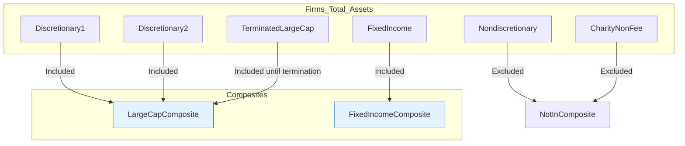

## Reading 92: Introduction to the Global Investment Performance Standards (GIPS) 📊

### 🎯 Introduction

Welcome to GIPS\! This reading tackles a fundamental problem in the investment world: How can you *trust* a firm's reported performance? Before GIPS, performance reporting was the "Wild West." Firms could:

  * **Cherry-pick** their best-performing portfolio and claim it represented their firm-wide results.
  * **Exclude** accounts that were terminated, especially those that left due to poor performance.
  * **Select** specific time periods that made them look like market wizards.

This made "apples-to-apples" 🍎🍏 comparisons impossible. The **Global Investment Performance Standards (GIPS)** were created to solve this. They are a *voluntary* set of ethical principles that standardize how firms calculate and present their investment performance. Following GIPS gives clients and prospects confidence that a firm's reported numbers are fair, complete, and comparable.

-----

### Part 1: The "Who, What, Why" of GIPS (LOS 92.a)

#### Why were GIPS created?

To provide a standardized, globally accepted methodology for reporting performance. This ensures that performance data is:

  * **Comparable** across different investment firms.
  * **Fairly represented** and not misleading.
  * **Complete**, including all relevant performance history.

#### Who can claim compliance?

This is a critical, frequently tested point.

  * Compliance is **voluntary**.
  * Only **investment management firms** can claim compliance. Consultants or software vendors cannot claim compliance.
  * Compliance must be claimed on a **firm-wide basis**. A firm *cannot* claim GIPS compliance for just one product or a single composite.

#### Who benefits from compliance?

1.  **Clients & Prospects:** They can have confidence in reported performance and make meaningful comparisons between firms.
2.  **Investment Firms:** Compliant firms gain credibility and show their commitment to ethical practices, which helps in a competitive marketplace.

-----

### Part 2: The Structure of GIPS (LOS 92.b)

The GIPS standards for firms are organized into eight sections. You don't need to memorize the details of each, but you should be familiar with the main components.

**The Eight Sections of GIPS Standards for Firms:**

1.  **Fundamentals of Compliance:** Defines the firm, sets policies, and requires providing GIPS reports to all prospects.
2.  **Input Data and Calculation Methodology:** Governs how to get data and calculate returns consistently.
3.  **Composite and Pooled Fund Maintenance:** This is a *major* section. It explains how to create and maintain composites, which are the building blocks of GIPS reporting.
4.  **Composite Time-Weighted Return Report:** Defines what must be in the standard GIPS report for composites.
5.  **Composite Money-Weighted Return Report:** Defines reporting for composites that use money-weighted returns (e.g., private equity).
6.  **Pooled Fund Time-Weighted Return Report:** Reporting rules for pooled funds (like mutual funds) using TWR.
7.  **Pooled Fund Money-Weighted Return Report:** Reporting rules for pooled funds using MWR.
8.  **GIPS Advertising Guidelines:** Rules for how a firm can advertise its claim of GIPS compliance.

-----

### Part 3: Fundamentals of Compliance (LOS 92.c, 92.d)

This is the most heavily tested part of GIPS. It covers the core concepts you *must* follow.

#### 1. Definition of the Firm

For GIPS purposes, the "firm" must be the distinct corporation, subsidiary, or division that is **held out to clients as a specific business entity**. If a firm markets its services globally under one name (e.g., "Bluestone Advisers"), it must define the "firm" as all its global offices combined.

#### 2. Definition of Discretion

Firms must define which portfolios are "discretionary". A portfolio is discretionary if the manager can implement its intended strategy. If a client places restrictions on the portfolio (e.g., "Don't buy any tech stocks") that prevent the manager from executing the strategy, the firm may classify that portfolio as **nondiscretionary**.

  * **Why this matters:** Only discretionary portfolios are included in composites.

#### 3. Composites (The Heart of GIPS)

A **composite** is an aggregation of one or more discretionary portfolios managed according to a **similar investment strategy or objective**.

**💡 Composite Rules are CRITICAL:**

  * **Rule 1:** A composite must include **ALL** *fee-paying, discretionary* portfolios (both current and past) that are managed according to that specific strategy.
  * **Rule 2:** A firm must include *all* its fee-paying, discretionary portfolios in *at least one* composite. No accounts can be "orphaned" or left out.
  * **Rule 3:** Composites must be **asset-weighted**, not a simple average of portfolio returns. This prevents a tiny, high-performing account from skewing the composite's return.
  * **Rule 4:** Composites **must include terminated accounts** for all periods up to the date they were terminated. This prevents survivorship bias.

-----

### Part 4: Verification (LOS 92.e)

Think of verification as an "audit" for GIPS compliance.

  * **What it is:** A third-party "verifier" performs tests on the firm's processes to confirm it has complied with all GIPS requirements on a firm-wide basis.
  * **Is it required?** **NO**. Verification is **optional**.
  * **What's the catch?** If a firm *chooses* to get verified, the verification **must apply to the entire firm**. A firm *cannot* have a single composite verified. It's all or nothing.

**🧠 GIPS vs. Verification: Key Distinction**

  * **Claiming Compliance:** A firm self-attests it followed all GIPS rules. (e.g., "XYZ Advisers claims compliance with the GIPS standards.")
  * **Claiming Verification:** A third party confirms the firm's compliance. (e.g., "XYZ Advisers claims compliance with the GIPS standards and has been independently verified by ABC Auditors.")

-----

### 🎯 Quick Exam-Day Pointers

  * **Voluntary & Firm-Wide:** GIPS compliance is *voluntary* and must be applied on a *firm-wide* basis.
  * **Composites are Key:** Composites must include **ALL** *fee-paying, discretionary* portfolios in *at least one* composite.
  * **No Cherry-Picking:** Terminated accounts *must* be included in composites up to the date of termination.
  * **Asset-Weighted:** Composite returns are asset-weighted, not simple averages.
  * **Definition of Firm:** The entity *held out to clients*.
  * **Verification is Optional:** Verification by a third party is *optional* but, if done, must also be on a *firm-wide* basis. You cannot verify just one composite.

