Excellent, Vipin. We've mastered the Income Statement. Now, let's turn our attention to the **Balance Sheet**.

### **Reading 3: Analyzing Balance Sheets**

If the Income Statement is a video of a company's performance over a period, the Balance Sheet is a snapshot or a photograph. It tells us what a company **owns (Assets)** and what it **owes (Liabilities)** at a single point in time. The difference between these two is the owners' stake, known as **Equity**. The fundamental equation that must always hold true is:

**Assets = Liabilities + Equity**
#### **Balance Sheet Analysis Overview Diagram**

```mermaid
flowchart TD
    A["📊 Balance Sheet Analysis"] --> B["🟦 Intangible Assets & Goodwill"]
    A --> C["🟧 Financial Instruments"]
    A --> D["🟨 Non-Current Liabilities"]
    A --> E["🟩 Balance Sheet Analysis & Ratios"]

    classDef mainNode fill:#e3f2fd,stroke:#0d47a1,stroke-width:4px,color:#000
    classDef topicNode fill:#f3e5f5,stroke:#4a148c,stroke-width:3px,color:#000

    class A mainNode
    class B,C,D,E topicNode
```

#### **Intangible Assets & Goodwill Detail**

#### **Financial Instruments Detail**

```mermaid
flowchart TD
    C["🟧 Financial Instruments"] --> C1["Amortized Cost"]
    C1 --> C11["Debt Held to Maturity"]
    C --> C2["Fair Value"]
    C2 --> C21["FVTPL: Gains/Losses in Income Statement"]
    C2 --> C22["FVOCI: Gains/Losses in OCI (Equity)"]

    classDef detailNode fill:#fff3e0,stroke:#e65100,stroke-width:2px,color:#000
    class C,C1,C11,C2,C21,C22 detailNode
```

#### **Non-Current Liabilities Detail**

```mermaid
flowchart TD
    D["🟨 Non-Current Liabilities"] --> D1["Long-Term Financial Liabilities"]
    D1 --> D11["Bonds, Loans: Amortized Cost"]
    D --> D2["Deferred Tax Liabilities (DTLs)"]
    D2 --> D21["Origin: Accelerated Depreciation"]
    D2 --> D22["Income Tax Expense > Taxes Payable"]

    classDef detailNode fill:#fff3e0,stroke:#e65100,stroke-width:2px,color:#000
    class D,D1,D11,D2,D21,D22 detailNode
```

#### **Balance Sheet Analysis & Ratios Detail**

```mermaid
flowchart TD
    E["🟩 Balance Sheet Analysis & Ratios"] --> E1["Vertical Common-Size Balance Sheet"]
    E1 --> E11["Express Each Item as % of Total Assets"]
    E --> E2["Liquidity Ratios"]
    E2 --> E21["Current Ratio = Current Assets / Current Liabilities"]
    E2 --> E22["Quick Ratio = (Cash + Securities + Receivables) / Current Liabilities"]
    E --> E3["Solvency Ratios"]
    E3 --> E31["Debt-to-Equity = Total Debt / Total Equity"]
    E3 --> E32["Financial Leverage = Avg Assets / Avg Equity"]

    classDef detailNode fill:#fff3e0,stroke:#e65100,stroke-width:2px,color:#000
    class E,E1,E11,E2,E21,E22,E3,E31,E32 detailNode
```

-----

### **Module 1: Intangible Assets & Goodwill**

These are assets you can't physically touch, but they can be incredibly valuable. Think of brand names, patents, and software.

Click to expand and explore Intangible Assets

-----

**Intangible Assets** are identifiable, non-monetary assets without physical substance. Goodwill is a special type of intangible asset that is not separately identifiable.

**How they are accounted for depends on how they are acquired:**

1.  **Purchased Intangibles:**

      * **What they are:** Buying a patent or a software license from another company.
      * **Accounting:** They are recorded on the balance sheet at their purchase cost (which is assumed to be their fair value).

2.  **Internally Developed Intangibles:**

      * **What they are:** Creating a brand or technology from scratch through internal efforts.
      * **Accounting (A Major IFRS vs. US GAAP difference):**
          * **Research Phase:** Under both IFRS and US GAAP, costs in the 'research' phase (e.g., searching for new knowledge) must be **expensed** as incurred.
          * **Development Phase:** This is the application of research findings (e.g., designing and testing a prototype).
              * **IFRS:** Allows companies to **capitalize** development costs as an intangible asset if they meet specific criteria (e.g., technical feasibility, intent to sell the asset).
              * **US GAAP:** Requires development costs to also be **expensed**, with a major exception for software development costs, which are capitalized after technological feasibility is established.
      * **Indian Context:** Consider **Dr. Reddy's Laboratories**. The money they spend in their labs trying to discover a new drug molecule is 'research' and is expensed. Once they have a promising molecule and start the expensive process of clinical trials to get it ready for production, IFRS would allow them to capitalize these 'development' costs. A similar US-based pharma company would have to expense them.
      * **Effect:** The IFRS-reporting company (Dr. Reddy's) would report higher assets and higher net income during the development phase compared to its US counterpart.

3.  **Goodwill:**

      * **What it is:** This is a unique intangible asset that is only created during an acquisition. It is the amount an acquirer pays *in excess of* the fair value of the identifiable net assets (Assets - Liabilities) of the company it buys. It represents things like brand reputation, customer relationships, and synergies that you can't put a finger on individually.
      * **Indian Context:** When **Tata Motors** acquired **Jaguar Land Rover (JLR)**, they paid a price that was significantly higher than the fair value of JLR's factories, inventory, and patents. That huge excess amount was recorded on Tata Motors' balance sheet as **Goodwill**.
      * **Accounting:** Goodwill is **not amortized** (expensed over time). Instead, it is tested for **impairment** at least annually. If its value is deemed to have fallen, the company takes a one-time impairment charge (an expense) on the income statement.

<!-- end list -->

  * **<mark>EXAM TIP:</mark>:** The different treatments for Research vs. Development costs under IFRS and US GAAP is a classic, high-probability exam topic. Remember: IFRS can capitalize development; US GAAP generally expenses it.

-----

-----

### **Module 2: Financial Instruments**

This refers to a company's investments in assets like stocks and bonds of other entities. How these are valued on the balance sheet and how changes in their value affect the income statement is a key topic.

Click to expand and explore Financial Instruments

-----

A **Financial Instrument** is a contract that creates a financial asset for one company and a financial liability (or equity) for another. Here, we focus on financial assets (investments).

There are two primary ways to measure these assets after they are initially purchased:

1.  **Amortized Cost:**

      * **What it's for:** Debt instruments (like bonds) that the company has both the intent and ability to hold until they mature.
      * **Accounting:** The investment is recorded at cost, and any discount or premium is gradually amortized over the bond's life. Market value fluctuations are ignored. This results in a very stable value on the balance sheet and predictable interest income.

2.  **Fair Value (Market Value):**

      * This is where it gets interesting. If an asset is measured at fair value, what happens to the unrealized gains or losses when the market price changes?
      * **Fair Value Through Profit or Loss (FVTPL):**
          * **What it's for:** Used for securities held for trading and most equity investments.
          * **Accounting:** Any change in the market value (unrealized gain or loss) is reported on the **Income Statement**. This makes the company's net income more volatile.
      * **Fair Value Through Other Comprehensive Income (FVOCI):**
          * **What it's for:** Used for certain debt instruments where the strategy is to both hold them for interest and sell them if needed.
          * **Accounting:** The unrealized gains and losses **bypass the Income Statement**. Instead, they are reported in a separate section of Shareholder's Equity called **Other Comprehensive Income (OCI)**. This keeps the income statement stable, but equity will fluctuate.

<!-- end list -->

  * **Indian Context:** Think of the massive investment portfolio of a bank like **ICICI Bank**. They hold government bonds that they might classify as "held to maturity" (amortized cost). They also have a portfolio of stocks for trading (FVTPL) and another portfolio of strategic bonds they might sell before maturity (FVOCI). An analyst needs to understand these classifications to assess the volatility and quality of the bank's earnings.

  * **<mark>EXAM TIP:</mark>:** This is a critical topic. You must know where unrealized gains/losses are reported for each classification. **FVTPL -> Income Statement (Volatile NI)**. **FVOCI -> OCI in Equity (Stable NI)**. This is a very common source of exam questions.

-----

-----

### **Module 3: Non-Current Liabilities**

This section covers a company's long-term obligations. We'll focus on one of the trickiest: Deferred Taxes.

Click to expand and explore Non-Current Liabilities

-----

  * **Long-Term Financial Liabilities:** This includes bonds and long-term bank loans. They are typically reported at **amortized cost** on the balance sheet.

  * **Deferred Tax Liabilities (DTLs):**

      * **Concept:** A DTL arises when a company reports *less* tax expense to the government on its tax return than it reports as tax expense to shareholders on its income statement. It's a "liability" because the company will have to pay that tax eventually.
      * **Most Common Cause:** Differences in depreciation. Tax laws often allow for **accelerated depreciation**, where you can deduct a larger portion of an asset's cost in the early years. This reduces your taxable income and the cash taxes you pay *now*. For financial reporting to shareholders, companies often prefer **straight-line depreciation**, which spreads the expense evenly. This results in higher accounting profit and higher tax expense reported on the income statement *now*.
      * **The Result:** `Income Tax Expense (on Income Statement) > Taxes Payable (to Government)`
        The difference between these two is the **Deferred Tax Liability**.
      * **Indian Context:** A manufacturing company like **Bharat Forge** might buy a new machine. For its tax filings, it uses accelerated depreciation to lower its current tax bill. For its annual report to investors, it uses straight-line depreciation to show smoother, higher profits. This difference creates a DTL on its balance sheet.

  * **<mark>EXAM TIP:</mark>:** Understand that a DTL is created when accounting income > taxable income due to a temporary difference. The classic example is the difference in depreciation methods.

-----

-----

### **Module 4: Balance Sheet Analysis: Tools & Techniques**

Now we apply our analytical tools to the balance sheet.

Click to expand and explore Balance Sheet Analysis

-----

  * **Vertical Common-Size Balance Sheet:**

      * **What it is:** Every item on the balance sheet is expressed as a percentage of **Total Assets**. This allows you to see the company's structure and strategy, irrespective of its size.
      * **Indian Context:**
          * **NTPC (National Thermal Power Corporation):** A common-size balance sheet would show a very large percentage for Property, Plant, & Equipment, as it's a capital-intensive power utility.
          * **Infosys:** A common-size balance sheet would show a very high percentage for Current Assets (like cash and receivables) and a very low percentage for PPE, reflecting its asset-light, service-based business model.

  * **Key Balance Sheet Ratios:**

      * **Liquidity Ratios (Short-term health):**
          * **Current Ratio** = `Current Assets / Current Liabilities`. A measure of a company's ability to cover its short-term bills.
          * **Quick Ratio (Acid-Test)** = `(Cash + Marketable Securities + Receivables) / Current Liabilities`. A stricter liquidity test that excludes less liquid inventory.
      * **Solvency Ratios (Long-term health):**
          * **Debt-to-Equity Ratio** = `Total Debt / Total Shareholders' Equity`. Shows how much debt a company is using to finance its assets relative to equity. A higher ratio means higher risk.
          * **Financial Leverage Ratio** = `Average Total Assets / Average Total Equity`. Shows the extent to which assets are financed by debt.

  * **<mark>EXAM TIP:</mark>:** You need to be able to calculate and, more importantly, *interpret* these key ratios. The exam will give you the numbers and ask what a change in a ratio implies about the company's risk or performance.

-----

-----

### **Key Formulas for Analyzing Balance Sheets**

  * **Accounting Equation:** `Assets = Liabilities + Equity`
  * **Current Ratio:** `Current Assets / Current Liabilities` 
  * **Quick Ratio:** `(Cash + Marketable Securities + Receivables) / Current Liabilities` 
  * **Debt-to-Equity Ratio:** `Total Debt / Total Equity` 
  * **Debt-to-Assets Ratio:** `Total Debt / Total Assets` 
  * **Financial Leverage:** `Average Total Assets / Average Total Equity` 

### **Quick Exam-Day Pointers**

  * **Intangibles:** Remember the R\&D rule difference: IFRS can capitalize **D**evelopment; US GAAP generally expenses it. Goodwill is not amortized but tested for impairment.
  * **Financial Instruments:** Know where unrealized gains/losses go\! **FVTPL -> Income Statement.** **FVOCI -> OCI (Equity).**
  * **DTLs:** The most common cause is using **accelerated depreciation for tax** and **straight-line for reporting**.
  * **Ratios:**
      * Liquidity = Short-term health.
      * Solvency = Long-term health.
      * A higher liquidity ratio is generally better.
      * A higher solvency (debt) ratio means higher financial risk.

We have now covered the Balance Sheet. This reading introduces some complex but very important valuation concepts.

Let me know when you are ready to proceed to the **"Analyzing Statements of Cash Flows"**.