Of course, Vipin. Let's build on what we've learned. Now that we understand the components of the Statement of Cash Flows, we can focus on how to use it for powerful analysis. This reading is all about interpretation and application.

### **Reading 5: Analyzing Statements of Cash Flows II**

Think of this reading as moving from being a mechanic who can take apart the engine (Reading 4) to being a performance analyst who can tell how well the car is running and how fast it can go. We're using the cash flow data to assess the health and prospects of the business.
#### **Cash Flow Analysis Overview Diagram**

```mermaid
flowchart TD
    A["💵 Cash Flow Analysis"] --> B["🟦 Evaluating the Statement of Cash Flows"]
    A --> C["🟧 Free Cash Flow (FCF)"]
    A --> D["🟨 Cash Flow Ratios"]

    classDef mainNode fill:#e3f2fd,stroke:#0d47a1,stroke-width:4px,color:#000
    classDef topicNode fill:#f3e5f5,stroke:#4a148c,stroke-width:3px,color:#000

    class A mainNode
    class B,C,D topicNode
```

#### **Evaluating the Statement of Cash Flows Detail**

```mermaid
flowchart TD
    B["🟦 Evaluating SCF"] --> B1["Major Sources & Uses of Cash"]
    B1 --> B11["CFO, CFI, CFF"]
    B1 --> B12["Life-Cycle Clues"]
    B12 --> B121["Healthy: CFO+, CFI-, CFF-"]
    B12 --> B122["Growth: CFO-, CFI-, CFF+"]
    B12 --> B123["Distress: CFO-, CFI+, CFF+"]
    B --> B2["Operating Cash Flow (CFO) Performance"]
    B2 --> B21["CFO vs. Net Income"]
    B2 --> B22["CFO > Net Income: Healthy"]
    B2 --> B23["Net Income > CFO: Red Flag"]
    B --> B3["Investing Cash Flow (CFI) Activities"]
    B3 --> B31["Capex vs. Depreciation"]
    B3 --> B32["Asset Sales"]
    B --> B4["Financing Cash Flow (CFF) Activities"]
    B4 --> B41["Debt: Issued vs. Repaid"]
    B4 --> B42["Equity: Dividends, Buybacks, Issuance"]
    B --> B5["Common-Size Analysis"]
    B5 --> B51["% of Revenue"]
    B5 --> B52["% of Total Inflows/Outflows"]

    classDef detailNode fill:#fff3e0,stroke:#e65100,stroke-width:2px,color:#000
    class B,B1,B11,B12,B121,B122,B123,B2,B21,B22,B23,B3,B31,B32,B4,B41,B42,B5,B51,B52 detailNode
```

#### **Free Cash Flow (FCF) Detail**

```mermaid
flowchart TD
    C["🟧 Free Cash Flow"] --> C1["FCFF: To All Capital Providers"]
    C1 --> C11["FCFF = CFO + After-Tax Interest – Capex"]
    C --> C2["FCFE: To Equity Holders"]
    C2 --> C21["FCFE = CFO – Capex + Net Borrowing"]

    classDef detailNode fill:#fff3e0,stroke:#e65100,stroke-width:2px,color:#000
    class C,C1,C11,C2,C21 detailNode
```

#### **Cash Flow Ratios Detail**

```mermaid
flowchart TD
    D["🟨 Cash Flow Ratios"] --> D1["Performance/Profitability"]
    D1 --> D11["Cash Flow to Revenue = CFO / Revenue"]
    D1 --> D12["Cash Return on Assets = CFO / Avg Total Assets"]
    D --> D2["Coverage/Solvency"]
    D2 --> D21["Debt Coverage = CFO / Total Debt"]
    D2 --> D22["Interest Coverage = (CFO + Interest Paid + Taxes Paid) / Interest Paid"]
    D --> D3["Reinvestment Ratio = CFO / Capex"]

    classDef detailNode fill:#fff3e0,stroke:#e65100,stroke-width:2px,color:#000
    class D,D1,D11,D12,D2,D21,D22,D3 detailNode
```

-----

### **Module 1: Evaluating the Statement of Cash Flows**

A structured evaluation of the SCF can reveal a lot about a company's strategy, health, and life-cycle stage. We can use a simple 4-step process.

Click to expand and explore the 4-step evaluation process

-----

**A Framework for Analyzing the SCF:**

1.  **Identify the Major Sources and Uses of Cash:**

      * **What it means:** Look at the bottom line of each of the three sections (CFO, CFI, CFF). Is the company generating cash or using cash in each activity?
      * **Life-Cycle Clues:**
          * **Healthy, Mature Company:** Should have strong, positive **CFO**. It uses this cash for investing (**negative CFI**) and to pay back capital providers (**negative CFF** through dividends, stock buybacks, or debt repayment). Example: **Hindustan Unilever**.
          * **Growth Company/Startup:** Often has **negative CFO** (as it builds inventory and receivables) and **negative CFI** (as it invests heavily in assets). It funds this cash burn by raising capital, leading to a large **positive CFF**. Example: A new-age tech company like **Paytm** in its early years.
          * **Company in Distress:** Might show **negative CFO** and be selling off assets to survive, leading to **positive CFI**. It might also be taking on emergency debt, leading to **positive CFF**. This is an unsustainable pattern.

2.  **Evaluate Operating Cash Flow (CFO) Performance:**

      * **What it means:** Dig deeper into the CFO section. Is the positive CFO coming from the core business, or from one-time items or aggressive working capital management (like delaying payments to suppliers)?
      * **CFO vs. Net Income:** A key quality check. For a healthy company, **CFO should be greater than Net Income**. Why? Because Net Income is reduced by non-cash expenses like depreciation. If Net Income is consistently higher than CFO, it's a **major red flag** that could signal aggressive revenue recognition or poor collection of receivables.

3.  **Evaluate Investing Cash Flow (CFI) Activities:**

      * **What it means:** Look at what the company is doing with its long-term assets.
      * **Capital Expenditures (Capex):** Is the company investing enough to maintain and grow its asset base? A good rule of thumb is that capex should at least equal depreciation expense to maintain the existing asset base. Capex significantly above depreciation suggests investment for growth.
      * **Asset Sales:** Consistent selling of productive assets could be a sign of financial trouble or a strategic shift away from a particular business line.

4.  **Evaluate Financing Cash Flow (CFF) Activities:**

      * **What it means:** How is the company managing its relationship with its investors and lenders?
      * **Debt:** Is the company consistently taking on more debt or is it paying it down?
      * **Equity:** Is the company paying dividends or buying back its own stock (returning cash to shareholders)? Or is it issuing new stock (raising cash from shareholders)? These actions signal management's confidence and capital allocation strategy.

**Common-Size Analysis of the SCF:**
Just like with the other statements, we can create common-size versions to spot trends.

  * **As a % of Revenue:** This is very useful for forecasting. It shows how much cash from operations a company generates for every rupee of sales.
  * **As a % of Total Inflows/Outflows:** This shows the relative importance of each activity. For a healthy company, CFO should be the largest percentage of cash inflows.

-----

-----

### **Module 2: Free Cash Flow (FCF) - The Ultimate Metric**

This is one of the most important concepts you will learn for valuation. Free cash flow is the cash generated by the business that is truly "free" and available to be distributed to its capital providers (lenders and owners) after all necessary operational expenses and investments are paid for.

Click to expand and master Free Cash Flow

-----

There are two main types of Free Cash Flow:

1.  **Free Cash Flow to the Firm (FCFF):**

      * **Concept:** This is the cash flow available to **all** capital providers, both **debt holders and equity holders**. It's the total cash flow generated by the company's assets before any financing decisions are considered.
      * **Formula (starting from CFO):**
        `FCFF = CFO + [Interest Expense * (1 – Tax Rate)] – Capital Expenditures`
      * **Logic Breakdown:**
          * `CFO`: Start with cash from operations.
          * `+ [Interest Expense * (1 – Tax Rate)]`: In the indirect method, the cash paid for interest was subtracted to get to CFO. Since FCFF is the cash available to *all* capital providers (including debt holders), we must add back the after-tax interest paid to debt holders.
          * `– Capital Expenditures`: Subtract the cash needed to maintain and grow the company's asset base (found in the CFI section).

2.  **Free Cash Flow to Equity (FCFE):**

      * **Concept:** This is the cash flow available **only** to the **equity holders (shareholders)**. It's the cash left over after all expenses and debt obligations (both interest and principal) are paid. This is the cash that could theoretically be paid out as dividends.
      * **Formula (starting from CFO):**
        `FCFE = CFO – Capital Expenditures + Net Borrowing`
      * **Logic Breakdown:**
          * `CFO`: Start with cash from operations.
          * `– Capital Expenditures`: Subtract the necessary investment in fixed assets.
          * `+ Net Borrowing`: This is `(Debt Issued – Debt Repaid)`. If the company borrowed more than it repaid, this is a source of cash for equity holders, so we add it. If it repaid more than it borrowed, it's a use of cash, so we subtract it.

<!-- end list -->

  * **Indian Context:** Imagine **Asian Paints**. Its strong, predictable CFO allows it to fund its new paint factories (Capital Expenditures). The cash that's left over is its Free Cash Flow. It can use this FCFE to pay dividends to its shareholders or to buy back its own stock.

  * **<mark>EXAM TIP:</mark>:** You **must** know the formulas for FCFF and FCFE and the logic behind them. The exam will give you the components from a company's financial statements and ask you to calculate one of these measures. These are high-probability questions.

-----

-----

### **Module 3: Cash Flow Ratios**

These ratios use "hard" cash flow numbers instead of "soft" accrual-based earnings, making them a great tool for assessing quality and performance.

Click to expand and learn key Cash Flow Ratios

-----

**Performance/Profitability Ratios (How well does it generate cash?):**

  * **Cash Flow to Revenue** = `CFO / Revenue`. Measures the cash generated per rupee of sales.
  * **Cash Return on Assets** = `CFO / Average Total Assets`. A cash-based version of ROA.

**Coverage/Solvency Ratios (Can it pay its bills with cash?):**

  * **Debt Coverage Ratio** = `CFO / Total Debt`. Measures how many years it would take to repay all debt using just operating cash flow. A lower number is better.
  * **Interest Coverage Ratio (Cash-based)** = `(CFO + Interest Paid + Taxes Paid) / Interest Paid`. Shows how many times the company can cover its cash interest payments from its operations. This is often seen as a more reliable measure than the earnings-based ratio.
  * **Reinvestment Ratio** = `CFO / Cash Paid for Long-Term Assets (Capex)`. A ratio > 1.0 means the company can fund its capital expenditures entirely with internally generated cash. A ratio < 1.0 means it relies on external financing (debt or equity) to expand.

-----

-----

### **Key Formulas for Analyzing Statements of Cash Flows II**

  * **Free Cash Flow to the Firm (FCFF)** = `CFO + [Interest Expense * (1 – Tax Rate)] – Capital Expenditures`
  * **Free Cash Flow to Equity (FCFE)** = `CFO – Capital Expenditures + Net Borrowing`
  * **Debt Coverage Ratio** = `CFO / Total Debt`
  * **Reinvestment Ratio** = `CFO / Capital Expenditures`
  * **Interest Coverage (Cash-Based)** = `(CFO + Interest Paid + Taxes Paid) / Interest Paid`

### **Quick Exam-Day Pointers**

  * A healthy, mature company should have **CFO > 0, CFI < 0, CFF < 0**.
  * A key quality check: **CFO should be > Net Income**. If not, investigate why.
  * **FCFF is for ALL capital providers (debt + equity).** You add back after-tax interest.
  * **FCFE is for EQUITY providers only.** You adjust for net debt movements.
  * Cash flow ratios are powerful because cash is harder to manipulate than earnings. Use them to confirm or question the story told by earnings-based ratios.

We've now completed our deep dive into the Statement of Cash Flows. This is a topic that ties together the Income Statement and the Balance Sheet and is fundamental to valuation.

Let me know when you're ready to move on to the next reading: **"Analysis of Inventories"**.