### **Reading 6: Analysis of Inventories**

For companies that sell physical goods (manufacturers and retailers), inventory is a significant asset on the balance sheet and the Cost of Goods Sold (COGS) is a major expense on the income statement. How inventory is accounted for can have a huge impact on reported financial performance.
#### **Inventory Analysis Overview Diagram**
#### **Inventory Valuation Methods Detail**

```mermaid
flowchart TD
    B["🧮 Inventory Valuation Methods"] --> B1["FIFO<br/>First-In, First-Out"]
    B --> B2["LIFO<br/>Last-In, First-Out"]
    B --> B3["Weighted-Average Cost"]
    B2 --> B21["Permitted: U.S. GAAP"]
    B2 --> B22["Prohibited: IFRS/Ind AS"]
    B1 --> B11["Lower COGS, Higher NI, Higher Inventory"]
    B2 --> B12["Higher COGS, Lower NI, Lower Inventory"]

    classDef detailNode fill:#fff3e0,stroke:#e65100,stroke-width:2px,color:#000
    class B,B1,B2,B3 detailNode
    class B21,B22,B11,B12 detailNode
```

#### **Inventory Write-Downs & NRV Detail**

#### **Presentation, Disclosures & Ratios Detail**

```mermaid
flowchart TD
    A["📦 Inventory Analysis<br/>Module 6 Overview"] --> B["🧮 Valuation Methods (FIFO, LIFO, Weighted-Average)"]
    A --> C["⚠️ Inventory Write-Downs & NRV"]
    A --> D["📑 Presentation, Disclosures & Ratios"]

    classDef mainNode fill:#e3f2fd,stroke:#0d47a1,stroke-width:4px,color:#000
    classDef topicNode fill:#f3e5f5,stroke:#4a148c,stroke-width:3px,color:#000

    class A mainNode
    class B,C,D topicNode
```

#### **1. Inventory Valuation Methods**

**Detailed Explanation:**
When a company buys inventory at different prices over a period, it needs a cost flow assumption to determine which costs to assign to the items sold (COGS) and which to assign to the items remaining (Ending Inventory).

* **First-In, First-Out (FIFO):** Assumes the first units purchased are the first ones sold.
    * **Impact in rising prices:** The oldest, cheapest costs go to COGS, and the newest, most expensive costs remain in Ending Inventory. This results in **lower COGS, higher net income, and higher inventory value** on the balance sheet.
* **Last-In, First-Out (LIFO):** Assumes the last units purchased are the first ones sold. **(Permitted under U.S. GAAP, but prohibited under IFRS).**
    * **Impact in rising prices:** The newest, most expensive costs go to COGS, and the oldest, cheapest costs remain in Ending Inventory. This results in **higher COGS, lower net income, and lower inventory value**.
* **Weighted-Average Cost:** Uses the weighted-average cost of all goods available for sale during the period to determine both COGS and Ending Inventory. The results will be between FIFO and LIFO.

**LIFO Reserve:** Companies using LIFO in the U.S. must also disclose a "LIFO Reserve." This is the amount by which the LIFO inventory value differs from the FIFO inventory value. An analyst can use this to adjust a LIFO company's financials to a FIFO basis for better comparability.
* `Inventory (FIFO) = Inventory (LIFO) + LIFO Reserve`
* `COGS (FIFO) = COGS (LIFO) - Change in LIFO Reserve`

**Indian Context Example:**
**Ind AS (and IFRS) prohibits the use of LIFO.** Therefore, an Indian retailer like **DMart (Avenue Supermarts)** would use either FIFO or the Weighted-Average Cost method. If an analyst wants to compare DMart to a U.S. retailer like **Costco (which uses LIFO)**, they must use the LIFO reserve disclosed by Costco to convert its inventory and COGS figures to a FIFO basis before making a meaningful comparison of profit margins or inventory turnover.

> **<mark>EXAM TIP:</mark>:**
> This is a classic and very important topic. You **must know the impact of LIFO vs. FIFO on financial statements and ratios during periods of rising and falling prices**. The table below summarizes the most common scenario (rising prices):
>
> | Item | FIFO | LIFO |
| :--- | :--- | :--- |
| **COGS** | Lower | Higher |
| **Net Income** | Higher | Lower |
| **Taxes Paid** | Higher | Lower |
| **Ending Inventory** | Higher | Lower |
| **Working Capital** | Higher | Lower |
| **Inventory Turnover** | Lower | Higher |

---

#### **2. Inventory Write-Downs (Lower of Cost or Net Realizable Value)**

**Detailed Explanation:**
Inventory cannot be carried on the balance sheet at an amount greater than its recoverable value. Accounting standards require inventory to be reported at the **lower of its cost or its net realizable value (NRV)**.

* **Net Realizable Value (NRV):** The estimated selling price minus the estimated costs of completion and sale.
* **Write-Down:** If NRV is less than the inventory's cost, the company must "write down" the value of the inventory to NRV. This write-down is recorded as an expense on the income statement (usually as part of COGS).
* **Impact of Write-Down:**
    * Reduces gross profit and net income.
    * Reduces the carrying value of inventory on the balance sheet.
    * Artificially increases inventory turnover in the period of the write-down.
* **Reversal of Write-Downs:**
    * **IFRS:** If the NRV of previously written-down inventory recovers, the write-down can be **reversed** (up to the amount of the original loss). The reversal reduces COGS.
    * **U.S. GAAP:** Reversals of inventory write-downs are **prohibited**.

**Indian Context Example:**
A fashion retailer like **Trent (Westside)** might find that a line of clothing from the winter season is out of style by the time spring arrives. The cost of this clothing might be ₹1 crore, but they estimate they can only sell it for ₹60 lakh after marketing costs. They must write down the inventory by ₹40 lakh, which increases their COGS and lowers their profit for the period. If, under IFRS/Ind AS, there is an unexpected surge in demand for that style later, they could reverse the write-down.

> **<mark>EXAM TIP:</mark>:**
> The difference in the treatment of write-down reversals between IFRS (allowed) and U.S. GAAP (prohibited) is a key testable point. Also, be aware of the impact of a write-down on ratios - it makes profitability look worse but can make inventory turnover look deceptively better.

---

#### **3. Presentation, Disclosures, and Inventory Ratios**

**Detailed Explanation:**
The notes to the financial statements provide crucial information about inventory, including:
* The cost flow method used (FIFO, Weighted-Average).
* The carrying amount of inventory broken down by category (raw materials, work-in-progress, finished goods).
* The amount of any inventory write-downs.
* The amount of inventory pledged as collateral for loans.

**Key Ratios:**
Analysts use several ratios to evaluate how efficiently a company is managing its inventory.
* **Inventory Turnover:** Measures how many times a company sells its average inventory during a period. A higher turnover is generally better.
* **Days of Inventory on Hand (DOH):** The number of days it takes to sell inventory. A lower number of days is generally better.

**Indian Context Example:**
An analyst looking at **Maruti Suzuki's** annual report would analyze the breakdown of its inventory between raw materials (steel, components), work-in-progress (cars on the assembly line), and finished goods (cars ready for sale). A buildup in finished goods inventory relative to sales could be a red flag, suggesting that production is outpacing demand, which might lead to future price cuts and lower margins. They would compare Maruti's DOH to that of competitors like Tata Motors to gauge relative efficiency.

> **<mark>EXAM TIP:</mark>:**
> Be ready to calculate Inventory Turnover and DOH. The formulas are key. Also, be able to interpret what these ratios signify. For example, a declining inventory turnover (and rising DOH) can be a sign of obsolete inventory or slowing sales.

***

### **Reading 6: Summary**

#### **List of Formulas Used**
1.  **Inventory Turnover:**
    $$\text{Inventory Turnover} = \frac{\text{Cost of Goods Sold}}{\text{Average Inventory}}$$

2.  **Days of Inventory on Hand (DOH):**
    $$\text{DOH} = \frac{365}{\text{Inventory Turnover}}$$

3.  **LIFO to FIFO Adjustments:**
    * `FIFO Inventory = LIFO Inventory + LIFO Reserve`
    * `FIFO COGS = LIFO COGS - (Ending LIFO Reserve - Beginning LIFO Reserve)`
    * `FIFO Retained Earnings = LIFO Retained Earnings + LIFO Reserve * (1 - Tax Rate)`

#### **Quick Exam-Day Pointer**
* **LIFO vs. FIFO in Rising Prices:** LIFO results in higher COGS, lower NI, lower inventory, and higher inventory turnover. FIFO is the opposite.
* **IFRS prohibits LIFO.** Indian companies use FIFO or Weighted-Average.
* Inventory must be reported at the **lower of cost or NRV**.
* **IFRS allows reversals of inventory write-downs; U.S. GAAP does not.**
* A **decreasing inventory turnover** (increasing DOH) is a potential warning sign of obsolete inventory or slowing sales.
