## Reading 27: Introduction to Financial Statement Analysis 🚀

### 🎯 Introduction

Welcome, future CFA charterholder\! Think of yourself as a financial detective 🕵️‍♂️ or a doctor examining a company's health 🩺. The company provides clues in its financial reports, but just looking at the surface isn't enough. **Financial statement analysis** is your toolkit to dig deeper, connect the dots, and understand what's *really* going on. This reading teaches you the framework for your investigation, the key evidence to look for (beyond just the main statements), and why understanding the rules of the game (accounting standards) is crucial. Let's learn how to read between the lines and make smarter investment decisions\!

-----

### Part 1: What's the Game Plan? The Analysis Framework 🗺️

Before diving into numbers, every good analyst needs a structured approach. The **financial statement analysis framework** provides a systematic way to tackle any analysis task, whether you're evaluating a stock, a bond, or a potential acquisition. It ensures you're thorough and objective.

Here are the six steps:

```mermaid
graph TD
    A["Step 1: State the Objective & Context<br/>🎯 What question are you answering?<br/>⏰ How much time/resource?"] --> B["Step 2: Gather Data<br/>📚 Financial statements, industry info,<br/>news, management discussions"]
    B --> C["Step 3: Process the Data<br/>📊 Adjust statements, calculate ratios,<br/>create charts & common-size statements"]
    C --> D["Step 4: Analyze & Interpret<br/>💡 Use data to answer Step 1 questions,<br/>draw conclusions"]
    D --> E["Step 5: Report Conclusions<br/>✍️ Write report/recommendation,<br/>ensure compliance (Code & Standards!)"]
    E --> F["Step 6: Update the Analysis<br/>🔄 Repeat periodically,<br/>revise as needed"]
```

1.  **State the Objective and Context:** Know *why* you're doing the analysis. Are you deciding whether to buy stock in Reliance Industries? Are you assessing if Tata Motors can repay its debt? Define the question, the required output format, and your time/resource constraints.
2.  **Gather Data:** Collect the raw materials – annual/quarterly reports, regulatory filings (like the 10-K in the US), industry data, economic news, and maybe even talk to the company's management or customers.
3.  **Process the Data:** Clean and organize the data. Make adjustments for accounting differences, calculate key **financial ratios**, create common-size statements, and visualize trends with graphs.
4.  **Analyze and Interpret the Data:** Turn data into insights. Compare ratios over time and against competitors. What does the processed data tell you about the company's performance and risks? Does it answer your initial question?
5.  **Report the Conclusions or Recommendations:** Communicate your findings clearly and concisely in a well-structured report. Crucially, ensure your report follows the CFA Institute **Code and Standards**.
6.  **Update the Analysis:** Markets and companies change. Regularly revisit your analysis and update your conclusions based on new information.

-----

### Part 2: Why Bother Analyzing Financial Statements? 🤔

**Financial reporting** is how companies communicate their financial performance and position to the outside world – investors, creditors, regulators, etc. Think of it as the company's official story.

The **role of financial statement analysis** is to use that story (the financial statements) and other available information to make informed **economic decisions**. 💰

  * **Investment Decisions:** Should you invest in Infosys stock or recommend it to a client? Analysis helps assess future profitability and risk.   \* **Credit Decisions:** Should HDFC Bank extend a loan to a small business? Analysis helps gauge the company's ability to repay debt.
  * **Other Uses:** Evaluating competitors, assessing acquisition targets, assigning credit ratings (like CRISIL or Moody's do), and more.

Essentially, analysts dissect past performance and current financial health to predict a company's future ability to generate profits and cash flow, while also identifying potential risks. 📈📉

-----

### Part 3: Digging Deeper - Beyond the Basic Statements 🕵️‍♀️

The main financial statements (Income Statement, Balance Sheet, Cash Flow Statement, Statement of Changes in Equity) are just the headlines. The real insights often come from the supporting details.

#### **The Rule Makers and Enforcers 🏛️**

  * **Standard-Setting Bodies:** These are independent groups that create the accounting rules (**financial reporting standards**).
      * **IASB (International Accounting Standards Board):** Sets **IFRS (International Financial Reporting Standards)**, used in many countries globally, including India (Ind AS is converged with IFRS). Older standards are called **IAS**.
      * **FASB (Financial Accounting Standards Board):** Sets **U.S. GAAP (Generally Accepted Accounting Principles)** for the United States.
  * **Regulatory Authorities:** These are government agencies that *enforce* compliance with accounting standards.
      * **SEC (Securities and Exchange Commission):** The main regulator in the U.S.
      * **SEBI (Securities and Exchange Board of India):** The primary regulator in India.
      * **IOSCO (International Organization of Securities Commissions):** An umbrella body whose members regulate most of the world's financial markets. They promote investor protection, fair markets, and reduced systemic risk.

#### **Key Regulatory Filings (Using U.S. SEC as Example)**

Public companies must file detailed reports. Knowing these helps you find crucial information:

  * **Form S-1:** Registration statement for new securities offerings (IPOs). Includes financials, risks, use of proceeds.
  * **Form 10-K:** *Annual* report. Very detailed, includes business description, risks, management discussion, and **audited** financial statements. (Similar to the Annual Report required by SEBI in India). Foreign equivalents: Form 40-F (Canada), Form 20-F (others).
  * **Form 10-Q:** *Quarterly* report. Less detailed than 10-K, **unaudited** financials, updates on significant events. Foreign equivalent: Form 6-K (often semiannual).
  * **Form DEF-14A (Proxy Statement):** Information provided to shareholders for voting matters, like electing directors, executive compensation, and stock options. Great source for corporate governance insights\!
  * **Form 8-K:** Reports *material* corporate events (acquisitions, disposals, management changes, accounting changes) as they happen. Provides timely updates.
  * **Forms 3, 4, 5:** Detail stock ownership and trading by company insiders (officers and directors). Useful for tracking insider sentiment.

#### **Financial Statement Notes (Footnotes) 📝**

These are absolutely essential reading\! They provide critical details behind the numbers on the main statements. Footnotes:

  * Explain the **basis of presentation** (fiscal period, accounting standards used, consolidation).
  * Detail the **accounting methods, assumptions, and estimates** used by management (e.g., depreciation method, inventory valuation). 🧐 *Different choices here can significantly impact reported numbers\!*
  * Provide more info on acquisitions, disposals, legal issues, employee benefits, significant customers, **related-party transactions**, and **segment data**.
  * Are **audited** along with the main statements.

**Segment Data:** Companies often operate in different business lines or geographic regions. IFRS and U.S. GAAP require disclosure for segments that exceed 10% of revenue, assets, or profit. Analyzing **business segments** (like Tata Group's diverse businesses - Steel, Motors, Consultancy) or **geographic segments** separately can reveal strengths and weaknesses hidden in consolidated numbers.

#### **Management Commentary (MD\&A) 🗣️**

Also known as **Management Discussion and Analysis (MD\&A)** or Operating and Financial Review. This is management's narrative view on:

  * The nature of the business and objectives.
  * Past performance and key performance measures.
  * Key resources, risks, and relationships.
  * Future trends, events, and uncertainties affecting liquidity, capital resources, and operations (SEC requirement).
  * Impact of inflation (if material).
  * Off-balance-sheet obligations and contractual commitments.
  * Critical accounting policies requiring significant judgment. ⚠️ *Be aware that some parts of MD\&A might be unaudited.*

#### **The Audit Report 🧐✅**

An **audit** is an independent review of the financial statements by a certified public accounting firm. Its goal is to provide an opinion on the **fairness and reliability** of the statements.

The **standard auditor's opinion** states:

1.  Management prepared the statements; the auditor performed an independent review.
2.  The audit followed accepted auditing standards, providing **reasonable assurance** (not absolute certainty\!) that statements are free from **material errors**.
3.  The statements comply with applicable accounting principles (IFRS or GAAP), and the estimates used are reasonable.

**Types of Audit Opinions:**

  * ✅ **Unqualified Opinion (Clean Opinion):** The best type. Auditor believes statements are free from material errors and omissions.
  * ⚠️ **Qualified Opinion:** Mostly okay, but auditor notes a specific exception to accounting principles.
  * ❌ **Adverse Opinion:** Bad news. Statements are *not* presented fairly or materially misstated/non-conforming.
  * ❓ **Disclaimer of Opinion:** Auditor cannot form an opinion (e.g., due to scope limitation).
  * **Modified Opinion:** Any opinion other than unqualified.

**Other Important Points:**

  * **Explanatory Paragraphs:** May highlight uncertainties like **going concern** issues (doubts about the company's ability to continue operating) or significant litigation. These are red flags 🚩.
  * **Internal Controls:** Management is responsible for processes ensuring accurate financial reporting. In the U.S., auditors must also opine on the effectiveness of internal controls (required by the Sarbanes-Oxley Act).
  * **Key/Critical Audit Matters:** Highlights areas requiring significant management judgment or posing challenges for the auditor (e.g., complex valuations, significant transactions). These point to areas needing closer analyst scrutiny.

> [\!TIP]
> **CFA Exam Tip ✍️:** Know the different types of audit opinions and what they imply. An unqualified opinion is good, but not a guarantee against fraud. Qualified, Adverse, or Disclaimer opinions are signals that require further investigation. Going concern uncertainty is a major red flag.

-----

### Part 4: Different Rules, Different Games - IFRS vs. U.S. GAAP 🌍🆚🇺🇸

While IASB and FASB are working towards convergence, significant differences still exist between IFRS and U.S. GAAP. This means comparing a company reporting under IFRS (like Siemens in Germany) with one using U.S. GAAP (like General Electric) requires careful attention to potential accounting disparities.

#### **Key Differences 📊**

| Basis for Comparison          | U.S. GAAP                     | IFRS                                     |
| :---------------------------- | :---------------------------- | :--------------------------------------- |
| **Developed by** | FASB                          | IASB                                     |
| **Based on** | Rules                         | Principles                               |
| **Inventory Valuation** | FIFO, LIFO, Weighted Average  | FIFO, Weighted Average (**LIFO prohibited**) |
| **Inventory Write-down Reversal** | Prohibited                    | Allowed (up to original cost)            |
| **Development Costs** | Generally Expensed            | Can be Capitalized if criteria met       |
| **Interest Paid (Cash Flow)** | CFO                           | CFO or CFF                               |

#### **Why Monitor Standards? 🕒**

Financial reporting standards are constantly evolving due to new business transactions, financial innovations (like cryptocurrencies or complex derivatives), and efforts by standard setters to improve reporting. Analysts *must* stay updated on these changes (via sources like IASB/FASB websites, CFA Institute) to understand how they will impact the financial statements they analyze. Pay attention to company disclosures about significant accounting standards and estimates used.

> [\!TIP]
> **CFA Exam Tip ✍️:** The exam often tests differences between IFRS and U.S. GAAP. Remember key distinctions like LIFO inventory being disallowed under IFRS, and the differing treatments for development costs and certain cash flows (interest/dividends).

-----

### Part 5: Where Else Can We Find Clues? Other Info Sources 📰

Annual and interim reports aren't the only places to gather intelligence. Analysts use a variety of sources:

  * **Issuer Sources (Directly from the Company):**

      * **Earnings Calls:** Management presentations and Q\&A sessions with analysts/investors after earnings releases. Often includes **earnings guidance** (forecasts).
      * **Press Releases:** Company announcements of significant events.
      * **Corporate Websites:** Investor relations sections often have presentations, fact sheets, and supplementary data.
      * Direct Communication: Conversations with management or investor relations personnel.
      * *(Caution: Much of this information is likely unaudited)* ⚠️

  * **Public Third-Party Sources (Often Free):**

      * Regulatory Filings (SEC EDGAR, India's MCA filings).
      * Industry Reports, Trade Journals (e.g., The Banker for finance).
      * Government Statistics (e.g., economic data from RBI or Bureau of Economic Analysis).
      * Financial News Media (Bloomberg, Reuters, Wall Street Journal, Economic Times).
      * Social Media (increasingly used, but requires careful vetting).

  * **Proprietary Third-Party Sources (Paid Services):**

      * Data Providers: Bloomberg Terminal, Refinitiv Eikon, FactSet, S\&P Capital IQ (provide vast financial data, estimates, analytics).
      * Analyst Reports: Sell-side research reports from investment banks and brokers.
      * Industry-Specific Research Firms.

  * **Proprietary Primary Research (Analyst's Own Work):**

      * Commissioned studies or surveys.
      * Direct experience with products/services (e.g., visiting stores, using software).
      * Consultations with technical experts.

A thorough analysis always involves comparing the company to its competitors and understanding the broader economic and industry context.

-----

### 🧪 Formula Summary

Reading 27 focuses on the framework and qualitative aspects of financial statement analysis and does not introduce specific calculation formulas. Key concepts involve understanding the *process* of analysis and the *information sources*, rather than mathematical computations at this stage.

-----

> [\!IMPORTANT]
>
> ### 🎯 Quick Exam-Day Pointers
>
>   * **Know the 6-Step Framework:** State Objective -> Gather Data -> Process Data -> Analyze -> Report -> Update. It's your roadmap.
>   * **Analysis Goal = Decisions:** The ultimate purpose is to make better economic decisions (investing, lending, etc.).
>   * **Look Beyond the Statements:** Footnotes, MD\&A, Audit Reports, and Regulatory Filings contain crucial details. Don't skip them\!
>   * **Audit Opinions Matter:** Unqualified = Good ✅. Qualified/Adverse/Disclaimer = Red Flags 🚩. Going Concern = Serious Warning 🚨.
>   * **IFRS vs. GAAP:** Be aware of key differences (LIFO, Development Costs, Cash Flow classifications) as they affect comparability.
>   * **Gather Widely:** Use company releases, regulatory filings, third-party data, and industry news for a complete picture.
>   * **Context is King:** Always analyze a company relative to its history, its competitors, and the overall economic/industry environment.