Hello\! As "CFA Samurai," I'm here to help you master this topic. Here is the formatted summary for **Reading 28: Analyzing Income Statements**, crafted in the style you requested. Let's dive in and dissect those earnings\!

-----

## Reading 28: Analyzing Income Statements 🚀

### 🎯 Introduction

Think of the **Income Statement** as the company's report card for a specific period 📝. It tells us how much **revenue** (sales) the company earned and what **expenses** it incurred to generate that revenue, ultimately revealing the **net income** (profit or loss). But just like a report card, the grades (numbers) don't tell the whole story. How did the company *really* earn that revenue? Were the expenses recognized properly? Were there any unusual events? This reading helps us dissect the income statement to understand the true quality and sustainability of a company's earnings. Let's sharpen our analytical skills\!

-----

### <span style="color: #1565C0;">Part 1: Show Me the Money\! Revenue Recognition Principles 💰 (LOS 28.a)</span>

IFRS and U.S. GAAP have converged on a principles-based, five-step process:

<div style="background-color: #F3E5F5; border-left: 5px solid #7B1FA2; padding: 12px; margin: 15px 0;">
<div style="color: #000000; font-weight: 500;">

**💡 MNEMONIC: "I Promise To Always Recognize"**
  - **I**dentify the Contract
  - **P**erformance obligations (identify)
  - **T**ransaction price (determine)
  - **A**llocate price to obligations
  - **R**ecognize revenue when obligation satisfied

```mermaid
graph TD
    A["1. Identify the Contract(s) 📜<br/>Agreement with rights & obligations.<br/>Collectability must be probable."] --> B["2. Identify Performance Obligations 🎯<br/>What distinct goods/services are promised?"]
    B --> C["3. Determine Transaction Price 💲<br/>How much does the company expect to receive?"]
    C --> D["4. Allocate Price to Obligations ⚖️<br/>Split the total price among the distinct promises."]
    D --> E["5. Recognize Revenue When Obligation Satisfied ✅<br/>Record revenue as control of good/service transfers."]
```

</div>
</div>



#### <span style="color: #6A1B9A;">1.1 Key Concepts</span>

  \* **Accrual Accounting:** Revenue is recognized when *earned*, not necessarily when cash is received.
  \* **Contract:** An agreement defining rights and obligations.
  \* **Performance Obligation:** A promise to deliver a **distinct** good or service (customer can benefit from it alone or with available resources, and the promise is separately identifiable).
  \* **Transaction Price:** The amount expected in exchange for the goods/services, which can be fixed or variable.
  \* **Control Transfer:** Revenue is recognized when the customer gains control (e.g., physical possession, legal title, risks/rewards of ownership).

#### <span style="color: #6A1B9A;">1.2 Global & Local Context 🌍</span>

##### **Long-Term Contracts (Construction Projects)**

Revenue is recognized over time based on progress towards completion (e.g., % of costs incurred or milestones achieved).

<div style="background-color: #E8F5E9; padding: 12px; border-radius: 5px; margin: 10px 0;">

**📌 Example - Infrastructure Construction:**
  * **Global:** Bechtel building a `$500M` power plant → Recognizes revenue annually based on construction progress (Year 1: 20% complete = `$100M` revenue; Year 2: 35% complete = `$75M` additional revenue)
  * **India:** L&T constructing Delhi Metro Phase 5 → If project is 30% complete in Year 1, L&T recognizes 30% of total contract value as revenue that year

</div>

##### **Acting as Agent vs. Principal**

The key distinction affects whether gross or net amounts are recognized as revenue.

<div style="background-color: #E8F5E9; padding: 12px; border-radius: 5px; margin: 10px 0;">

**📌 Example - Agent vs Principal:**

| Role | Company | Transaction | Revenue Recognized |
|:-----|:--------|:------------|:-------------------|
| **Principal** | Amazon (own products) | Customer buys Echo for `$100`. Amazon's cost is `$60`. | **Revenue:** `$100`<br/>**COGS:** `$60`<br/>**Gross Profit:** `$40` |
| **Agent** | Travel Agent | Books `$500` flight, earns 10% commission. | **Revenue:** `$50`<br/>**COGS:** `$0`<br/>**Gross Profit:** `$50` |

*Key Indicator:* Principal bears inventory risk; Agent does not.

</div>

##### **Franchising Revenue**

Initial fees are deferred and recognized over the contract life; ongoing royalties are recognized as earned.

<div style="background-color: #E8F5E9; padding: 12px; border-radius: 5px; margin: 10px 0;">

**📌 Example - McDonald's Franchise:**
  * **Initial Fee:** `$45,000` paid upfront for 20-year franchise → Recognize `$2,250`/year (`$45,000` ÷ 20)
  * **Ongoing Royalties:** 4% of franchisee's monthly sales → If franchisee earns `$50,000` in January, McDonald's recognizes `$2,000` royalty revenue that month

</div>

##### **Software Licenses**

Revenue recognition timing depends on the nature of the license.

<div style="background-color: #E8F5E9; padding: 12px; border-radius: 5px; margin: 10px 0;">

**📌 Example - Software Revenue:**

| License Type | Product | Revenue Recognition |
|:-------------|:--------|:--------------------|
| **Right to Use** | Microsoft Office 2021 (perpetual license) | `$149` recognized **upfront** when sold<br/>Support contract (`$50`/year) recognized **over time** |
| **Right to Access** | Microsoft 365 (cloud subscription) | `$99`/year recognized **monthly** (`$8.25`/month) as customer continuously accesses updated software |

</div>

##### **Bill-and-Hold Arrangements ⚠️**

Customer is billed but seller retains possession. High risk area for manipulation\!

<div style="background-color: #FFF3E0; padding: 12px; border-radius: 5px; margin: 10px 0; border-left: 4px solid #F57C00;">

**📌 Example - Bill-and-Hold:**
  * **Scenario:** Furniture manufacturer completes custom order for `$100,000`. Customer requests storage at manufacturer's warehouse until their new building is ready (3 months away).
  * **Can Revenue Be Recognized Now?** ✅ YES, if ALL criteria met:
    1. Customer specifically requested bill-and-hold
    2. Goods are complete, separately identified, and ready for transfer
    3. Manufacturer cannot use/redirect the goods
    4. Customer acknowledges ownership
  \* **Red Flag:** Companies using bill-and-hold to inflate current period revenue

</div>

#### <span style="color: #6A1B9A;">1.3 Required Disclosures 📢</span>

Companies must disclose details about their contracts, performance obligations, transaction prices allocated, and significant judgments used in revenue recognition. Analysts should scrutinize these notes\!

<div style="background-color: #E3F2FD; border-left: 5px solid #1976D2; padding: 12px; margin: 15px 0;">
<div style="color: #000000; font-weight: 500;">

💡 CFA Exam Tip ✍️:Understand the 5-step framework. Be able to differentiate between agent and principal reporting – look at who bears inventory risk and credit risk. For long-term contracts, know that revenue recognition aligns with the progress made.

</div>
</div>

-----

### <span style="color: #1565C0;">Part 2: Matching Expenses with Revenues 🤝 (LOS 28.b)</span>

Just like revenue, expenses aren't always recorded when cash is paid. The **matching principle** is key: expenses incurred to generate revenue should be recognized in the *same period* as that revenue.

<div style="background-color: #F3E5F5; border-left: 5px solid #7B1FA2; padding: 12px; margin: 15px 0;">
<div style="color: #000000; font-weight: 500;">

**💡 MNEMONIC: "DPC" (Direct-Period-Capitalize)**
  - **D**irect Matching: Match costs to revenue (COGS, Warranty)
  - **P**eriod Costs: Expense when incurred (Rent, Admin salaries)
  - **C**apitalize: Spread over time via depreciation/amortization (PP\&E)

</div>
</div>

#### <span style="color: #6A1B9A;">2.1 Expense Recognition Methods</span>

##### **1. Direct Matching (Product Costs)**

Costs directly tied to revenue are expensed when the revenue is recognized.

<div style="background-color: #E8F5E9; padding: 12px; border-radius: 5px; margin: 10px 0;">

**📌 Example - Inventory & Warranty:**
  * **COGS:** Company purchases 1,000 widgets for `$10` each in January (total `$10,000`). They sell 600 widgets in February for `$20` each.
    * *When purchased (Jan):* Record `$10,000` as Inventory (Asset) - NO expense yet
    * *When sold (Feb):* Expense `$6,000` (600 × `$10`) as COGS; Revenue = `$12,000`
  * **Warranty:** Company estimates 5% of products will require `$50` repairs.
    * *At sale:* Expense `$30` warranty cost per unit sold (5% × `$50` × 12)
    * *When repair occurs:* No additional expense (just reduce warranty liability)

</div>

##### **2. Period Costs**

Costs not directly linked to specific revenues are expensed in the period incurred.

<div style="background-color: #E8F5E9; padding: 12px; border-radius: 5px; margin: 10px 0;">

**📌 Example - Period Expenses:**
  * **Rent:** Monthly office rent of `$5,000` → Expensed each month regardless of sales volume
  * **Admin Salaries:** CFO salary of `$15,000`/month → Expensed each month
  * **Advertising:** `$20,000` marketing campaign in March → Fully expensed in March (even if it generates future sales)

</div>

##### **3. Systematic Allocation (Capitalization)**

Long-lived asset costs are capitalized and then expensed over their useful lives.

<div style="background-color: #E8F5E9; padding: 12px; border-radius: 5px; margin: 10px 0;">

**📌 Example - Factory Machine:**
  * **Purchase:** `$100,000` machine, 10-year useful life, `$10,000` salvage value
  * **Year 1:** Capitalize `$100,000` as PP&E (Asset), Expense `$9,000` depreciation [(`$100,000` - `$10,000`) ÷ 10]
  * **Years 2-10:** Continue expensing `$9,000` depreciation annually
  * **Total over 10 years:** `$90,000` total expense

</div>

#### <span style="color: #6A1B9A;">2.2 Capitalize vs. Expense Decision</span>

<div style="background-color: #E8F5E9; padding: 12px; border-radius: 5px; margin: 10px 0;">

**📌 Decision Framework:**

| Expenditure Type | Treatment | Reason | Example |
|:-----------------|:----------|:-------|:--------|
| **Capitalize** | Record as Asset<br>(Expense over time) | Future benefits over multiple periods | • New factory building ($5M)<br>• Major equipment upgrade<br>• Building addition |
| **Expense** | Record immediately<br>as expense | Benefits only current period or uncertain future benefit | • Routine maintenance<br>• Employee training<br>• Most R\&D costs (U.S. GAAP)<br>• Repairs |

**Conservatism Note:** Expensing is more conservative initially (lower income Year 1) but reduces future expenses.

</div>

#### <span style="color: #6A1B9A;">2.3 Impact of Capitalizing vs. Expensing ⚖️</span>

<div style="background-color: #F3E5F5; border-left: 5px solid #7B1FA2; padding: 12px; margin: 15px 0;">
<div style="color: #000000; font-weight: 500;">

**💡 MNEMONIC: "CAP is HIGH early, LOW later"**
  - **Capitalizing** = **HIGH** early: Assets, Equity, Net Income (Year 1), CFO, ROA/ROE
  - **Capitalizing** = **LOW** later: Net Income (Years 2-4), Variability, Debt ratios
  - *Remember:* Total Net Income & Total Cash Flow are SAME over asset life\!

</div>
</div>

<div style="background-color: #E8F5E9; padding: 12px; border-radius: 5px; margin: 10px 0;">

**📌 Scenario:** Company buys machinery for `£12,000` with 4-year useful life, no salvage value.

##### **Option A: Capitalize (Depreciate `£3,000`/year)**

  * **Year 1:** 
    * Depreciation Expense: `£3,000`
    * Pre-tax Income Impact: `-£3,000`
    * Asset on Balance Sheet: `£9,000` (`£12,000` - `£3,000`)
    * CFO: No impact from purchase (depreciation is non-cash add-back)
    * CFI: `-£12,000` (capital expenditure)
  * **Years 2-4:** 
    * Same depreciation pattern (`£3,000`/year)

##### **Option B: Expense Immediately**

  \* **Year 1:**
    \* Expense: `£12,000`
    \* Pre-tax Income Impact: `-£12,000`
    \* Asset on Balance Sheet: `£0`
    \* CFO: `-£12,000` (operating expense)
    \* CFI: `£0`
  \* **Years 2-4:**
    \* No expense</div>

##### **Comparative Impact Summary:**

| Impact Area              | Capitalizing (Year 1) | Expensing (Year 1) | Winner (Year 1) |
| :----------------------- | :-------------------- | :----------------- | :-------------- |
| **Net Income** | Higher (+`£9,000` pre-tax) | Lower | Capitalize 📈 |
| **Net Income (Yrs 2-4)** | Lower (ongoing depr.) | Higher (no expense) | Expense 📈 |
| **Income Variability** | Lower (smoother) | Higher (spike Year 1) | Capitalize 📈 |
| **Total Assets** | Higher (`£9,000` Year 1) | Lower (`£0`) | Capitalize 📈 |
| **Shareholders' Equity** | Higher (more retained earnings) | Lower | Capitalize 📈 |
| **CFO** | Higher (depr. is non-cash) | Lower (`-£12,000`) | Capitalize 📈 |
| **CFI** | Lower (`-£12,000`) | Higher (`£0`) | Expense 📈 |
| **Total Cash Flow** | Same over life* | Same over life* | Equal ⚖️ |
| **Debt/Assets Ratio** | Lower (↑ assets) | Higher | Capitalize 📈 |
| **ROE Year 1** | Higher | Lower | Capitalize 📈 |
| **ROE Years 2-4** | Lower | Higher | Expense 📈 |

\*Assuming consistent tax treatment

**Key Insight:** Capitalizing makes Year 1 look better on almost all metrics (except CFI), but reverses in later years. Total economic outcome is identical.

#### <span style="color: #6A1B9A;">2.4 Specific Expense Areas 🧐</span>

##### **Capitalized Interest**

Interest costs during construction are added to the asset's cost (not expensed immediately).

<div style="background-color: #E8F5E9; padding: 12px; border-radius: 5px; margin: 10px 0;">

**📌 Example - Building Construction:**
  * **Scenario:** Company builds a `$10M` factory over 2 years. Incurs `$400,000` interest during construction.
  * **Accounting:**
    * Capitalize: Add `$400,000` to PP\&E cost → Total asset = `$10.4M`
    * Depreciate: If 20-year life, annual depreciation = `$520,000` (`$10.4M` ÷ 20)
  * **Impact:**
    * Interest Expense in income statement: `$0` during construction
    * Depreciation starts when factory is ready for use
    * **Cash Flow:** Interest outflow classified as CFI (not CFO)
  * **Analyst Adjustment:** Add back capitalized interest when calculating interest coverage ratios to show true interest burden</div>

##### **Research & Development (R\&D)**

Treatment differs significantly between IFRS and U.S. GAAP.

<div style="background-color: #E8F5E9; padding: 12px; border-radius: 5px; margin: 10px 0;">

**📌 Example - Pharmaceutical Company:**

Company spends `$50M` developing a new drug over 3 years:
  * **Years 1-2 (Research phase):** Basic research, testing feasibility = `$30M`
  * **Year 3 (Development phase):** Technical feasibility proven, regulatory approval likely = `$20M`

| Standard | Treatment | Impact on Year 3 |
|:---------|:----------|:-----------------|
| **U.S. GAAP** | Expense all `$50M` as incurred | • Lower Net Income (`-$20M`)<br>• Lower Assets<br>• Lower CFO (`-$20M`) |
| **IFRS** | • Research: Expense `$30M`<br>• Development: Capitalize `$20M` if criteria met | • Higher Net Income (Year 3)<br/>• Higher Assets (`+$20M`)<br>• Higher CFO<br>• Lower CFI (`-$20M`)<br>• Future amortization expense |**Key Criteria (IFRS Development Capitalization):**
  1. ✅ Technical feasibility established
  2. ✅ Intent and ability to complete & sell/use
  3. ✅ Future economic benefits probable
  4. ✅ Resources available to complete
  5. ✅ Costs can be reliably measured

</div>

##### **Bad Debt & Warranty Expenses**

Must estimate and expense in the same period as related revenue (matching principle).

<div style="background-color: #E8F5E9; padding: 12px; border-radius: 5px; margin: 10px 0;">

**📌 Example - Credit Sales:**
  * **Q1 Sales:** Company sells `$1,000,000` on credit. Historical data shows 2% of credit sales become uncollectible.
  * **Accounting (Q1):**
    * Record Revenue: `$1,000,000`
    * Record Bad Debt Expense: `$20,000` (2% × `$1,000,000`)
    * Create Allowance for Doubtful Accounts: `$20,000` (contra-asset account)
  * **Q3:** Specific customer owing `$5,000` declares bankruptcy
    * Write-off: Reduce Accounts Receivable by `$5,000`
    * Reduce Allowance by `$5,000`
    * **No new expense** (already recognized in Q1)

**📌 Example - Warranties:**
  * **Scenario:** Electronics company sells 10,000 units at `$200` each. Estimates 3% will require `$50` repairs.
  * **At Time of Sale:**
    * Revenue: `$2,000,000`
    * Warranty Expense: `$15,000` (10,000 × 3% × `$50`)
    * Warranty Liability: `$15,000`
  * **When Repairs Made:** Use warranty liability (no additional expense unless estimate changes)</div>

<div style="background-color: #E3F2FD; border-left: 5px solid #1976D2; padding: 12px; margin: 15px 0;">
<div style="color: #000000; font-weight: 500;">

💡 CFA Exam Tip ✍️:Capitalizing results in higher initial profits, higher assets, higher equity, higher CFO, and lower CFI compared to expensing. However, profits will be lower in subsequent years due to depreciation/amortization. Know the IFRS vs. U.S. GAAP difference for R\&D costs – IFRS allows capitalization of development costs, U.S. GAAP generally expenses both.

</div>
</div>

-----

### <span style="color: #1565C0;">Part 3: One-Off Events & Accounting Changes 📊➡️📉 (LOS 28.c)</span>

#### <span style="color: #6A1B9A;">3.1 Nonrecurring Items and Discontinued Operations</span>

<div style="background-color: #F3E5F5; border-left: 5px solid #7B1FA2; padding: 12px; margin: 15px 0;">
<div style="color: #000000; font-weight: 500;">

**💡 MNEMONIC: "RPP" for Accounting Changes Application**
  - **R**etrospective: Policy changes & Prior-period Errors (restate past)
  - **P**rospective: Estimate changes (only future affected)
  - Remember: **R** = **R**estate, **P** = **P**roceed forward only

</div>
</div>

##### **Unusual or Infrequent Items**

Events that are unusual in nature *or* infrequent in occurrence, and material.

<div style="background-color: #E8F5E9; padding: 12px; border-radius: 5px; margin: 10px 0;">

**📌 Examples:**
  * **Restructuring Costs:** `$50M` severance payments from closing 10 factories
  * **Asset Impairment:** `$30M` write-down of goodwill
  * **Legal Settlement:** `$15M` payment to settle patent dispute
  * **Inventory Write-offs:** `$8M` obsolete inventory disposal**Reporting Location:** Included in **Income from Continuing Operations** (before tax)

**Income Statement Presentation:**

```
```
Revenue                          $500M
Cost of Goods Sold              ($300M)
Gross Profit                     $200M
Operating Expenses              ($100M)
Restructuring Costs              ($50M)  ← Unusual item
Operating Income (EBIT)           $50M
Interest Expense                 ($10M)
Income Before Tax                 $40M
Income Tax Expense               ($12M)
Net Income                        $28M
```
```

**Analyst Consideration:** Is this truly "one-off" or recurring? If restructuring happens annually, it's really an operating cost\!

</div>

##### **Discontinued Operations**

A component of the business that has been (or will be) disposed of and is physically and operationally distinct.

<div style="background-color: #E8F5E9; padding: 12px; border-radius: 5px; margin: 10px 0;">

**📌 Example - Retail Chain Exits Division:**

**Scenario:** RetailCo decides to sell its entire Electronics division (previously \~20% of operations).

**Criteria Met:**
  \* ✅ Physically distinct (separate stores/warehouses)
  \* ✅ Operationally distinct (separate management, customers)
  \* ✅ Strategic shift (major impact on operations)

**Income Statement Presentation:**

```
Income from Continuing Operations:
  Revenue                     $800M
  Expenses                   ($700M)
  Income Tax Expense           ($30M)
Income from Continuing Operations    $70M

Discontinued Operations:
  Income from Electronics Div (net of tax)  $8M
  Loss on Sale of Division (net of tax)   ($5M)
Income from Discontinued Operations     $3M

Net Income                          $73M
```

**EPS Presentation:**
  * Basic EPS - Continuing Operations: `$0.70` per share
  * Basic EPS - Discontinued Operations: `$0.03` per share
  * Basic EPS - Total: `$0.73` per share

**Analyst Approach:**
  * Forecast future earnings based on `$70M` continuing operations only
  * Exclude the `$3M` from discontinued operations (won't repeat)
  * Consider one-time cash proceeds from sale</div>

#### <span style="color: #6A1B9A;">3.2 Accounting Changes and Error Corrections</span>

<div style="background-color: #E8F5E9; padding: 12px; border-radius: 5px; margin: 10px 0;">

**📌 Type 1: Changes in Accounting Policies**

**Definition:** Switching from one acceptable method to another (e.g., inventory method change).

**Example - Inventory Method Change:**
  \* Company changes from Weighted Average Cost to FIFO method
  \* **Application:** **Retrospective** - restate prior years as if FIFO was always used
 
**Impact on Financial Statements:**

```
                         2023 (As Previously Reported)    2023 (Restated to FIFO)
Inventory                 $500,000                         $550,000
COGS                      $2,000,000                       $1,950,000
Net Income                $150,000                         $165,000
Retained Earnings         $800,000                         $815,000
```

**Disclosure Required:**   \* Nature of change
  \* Reason for change
  \* Impact on each line item
  \* Cumulative effect on retained earnings

</div>

<div style="background-color: #E8F5E9; padding: 12px; border-radius: 5px; margin: 10px 0;">

**📌 Type 2: Changes in Accounting Estimates**

**Definition:** Revising estimates based on new information (no restatement of past).

**Example - Useful Life Extension:**
  * **Original:** Machine cost `$100,000`, 10-year life, 5 years depreciated, NBV = `$50,000`
  * **Change:** New estimate suggests remaining useful life is 7 years (not 5)
  * **Application:** **Prospective** - adjust going forward only
  
**Depreciation Calculation:**
  * Old annual depreciation: `$10,000`/year
  * New annual depreciation: `$50,000` ÷ 7 = `$7,143`/year (for remaining life)
  * **No restatement** of Years 1-5**Common Examples:**
  \* Useful life or salvage value changes
  \* Bad debt % estimate revision
  \* Warranty cost estimate adjustment
  \* Percentage-of-completion estimate update

**Analyst Note:** Assess if change is justified or is earnings management (e.g., extending life to reduce depreciation expense).

</div>

<div style="background-color: #FFF3E0; padding: 12px; border-radius: 5px; margin: 10px 0; border-left: 4px solid #F57C00;">

**📌 Type 3: Correction of Prior-Period Errors**

**Definition:** Fixing mistakes in previous financial statements.

**Example - Inventory Miscount:**
  * **2023 Error:** Ending inventory overstated by `$20,000`
  * **Discovery:** Found in 2024 during audit
  * **Application:** **Retrospective** - restate 2023 financial statements

**Impact Analysis:**
```
2023 Impact (Error Present):
  Ending Inventory: Overstated by $20,000
  COGS: Understated by $20,000
  Net Income: Overstated by $20,000 (pre-tax)
  Retained Earnings: Overstated by $20,000

2023 Restatement (Corrected):
  Reduce Inventory by $20,000
  Increase COGS by $20,000
  Reduce Net Income by $20,000
  Reduce Beginning Retained Earnings (2024) by $20,000
```

**Red Flag:** May indicate weak internal controls requiring further investigation.

**Common Errors Requiring Restatement:**
  * Mathematical mistakes
  * Misapplication of accounting policies
  * Oversight of facts
  * Fraud</div>

<div style="background-color: #E3F2FD; border-left: 5px solid #1976D2; padding: 12px; margin: 15px 0;">
<div style="color: #000000; font-weight: 500;">

💡 CFA Exam Tip ✍️:Know where items are reported: Unusual/Infrequent = Pre-tax, within Continuing Operations. Discontinued Ops = Net of tax, *below* Continuing Operations. Understand retrospective (policy changes, errors) vs. prospective (estimate changes) application. Discontinued Ops should be excluded from future earnings forecasts.

</div>
</div>

-----

### <span style="color: #1565C0;">Part 4: Slicing the Pie - Earnings Per Share (EPS) 🍕 (LOS 28.d)</span>

**Earnings Per Share (EPS)** is a widely used measure of profitability for companies with publicly traded common stock. It shows how much net income is attributable to each share of common stock.

#### <span style="color: #6A1B9A;">4.1 Capital Structure</span>

  \* **Simple Capital Structure:** Contains *no* potentially dilutive securities (like options, warrants, convertible bonds/preferred stock). Only reports **Basic EPS**.
  \* **Complex Capital Structure:** Contains potentially dilutive securities. Must report *both* **Basic EPS** and **Diluted EPS**.

#### <span style="color: #6A1B9A;">4.2 Basic EPS Calculation</span>

Shows earnings available to common shareholders on shares currently outstanding.

<div style="background-color: #F5F5F5; padding: 10px; border-radius: 5px; margin: 10px 0;">

$$\text{Basic EPS} = \frac{\text{Net Income} - \text{Preferred Dividends}}{\text{Weighted Average Number of Common Shares Outstanding}}$$

</div>

  \* **Numerator:** Subtract preferred dividends (because EPS is for *common* shareholders). Common dividends are *not* subtracted.
  \* **Denominator (Weighted Average Shares):** Accounts for changes in the number of shares outstanding during the year (e.g., due to share issuance or buybacks).
  \* \*\*Shares are weighted by the portion of the year they were outstanding.
    \* **Stock Splits & Stock Dividends:** These increase the number of shares but don't change a shareholder's proportional ownership. They are applied *retroactively* to the beginning of the period and to all prior periods presented, adjusting the weighted average share count.

<div style="background-color: #E8F5E9; padding: 12px; border-radius: 5px; margin: 10px 0;">

**📌 Example - Weighted Average Shares Calculation:**

**Scenario:** Company has the following share transactions during the year:
  \* **Jan 1:** 10,000 shares outstanding
  \* **Apr 1:** Issued 4,000 new shares
  \* **Jul 1:** 10% stock dividend
  \* **Sep 1:** Repurchased 3,000 shares

**Step-by-Step Calculation:**

| Event | Shares | Time Weight | Stock Dividend Adj | Weighted Shares |
|:------|:-------|:------------|:-------------------|:----------------|
| **Jan 1 balance** | 10,000 | 12/12 months | × 1.10 | 11,000 |
| **Apr 1 issuance** | 4,000 | 9/12 months\* | × 1.10 | 3,300 |
| **Sep 1 buyback** | (3,000) | 4/12 months\*\* | × 1.00\*\*\* | (1,000) |
| **Weighted Average** | | | | **13,300** |

\*Outstanding from Apr 1 to Dec 31 = 9 months  
\*\*NOT outstanding from Sep 1 to Dec 31 = 4 months (subtract)  
\*\*\*Buyback happened after stock dividend, so no 1.10 adjustment needed

**Key Principles:**
  1. Stock dividends/splits apply retroactively to ALL shares for the ENTIRE period
  2. New share issuances are weighted from issuance date forward
  3. Buybacks reduce the weighted average from the buyback date forward

</div>

#### <span style="color: #6A1B9A;">4.3 Diluted EPS Calculation</span>

Shows the "worst-case" EPS if all dilutive securities were exercised or converted. **Diluted EPS ≤ Basic EPS**.

  \* **Dilutive Securities:** Options, warrants, convertible bonds, convertible preferred stock that would *decrease* EPS if converted/exercised.
  \* **Antidilutive Securities:** Securities that would *increase* EPS if converted/exercised. These are *ignored* when calculating Diluted EPS.

**Adjustments for Diluted EPS (If-Converted Method):**

<div style="background-color: #F5F5F5; padding: 10px; border-radius: 5px; margin: 10px 0;">

$$\text{Diluted EPS} = \frac{(\text{Net Income} - \text{Preferred Dividends}) + \text{Convertible Preferred Dividends} + (\text{Convertible Debt Interest})(1 - t)}{(\text{Weighted Average Shares}) + (\text{Shares from Conversion of Conv. Pfd Shares}) + (\text{Shares from Conversion of Conv. Debt}) + (\text{Shares Issuable from Stock Options})}$$

</div>

##### **Numerator Adjustments:**

<div style="background-color: #E8F5E9; padding: 12px; border-radius: 5px; margin: 10px 0;">

**1. Convertible Preferred Stock**
  \* Add back the preferred dividends (wouldn't be paid if converted to common stock)
  \* Example: $100,000 preferred dividends → Add back $100,000

**2. Convertible Debt**
  \* Add back after-tax interest expense: Interest Expense × (1 - Tax Rate)
  \* Rationale: Interest wouldn't be paid, but lose the tax deduction benefit
  \* Example: $50,000 interest expense, 30% tax rate → Add back $50,000 × (1 - 0.30) = $35,000

**3. Options/Warrants**
  \* No numerator adjustment (no dividends or interest involved)

</div>

##### **Denominator Adjustments:**

<div style="background-color: #E8F5E9; padding: 12px; border-radius: 5px; margin: 10px 0;">

**1. Convertible Preferred Stock & Convertible Debt**
  \* Add the number of new common shares that would be issued upon conversion
  \* If issued/converted mid-year, weight the new shares accordingly
 
**Example - Convertible Bonds:**
  \* $1,000,000 bonds convertible into 50,000 common shares
  \* Issued on Apr 1 → Outstanding 9 months
  \* New shares added: 50,000 × (9/12) = 37,500 shares

**2. Stock Options/Warrants (Treasury Stock Method)**

**Concept:** Assume company receives cash from option exercise and uses proceeds to buy back shares at average market price.

</div>

<div style="background-color: #F5F5F5; padding: 10px; border-radius: 5px; margin: 10px 0;">

$$\text{Net New Shares} = N \times \frac{\text{AMP} - \text{EP}}{\text{AMP}}$$

Where:
  \* N = Number of options/warrants
  \* AMP = Average Market Price during the period
  \* EP = Exercise Price

</div>

<div style="background-color: #E8F5E9; padding: 12px; border-radius: 5px; margin: 10px 0;">

**Only include if "in-the-money":** Exercise Price < Average Market Price

**📌 Complete Example - Treasury Stock Method:**

**Given:**
  * 10,000 stock options outstanding
  * Exercise price: `$40` per share
  * Average market price during year: `$50` per share

**Step 1: Calculate proceeds from exercise**
  * Proceeds = 10,000 options × `$40` = `$400,000`

**Step 2: Calculate shares repurchased with proceeds**
  * Shares repurchased = `$400,000` ÷ `$50` = 8,000 shares**Step 3: Calculate net new shares**
  \* Shares issued from exercise: 10,000
  \* Shares repurchased: (8,000)
  \* **Net new shares added to denominator: 2,000**

**Using the shortcut formula:**
$$\text{Net New Shares} = 10,000 \times \frac{50 - 40}{50} = 10,000 \times 0.20 = 2,000 \text{ shares}$$

**What if Exercise Price > Market Price?**
  \* Options are "out-of-the-money" → Antidilutive → **Ignore** (don't include in Diluted EPS)

</div>

**Testing for Dilution:**

  \* Calculate the "per share impact" for each potentially dilutive security:
    \* Convertible Preferred: Preferred Dividend / New Shares
    \* Convertible Debt: After-Tax Interest / New Shares
    \* Options/Warrants: Numerator impact is `$0`.
  \* Compare each security's per-share impact to Basic EPS. If the impact < Basic EPS, it's dilutive. (For options, the impact is `$0`, so they are dilutive if Exercise Price < Average Market Price).
  \* If multiple dilutive securities exist, they are ranked and included sequentially from most dilutive (lowest per-share impact) to least, checking if EPS remains diluted at each step. (Detailed ranking is less common at Level 1).

<div style="background-color: #E3F2FD; border-left: 5px solid #1976D2; padding: 12px; margin: 15px 0;">
<div style="color: #000000; font-weight: 500;">

💡 CFA Exam Tip ✍️:Master Basic EPS (Net Income - Preferred Div / Weighted Avg Shares). Remember to adjust weighted avg shares for splits/stock dividends *retroactively*. For Diluted EPS, know the numerator/denominator adjustments for convertible securities (add back pref div / after-tax interest; add new shares) and the treasury stock method for options (add net new shares = Issued - Repurchased). Only include securities if they are dilutive (impact < Basic EPS).

</div>
</div>

-----

### <span style="color: #1565C0;">Part 5: Standardizing for Comparison - Common-Size Statements & Margins 📏 (LOS 28.e)</span>

**Common-size analysis** fixes the issue of comparing companies of different sizes.

  \* **Vertical Common-Size Income Statement:** Expresses each line item as a **percentage of total revenue**.
    \* This eliminates size effects, allowing for easy comparison of cost structure and profitability over time (**time-series analysis**) or against competitors (**cross-sectional analysis**).
  \* **Effective Tax Rate:** One exception. This is typically shown as `Income Tax Expense / Pretax Income`.

<div style="background-color: #E8F5E9; padding: 12px; border-radius: 5px; margin: 10px 0;">

**📌 Example - Vertical Common-Size Income Statement:**

| Item | North Co. ($) | South Co. ($) | North Co. (%) | South Co. (%) | Analysis |
|:-----|:--------------|:--------------|:--------------|:--------------|:---------|
| **Revenue** | $75,000,000 | $3,500,000 | **100.0%** | **100.0%** | |
| **COGS** | ($52,500,000) | ($700,000) | 70.0% | 20.0% | South Co. has much lower COGS % |
| **Gross Profit** | $22,500,000 | $2,800,000 | 30.0% | 80.0% | South's Gross Margin is superior |
| **Admin Exp** | ($11,250,000) | ($735,000) | 15.0% | 21.0% | North is more efficient at admin |
| **Research Exp** | ($3,750,000) | ($700,000) | 5.0% | 20.0% | South spends heavily on research |
| **Operating Profit**| $7,500,000 | $1,365,000 | 10.0% | 39.0% | South is far more profitable |

**Insight:** North Co. is much larger, but South Co. is significantly more profitable, likely due to a different strategy (e.g., high-tech products from R\&D allowing high prices and low production costs).

</div>

#### <span style="color: #6A1B9A;">5.2 Key Profitability Margins</span>

Margins are key components of a common-size income statement and are critical for ratio analysis.

<div style="background-color: #F5F5F5; padding: 10px; border-radius: 5px; margin: 10px 0;">

$$\text{Gross Profit Margin} = \frac{\text{Gross Profit}}{\text{Revenue}}$$
*(Measures efficiency of production)*

$$\text{Operating Profit Margin} = \frac{\text{Operating Profit (EBIT)}}{\text{Revenue}}$$
*(Measures profitability from core business operations, before interest/tax)*

$$\text{Net Profit Margin} = \frac{\text{Net Income}}{\text{Revenue}}$$
*(Measures final profitability after all expenses, interest, and taxes)*

</div>

<div style="background-color: #E3F2FD; border-left: 5px solid #1976D2; padding: 12px; margin: 15px 0;">
<div style="color: #000000; font-weight: 500;">

💡 CFA Exam Tip ✍️:Vertical common-size statements (dividing by Revenue) are essential for comparing firms of different sizes and for analyzing trends over time. Be ready to calculate and interpret Gross, Operating, and Net Profit Margins.

</div>
</div>

-----

<div style="background-color: #FFF9E6; border-left: 5px solid #F57C00; padding: 15px; margin: 20px 0;">

### 🎯 Quick Exam-Day Pointers

<div style="color: #000000; font-weight: 500;">

  * **Revenue Recognition:** Know the 5 steps (I-P-T-A-R). Agent (Net revenue = commission) vs. Principal (Gross revenue = full sale price).
  * **Capitalize vs. Expense:** Capitalizing = HIGHER Net Income, Assets, Equity, and CFO in Year 1. Expensing is the opposite. Total income/cash flow over the asset's life is the same.
  * **R\&D:** U.S. GAAP expenses all R\&D. IFRS expenses Research but can capitalize Development.
  * **Nonrecurring Items:**
      * **Unusual/Infrequent:** Reported *before* tax, within Continuing Operations.
      * **Discontinued Ops:** Reported *after* tax, *below* Continuing Operations. (Exclude from forecasts\!)
  * **Accounting Changes:**
      * **Estimate:** Prospective (future only). No restatement.
      * **Policy/Error:** Retrospective (restate past statements).
  * **Basic EPS:** `(Net Income - Preferred Div) / Weighted Avg Shares`.
  * **Diluted EPS:** `(NI - Pfd Div + Adjustments) / (W.A. Shares + New Shares)`.
      * **Convertible Debt:** Add back `Interest × (1-t)` to numerator. Add converted shares to denominator.
      * **Convertible Pfd:** Add back `Preferred Div` to numerator. Add converted shares to denominator.
      * **Options:** Use Treasury Stock Method. Add net new shares to denominator only.
  * **Antidilutive:** If a security would *increase* EPS, it is ignored for Diluted EPS.
  * **Common-Size:** Divide all Income Statement items by **Revenue** to compare across companies or time.

</div>
</div>