Okay, CFA Samurai is ready to forge a sharp summary for Reading 28\! ⚔️

## Reading 28: Analyzing Income Statements 🚀

### 🎯 Introduction

Think of the **Income Statement** as the company's report card for a specific period 📝. It tells us how much **revenue** (sales) the company earned and what **expenses** it incurred to generate that revenue, ultimately revealing the **net income** (profit or loss). But just like a report card, the grades (numbers) don't tell the whole story. How did the company *really* earn that revenue? Were the expenses recognized properly? Were there any unusual events? This reading helps us dissect the income statement to understand the true quality and sustainability of a company's earnings. Let's sharpen our analytical skills\!

-----

### Part 1: Show Me the Money\! Revenue Recognition Principles 💰 (LOS 28.a)

When does a company actually get to record a sale? It's not always when the cash changes hands\! **Revenue recognition** follows specific rules to ensure companies report earnings when they're truly *earned*.

IFRS and U.S. GAAP have converged on a principles-based, five-step process:

> **💡 MNEMONIC: "I Promise To Always Recognize"**
> - **I**dentify the Contract
> - **P**erformance obligations (identify)
> - **T**ransaction price (determine)
> - **A**llocate price to obligations
> - **R**ecognize revenue when obligation satisfied

```mermaid
graph TD
    A["1. Identify the Contract(s) 📜<br/>Agreement with rights & obligations.<br/>Collectability must be probable."] --> B["2. Identify Performance Obligations 🎯<br/>What distinct goods/services are promised?"]
    B --> C["3. Determine Transaction Price 💲<br/>How much does the company expect to receive?"]
    C --> D["4. Allocate Price to Obligations ⚖️<br/>Split the total price among the distinct promises."]
    D --> E["5. Recognize Revenue When Obligation Satisfied ✅<br/>Record revenue as control of good/service transfers."]
```

**Key Concepts:**

  * **Accrual Accounting:** Revenue is recognized when *earned*, not necessarily when cash is received.
  * **Contract:** An agreement defining rights and obligations.
  * **Performance Obligation:** A promise to deliver a **distinct** good or service (customer can benefit from it alone or with available resources, and the promise is separately identifiable), 613].
  * **Transaction Price:** The amount expected in exchange for the goods/services, which can be fixed or variable, 617].
  * **Control Transfer:** Revenue is recognized when the customer gains control (e.g., physical possession, legal title, risks/rewards of ownership), 621].

#### **Specific Applications 🌍**

  * **Long-Term Contracts (e.g., Construction):** Revenue is recognized over time based on progress towards completion (like % of costs incurred or milestones achieved), 623].
      * *Global Example:* A company like Bechtel building a massive infrastructure project recognizes revenue gradually as construction progresses.
      * *Indian Example:* L\&T building a metro rail line would recognize revenue based on the percentage of the project completed each year.
  * **Acting as Agent vs. Principal:**
      * **Principal:** Recognizes the *gross* amount of the sale as revenue and the cost of goods as an expense (e.g., Amazon selling its own Echo device).
      * **Agent:** Recognizes only the *net* commission received as revenue (e.g., a travel agent booking a flight), 646]. The gross profit margin calculation differs significantly\! , 649]
  * **Franchising:** Fees for initial rights are often deferred and recognized over the contract life; ongoing royalty fees (like % of sales) are recognized as earned, 659, 661].
      * *Example:* McDonald's recognizes initial franchise fees over the franchise term and ongoing royalties from its franchisees each period.
  * **Software Licenses:**
      * *Right to Use (Sold "as is"):* Revenue recognized upfront. Support/updates are separate obligations recognized over time, 672].
      * *Right to Access (Supplier updates/Cloud):* Revenue recognized over the contract life -668, 673].
  * **Bill-and-Hold Arrangements:** Customer is billed but the seller retains possession. Revenue *can* be recognized before delivery *only* if strict criteria are met (customer requested it, goods identified & ready, seller cannot redirect) -678]. This area carries high risk for manipulation ⚠️.

#### **Required Disclosures 📢**

Companies must disclose details about their contracts, performance obligations, transaction prices allocated, and significant judgments used in revenue recognition -682]. Analysts should scrutinize these notes\!

> [\!TIP]
> **CFA Exam Tip ✍️:** Understand the 5-step framework. Be able to differentiate between agent and principal reporting – look at who bears inventory risk and credit risk. For long-term contracts, know that revenue recognition aligns with the progress made.

-----

### Part 2: Matching Expenses with Revenues 🤝 (LOS 28.b)

Just like revenue, expenses aren't always recorded when cash is paid. The **matching principle** is key: expenses incurred to generate revenue should be recognized in the *same period* as that revenue.

**How Expenses are Recognized:**

> **💡 MNEMONIC: "DPC" (Direct-Period-Capitalize)**
> - **D**irect Matching: Match costs to revenue (COGS, Warranty)
> - **P**eriod Costs: Expense when incurred (Rent, Admin salaries)
> - **C**apitalize: Spread over time via depreciation/amortization (PP&E)

1.  **Direct Matching (Product Costs):** Costs directly tied to the revenue are expensed when the revenue is recognized.
      * *Example:* The **Cost of Goods Sold (COGS)** for inventory is expensed when the inventory is sold, not when it was purchased, 711]. Estimated warranty costs are also expensed at the time of sale, 713].
2.  **Expensing in Period Incurred (Period Costs):** Costs not directly linked to specific revenues are expensed in the period they occur.
      * *Example:* Administrative salaries, rent expense, 717].
3.  **Capitalization (Systematic Allocation):** For long-lived assets (like machinery or buildings), the cost is initially recorded as an **asset** on the balance sheet (**capitalized**) and then spread systematically as **depreciation** (tangible assets) or **amortization** (intangible assets) expense over the asset's useful life, 715, 772].

**Capitalize vs. Expense Decision:**

  * **Capitalize:** Expenditures providing *future* economic benefits over multiple periods (e.g., buying a new machine, major improvements). Capitalizing is generally seen as less conservative initially.
  * **Expense:** Expenditures providing benefits only in the *current* period or where future benefits are uncertain (e.g., routine maintenance, training costs, most R\&D under U.S. GAAP), 776, 796, 798]. Expensing is generally more conservative initially.

#### **Impact of Capitalizing vs. Expensing ⚖️**

> **💡 MNEMONIC: "CAP is HIGH early, LOW later"**
> - **Capitalizing** = **HIGH** early: Assets, Equity, Net Income (Year 1), CFO, ROA/ROE
> - **Capitalizing** = **LOW** later: Net Income (Years 2-4), Variability, Debt ratios
> - *Remember:* Total Net Income & Total Cash Flow are SAME over asset life!

Let's compare buying a £12,000 machine with a 4-year life.

| Impact Area              | Capitalizing (then Depreciating £3k/yr) | Expensing (£12k in Year 1)            |
| :----------------------- | :-------------------------------------- | :------------------------------------ |
| **Net Income (Year 1)** | Higher (£9k pre-tax vs £0) , 814] | Lower (£0 pre-tax vs £9k) , 812] |
| **Net Income (Yrs 2-4)** | Lower (£9k pre-tax vs £12k) , 814] | Higher (£12k pre-tax vs £9k) , 812] |
| **Income Variability** | Lower (Smoother earnings)     | Higher (Volatile earnings)    |
| **Total Assets (Early Yrs)**| Higher (Asset on Balance Sheet)  | Lower                        |
| **Shareholders' Equity (Early Yrs)**| Higher (Higher Retained Earnings) , 826] | Lower                        |
| **Operating Cash Flow (CFO - Year 1)** | Higher (Expense is depreciation, a non-cash add-back) , 839] | Lower (Full cost is operating outflow) , 839] |
| **Investing Cash Flow (CFI - Year 1)** | Lower (Purchase is investing outflow) , 839] | Higher (No investing outflow) , 839] |
| **Total Cash Flow (Year 1)** | Lower (Due to tax timing)       | Higher (Full tax benefit upfront)  |
| **Debt Ratios (Early Yrs)** | Lower (Higher Assets & Equity)  | Higher                        |
| **ROE/ROA (Year 1)** | Higher , 855]                     | Lower , 855]                       |
| **ROE/ROA (Later Yrs)** | Lower , 855]                     | Higher , 855]                      |

*(Note: Total Net Income and Total Cash Flow over the asset's entire life are the same under both methods, assuming consistent tax treatment , 841])*

#### **Specific Expense Areas 🧐**

  * **Capitalized Interest:** Interest costs incurred during the construction of an asset (for own use or sometimes resale) are added to the asset's cost, not expensed immediately, 860]. This interest then gets expensed over time via depreciation. It also shifts the cash outflow from Operating (CFO) to Investing (CFI). Analysts should add back capitalized interest (and related depreciation) when calculating coverage ratios, 867].
  * **Research & Development (R\&D):**
      * *U.S. GAAP:* Generally expensed as incurred  (Exception: certain software development costs after technological feasibility is established , 897]).
      * *IFRS:* Research costs are expensed. Development costs *can be capitalized* if criteria (technical feasibility, intent/ability to complete & sell/use, future benefits probable) are met, 894].
      * *Impact:* Capitalizing R\&D (under IFRS) leads to higher assets, higher initial net income, and lower CFO compared to expensing (under U.S. GAAP) -900].
  * **Bad Debt & Warranty Expenses:** The matching principle requires firms to *estimate* and expense potential bad debts (from credit sales) and future warranty costs in the period the related revenue is recognized, 903].

> [\!TIP]
> **CFA Exam Tip ✍️:** Capitalizing results in higher initial profits, higher assets, higher equity, higher CFO, and lower CFI compared to expensing. However, profits will be lower in subsequent years due to depreciation/amortization. Know the IFRS vs. U.S. GAAP difference for R\&D costs – IFRS allows capitalization of development costs, U.S. GAAP generally expenses both.

-----

### Part 3: One-Off Events & Accounting Changes 📊➡️📉 (LOS 28.c)

#### **3.1 Nonrecurring Items and Discontinued Operations**

> **💡 MNEMONIC: "RPP" for Accounting Changes Application**
> - **R**etrospective: Policy changes & Prior-period Errors (restate past)
> - **P**rospective: Estimate changes (only future affected)
> - Remember: **R** = **R**estate, **P** = **P**roceed forward only

Not everything on the income statement reflects normal, repeatable business operations. Analysts need to identify and handle nonrecurring items and accounting changes appropriately.

  * **Unusual or Infrequent Items:** Events that are either unusual in nature *or* infrequent in occurrence, and material.

      * *Examples:* Gains/losses from selling non-operating assets, impairments, write-offs, restructuring costs -929].
      * *Reporting:* Included in **income from continuing operations**, reported **before tax**.
      * *Analysis:* Assess if they are truly "one-off" or recurring in disguise. A company with "unusual" losses every year might have underlying issues, 932].

  * **Discontinued Operations:** A component of the business that management has decided to dispose of (or has already disposed of). Must be physically and operationally distinct.

      * *Reporting:* Income/loss from the component (including gain/loss on disposal) is reported **separately**, **net of tax**, *after* income from continuing operations. Prior-period statements are restated.
      * *Analysis:* Exclude from forecasts of future *continuing* earnings, but the disposal itself might provide cash flow insights, 941].

#### **3.2 Accounting Changes and Error Corrections**

  * **Changes in Accounting Policies:** Switching from one acceptable method to another (e.g., changing inventory method from weighted average to FIFO).

      * *Application:* Requires **retrospective application** – restate prior period statements as if the new policy had always been used, 951]. Enhances comparability.
      * *Exception:* Sometimes **modified retrospective** application is allowed (adjust beginning balances, no full restatement), 953].

  * **Changes in Accounting Estimates:** Revising estimates based on new information (e.g., changing an asset's useful life or salvage value), 955].

      * *Application:* Applied **prospectively** – only affects current and future periods, no restatement of past periods, 956].
      * *Analysis:* Understand the reason for the change. Does it reflect genuine changes or earnings management? Usually no cash flow impact.

  * **Correction of Prior-Period Errors:** Fixing mistakes made in previous financial statements.

      * *Application:* Requires **retrospective application** – restate prior period statements and disclose the nature/impact of the error, 960].
      * *Analysis:* May indicate weaknesses in internal controls. Usually no cash flow impact.

  * **Changes in Scope / Exchange Rates:** Acquisitions/divestitures significantly impact comparability, 966]. Fluctuating exchange rates affect reported figures for companies with international operations, 968]. While not explicitly "accounting changes," analysts must be aware of their impact.

> [\!TIP]
> **CFA Exam Tip ✍️:** Know where items are reported: Unusual/Infrequent = Pre-tax, within Continuing Operations. Discontinued Ops = Net of tax, *below* Continuing Operations. Understand retrospective (policy changes, errors) vs. prospective (estimate changes) application. Discontinued Ops should be excluded from future earnings forecasts.

-----

### Part 4: Slicing the Pie - Earnings Per Share (EPS) 🍕 (LOS 28.d)

**Earnings Per Share (EPS)** is a widely used measure of profitability for companies with publicly traded common stock, 988]. It shows how much net income is attributable to each share of common stock.

**Capital Structure:**

  * **Simple Capital Structure:** Contains *no* potentially dilutive securities (like options, warrants, convertible bonds/preferred stock), 991]. Only reports **Basic EPS**.
  * **Complex Capital Structure:** Contains potentially dilutive securities. Must report *both* **Basic EPS** and **Diluted EPS**.

#### **Basic EPS Calculation**

Shows earnings available to common shareholders on shares currently outstanding.

$$\text{Basic EPS} = \frac{\text{Net Income} - \text{Preferred Dividends}}{\text{Weighted Average Number of Common Shares Outstanding}}$$

  * **Numerator:** Subtract preferred dividends (because EPS is for *common* shareholders). Common dividends are *not* subtracted.
  * **Denominator (Weighted Average Shares):** Accounts for changes in the number of shares outstanding during the year (e.g., due to share issuance or buybacks).
      * Shares are weighted by the portion of the year they were outstanding, 1016].
      * **Stock Splits & Stock Dividends:** These increase the number of shares but don't change a shareholder's proportional ownership -1009]. They are applied *retroactively* to the beginning of the period and to all prior periods presented, adjusting the weighted average share count, 1011].

*Example: Weighted Average Shares*
10,000 shares outstanding Jan 1. Issued 4,000 on Apr 1 (9 months outstanding). 10% stock dividend on Jul 1. Repurchased 3,000 on Sep 1 (4 months *not* outstanding).
Jan 1 shares: $10,000 \times 1.10 \times (12/12) = 11,000$ 
Apr 1 shares: $4,000 \times 1.10 \times (9/12) = 3,300$ 
Sep 1 repurchase: $-3,000 \times (4/12) = -1,000$ (No 1.10 factor as it's after dividend) 
Weighted Avg Shares = $11,000 + 3,300 - 1,000 = 13,300$ 

#### **Diluted EPS Calculation**

Shows the "worst-case" EPS if all dilutive securities were exercised or converted. **Diluted EPS ≤ Basic EPS**.

  * **Dilutive Securities:** Options, warrants, convertible bonds, convertible preferred stock that would *decrease* EPS if converted/exercised.
  * **Antidilutive Securities:** Securities that would *increase* EPS if converted/exercised. These are *ignored* when calculating Diluted EPS.

**Adjustments for Diluted EPS (If-Converted Method):**

$$\text{Diluted EPS} = \frac{(\text{Net Income} - \text{Preferred Divs}) + \text{Adjustments for Dilutive Securities}}{\text{Weighted Avg Shares} + \text{New Shares from Dilutive Securities}}$$

1.  **Numerator Adjustments:**
      * **Convertible Preferred Stock:** Add back the preferred dividends (since they wouldn't be paid if converted).
      * **Convertible Debt:** Add back the after-tax interest expense (Interest Expense × (1 - Tax Rate)), 1060]. Interest wouldn't be paid, but the tax shield from interest deduction is also lost.
      * **Options/Warrants:** No numerator adjustment.
2.  **Denominator Adjustments:**
      * **Convertible Preferred/Debt:** Add the number of *new common shares* that would be issued upon conversion. If issued mid-year, weight the new shares.
      * **Options/Warrants (Treasury Stock Method):** Assumes the company receives cash from the exercise and uses it to buy back shares at the average market price for the period.
          * New Shares Added = Shares Issued from Exercise - Shares Repurchased with Proceeds.
          * Proceeds = Exercise Price × Number of Options.
          * Shares Repurchased = Proceeds / Average Market Price.
          * *Shortcut Formula:* New Shares = $N \times \frac{AMP - EP}{AMP}$, where N=options, AMP=Avg Mkt Price, EP=Exercise Price -1168].
          * Only include options if Exercise Price < Average Market Price (i.e., they are "in-the-money" on average).

**Testing for Dilution:**

  * Calculate the "per share impact" for each potentially dilutive security:
      * Convertible Preferred: Preferred Dividend / New Shares 
      * Convertible Debt: After-Tax Interest / New Shares 
      * Options/Warrants: Numerator impact is $0.
  * Compare each security's per-share impact to Basic EPS. If the impact < Basic EPS, it's dilutive, 1140]. (For options, the impact is $0, so they are dilutive if Exercise Price < Average Market Price).
  * If multiple dilutive securities exist, they are ranked and included sequentially from most dilutive (lowest per-share impact) to least, checking if EPS remains diluted at each step. (Detailed ranking is less common at Level 1).

> [\!TIP]
> **CFA Exam Tip ✍️:** Master Basic EPS (Net Income - Preferred Div / Weighted Avg Shares). Remember to adjust weighted avg shares for splits/stock dividends *retroactively*. For Diluted EPS, know the numerator/denominator adjustments for convertible securities (add back pref div / after-tax interest; add new shares) and the treasury stock method for options (add net new shares = Issued - Repurchased). Only include securities if they are dilutive (impact < Basic EPS).

-----

### Part 5: Standardizing for Comparison - Common-Size Statements & Margins 📏 (LOS 28.e)

Comparing the raw income statements of two companies of different sizes (like comparing Apple to a small tech startup) isn't very useful. **Common-size analysis** fixes this.

  * **Vertical Common-Size Income Statement:** Expresses each line item as a **percentage of total revenue**.
      * This eliminates size effects, allowing for easy comparison of cost structure and profitability over time (**time-series analysis**) or between companies (**cross-sectional analysis**), 1215].
      * *Example:* Company A has COGS of $70M on $100M revenue (70%). Company B has COGS of $15M on $50M revenue (30%). Common-size shows Company B has a much better gross margin structure, even though its absolute profit is lower -1223].
      * *Exception:* Income tax expense is often analyzed as a percentage of *pretax income* (the **effective tax rate**) rather than revenue, 1230].

**Key Income Statement Ratios (Margins):**

These are directly visible on a common-size income statement.

  * **Gross Profit Margin:** Measures profitability after direct production costs.
    $$\text{Gross Profit Margin} = \frac{\text{Gross Profit}}{\text{Revenue}} = \frac{\text{Revenue} - \text{COGS}}{\text{Revenue}}$$
      * Higher margin indicates better control over production costs or stronger pricing power (perhaps due to differentiation, brand strength), 1237].
  * **Operating Profit Margin:** Measures profitability after production and operating expenses (like SG\&A). Often uses EBIT as a proxy for operating profit.
    $$\text{Operating Profit Margin} = \frac{\text{Operating Profit (or EBIT)}}{\text{Revenue}}$$ 
  * **Pretax Margin:** Profitability before taxes.
    $$\text{Pretax Margin} = \frac{\text{Pretax Income (EBT)}}{\text{Revenue}}$$ 
  * **Net Profit Margin:** Measures overall profitability after all expenses, including interest and taxes.
    $$\text{Net Profit Margin} = \frac{\text{Net Income}}{\text{Revenue}}$$
      * Reflects the combined impact of operational efficiency, financing costs, and taxes.

> [\!TIP]
> **CFA Exam Tip ✍️:** Common-size income statements (everything as % of Revenue) are essential for comparing companies of different sizes or analyzing trends within one company. Know the formulas for Gross Profit Margin and Net Profit Margin and what they indicate about a company's performance.

-----

### 🧪 Formula Summary

  * **Basic EPS:**
    $$\text{Basic EPS} = \frac{\text{Net Income} - \text{Preferred Dividends}}{\text{Weighted Average Common Shares Outstanding}}$$
  * **Diluted EPS (Conceptual):**
    $$\text{Diluted EPS} = \frac{\text{Adjusted Income Available for Common Shares}}{\text{Weighted Average Common Shares + Potential Common Shares Outstanding}}$$
  * **Diluted EPS Numerator Adjustments:**
      * Convertible Preferred: Add back Preferred Dividends.
      * Convertible Debt: Add back Interest Expense $\times (1 - \text{Tax Rate})$.
  * **Diluted EPS Denominator Adjustments (Treasury Stock Method - Options/Warrants):**
    $$\text{Additional Shares} = N - \left( \frac{N \times EP}{AMP} \right) = N \times \left( \frac{AMP - EP}{AMP} \right)$$
    (Where N = shares from exercise, EP = exercise price, AMP = average market price)
  * **Gross Profit Margin:**
    $$\text{Gross Profit Margin} = \frac{\text{Revenue} - \text{COGS}}{\text{Revenue}}$$
  * **Net Profit Margin:**
    $$\text{Net Profit Margin} = \frac{\text{Net Income}}{\text{Revenue}}$$

-----

> [\!IMPORTANT]
>
> ### 🎯 Quick Exam-Day Pointers
>
>   * **Revenue Recognition:** Know the 5 steps. Recognize revenue when *control* transfers. Agent (Net Revenue) vs. Principal (Gross Revenue).
>   * **Expense Recognition:** **Matching Principle** is key (match expense to revenue). Capitalize (future benefit) vs. Expense (current benefit/uncertainty). Capitalizing boosts initial income & assets but lowers future income.
>   * **IFRS vs. GAAP (Key Income Stmt):** IFRS allows capitalizing *development* costs; U.S. GAAP mostly expenses R\&D.
>   * **Nonrecurring Items:** Unusual/Infrequent (Pre-tax, Continuing Ops) vs. Discontinued Ops (Net-of-tax, Separate line item). Exclude Discontinued Ops from forecasts.
>   * **Accounting Changes:** Policy Change/Error = Retrospective. Estimate Change = Prospective.
>   * **EPS:** Basic = (NI - Pref Div) / WAvg Shares. Diluted = Adjusts for convertibles (add back div/after-tax interest, add shares) & options (treasury stock method). Diluted ≤ Basic. Ignore antidilutive securities.
>   * **Common-Size:** Everything as % of Revenue. Essential for comparability.
>   * **Margins:** Gross Margin (Rev - COGS)/Rev. Net Margin (NI/Rev). Know what drives them.