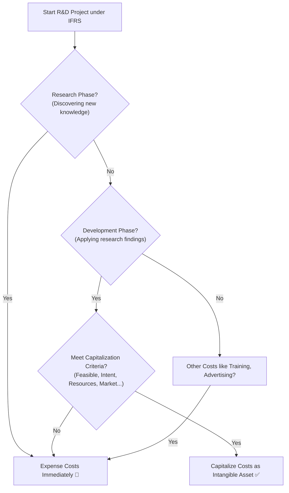

Okay, let's dissect the Balance Sheet with Reading 29\! ⚔️

## Reading 29: Analyzing Balance Sheets 🚀

### 🎯 Introduction

Imagine the **Balance Sheet** as a company's financial photograph 📸 taken at a specific moment in time. On one side, you see everything the company *owns* (**Assets**). On the other side, you see how it *paid* for those things – either by borrowing (**Liabilities**) or through owner contributions and retained profits (**Equity**). It's the fundamental equation: Assets = Liabilities + Equity. This reading teaches us how to analyze this snapshot, looking beyond the surface to understand the value of unseen assets (like brands), the classification of investments, long-term debts, and ultimately, a company's financial structure, liquidity (short-term health), and solvency (long-term staying power). Let's develop our X-ray vision for the balance sheet\! ✨

-----

### Part 1: Intangible Assets - The Invisible Value 🤔 (LOS 29.a)

**Intangible assets** are assets you can't physically touch, like patents, trademarks, copyrights, and goodwill. They lack physical substance but can be incredibly valuable.

**Types:**

  * **Identifiable Intangibles:** Can be separated from the company or arise from contractual/legal rights (e.g., patents, trademarks, copyrights) -1383]. Think of the brand value of Coca-Cola or Apple's patents.
  * **Unidentifiable Intangibles:** Cannot be separated from the company (e.g., **goodwill**) -1384].

**Accounting Treatment:**

  * **Purchased Intangibles:**
      * *IFRS:* Can use the **cost model** (cost less amortization/impairment) or **revaluation model** (fair value, if active market exists - rare for intangibles).
      * *U.S. GAAP:* Only the **cost model** is allowed.
  * **Internally Created Intangibles:**
      * *U.S. GAAP:* Most costs (like internal R\&D) are expensed immediately. Exception: Certain software development costs.
      * *IFRS:* Distinguishes between research and development:
          * **Research Costs:** Expensed as incurred (discovery phase), 1390].
          * **Development Costs:** *Can be capitalized* (recorded as an asset) if specific criteria are met (technical feasibility, intent to complete, ability to use/sell, future economic benefits likely, etc.) -1391].

> **💡 MNEMONIC: "IFRS: Research Runs away (expensed), Development Delivers (can capitalize)"**
> - **Research** = **Expense** (like money running away)
> - **Development** = **Capitalize** (if criteria met - delivers an asset)
> - **U.S. GAAP**: Both R&D usually **Expensed** (simpler rule)

<!-- end list -->

  * **Finite vs. Indefinite Life:**
      * **Finite Life (e.g., Patent):** **Amortized** (like depreciation) over its useful life. Tested for impairment if indicators exist.
      * **Indefinite Life (e.g., some Trademarks, Goodwill):** Not amortized. Tested for **impairment** (a write-down if value drops below carrying amount) at least annually.

**Costs Always Expensed (IFRS & U.S. GAAP):** Start-up, training, admin overhead, advertising, relocation, termination costs -1400].

**Analysis:** Capitalizing costs (like IFRS development) results in higher assets and higher initial net income compared to expensing (like U.S. GAAP R\&D). Analysts need to be aware of these differences when comparing companies. Some analysts adjust financials by removing intangible assets, but it's crucial to consider their real economic value -1402].

> [\!TIP]
> **CFA Exam Tip ✍️:** Remember the key IFRS vs. U.S. GAAP difference for R\&D: IFRS *can* capitalize development costs if criteria are met; U.S. GAAP generally expenses both research and development. Know that indefinite-lived intangibles (like goodwill) are *not* amortized but *are* tested for impairment annually.

-----

### Part 2: Goodwill - Paying More Than Meets the Eye? 🤝 (LOS 29.b)

**Goodwill** is a specific type of unidentifiable intangible asset created *only* during a business acquisition, 1431].

**Creation:** It's the amount the acquiring company pays *in excess* of the fair value of the identifiable net assets (Assets - Liabilities) of the company it buys -1422].

*Purchase Price - Fair Value of Identifiable Net Assets = Goodwill*

**Why pay extra?**

  * Unrecognized assets (brand reputation, customer relationships) -1424].
  * Synergies expected from the combination (cost savings, enhanced revenues) -1427].

**Accounting:**

  * Goodwill is *not* amortized because it's considered to have an indefinite life.
  * It *must* be tested for **impairment** at least annually. If its value is deemed impaired (less than its carrying amount), the company records an impairment loss on the income statement and reduces the goodwill asset on the balance sheet. This loss is a non-cash charge.
  * **Bargain Purchase:** If the purchase price is *less* than the fair value of net assets, the difference is recognized immediately as a gain on the acquirer's income statement -1430].

**Analysis:**

  * **Manipulation Risk:** Management might allocate more purchase price to goodwill (which isn't amortized) and less to identifiable assets (which are depreciated/amortized) to inflate future reported earnings -1436]. ⚠️
  * **Economic vs. Accounting Goodwill:** Accounting goodwill arises from acquisitions. Economic goodwill relates to a company's expected future performance. They are not the same.
  * **Impairment as a Signal:** Goodwill impairments indicate that past acquisitions haven't performed as expected – the acquirer likely overpaid or synergies didn't materialize, 1441].
  * **Comparability:** Analysts often remove goodwill from assets and impairment charges from income when calculating ratios to improve comparability between companies.

-----

### Part 3: Financial Assets - Investments on the Books 📈 (LOS 29.c)

**Financial instruments** are contracts creating a financial asset for one party and a financial liability or equity for another. On the asset side, this includes investments like stocks and bonds, derivatives, loans, and receivables. How they're valued depends on their classification, which differs between U.S. GAAP and IFRS.

#### **3.1 U.S. GAAP Classifications 🇺🇸**

> **💡 MNEMONIC: "HTA" for U.S. GAAP Financial Assets**
> - **H**eld-to-Maturity = **A**mortized Cost (stable, ignore market)
> - **T**rading = Fair Value through **I**ncome Statement (volatile, hits profit)
> - **A**vailable-for-Sale = Fair Value through **O**CI (middle ground, hits equity)

  * **Held-to-Maturity (HTM) Securities:** *Debt securities* the company intends and is able to hold until maturity.
      * *Measurement:* **Amortized Cost** (original cost adjusted for principal payments and amortization of any discount or premium). Market value changes are ignored unless impaired.
  * **Trading Securities:** *Debt or Equity* bought primarily for short-term trading profit.
      * *Measurement:* **Fair Value** (Market Value).
      * *Unrealized Gains/Losses (Changes in Fair Value):* Reported directly on the **Income Statement**.
  * **Available-for-Sale (AFS) Securities:** *Debt securities* not classified as HTM or Trading. (Note: Under current U.S. GAAP, equity securities generally cannot be AFS ).
      * *Measurement:* **Fair Value**.
      * *Unrealized Gains/Losses:* Reported in **Other Comprehensive Income (OCI)** – part of Shareholders' Equity, bypassing the Income Statement until sold -1462].
  * **Other:** Loans, receivables, unquoted equity are typically at historical or amortized cost. Derivatives are usually at Fair Value through Income Statement, 1457].

#### **3.2 IFRS Classifications 🌍**

> **💡 MNEMONIC: "IFRS: APO" (like Apollo rocket - 3 stages)**
> - **A**mortized Cost = Held to collect (like HTM)
> - **P**&L (FVPL) = Fair Value through Income (default, like Trading)
> - **O**CI (FVOCI) = Fair Value through Equity (middle option)

  * **Amortized Cost:** *Debt securities* held to collect contractual cash flows (principal and interest). (Similar to HTM).
  * **Fair Value through Other Comprehensive Income (FVOCI):**
      * *Debt securities* held to collect cash flows *and* potentially sell. (Similar to AFS debt). Unrealized G/L go to OCI.
      * *Equity securities* if an *irrevocable election* is made at purchase to report Unrealized G/L in OCI. (No AFS equivalent for equity in U.S. GAAP).
  * **Fair Value through Profit or Loss (FVPL):** Default category for anything else. Includes securities held for trading, derivatives, and *most equity securities*. An irrevocable election can be made to classify *any* financial asset as FVPL. (Similar to Trading).
      * *Measurement:* **Fair Value**.
      * *Unrealized Gains/Losses:* Reported directly on the **Income Statement (Profit & Loss)**.

#### **3.3 Common Ground 🤝**

  * For *all* classifications under both standards, **interest income**, **dividend income**, and **realized gains/losses** (when the security is actually sold) are reported on the Income Statement.

> [\!TIP]
> **CFA Exam Tip ✍️:** Focus on where *unrealized* gains and losses go:
>
>   * Trading (U.S. GAAP) / FVPL (IFRS): Income Statement.
>   * Available-for-Sale Debt (U.S. GAAP) / FVOCI (IFRS): Other Comprehensive Income (Equity).
>     Remember IFRS has the FVOCI option for equity (if elected), which U.S. GAAP generally lacks.

-----

### Part 4: Non-Current Liabilities - Long-Term Obligations ⏳ (LOS 29.d)

These are obligations due beyond one year or the operating cycle. Common examples include bonds payable, long-term notes payable, and **deferred tax liabilities**.

**Measurement:**

  * **Amortized Cost:** Most common for bonds and loans. If issued at a price different from face value (par), the discount or premium is amortized over the liability's life, adjusting the interest expense each period. The carrying value gradually moves towards the face value by maturity -1501].
  * **Fair Value:** Used for certain liabilities like derivatives and those held for trading (e.g., short positions) -1503].

**Deferred Tax Liabilities (DTLs):** 📝

  * Arise from **temporary differences** between accounting rules and tax rules.
  * Specifically, a DTL is created when **Income Tax Expense** (on the income statement) is *greater than* **Taxes Payable** (amount owed per tax return) in the current period, and this difference is expected to reverse later, 1504].
  * **Common Causes:**
      * Using accelerated depreciation for tax purposes but straight-line for financial reporting (more depreciation expense on tax return initially = lower taxable income = lower taxes payable now, but higher tax expense on IS anticipating higher future taxes payable).
      * Recognizing revenue on the income statement before it's taxable.
  * DTLs represent expected *future* cash outflows when the temporary differences reverse and taxes become payable.

-----

### Part 5: Sizing Up the Snapshot - Common-Size & Ratios 📏 (LOS 29.e)

Analyzing the raw numbers on a balance sheet can be misleading if comparing companies of different sizes.

  * **Vertical Common-Size Balance Sheet:** Expresses every item as a **percentage of Total Assets**.
      * **Purpose:** Eliminates size differences, making it easy to compare a company's balance sheet structure over time (trends) or against competitors (cross-sectional) -1556].
      * **Insights:** Reveals reliance on different asset types (e.g., inventory vs. fixed assets) and financing sources (e.g., debt vs. equity).

**Key Balance Sheet Ratios:**

#### **Liquidity Ratios (Short-Term Health)**

Measure the ability to meet short-term obligations. Generally, higher is better, but *too* high might indicate inefficient asset use.

> **💡 MNEMONIC: "CQC" - Getting more Conservative (Current → Quick → Cash)**
> - **C**urrent Ratio = All Current Assets ÷ Current Liabilities (Least conservative)
> - **Q**uick Ratio = (Current Assets - Inventory) ÷ CL (More conservative - "Acid test")
> - **C**ash Ratio = Only Cash & Marketable Securities ÷ CL (Most conservative)

  * **Current Ratio:**
    $$\text{Current Ratio} = \frac{\text{Current Assets}}{\text{Current Liabilities}}$$
      * Most common measure.
  * **Quick Ratio (Acid-Test Ratio):** Excludes inventory (less liquid).
    $$\text{Quick Ratio} = \frac{\text{Cash + Marketable Securities + Receivables}}{\text{Current Liabilities}}$$
      * A more conservative measure than the current ratio.
  * **Cash Ratio:** Excludes inventory and receivables.
    $$\text{Cash Ratio} = \frac{\text{Cash + Marketable Securities}}{\text{Current Liabilities}}$$
      * Most conservative measure.

#### **Solvency Ratios (Long-Term Stability & Leverage)**

Measure the ability to meet long-term obligations and the extent of financial leverage -1598]. Higher leverage implies higher risk.

  * **Debt Ratios:** (Note: "Total Debt" typically refers to interest-bearing liabilities, but definitions can vary )
      * **Long-Term Debt-to-Equity:**
        $$\text{LT Debt-to-Equity} = \frac{\text{Long-Term Debt}}{\text{Total Equity}}$$
      * **Total Debt-to-Equity:**
        $$\text{Debt-to-Equity} = \frac{\text{Total Debt}}{\text{Total Equity}}$$
      * **Debt Ratio (Debt-to-Assets):**
        $$\text{Debt Ratio} = \frac{\text{Total Debt}}{\text{Total Assets}}$$
  * **Financial Leverage Ratio:** Measures how much assets are financed by equity.
    $$\text{Financial Leverage} = \frac{\text{Total Assets}}{\text{Total Equity}}$$

**Limitations of Ratio Analysis:** Ratios need context (comparison to history, industry peers), are affected by different accounting choices, can be hard to interpret for diversified firms, and the balance sheet is just a snapshot at one point in time -1619].

-----

### 🧪 Formula Summary

  * **Liquidity Ratios:**
      * Current Ratio: $\frac{\text{Current Assets}}{\text{Current Liabilities}}$
      * Quick Ratio: $\frac{\text{Cash + Marketable Securities + Receivables}}{\text{Current Liabilities}}$
      * Cash Ratio: $\frac{\text{Cash + Marketable Securities}}{\text{Current Liabilities}}$
  * **Solvency Ratios:**
      * LT Debt-to-Equity: $\frac{\text{Long-Term Debt}}{\text{Total Equity}}$
      * Debt-to-Equity: $\frac{\text{Total Debt}}{\text{Total Equity}}$
      * Debt Ratio: $\frac{\text{Total Debt}}{\text{Total Assets}}$
      * Financial Leverage: $\frac{\text{Total Assets}}{\text{Total Equity}}$
  * **Goodwill Calculation:**
    $$\text{Goodwill} = \text{Purchase Price} - \text{Fair Value of Identifiable Net Assets Acquired}$$

-----

> [\!IMPORTANT]
>
> ### 🎯 Quick Exam-Day Pointers
>
>   * **Intangibles:** Know Purchased vs. Internally Created rules. IFRS can capitalize *Development* costs; U.S. GAAP usually expenses R\&D. Indefinite-life intangibles (inc. Goodwill) are NOT amortized but tested annually for impairment.
>   * **Goodwill:** Created *only* in acquisitions (Price > FV Net Assets). Not amortized, tested for impairment. Impairment signals overpayment or poor performance of acquisition.
>   * **Financial Assets:** Know the measurement (Amortized Cost vs. Fair Value) and where *unrealized* G/L go: Trading/FVPL -> Income Stmt; AFS(Debt)/FVOCI -> OCI (Equity).
>   * **DTLs:** Arise when Taxable Income < Accounting Profit (temporarily). Often due to accelerated tax depreciation. Represent future taxes payable.
>   * **Common-Size Balance Sheet:** Expresses everything as % of Total Assets. Crucial for comparing different-sized companies or analyzing trends.
>   * **Key Ratios:** Understand what Liquidity ratios (Current, Quick, Cash) and Solvency ratios (Debt-to-Equity, Debt-to-Assets, Leverage) measure about a company's financial health and risk.