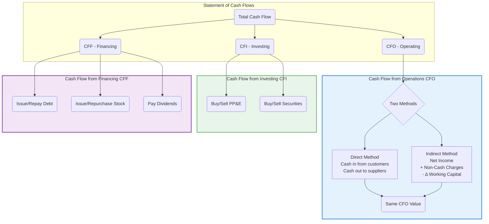

## Reading 30: Analyzing Statements of Cash Flows I 🌊

### 🎯 Introduction

Alright, future CFA charterholder\! Think of a company like a river. The Income Statement tells you how much water *should* be flowing (profits), but the **Statement of Cash Flows** shows you where the water *actually* came from and where it *actually* went. 🏞️ It tracks the real cash moving in and out, revealing the company's lifeblood.

Why does this matter? Because **cash is king**\! 👑 A company can show profits on paper but run out of actual cash to pay its bills. This reading teaches you how to be a cash flow detective, uncovering the real story behind the numbers by analyzing operating, investing, and financing activities. Let's trace the flow\!

-----

### Part 1: How Does Cash Flow Connect Everything? 🔗 (LOS 30.a)

The Statement of Cash Flows is the ultimate bridge between the Income Statement and the Balance Sheet. While the Income Statement uses **accrual accounting** (recognizing revenue when earned, expenses when incurred, not necessarily when cash changes hands), the Cash Flow Statement focuses purely on cash movements during a period.

Why is this statement crucial for analysts? It helps assess:

  * **Liquidity:** Can the company meet its short-term bills? 💧
  * **Solvency:** Can the company meet its long-term debts? 🏛️
  * **Financial Flexibility:** Can the company handle unexpected events or grab new opportunities? 💪
  * **Quality of Earnings:** Are the reported profits backed by real cash? 🤔 High-quality earnings usually mean **Cash Flow from Operations (CFO)** is close to or higher than Net Income. If Net Income consistently outpaces CFO, it might be a red flag\! 🚩

The basic cash flow equation connects the beginning and ending cash balances shown on the Balance Sheet:

$$
\text{Beginning Cash} + \text{CFO} \pm \text{CFI} \pm \text{CFF} = \text{Ending Cash}
$$

**Linking Accruals to Cash:**

Transactions where timing differs between accrual recognition and cash flow cause changes in Balance Sheet accounts.

  * **Revenue vs. Cash Collected:** If a company sells ₹100 worth of goods on credit, Revenue goes up by ₹100, but cash doesn't change immediately. Instead, **Accounts Receivable** (an asset) increases.
      * The relationship is: 
$\text{Beginning AR} + \text{Sales} - \text{Cash Collections} = \text{Ending AR}$

      * Rearranged for cash: 
$\text{Cash Collections} = \text{Sales} - \Delta AR$
 (where $\Delta AR$ is the *increase* in Accounts Receivable)
      * **Example:** If Sales are ₹1,000 and Accounts Receivable increased by ₹50, Cash Collected = ₹1,000 - ₹50 = ₹950. If AR *decreased* by ₹50, Cash Collected = ₹1,000 - (-₹50) = ₹1,050.
  * **Cash Received Before Earning:** If a customer pays in advance (like for a magazine subscription), the company receives cash, but recognizes it as **Unearned Revenue** (a liability). Revenue is only recognized on the Income Statement as the service/product is delivered. An increase in Unearned Revenue means more cash was collected than revenue recognized.
      * Cash Impact = Revenue + 
$\Delta \text{Unearned Revenue}$

#### 1.1 Global & Local Context 🌍

  * **Global Example:** Software companies like Microsoft often receive cash upfront for multi-year software licenses or cloud subscriptions (like Office 365). This cash inflow boosts CFO immediately, but the revenue is recognized gradually over the subscription term, creating **Unearned Revenue** on the balance sheet.
  * **Indian Example:** Real estate developers in India like DLF often collect payments from homebuyers in installments before the construction is fully complete. This cash comes in early (boosting CFO), while revenue recognition under accounting standards like Ind AS 115 might be spread over the construction period, leading to significant **Unearned Revenue**.

Understanding these links is vital for building the CFO section and spotting potential accounting manipulations.

-----

### Part 2: Building the CFO Section - Direct vs. Indirect 🏗️ (LOS 30.b)

The Statement of Cash Flows is divided into three sections: **Operating (CFO)**, **Investing (CFI)**, and **Financing (CFF)**.

CFI and CFF are presented the same way regardless, but there are two methods to present the crucial CFO section: **Direct** and **Indirect**.

**🧠 Memory Aid: "ALOUD" for Cash Flow Rules**

  - **A**ssets UP = cash **D**own (USE of cash -)
  - **L**iabilities/equity UP = cash UP (SOURCE of cash +)
  - Think: "Say it ALOUD" - Assets & Liabilities move Opposite to cash (Usually)

💡 CFA Exam Tip ✍️:Key Rules to Remember:

  * Increases in **Assets** are a **USE** (-) of cash. Decreases are a **SOURCE** (+) of cash.
  * Increases in **Liabilities/Equity** are a **SOURCE** (+) of cash. Decreases are a **USE** (-) of cash.
  * **CFO** results are the **SAME** under both Direct and Indirect methods.
  * **CFI** relates mainly to **Noncurrent Assets**.
  * **CFF** relates mainly to **Noncurrent Liabilities** and **Equity**.
    

    

#### 2.1 The Direct Method: Just the Cash Facts 🕵️‍♀️

The Direct Method shows the actual cash received and cash paid for operating activities. It's like watching the cash flow directly into and out of the company's operating wallet.

**Common Components:**

  * Cash collected from customers (+)
  * Cash paid to suppliers (-)
  * Cash paid to employees (-)
  * Cash paid for other operating expenses (-)
  * Interest paid (-) (under US GAAP)
  * Taxes paid (-)

**Steps:**

1.  Start with an Income Statement line item (e.g., Revenue).
2.  Find the related Balance Sheet account(s) (e.g., Accounts Receivable, Unearned Revenue).
3.  Calculate the change in the Balance Sheet account(s).
4.  Adjust the Income Statement amount using the Asset/Liability rules (remember to treat expenses as negative numbers\!).
      * Subtract an increase in a related Asset (like AR).
      * Add a decrease in a related Asset.
      * Add an increase in a related Liability (like Unearned Revenue or Accounts Payable).
      * Subtract a decrease in a related Liability.
5.  Repeat for all operating items on the Income Statement.
6.  **Ignore Noncash Items** like Depreciation, Amortization, Gains/Losses on asset sales (these are handled elsewhere or not cash).
7.  Sum the adjusted cash flows to get total CFO.

**🧮 Example: Direct Method CFO**

Let's use the example data from the reading:

| Item | Calculation | Cash Flow |
| :--- | :--- | :--- |
| **Cash from Customers** | Sales (`$104k`) - Incr. in AR (`$1k`) + Incr. in Unearned Rev (`$4k`) | `$107,000` |
| **Cash paid to Suppliers** | COGS (`-$40k`) + Decr. in Inventory (`$2k`) + Incr. in AP (`$4k`) | `($34,000)` |
| **Wages Paid** | Wage Expense (`-$5k`) - Decr. in Wages Payable (`$3.5k`) | `($8,500)` |
| **Interest Paid** | Interest Expense (`-$1k`) + Incr. in Interest Payable (`$0.5k`) | `($500)` |
| **Taxes Paid** | Tax Expense (`-$20k`) + Incr. in Taxes Payable (`$1k`) + Incr. in DTL (`$5k`) | `($14,000)` |
| **Depreciation** | *Ignored (Noncash)* | `$0` |
| **Gain on Land Sale** | *Ignored (Investing Activity related)* | `$0` |
| **Loss on PP\&E Disposal**| *Ignored (Investing Activity related)* | `$0` |
| **Total CFO** | **Sum of above** | **`$50,000`** |

*Note: DTL = Deferred Tax Liability. Changes in deferred taxes adjust tax expense to get cash taxes paid.*

#### 2.2 The Indirect Method: Net Income Reconciliation 🔄

**🧠 MNEMONIC: "NI + NCC - WCInv" (Pronounce: "Nigh Nick Winks")**

  - **NI** = Net Income (starting point)
  - **NCC** = Noncash Charges (add back depreciation, losses; subtract gains)
  - **WCInv** = Working Capital Investment (subtract if WC increases)

$$
\text{CFO} = \text{Net Income} + \text{Noncash Charges} - \text{Investment in Working Capital}
$$

**Steps:**

1.  **Start with Net Income.**
2.  **Adjust for Noncash Charges (NCC):**
      * **Add back** expenses that didn't use cash (Depreciation, Amortization, Impairments, Losses on asset sales).
      * **Subtract** revenues/gains that didn't provide cash (Gains on asset sales).
      * Adjust for changes in Deferred Tax accounts (Add increases in DTL, Subtract increases in DTA).
3.  **Adjust for Investment in Working Capital (WCInv):** Focus on changes in *operating* current assets and liabilities.
      * **Subtract** increases in Operating Assets (like AR, Inventory). **Add** decreases.
      * **Add** increases in Operating Liabilities (like AP, Wages Payable, Unearned Revenue). **Subtract** decreases.
      * *Exclude:* Cash, Short-term investments (usually CFI), Dividends Payable (CFF), Short-term debt (CFF).

**🧮 Example: Indirect Method CFO**

Using the same data:

| Item | Adjustment | Amount |
| :--- | :--- | :--- |
| **Net Income** | Starting Pt | `$39,000` |
| **Noncash Adjustments:** | | |
| Depreciation | + Add Back | `$7,000` |
| Increase in DTL | + Add Back | `$5,000` |
| Loss on PP\&E Disposal | + Add Back | `$2,000` |
| Gain on Land Sale | - Subtract | `($10,000)` |
| *Subtotal after NCC* | | *`$43,000`* |
| **Working Capital Adjustments:** | | |
| Increase in Accounts Receivable| - Subtract | `($1,000)` |
| Decrease in Inventory | + Add | `$2,000` |
| Increase in Accounts Payable | + Add | `$4,000` |
| Decrease in Wages Payable | - Subtract | `($3,500)` |
| Increase in Interest Payable | + Add | `$500` |
| Increase in Unearned Revenue | + Add | `$4,000` |
| Increase in Taxes Payable | + Add | `$1,000` |
| *Subtotal WC Adjustments* | | *`$7,000`* |
| **Total CFO** | **Sum** | **`$50,000`** |

*Result is the same `$50,000` as the Direct Method\!* ✅

While GAAP/IFRS encourage the Direct Method for its clarity on actual cash movements, the Indirect Method is more common because it directly links Net Income to CFO, highlighting the **quality of earnings**. US GAAP requires companies using the Direct Method to also provide the Indirect Method reconciliation in the footnotes.

-----

### Part 3: Decoding CFI & CFF - The Rest of the Story 📈💰 (LOS 30.b)

CFO is the most complex, but we must complete the statement. CFI and CFF are calculated the same way regardless of the CFO method.

#### 3.1 Cash Flow from Investing (CFI)

CFI shows cash spent or received from **investments in long-term assets** (and some short-term ones). Think of it as the company's "building and acquiring" budget.

* **Common Inflows (+):**
  * Sale of Property, Plant & Equipment (PP&E)
  * Sale of securities (e.g., stocks/bonds of other companies)
  * Receiving principal from loans made to others
* **Common Outflows (-):**
  * Purchase of PP&E (Capital Expenditures or "CapEx")
  * Purchase of securities
  * Making loans to others
  * Acquiring other businesses (check for Goodwill!)

**💡 Tricky Calculation: Finding Cash from Asset Sales**

This is a classic exam trap! The Income Statement shows the *Gain or Loss*, not the *cash received*.

1.  **Find Book Value (BV) of Asset Sold:** You need to do a "T-account" reconciliation.
    * `Ending Net PP&E = Beg. Net PP&E + CapEx - Depr. Expense - BV of Asset Sold`
    * Rearrange: **`BV of Asset Sold = Beg. Net PP&E + CapEx - Depr. Expense - Ending Net PP&E`**
2.  **Calculate Cash Proceeds:**
    * **`Cash Proceeds = BV of Asset Sold + Gain on Sale`**
    * **`Cash Proceeds = BV of Asset Sold - Loss on Sale`**

**🧮 Example: Calculating CFI**

Using the same data:

* **Land Sale:**
  * `Beg. Land = $40k`, `End. Land = $35k`. No purchases mentioned.
  * `BV of Land Sold = $40k - $35k = $5,000`
  * `Gain on Sale (I/S) = $10,000`
  * **Cash from Land Sale = $5k (BV) + $10k (Gain) = +$15,000**
* **PP&E Sale:**
  * `Beg. Net PP&E = $51k`, `End. Net PP&E = $57k`
  * `CapEx (Purchases) = $25,000` (from text footnote)
  * `Depr. Expense (I/S) = $7,000`
  * `BV of PP&E Sold = $51k + $25k - $7k - $57k = $12,000`
  * `Loss on Sale (I/S) = $2,000`
  * **Cash from PP&E Sale = $12k (BV) - $2k (Loss) = +$10,000**
* **Goodwill:**
  * `Beg. Goodwill = $10k`, `End. Goodwill = $20k`. Increase = `$10,000`.
  * This implies a **cash purchase/acquisition = -$10,000** (This was missed in the textbook's example but is needed for the B/S to balance!)
* **Total CFI:**
  * `-$25,000` (Purchase of PP&E)
  * `+$15,000` (Sale of Land)
  * `+$10,000` (Sale of PP&E)
  * `-$10,000` (Acquisition/Goodwill)
  * **Total CFI = -$10,000**

#### 3.2 Cash Flow from Financing (CFF)

CFF shows cash movements between the company and its **owners (equity) and lenders (debt)**.

* **Common Inflows (+):**
  * Issuing new stock
  * Issuing new bonds or other debt (long-term or short-term)
* **Common Outflows (-):**
  * Repurchasing stock (Treasury Stock)
  * Repaying debt principal (not the interest!)
  * Paying dividends

**💡 Tricky Calculation: Finding Dividends *Paid***

The Income Statement doesn't show dividends! You need the Retained Earnings (RE) and Dividends Payable (DP) accounts.

1.  **Find Dividends *Declared*:**
    * `Ending RE = Beg. RE + Net Income - Dividends Declared`
    * Rearrange: **`Dividends Declared = Beg. RE + Net Income - Ending RE`**
2.  **Find Dividends *Paid*:**
    * `Ending DP = Beg. DP + Dividends Declared - Dividends Paid`
    * Rearrange: **`Dividends Paid = Dividends Declared - Δ Dividends Payable`**

**🧮 Example: Calculating CFF**

Using the same data:

* **Debt (Bonds Payable):**
  * `Beg. Bonds = $15k`, `End. Bonds = $20k`.
  * **Cash from new bonds = +$5,000**
* **Equity (Common Stock + APIC):**
  * `Beg. (CS + APIC) = $45k`, `End. (CS + APIC) = $55k`.
  * **Cash from stock issuance = +$10,000**
* **Dividends Paid:**
  * *Step 1 (Find Declared):* `Beg RE ($30.8k) + NI ($39k) - End RE ($61.3k) = $8,500` (This matches the `$8.5k` dividend declared in the text's I/S).
  * *Step 2 (Find Paid):* `Beg. Div Payable = $1k`, `End. Div Payable = $2k`. `Δ Div Payable = +$1,000`.
  * `Dividends Paid = $8,500 (Declared) - $1,000 (ΔDP) = $7,500`
  * **Cash for Dividends Paid = -$7,500**
* **Total CFF:**
  * `+$5,000` (From Bonds)
  * `+$10,000` (From Stock)
  * `-$7,500` (Dividends Paid)
  * **Total CFF = +$7,500**

#### 3.3 The Final Check: Does It Balance?

Let's assemble all our calculated pieces and see if they match the change in cash on the Balance Sheet.

* **CFO** (from Part 2) = **+$50,000**
* **CFI** (from Part 3.1) = **-$10,000**
* **CFF** (from Part 3.2) = **+$7,500**
* **Total Change in Cash** = `$50,000 - $10,000 + $7,500` = **`+$47,500`**

*Check against Balance Sheet:*

* `Ending Cash = $59,000`
* `Beginning Cash = $11,500`
* **Actual Change in Cash** = `$59,000 - $11,500` = **`+$47,500`**

It balances perfectly! 💯 This confirms our calculations for CFO, CFI, and CFF are correct.

-----

### Part 4: Converting Indirect to Direct CFO 🔄➡️ (LOS 30.c)

Sometimes analysts want the detail of the Direct Method even if the company reports using the Indirect Method. You can convert\! It involves using the Income Statement and the changes in Balance Sheet accounts (often available from the Indirect CFO section or the Balance Sheet itself).

**The 3-Step Process:**

1.  **Aggregate Revenues/Gains & Expenses/Losses:** Group items from the Income Statement.
2.  **Remove Noncash & Non-Operating Items:** Adjust the aggregates from Step 1 by removing items like depreciation, gains/losses on asset sales (similar to the Indirect Method's NCC adjustments, but applied to the *revenue* and *expense* totals). Disaggregate the remaining totals into specific operating lines (Sales, COGS, Wages, etc.).
3.  **Convert Accruals to Cash Flows:** Adjust each disaggregated line item from Step 2 for the change in its related working capital accounts (using the Asset/Liability rules), just like building the Direct Method from scratch.

**🧮 Example: Conversion**

Using the same data:

1.  **Aggregate:**
      * Total Revenues & Gains = `$104k` (Sales) + `$10k` (Gain) = `$114k`
      * Total Expenses & Losses = `$40k` (COGS) + `$5k` (Wages) + `$7k` (Depr) + `$1k` (Int) + `$2k` (Loss) + `$20k` (Tax) = `$75k`
      * *Check:* `$114k` - `$75k` = `$39k` (Net Income) 👍
2.  **Remove Noncash/Non-Operating & Disaggregate:**
      * Cash-Based Revenues = `$114k` - `$10k` (Gain) = `$104k` (This is just Sales)
      * Cash-Based Expenses = `$75k` - `$7k` (Depr) - `$2k` (Loss) - `$5k` (ΔDTL part of Tax Exp) = `$61k`
          * Disaggregate `$61k` into: COGS (`$40k`), Wages (`$5k`), Interest (`$1k`), Cash Taxes Payable\* (`$15k`). *Total = `$61k`.*
          * \*Cash Taxes Payable = Tax Expense (`$20k`) - Increase in DTL (`$5k`) = `$15k`. We deal with the Taxes Payable *liability* change in the next step.
3.  **Convert to Cash Flows:**
      * Cash from Customers = `$104k` (Sales) - `$1k` (ΔAR) + `$4k` (ΔUnearned Rev) = `$107k`
      * Cash to Suppliers = `-$40k` (COGS) + `$2k` (ΔInv) + `$4k` (ΔAP) = `-$34k`
      * Cash Wages Paid = `-$5k` (Wages Exp) - `$3.5k` (ΔWages Pay) = `-$8.5k`
      * Cash Interest Paid = `-$1k` (Int Exp) + `$0.5k` (ΔInt Pay) = `-$0.5k`
      * Cash Taxes Paid = `-$15k` (Cash Taxes Payable from Step 2) + `$1k` (ΔTaxes Pay) = `-$14k`
      * **Total CFO** = `$107k` - `$34k` - `$8.5k` - `$0.5k` - `$14k` = **`$50k`** 🎉

-----

### Part 5: IFRS vs. US GAAP Differences 🌍🇺🇸 (LOS 30.d)

While the overall structure is similar, IFRS allows more flexibility than US GAAP in classifying certain cash flows, especially for interest and dividends. Taxes also get different treatment.

**🧠 MNEMONIC: "IFRS is FLEXIBLE - US GAAP is FIXED"**

  - **U.S. GAAP**: Interest & Dividends RECEIVED = **CFO**, Dividends PAID = **CFF**, Interest PAID = **CFO**
  - **IFRS**: Has OPTIONS (more flexible):
      - **"ID-RIFF"** for IFRS choices:
          - **I**nterest/**D**ividends **R**eceived = CFO or CF**I** (Investing)
          - **I**nterest/**D**ividends Paid = CFO or CF**F** (Financing)

| Cash Flow Item | US GAAP Classification | IFRS Classification | Why the Difference? |
| :--- | :--- | :--- | :--- |
| **Interest Received** | **CFO** | CFO or CFI | IFRS allows viewing it as returns *on* investments (CFI) or part of operations (CFO). |
| **Dividends Received**| **CFO** | CFO or CFI | Same logic as Interest Received. |
| **Interest Paid** | **CFO** | CFO or CFF | IFRS allows viewing it as a cost of *obtaining* finance (CFF) or operations (CFO). |
| **Dividends Paid** | **CFF** | CFO or CFF | Same logic as Interest Paid. Can be seen as a cost of finance or a use of operating cash. |
| **Taxes Paid** | **CFO** (Generally) | CFO, *unless* tied to CFI/CFF | IFRS allows allocation. If tax relates to asset sale (CFI), it can be CFI. |
| **Bank Overdrafts** | Treated as Debt (CFF) | Treated as part of Cash | IFRS considers them part of cash management (Operating). |

💡 CFA Exam Tip ✍️:Memorize this table\! The classification differences for **Interest Paid/Received** and **Dividends Paid/Received** are classic exam questions. Know the US GAAP rule and the IFRS flexibility.

**🧮 Example: Tax Allocation under IFRS**

A company sells land (Investing Activity) for `$1M` and pays `$160k` in taxes on the gain.

  * **US GAAP:** CFI = +`$1M` inflow. CFO = -`$160k` outflow (tax paid).
  * **IFRS:** Can report CFI = +`$840k` net inflow (allocating the tax to the investing activity).

-----

### 🧪 Formula Summary

**Cash Flow Equation:**

$$
\text{Beginning Cash} + \text{CFO} \pm \text{CFI} \pm \text{CFF} = \text{Ending Cash}
$$

**Linking AR to Cash Collections:**

$$
\text{Cash Collections} = \text{Sales} - \Delta AR
$$*(Use +ΔAR if AR increases, -ΔAR if AR decreases)*

**Linking Unearned Revenue to Cash Collections:**

$$
\text{Cash Impact from Revenue} = \text{Revenue} + \Delta \text{Unearned Revenue}
$$*(Use +ΔUnearned Revenue if it increases, -Δ if it decreases)*

**Indirect Method CFO:**

$$
\text{CFO} = \text{Net Income} + \text{Noncash Charges} - \text{Investment in Working Capital}
$$*(Where Investment in WC = ΔOperating Assets - ΔOperating Liabilities)*

**Cash from Asset Sale (CFI):**

$$
\text{Cash Proceeds} = \text{Book Value of Asset Sold} + \text{Gain (or} - \text{Loss)}
$$

**Dividends Paid (CFF):**

$$
\text{Dividends Declared} = \text{Beg. RE} + \text{Net Income} - \text{End. RE}
$$$$
\text{Dividends Paid} = \text{Dividends Declared} - \Delta \text{Dividends Payable}
$$

-----

### 🎯 Quick Exam-Day Pointers

  * **Cash is King:** The cash flow statement reveals the *real* cash movements, crucial for assessing liquidity, solvency, and earnings quality.
  * **The Core Equation:** Beg Cash + CFO +/- CFI +/- CFF = End Cash. Master this!
  * **Asset/Liability Rules:** ↑Asset = Use (-) Cash; ↓Asset = Source (+) Cash. ↑Liability/Equity = Source (+) Cash; ↓Liability/Equity = Use (-) Cash. Drill this!
  * **Direct vs. Indirect CFO:** Direct shows actual cash paid/received (more intuitive). Indirect starts with Net Income and adjusts (better links profit to cash, shows earnings quality). Both yield the **SAME** CFO number.
  * **Indirect Adjustments:** Remember `NI + NCC - WCInv`. Add back noncash expenses (like depreciation), subtract noncash gains. Adjust for changes in *operating* working capital accounts.
  * **Tricky CFI:** To find cash from an asset sale, calculate `Cash Proceeds = Book Value of Asset Sold +/- Gain/Loss`. You often have to find the `BV of Asset Sold` first using the PP&E reconciliation. Don't forget non-PP&E assets like Goodwill!
  * **Tricky CFF:** To find Dividends *Paid*, you must use the two-step process: 1) Find Dividends *Declared* from the RE reconciliation, then 2) Adjust for changes in *Dividends Payable*.
  * **IFRS vs. US GAAP:** Know the classification flexibility IFRS allows for **Interest (Paid/Received)** and **Dividends (Paid/Received)**, compared to the stricter US GAAP rules. Taxes can also be allocated under IFRS. 🇮🇳 Most Indian companies follow Ind AS, which is largely converged with IFRS, so this flexibility often applies.
    

    
