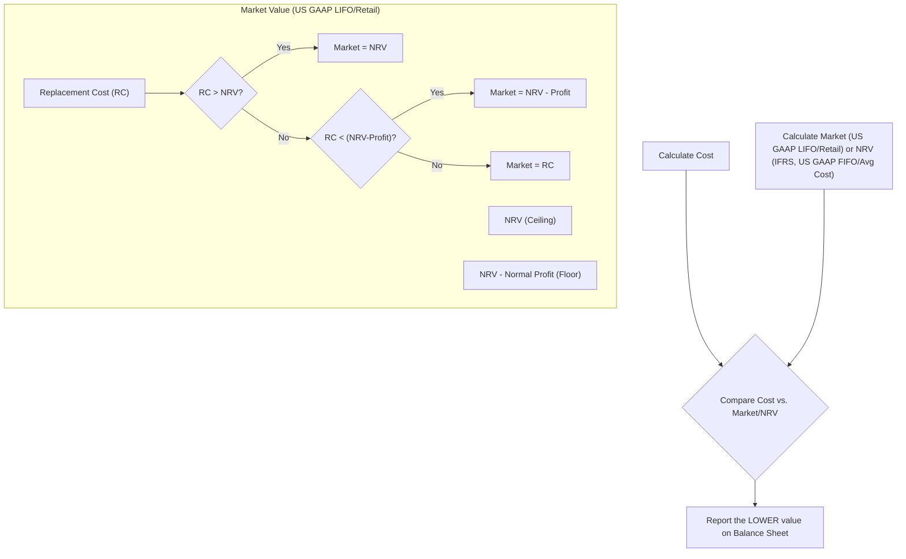

## Reading 32: Analysis of Inventories

### 🎯 Introduction

Think of a company's **inventory** like the stock in a retail store – the goods waiting to be sold. 🏪 Managing this stock effectively is crucial for profitability. This reading dives into how companies value this inventory, the different methods they use (like **FIFO** and **LIFO**), and how these choices ripple through the financial statements, especially when prices are changing. We'll also unpack the footnotes to see what secrets inventory disclosures hold for savvy analysts\! 🕵️‍♀️

-----

### Part 1: Inventory Measurement - Playing it Safe 🤔 (LOS 32.a)

Accounting standards require companies to be prudent. If inventory loses value *before* it's sold, companies must recognize this loss immediately. It's like marking down sweaters after winter – you can't pretend they're still worth the original price. 🧥📉

There are two main rules for this "markdown," depending on the accounting standards and inventory method used:

#### **IFRS: Lower of Cost or Net Realizable Value (LCNRV)**

  * **Cost:** What the company originally paid for the inventory, plus costs to get it ready for sale.
  * **Net Realizable Value (NRV):** The estimated selling price *minus* any estimated selling costs (like finishing the product or paying sales commissions).
    $$\text{NRV} = \text{Estimated Selling Price} - \text{Estimated Selling Costs}$$
  * **The Rule:** Inventory is reported on the balance sheet at whichever value is *lower* – its original **Cost** or its **NRV**.

#### **U.S. GAAP: Depends on Method...**

  * **For FIFO & Average Cost:** Same as IFRS – use **LCNRV**.
  * **For LIFO & Retail Method:** Use **Lower of Cost or Market (LCM)**.
      * **Cost:** Same as under IFRS.
      * **Market:** This is usually the **replacement cost** (what it would cost to buy the inventory today). *However*, this "Market" value has boundaries:
          * **Ceiling:** It cannot be *higher* than NRV.
          * **Floor:** It cannot be *lower* than NRV minus a normal profit margin.
      * **The Rule:** Inventory is reported at whichever value is *lower* – its original **Cost** or the calculated **Market** value (within its ceiling and floor).

<!-- end list -->

#### **Financial Statement Impact of Write-Downs 📉**

When inventory is written down (because Market or NRV is lower than Cost):

  * **Income Statement:**
      * **Cost of Goods Sold (COGS)** increases (or a separate loss is reported).
      * **Gross Profit**, **Operating Profit**, and **Net Income** decrease. ⬇️
  * **Balance Sheet:**
      * **Inventory (Asset)** decreases. ⬇️
      * **Equity (Retained Earnings)** decreases. ⬇️
  * **Cash Flow Statement:** No immediate cash impact (it's a non-cash charge), but future cash flow might be lower if the selling price is indeed lower.
  * **Ratios:**
      * **Profitability Ratios** (Gross Margin, Net Margin, ROA, ROE) decrease in the period of the write-down.
      * **Liquidity Ratios** (Current Ratio, Quick Ratio) may decrease (lower assets).
      * **Activity Ratios** (**Inventory Turnover** increases, **Days of Inventory on Hand** decreases) because COGS is higher and/or Inventory is lower.
      * **Solvency Ratios** (Debt-to-Assets, Debt-to-Equity) increase (lower assets/equity).

#### **Inventory Write-Ups ⬆️ (IFRS Only)**

  * Under **IFRS**, if the value of previously written-down inventory recovers, a company *can* write the value back *up*.
  * **Limitation:** The write-up is limited to the amount of the original write-down. The inventory value cannot exceed its original cost.
  * **Impact:** A write-up decreases COGS (or is reported as income) and increases inventory (assets) and equity.
  * **U.S. GAAP:** Write-ups are **prohibited**. Once written down, the new lower value becomes the effective "cost."

> [\!TIP]
> **CFA Exam Tip ✍️:** Know the key difference: IFRS allows reversals of write-downs (up to original cost), while U.S. GAAP *never* allows reversals. Also, remember the LCNRV vs. LCM distinction based on standards and inventory method (LIFO/Retail gets the trickier 'Market' definition under US GAAP).

-----

### Part 2: Inflation Impact on FIFO and LIFO 🔥❄️ (LOS 32.b)

When inventory purchase prices change over time (due to inflation or deflation), the choice of cost flow assumption (**FIFO**, **LIFO**, or **Weighted-Average Cost**) significantly impacts reported numbers.

**Assume Rising Prices (Inflation) 🔥:**

#### **2.1 FIFO (First-In, First-Out)**

  * **Concept:** Assumes the *first* (oldest, cheapest) items purchased are the *first* ones sold.
  * **COGS:** Lower (reflects older, cheaper costs).
  * **Ending Inventory:** Higher (reflects recent, more expensive costs – closer to current replacement cost).
  * **Gross Profit & Net Income:** Higher (because COGS is lower).
  * **Taxes:** Higher (because reported income is higher).

#### **2.2 LIFO (Last-In, First-Out)**

  * **Concept:** Assumes the *last* (newest, most expensive) items purchased are the *first* ones sold. (Note: LIFO is **prohibited** under IFRS but allowed under U.S. GAAP).
  * **COGS:** Higher (reflects recent, more expensive costs – better matches current revenues with current costs).
  * **Ending Inventory:** Lower (reflects older, potentially very cheap costs).
  * **Gross Profit & Net Income:** Lower (because COGS is higher).
  * **Taxes:** Lower (because reported income is lower – a primary reason firms use LIFO in the US).

#### **2.3 Weighted-Average Cost**

  * **Concept:** Averages the cost of all items available for sale during the period.
  * **COGS, Ending Inventory, Profit, Taxes:** Generally fall *between* FIFO and LIFO values.

> **💡 MNEMONIC: "LIFO = LITE" (During Inflation)**
> - **L**ower **I**ncome (Net Income lower due to higher COGS)
> - **L**ower **I**nventory (older, cheaper costs on Balance Sheet)
> - **L**ower **T**axes (lower taxable income = tax savings!)
> - **E**xpenses match current costs (COGS reflects recent prices)
> 
> **FIFO = The opposite**: Higher Income, Inventory, Taxes; Lower expense matching

**Summary Table (Assuming Rising Prices 🔥 & Stable/Increasing Inventory):**

| Item              | FIFO    | LIFO     | Weighted-Average |
| :---------------- | :------ | :------- | :--------------- |
| **COGS** | Lower   | Higher   | In Between       |
| **Ending Inv.** | Higher  | Lower    | In Between       |
| **Gross Profit** | Higher  | Lower    | In Between       |
| **Net Income** | Higher  | Lower    | In Between       |
| **Income Taxes** | Higher  | Lower    | In Between       |
| **Balance Sheet** | Stronger | Weaker   | In Between       |
| **Income Stmt** | Weaker match | Better match | In Between       |

*(Effects are reversed during periods of falling prices ❄️)*

#### **2.4 The LIFO Reserve Bridge 🌉 (U.S. GAAP)**

Companies using LIFO must disclose a **LIFO reserve**. This is the amount by which LIFO inventory is *lower* than FIFO inventory. It acts as a bridge to compare LIFO firms with FIFO firms.

  * **Adjusting Inventory:** 
    $$\text{Inventory}_{\text{FIFO}} = \text{Inventory}_{\text{LIFO}} + \text{LIFO Reserve}$$
  * **Adjusting COGS:** 
    $$\text{COGS}_{\text{FIFO}} \approx \text{COGS}_{\text{LIFO}} - \Delta \text{LIFO Reserve}$$
    *(Where ΔLIFO Reserve = Ending LIFO Reserve - Beginning LIFO Reserve)*
  * **Adjusting Net Income:** Add the tax-adjusted *change* in the LIFO reserve back to LIFO Net Income. 
    $$\Delta \text{Net Income} \approx \Delta \text{LIFO Reserve} \times (1 - \text{Tax Rate})$$
  * **Adjusting Retained Earnings:** Add the tax-adjusted *ending* LIFO reserve back to LIFO Retained Earnings. 
    $$\Delta \text{Retained Earnings} \approx \text{Ending LIFO Reserve} \times (1 - \text{Tax Rate})$$

#### **Impact on Ratios (Assuming Rising Prices 🔥)**

| Ratio Category   | Ratio                 | FIFO vs. LIFO Effect | Why?                                       |
| :--------------- | :-------------------- | :------------------- | :----------------------------------------- |
| **Profitability**| Gross/Net Margin      | FIFO > LIFO          | Lower COGS under FIFO                      |
|                  | ROA / ROE             | Numerator: FIFO > LIFO Denominator: FIFO > LIFO | Effect is ambiguous, depends on relative changes |
| **Liquidity** | Current Ratio         | FIFO > LIFO          | Higher Inventory (Current Asset) under FIFO |
| **Activity** | Inventory Turnover    | LIFO > FIFO          | Lower Avg Inventory under LIFO             |
|                  | Total Asset Turnover  | LIFO > FIFO          | Lower Total Assets under LIFO              |
| **Solvency** | Debt-to-Equity        | LIFO > FIFO          | Lower Equity under LIFO                    |

#### **2.5 LIFO Liquidation 💧➡️💨**

This occurs when a LIFO firm sells more units than it purchases, causing older, lower-cost inventory layers to be liquidated and flow through COGS.

  * **Impact during inflation:** COGS becomes artificially low, boosting gross profit and net income. This profit boost is unsustainable.
  * **Detection:** Analysts can spot LIFO liquidation by observing a *decrease* in the **LIFO reserve** during the period. A significant drop signals that older costs impacted earnings.

> [\!TIP]
> **CFA Exam Tip ✍️:** Memorize the effects of FIFO vs. LIFO during inflation (it's very common). A helpful mnemonic: **LIFO = Last-In, First-Out = Lower Income, Lower Inventory, Lower Taxes (during inflation).** Also, know how to use the LIFO Reserve to make LIFO firms comparable to FIFO firms. Be alert for LIFO liquidation scenarios\!

-----

### Part 3: Presentation and Disclosure - Reading the Fine Print 📜 (LOS 32.c)

The footnotes to the financial statements provide crucial details about inventory. Analysts need to dig into these disclosures to truly understand a company's inventory situation.

**Required Disclosures (IFRS & U.S. GAAP are similar):**

  * **Cost flow method** used (FIFO, LIFO, Weighted-Average, Specific ID).
  * Total **carrying value** of inventory, often broken down by classification (e.g., **raw materials**, **work-in-progress**, **finished goods**).
  * Carrying value of inventory reported at **fair value less selling costs** (if any).
  * **COGS** (inventory expense) for the period.
  * Amount of any **inventory write-downs** during the period.
  * Amount of any **reversals of write-downs** (IFRS only).
  * Carrying value of inventory **pledged as collateral** for loans.
  * (U.S. GAAP LIFO firms) The **LIFO reserve** and effects of any **LIFO liquidation**.

**What Analysts Look For:**

  * **Inventory Composition Changes:**
      * Rising finished goods relative to raw materials/WIP might signal slowing demand and potential future write-downs. 📉
      * Rising raw materials/WIP relative to finished goods might signal expected increases in demand. 📈
  * **Inventory Growth vs. Sales Growth:** Inventory growing much faster than sales is a red flag 🚩 – it could indicate obsolete inventory or overestimated demand.
  * **Inventory Turnover & DOH Trends:**
      * **Inventory Turnover:** 
        $$\text{Inv. Turnover} = \frac{\text{COGS}}{\text{Average Inventory}}$$
      * **Days of Inventory on Hand (DOH):** 
        $$\text{DOH} = \frac{365}{\text{Inventory Turnover}}$$
      * *Generally*, higher turnover (lower DOH) is better (more efficient).
      * *However*, turnover that's *too high* might mean the company carries too little inventory, risking stock-outs and lost sales. 💨
      * Comparing turnover to industry peers is essential.
      * A sharp increase in turnover could also be due to significant write-downs, masking underlying efficiency issues.

**Example Insights (like Hyzer Corp):**

An analyst might see inventory turnover dramatically increase. Instead of just assuming improved efficiency, checking the disclosures might reveal large inventory write-downs (as seen by changes in the valuation allowance). This would explain the higher turnover ratio but indicates poor past inventory management rather than current efficiency. Comparing inventory levels to sales growth and analyzing the mix of raw materials vs. finished goods helps build a more complete picture.

> [\!TIP]
> **CFA Exam Tip ✍️:** Disclosures are key\! They allow you to:
>
> 1.  Understand the *quality* of reported inventory and COGS.
> 2.  Compare firms using different methods (especially LIFO vs. FIFO via the LIFO reserve).
> 3.  Assess inventory management efficiency using turnover ratios *in context* (comparing to peers, sales growth, and checking for write-downs or LIFO liquidation).

-----

### 🧪 Formula Summary

  * **Net Realizable Value (NRV):** 
    $$\text{NRV} = \text{Estimated Selling Price} - \text{Estimated Selling/Completion Costs}$$
  * **Market Value (LCM - US GAAP LIFO/Retail):** Usually Replacement Cost (RC), but:
      * Cannot exceed NRV (Ceiling).
      * Cannot be less than NRV - Normal Profit Margin (Floor).
  * **Inventory Valuation Rule (IFRS; US GAAP FIFO/Avg Cost):** Report at Lower of Cost or NRV.
  * **Inventory Valuation Rule (US GAAP LIFO/Retail):** Report at Lower of Cost or Market.
  * **Inventory (FIFO from LIFO):** 
    $$\text{Inventory}_{FIFO} = \text{Inventory}_{LIFO} + \text{LIFO Reserve}$$
  * **COGS (FIFO from LIFO):** 
    $$\text{COGS}_{FIFO} = \text{COGS}_{LIFO} - (\text{Ending LIFO Reserve} - \text{Beginning LIFO Reserve})$$
  * **Net Income (FIFO from LIFO):** 
    $$\text{NI}_{FIFO} = \text{NI}_{LIFO} + \Delta \text{LIFO Reserve} \times (1 - \text{Tax Rate})$$
  * **Retained Earnings (FIFO from LIFO):** 
    $$\text{RE}_{FIFO} = \text{RE}_{LIFO} + \text{Ending LIFO Reserve} \times (1 - \text{Tax Rate})$$
  * **Inventory Turnover:** 
    $$\text{Inv. Turnover} = \frac{\text{COGS}}{\text{Average Inventory}}$$
  * **Days of Inventory on Hand (DOH):** 
    $$\text{DOH} = \frac{365}{\text{Inventory Turnover}}$$

-----

> [\!IMPORTANT]
>
> ### 🎯 Quick Exam-Day Pointers
>
>   * **Valuation Rules:** Know LCNRV (IFRS & FIFO/Avg Cost US GAAP) vs. LCM (LIFO/Retail US GAAP) and the ceiling/floor for 'Market'.
>   * **Write-downs:** Reduce assets, equity, and net income. Increase turnover ratios initially. Reversals only under IFRS (up to original cost).
>   * **Inflation Effects (FIFO vs. LIFO):**
>       * **FIFO:** Lower COGS, Higher Profit, Higher Taxes, Higher Inventory (closer to current cost). = **F**irst **I**n **F**lates **O**utput (Profit/Assets)
>       * **LIFO:** Higher COGS, Lower Profit, Lower Taxes, Lower Inventory (older costs). = **L**ast **I**n **F**latten **O**utput
>   * **LIFO Reserve:** The key to comparing LIFO and FIFO firms. Know the adjustment formulas for Inventory, COGS, Net Income, and Equity.
>   * **LIFO Liquidation:** Occurs when inventory units decline. Causes older, lower costs to hit COGS during inflation, *artificially boosting profits*. Look for a *decreasing* LIFO reserve.
>   * **Disclosures Matter:** Analyze inventory composition, growth vs. sales, and turnover trends. Check footnotes for methods, write-downs, and LIFO details. High turnover isn't always good – check for write-downs or potential lost sales.