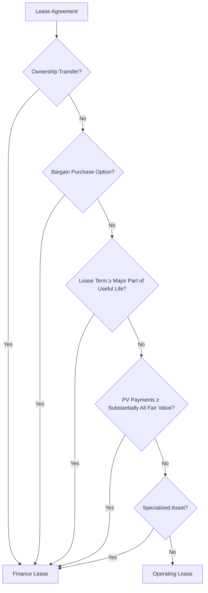

## Reading 34: Topics in Long-Term Liabilities and Equity

### 🎯 Introduction

Welcome back, future CFA charterholder! Think of a company's balance sheet like its financial skeleton. 🦴 We've looked at assets (what it owns), and now we dive into the other side: **long-term liabilities** (what it owes for more than a year, like long-term IOUs 📜) and **equity** (the owners' stake 🍰). This reading focuses on some key areas: leasing assets instead of buying them, promises made to employees for retirement (**pensions**), and paying employees with stock or options. Understanding these complex items is crucial for getting a true picture of a company's obligations and ownership structure!

-----

### Part 1: Leases - Renting vs. Owning 🏢➡️📄 (LOS 34.a)

Sometimes, instead of buying a big asset like a building or machinery, a company **leases** it. The company using the asset is the **lessee**, and the owner providing the asset is the **lessor**. It's like renting an apartment instead of buying a house. 🏠

#### 1.1 Why Lease?

  * **Less Cash Upfront:** Cheaper initially than buying.
  * **Negotiation Flexibility:** Lease terms can be customized.
  * **Obsolescence Risk:** Lessor often bears the risk the asset becomes outdated.
  * **Tax Advantages:** Lease payments might be deductible.

#### 1.2 Lease Classification: Finance vs. Operating

The crucial first step is classifying the lease. Does it *feel* more like ownership (a **finance lease**) or just temporary use (an **operating lease**)?

**💡 MNEMONIC: "OWL-TV-SPecialized" for Finance Lease Criteria**
  - **O**wnership transfers
  - **W**onder price (Bargain purchase option)
  - **L**ife (Major part of asset's useful life)
  - **T**otal value (PV ≈ Fair Value, substantially all)
  - **V**ery specialized (only lessee can use)

If **ANY ONE** applies → **Finance Lease**

A lease is generally a **finance lease** if *any* of these are met:

  * Ownership transfers to lessee at the end. 🎁
  * Lessee has a bargain option to purchase the asset. 💰
  * Lease term covers most of the asset's useful life (e.g., >75%). ⏳
  * Present value (PV) of lease payments is close to the asset's fair value (e.g., >90%). 💲
  * The asset is so specialized only the lessee can use it without major changes. 🧑‍🔧

If none of these conditions are met, it's an **operating lease**.

#### 1.3 Lease Classification Criteria

#### 1.4 Lessee Accounting: How the User Reports It

This is where IFRS and U.S. GAAP have some key differences.

##### 1.4.1 IFRS Lessee Accounting

  * **Simple Approach:** IFRS treats *almost all* leases by lessees as **finance leases**. ✅
  * **Balance Sheet:**
    * Recognize a **Right-of-Use (ROU) Asset** (representing the right to use the leased item).
    * Recognize a **Lease Liability** (representing the obligation to make payments).
    * Both are initially measured at the **present value (PV)** of the lease payments.
  * **Income Statement:**
    * Recognize **Amortization Expense** on the ROU asset (usually straight-line).
    * Recognize **Interest Expense** on the Lease Liability (using the effective interest method).
  * **Cash Flow Statement:**
    * Interest portion of payment → CFO or CFF (IFRS flexibility).
    * Principal portion of payment → CFF.
  * **Exception:** Very short-term leases (<12 months) or low-value assets can be expensed straight-line, off-balance sheet.

##### 1.4.2 U.S. GAAP Lessee Accounting

  * **Dual Approach:** U.S. GAAP maintains the distinction between **finance leases** and **operating leases** for reporting. ✌️
  * **Balance Sheet (Both Types):** Similar to IFRS, both finance and operating leases result in an **ROU Asset** and a **Lease Liability** based on the PV of lease payments.
  * **Income Statement:**
    * **Finance Lease:** Separate **Interest Expense** and **Amortization Expense** (identical to IFRS). Total expense is higher in early years, lower in later years.
    * **Operating Lease:** A single, combined **Lease Expense** is reported (usually the straight-line lease payment amount). Total expense is constant each year.
  * **Cash Flow Statement:**
    * **Finance Lease:** Interest portion → CFO; Principal portion → CFF (similar to IFRS CFF classification).
    * **Operating Lease:** The *entire* lease payment is classified as **CFO**.

#### 1.5 Theory: IFRS vs. U.S. GAAP Lessee

| Item                   | IFRS (Finance Lease Only) | U.S. GAAP (Finance Lease) | U.S. GAAP (Operating Lease) |
| :--------------------- | :------------------------ | :------------------------ | :-------------------------- |
| **Balance Sheet** | ROU Asset, Lease Liability| ROU Asset, Lease Liability| ROU Asset, Lease Liability  |
| **Income Statement** | Interest Exp + Amort Exp  | Interest Exp + Amort Exp  | Single Lease Expense        |
| **Total Expense Trend**| Higher early, Lower later | Higher early, Lower later | Constant                    |
| **Cash Flow Stmt** | Int (CFO/CFF), Prin (CFF) | Int (CFO), Prin (CFF)     | Entire Payment (CFO)        |
| **Effect vs Operating**| Lower CFO, Higher CFF     | Lower CFO, Higher CFF     | Higher CFO, Lower CFF       |
| **Effect vs Operating**| Higher EBIT                 |

#### 1.6 Example 🧮

Affordable Co. leases a machine for 4 years (its entire useful life) with `$10,000` annual payments. The implicit interest rate is 5%. PV of payments = `$35,460`.

**IFRS / U.S. GAAP Finance Lease:**

  * **Year 1 IS:** Interest = `$1,773` (`$35,460` × 5%); Amortization = `$8,865` (`$35,460` / 4). Total Exp = `$10,638`.
  * **Year 1 CF:** Interest (`$1,773`) → CFO/CFF (IFRS) or CFO (US GAAP); Principal (`$10,000` - `$1,773` = `$8,227`) → CFF.
  * **Year 1 BS:** ROU Asset = `$26,595` (`$35,460` - `$8,865`); Lease Liability = `$27,233` (`$35,460` - `$8,227`).

**U.S. GAAP Operating Lease:**

  * **Year 1 IS:** Single Lease Expense = `$10,000`.
  * **Year 1 CF:** Entire Payment (`$10,000`) → CFO.
  * **Year 1 BS:** ROU Asset = `$27,233`; Lease Liability = `$27,233`. (ROU Asset = Lease Liability throughout the lease).

#### 1.7 Lessor Accounting: How the Owner Reports It

The lessor also classifies the lease as **finance** or **operating** using the same criteria.

**Finance Lease (Lessor):**

  * Feels like the lessor *sold* the asset.
  * **Balance Sheet:** Lessor removes the asset, adds a **Lease Receivable** (PV of payments + PV of residual value).
  * **Income Statement:**
    * If lessor is a manufacturer/dealer → Recognizes **profit (or loss)** on the "sale" upfront. Reports **Interest Income** over the lease term.
    * If lessor is just financing (Direct Financing Lease) → No upfront profit. Interest income is recognized over the lease term.
  * **Cash Flow Statement:** Lease payments received are split; Interest portion → CFO, Principal portion → CFI (as return *of* investment). *(Note: Text says CFO, but conceptually CFI fits better for principal recovery; follow text for exam).*

**Operating Lease (Lessor):**

  * Feels like the lessor is just *renting out* the asset.
  * **Balance Sheet:** Lessor keeps the asset on its books. Continues to record **Accumulated Depreciation**.
  * **Income Statement:** Reports **Lease Revenue** (usually straight-line). Records **Depreciation Expense** on the asset.
  * **Cash Flow Statement:** Entire lease payment received is typically **CFO**.

##### 1.7.1 Example 🧾 (Lessor)

CapitalCo leases a machine to Affordable Co for 4 years (annual payments of `$10,000`, implicit rate 5%, PV = `$35,460`). For simplicity assume no residual value.

**Finance Lease (Lessor) — Manufacturer/Dealer example:**

  * **Inception (initial recognition):** Lessor removes the asset (cost basis = `$30,000`) and records a **Lease Receivable** = `$35,460`. Recognizes an **upfront profit** = `$35,460 - $30,000 = $5,460`.
  * **Year 1 IS:** Interest income = `$35,460 * 5% = $1,773` recognized over the term. No depreciation (asset removed). Total Year 1 income impact (ignoring tax) includes the upfront profit plus interest income.
  * **Year 1 CF:** Cash received = `$10,000`. Of that, interest portion `$1,773` → **CFO**; principal portion `$8,227` → **CFI** (return of investment / recovery of principal) per conceptual presentation.
  * **Year 1 BS (after payment):** Lease Receivable ending = `$35,460 - $8,227 = $27,233`.

**Operating Lease (Lessor) example:**

  * **Inception:** Lessor keeps the asset on its books (cost/fair value `$35,460`) and continues to depreciate it over its useful life (4 years).
  * **Year 1 IS:** Lease revenue = `$10,000` (usually straight-line). Depreciation expense = `$35,460 / 4 = $8,865`. Net operating income effect = `$10,000 - $8,865 = $1,135`.
  * **Year 1 CF:** Entire lease payment `$10,000` → **CFO**.

> Quick takeaway: A finance lease to the lessor often looks like a sale (upfront profit for a manufacturer/dealer and interest income over time). An operating lease looks like rental income with continuing depreciation of the asset.

##### 1.7.2 Lessor Accounting — Comparison Table

| Item | Finance Lease (Lessor) | Operating Lease (Lessor) |
| :--- | :--------------------- | :------------------------ |
| Balance Sheet | Remove asset; record **Lease Receivable** (PV of payments ± residual) | Keep asset; record asset and **Accumulated Depreciation** |
| Income Statement | Upfront **profit** if manufacturer/dealer (sale-like) or no upfront profit if pure financier; **Interest income** over term | **Lease revenue** (usually straight-line) and **Depreciation expense** on the asset |
| Cash Flow Statement | Interest portion → **CFO**; Principal recovery → **CFI** (return of investment) (note: some texts present principal as CFO) | Entire lease receipts → **CFO** |
| Recognition of Asset | Derecognize leased asset (if finance) | Asset remains on lessor's books |
| Initial Profit (when applicable) | Recognize sale profit if lessor is manufacturer/dealer (fair value - cost) | No sale profit; revenue recognized as rental |

-----

#### 1.8 Global & Local Context 🌍

  * **Global Impact:** The IFRS rule treating most lessee leases as finance leases significantly impacted industries like airlines (e.g., IndiGo, Lufthansa) and retailers (e.g., Walmart, Future Retail) that heavily rely on leased properties and equipment, bringing large amounts of assets and liabilities onto their balance sheets compared to previous rules or current U.S. GAAP operating lease rules.
  * **Indian Example (Lessor):** A company like Sundaram Finance leasing commercial vehicles would classify leases. If a lease transfers ownership risks (e.g., long term, covers most of truck's life), it's a finance lease; they record a receivable and interest income. If it's short-term rental, it's an operating lease; they keep the truck as an asset, record lease income and depreciation.

**💡 CFA Exam Tip ✍️:** Master the lessee accounting differences between IFRS (mostly finance) and U.S. GAAP (finance vs. operating). Know the impact on BS (Assets/Liabilities), IS (Expense timing & type), and CFS (CFO vs. CFF classification). Remember the 5 criteria for finance lease classification.

-----

### Part 2: Deferred Compensation - Promises for the Future ⏳➡️💰/📈 (LOS 34.b)

Companies often compensate employees not just with salary today, but with promises for the future – like retirement benefits or company stock.

#### 2.1 Pension Plans: Retirement Promises

**💡 MNEMONIC: "DC = Direct & Clear; DB = Daunting & Burdensome"**
  - **DC** (Defined **C**ontribution): **C**ompany risk is **C**lear & limited, Employee bears investment risk
  - **DB** (Defined **B**enefit): Company **B**ears the **B**urden, complex accounting with **B**alance sheet impact

  * **Defined Contribution (DC) Plans:**
    * **Concept:** Company contributes a certain amount (e.g., % of salary) to an employee's individual retirement account each period. Think of it like a corporate contribution to a 401(k) in the US or NPS contributions in India.
    * **Risk:** Employee bears the investment risk. The final retirement amount depends on contributions and investment returns. 📈📉
    * **Accounting:** Simple! **Pension Expense** on the Income Statement = Company's contribution for the period. No future liability on the Balance Sheet (once contribution is paid). ✅

  * **Defined Benefit (DB) Plans:**
    * **Concept:** Company *promises* a specific retirement benefit to the employee (e.g., based on final salary and years of service). Common in older government/large corporate plans (less common now).
    * **Risk:** Company bears the investment risk. Must ensure the plan has enough assets to meet future promises. 😬
    * **Accounting:** Complex! Involves estimating the future obligation and accounting for plan assets.
      * **Funded Status:** The core concept.

        

        $$\text{Funded Status} = \text{Fair Value of Plan Assets} - \text{PV of Defined Benefit Obligation (PVDBO/PBO)}$$
        

        * If Assets > Obligation = **Net Pension Asset** (Overfunded) 🙂
        * If Assets < Obligation = **Net Pension Liability** (Underfunded) 😟
          (Reported on the Balance Sheet).
      * **Total Pension Cost:** Has multiple components, split differently between the Income Statement and Other Comprehensive Income (OCI - part of Equity) under IFRS vs. U.S. GAAP.
        * **Components Included in Income Statement (Profit & Loss):**
          * **Service Cost:** PV of benefit earned by employees *this year*. (IFRS also includes *Past Service Costs* here - changes from plan amendments).
          * **Net Interest Expense/Income:** (Funded Status) × (Discount Rate). Interest accrues on the net obligation or net asset.
        * **Components Included in OCI (Equity):**
          * **Remeasurements (IFRS) / Actuarial Gains/Losses (U.S. GAAP):** Changes due to assumption adjustments (e.g., life expectancy, salary growth) or differences between expected and actual asset returns.
          * **Past Service Costs (U.S. GAAP):** Recorded in OCI and amortized to Income Statement over employee service life.
        * **Key Idea:** The *total* economic cost is the same under both standards, but *where* it's reported (IS vs. OCI) differs, affecting reported Net Income vs. Comprehensive Income.

##### 2.1.1 DC vs. DB — Quick Comparison

| Item | Defined Contribution (DC) | Defined Benefit (DB) |
| :--- | :----------------------- | :------------------- |
| Nature | Employer makes specified contributions to individual accounts | Employer promises a specified retirement benefit (formula-based) |
| Employer obligation | Limited to making contributions; no further liability after contribution | Ongoing obligation; present value of future benefits (PBO) recognized |
| Who bears investment risk? | Employee | Employer |
| Balance sheet impact | None once contributions are paid (no ongoing liability for employer) | **Funded status**: Plan assets - PBO shown as an asset (overfunded) or liability (underfunded) |
| Income statement | Expense = employer contribution for the period | Service cost + net interest (remeasurements/actuarial gains or losses typically in OCI under IFRS) |
| Measurement / key assumptions | N/A for employer beyond expected contributions | Discount rate, salary growth, mortality, expected return on plan assets (inputs matter a lot) |
| Accounting complexity | Low | High (actuarial valuations, OCI recycling differences between IFRS and U.S. GAAP) |
| Typical examples | Employer 401(k) matching contributions | Final-salary pension plans, defined-benefit pension schemes |

##### 2.1.2 IFRS vs. U.S. GAAP — Pension Accounting Comparison

| Item | IFRS | U.S. GAAP |
| :--- | :--- | :--- |
| Measurement of obligation | Uses the **Defined Benefit Obligation (DBO)** measured with the projected unit credit method; discount rate based on high-quality corporate bonds. | Uses the **Projected Benefit Obligation (PBO)** (projected benefit approach); discount rates generally based on corporate bond yields.
| Recognition of remeasurements / actuarial gains & losses | Remeasurements (actuarial gains/losses and differences between actual and expected returns) are recognized in **OCI** and are **not recycled** to profit or loss. | Actuarial gains/losses are recognized in **OCI**. Certain items (e.g., prior service cost) are recognized in OCI and then **amortized** to profit or loss over future service periods.
| Past service (plan amendments) | Past service cost generally recognized **immediately in profit or loss** when the plan amendment occurs (IFRS IAS 19). | Prior service cost is recognized in **OCI** when incurred and typically **amortized** to pension expense over employees' remaining service periods.
| Net interest / pension cost presentation | Net interest on the net defined benefit liability (asset) = net defined liability × discount rate; **service cost** is shown in profit or loss. | Net periodic pension cost typically shows **service cost**, **interest cost** on the PBO and **(expected) return** on plan assets (presentation of components may vary).|
| Asset recognition limit / surplus | A surplus (plan assets > DBO) is recognized but **limited to the economic benefit available** to the employer (e.g., refunds or reduced future contributions). | An asset is recognized to the extent the plan surplus is recoverable (subject to a recoverability ceiling related to refunds or offsets against future contributions). |
| OCI recycling | Remeasurements remain in OCI and are **not recycled** to profit or loss under IFRS. | Remeasurements are recorded in OCI; certain items (like prior service cost) are amortized into profit or loss under US GAAP.
| Key disclosure focus | Detailed reconciliation of funded status, assumptions (discount rate, salary growth, mortality), sensitivity analysis, and allocation of plan assets. | Similar disclosures required: reconciliation of obligation/asset, assumptions, amounts recognized in OCI and P&L, and sensitivity information.

#### 2.2 Share-Based Compensation: Paying with Stock 📈

Aligns employee and shareholder interests.

  * **Stock Grants / Restricted Stock:**
    * **Concept:** Giving employees actual shares (which might have vesting conditions – employee must stay X years).
    * **Value:** Value = Market price on the grant date.
    * **Accounting:**
      * **Compensation Expense:** Total fair value (Grant Date Price × Shares) recognized on Income Statement, usually straight-line over the **vesting period**.
      * **Balance Sheet:** Equity (Common Stock & Additional Paid-in Capital - APIC) increases as expense is recognized. No cash impact until shares potentially sold by employee much later.

  * **Stock Options:**
    * **Concept:** Giving employees the *right* to buy shares in the future at a fixed **exercise price**. Value depends on stock price rising above exercise price.
    * **Value:** More complex. Estimated using option-pricing models (like Black-Scholes) at the grant date, requiring subjective inputs (volatility!).
    * **Accounting:**
      * **Compensation Expense:** Total estimated fair value recognized on Income Statement, usually straight-line over the **vesting period**.
      * **Balance Sheet:** Equity (APIC) increases as expense is recognized.
      * **When Exercised:** Cash increases (by exercise price paid), Equity increases (Common Stock & APIC). Dilutes existing shareholders.

  * **Stock Appreciation Rights (SARs) / Phantom Stock:**
    * **Concept:** Cash payments based on the increase in stock price (SARs) or hypothetical stock performance (Phantom Stock). No actual shares issued.
    * **Accounting:** Treated as a liability, fair value adjusted each period. Results in more volatile expenses compared to grants/options.

**💡 CFA Exam Tip ✍️:** Distinguish DC (simple, employee risk) vs. DB (complex, company risk, BS asset/liability). Know the basic components of DB cost and the key IFRS vs. U.S. GAAP reporting differences (esp. Past Service Cost and Actuarial Gains/Losses → IS vs. OCI). For stock comp, understand Grants vs. Options and that expense is recognized over the vesting period based on grant-date fair value.

-----

### Part 3: Disclosures - Uncovering the Details 🕵️‍♀️📑 (LOS 34.c)

The footnotes provide the necessary details to understand these complex liabilities and equity components.

#### 3.1 Lease Disclosures

  * **Lessee:** Needs to disclose qualitative info (nature of leases) and quantitative info like:
    * ROU asset/liability amounts by asset class.
    * Lease expense details (interest, amortization, variable payments).
    * Cash outflows.
    * Maturity analysis of lease liabilities (future payments).
    * Sale-leaseback details.
  * **Lessor:** Disclosures depend on lease type (Finance vs. Operating). Includes info like:
    * Profit/loss on finance leases.
    * Interest income (finance).
    * Lease income (operating).
    * Net investment in leases (receivable detail) (finance).
    * Asset details and depreciation (operating).
    * Maturity analysis of receivables.

#### 3.2 Pension Disclosures (Defined Benefit)

  * Crucial for understanding the true obligation and risks. Key items:
    * Description of the plan.
    * **Reconciliation of Funded Status:** Shows beginning obligation/assets, changes during the year (service cost, interest, returns, contributions, benefits paid, remeasurements), and ending obligation/assets. VERY IMPORTANT.
    * Components of pension cost recognized in P&L vs. OCI.
    * **Assumptions used:** Discount rate, expected return on assets (U.S. GAAP P&L component), compensation growth rate, mortality rates. *Sensitivity analysis* showing impact of assumption changes is vital.
    * **Plan Asset Details:** Fair value, allocation across asset classes (stocks, bonds, etc.), expected contributions.
    * Maturity profile of the obligation.

#### 3.3 Share-Based Compensation Disclosures

  * Helps assess the cost and potential dilution. Key items:
    * Description of the plan(s).
    * Method used to determine fair value (e.g., option model) and the **inputs** used (volatility, life, interest rate, dividend yield).
    * Total compensation expense recognized.
    * Number and details of options/shares outstanding, granted, exercised, forfeited, expired (reconciliation).
    * Exercise prices and remaining contractual life for options.

#### 3.4 Why Analysts Care

  * **Leases:** Understand the magnitude of off-balance-sheet financing (historically) and the fixed commitments impacting future cash flows. Compare companies more effectively (e.g., adjusting U.S. GAAP operating leases).
  * **Pensions:** Assess the underfunding risk (size of net liability), the quality of assumptions (are they realistic?), the impact on future earnings and cash flow (contributions needed), and the risk profile of plan assets.
  * **Share-Based Comp:** Understand the *true* employee cost (often significant for tech firms like Infosys or Google), potential future dilution for existing shareholders, and management's assumptions about stock volatility.

**💡 CFA Exam Tip ✍️:** Don't just look at the face of the financial statements for leases and pensions. The *disclosures* are essential. Pay close attention to DB pension assumptions (especially the discount rate) and the reconciliation of the funded status. For stock options, scrutinize the valuation inputs disclosed.

-----

### 🧪 Formula Summary

  * **Lease Liability / ROU Asset Initial Value:** 
    $$\text{PV}(\text{Lease Payments})$$

  * **Finance Lease Interest Expense (Lessee):** 
    $$\text{Beginning Lease Liability} \times \text{Discount Rate}$$

  * **Finance Lease Principal Repayment (Lessee):** 
    $$\text{Lease Payment} - \text{Interest Expense}$$

  * **Finance Lease ROU Asset Amortization (IFRS / US GAAP):** Typically Straight-Line: 
    $$\frac{\text{PV}(\text{Lease Payments})}{\text{Lease Term}}$$

  * **Operating Lease Expense (U.S. GAAP Lessee):** Typically Straight-Line Lease Payment.

  * **Defined Benefit Pension Funded Status:** 
    $$\text{Funded Status} = \text{Fair Value of Plan Assets} - \text{PV}(\text{Defined Benefit Obligation})$$

  * **Stock Compensation Expense:** Recognized based on Grant-Date Fair Value over the Vesting Period.

-----

### 🎯 Quick Exam-Day Pointers

  * **Lease Classification:** Know the 5 finance lease criteria. If none met → Operating.
  * **Lessee Accounting Differences:** IFRS treats most leases as finance (separate Interest & Amortization Exp). U.S. GAAP splits: Finance (like IFRS IS/CFS) vs. Operating (Single Lease Exp, all CFO). Both put ROU Asset/Lease Liability on BS.
  * **Lessor Accounting:** Finance = Sale-like (remove asset, add receivable, recognize profit/interest). Operating = Rental-like (keep asset, recognize revenue/depreciation).
  * **Pensions:** DC = Simple expense. DB = Complex; focus on **Funded Status** (Assets vs Obligation) reported on BS. Know cost components are split between IS & OCI (differs slightly IFRS vs US GAAP).
  * **Pension Assumptions Matter:** Discount rate changes heavily impact the DB Obligation. Check disclosures for sensitivity.
  * **Stock Comp:** Grants vs. Options. Expense = Grant-Date Fair Value spread over Vesting Period. Impacts IS (expense) and Equity (APIC). Option exercise brings in cash but dilutes.
  * **Read the Footnotes!** Disclosures are critical for understanding lease commitments, true pension obligations/risks (assumptions!), and the real cost/impact of stock compensation.

