## Reading 36: Financial Reporting Quality 🚀

### 🎯 Introduction

Think of a company's financial reports like a doctor's check-up report for your health. 🩺 **Financial Reporting Quality** is about how clearly and accurately that report is written – does it follow the rules (like GAAP or IFRS) and honestly represent the patient's condition? **Quality of Earnings** (or Results), on the other hand, is about the patient's actual health – are the reported profits sustainable and reflective of real economic activity, or are they artificially boosted? This reading helps you become a sharp diagnostician, able to assess both the clarity of the report and the true health of the company! 🧐

-----

### Part 1: Quality Reporting vs. Quality Results: What's the Difference? 🤔 (LOS 36.a)

It's crucial to understand that high-quality *reporting* doesn't automatically mean high-quality *results*.

* **Financial Reporting Quality:** This refers to the characteristics of the financial statements themselves.
  * **Primary Criterion:** Compliance with **GAAP** (Generally Accepted Accounting Principles) or **IFRS** (International Financial Reporting Standards).
  * **Decision Usefulness:** High-quality reporting must be useful for making decisions. This requires:
    * **Relevance:** The information matters and can influence decisions. It must also be **material** (significant enough to make a difference).
    * **Faithful Representation:** The information is complete, neutral (unbiased), and free from error.
* **Quality of Reported Results (Earnings Quality):** This refers to the nature of the earnings themselves.
  * **Sustainability:** High-quality earnings are likely to persist in the future (**sustainable earnings**). Earnings driven by one-off events (like selling a building) are considered lower quality.
  * **Adequacy:** Earnings must be sufficient to cover the company's cost of capital and provide an adequate return to investors over time.
  * **Link to Cash Flow & Balance Sheet:** High-quality earnings are often backed by strong **operating cash flows**. Overstated assets or understated liabilities on the balance sheet can reduce earnings quality.

**The Matrix:** You can have different combinations:

|                        | High Reporting Quality                        | Low Reporting Quality                           |
| :--------------------- | :-------------------------------------------- | :---------------------------------------------- |
| **High Earnings Quality** | **Ideal:** GAAP compliant, sustainable earnings. ✅ | Earnings are good, but reporting is unclear. 😔 |
| **Low Earnings Quality** | Reporting is clear, but earnings aren't sustainable. 🧐 | **Worst:** Misleading reports, unsustainable earnings. ❌ |

💡 CFA Exam Tip ✍️:Understand the distinction! A company can perfectly follow GAAP (high reporting quality) but report earnings driven by unsustainable, one-time gains (low earnings quality). Conversely, a company might have solid, sustainable earnings but obscure them through poor, confusing disclosure (low reporting quality).

-----

### Part 2: The Reporting Quality Spectrum: From Saintly to Sketchy 😇➡️😈 (LOS 36.b)

**💡 MNEMONIC: "GOOD → BAD → BANNED → FRAUD" (6 Levels)**
- **G**reat: GAAP compliant + Quality earnings ✨
- **O**kay reports, **O**dd earnings: GAAP but unsustainable 📉
- **B**iased within GAAP 🤨
- **A**ggressive management within GAAP 🎭
- **D**eparted from GAAP (Non-compliant) 🚫
- **F**raud (Fictitious transactions) ☠️

Think of financial reporting quality as a spectrum, ranging from ideal to outright fraudulent.

```mermaid
graph LR
    A["1. GAAP Compliant & Decision Useful (High Quality Reporting + High Quality Earnings) ✨"] --> B["2. GAAP Compliant & Decision Useful, but Earnings Quality is Low 📉"]
    B --> C["3. Biased Accounting Choices within GAAP 🤨"]
    C --> D["4. Aggressive Choices within GAAP to Manage Earnings 🎭"]
    D --> E["5. Non-Compliant Accounting (Departure from GAAP) 🚫"]
    E --> F["6. Fictitious Transactions (Fraud) ☠️"]
```

* **Top Tier:** Reporting follows GAAP, is decision-useful, and earnings are sustainable and adequate. This is the gold standard.
* **Sustainable Issues:** Reporting is good, but the earnings themselves are not sustainable (e.g., relying on one-off asset sales).
* **Biased Choices:** Management makes choices *within* GAAP that obscure reality (e.g., using **conservative accounting** to smooth earnings down now, hoping to boost them later, or **aggressive accounting** to inflate them now).
* **Earnings Management:** Actively using accounting choices to manipulate reported earnings to meet specific targets.
* **Non-Compliant:** Reporting departs from GAAP/IFRS rules.
* **Fiction:** Reporting fictitious events or transactions – outright fraud.

💡 CFA Exam Tip ✍️:The key difference between levels 3/4 and levels 5/6 is compliance with accounting standards. Earnings management (level 4) might be unethical but still technically *within* the rules, while non-compliance (level 5) and fraud (level 6) are clear violations.

-----

### Part 3: Conservative vs. Aggressive Accounting: Playing it Safe or Pushing the Limits? 🐢💨 (LOS 36.c)

Within the bounds of GAAP/IFRS, managers have choices. These choices can lean towards being conservative or aggressive.

#### 3.1 Accounting Choice Spectrum

* **Conservative Accounting:** Choices tend to decrease reported earnings and financial position in the *current* period. Think of deferring revenue recognition or accelerating expense recognition.
  * Example: Expensing R&D costs immediately (required by US GAAP) is more conservative than capitalizing some development costs (allowed by IFRS under certain conditions).
  * Impact: Lower current profits, potentially higher future profits. Can lead to **earnings smoothing**.
* **Aggressive Accounting:** Choices tend to increase reported earnings and financial position in the *current* period. Think of recognizing revenue sooner or deferring expense recognition.
  * Example: Using a longer estimated useful life for depreciating an asset reduces current depreciation expense.
  * Impact: Higher current profits, potentially lower future profits. Also used for **earnings smoothing**.

**Is Conservative "Good"? 🤔** Not necessarily! While it might seem prudent, conservatism is still a form of bias. Ideally, financial reporting should be **neutral** and provide a **faithful representation** of economic reality. Both conservative and aggressive biases reduce the decision usefulness of financial statements. GAAP itself sometimes incorporates conservatism (e.g., immediate write-downs for inventory impairment but no immediate write-ups for value increases under US GAAP).

💡 CFA Exam Tip ✍️:Be able to identify examples of conservative vs. aggressive accounting choices. Remember that *both* can be used for earnings smoothing, just with opposite timing effects. Neutral, unbiased reporting is the theoretical ideal.

-----

### Part 4: Why Bend the Rules? Motivations & Opportunities for Low Quality 🤫 (LOS 36.d)

**💡 MNEMONIC: "MOR" - The Fraud Triangle**
- **M**otivation (pressure to perform - bonuses, targets)
- **O**pportunity (weak controls, flexible standards)
- **R**ationalization (justifying the behavior)

All 3 typically present for financial fraud/manipulation

Why would managers intentionally issue low-quality reports? It usually boils down to three factors: Motivation, Opportunity, and Rationalization.

* **Motivations:**
  * **Meet Earnings Benchmarks:** Pressure to hit analyst forecasts or prior-period earnings.
  * **Career Considerations:** Enhance reputation or job security.
  * **Compensation:** Bonuses tied to reported earnings or stock price.
  * **Improve Perceptions:** Look better to customers, suppliers, or investors.
  * **Debt Covenants:** Avoid violating loan agreements tied to financial ratios.

* **Opportunities:**
  * **Weak Internal Controls:** Insufficient checks and balances.
  * **Inadequate Board Oversight:** Lack of scrutiny from the board of directors.
  * **Accounting Standard Flexibility:** Wide range of acceptable treatments under GAAP/IFRS.
  * **Low Penalties:** Minimal consequences for violations.

* **Rationalization:** Managers convince themselves their actions are justified ("It's just temporary," "Everyone does it," "It's for the good of the company").

```mermaid
graph TD
    A["Motivation (e.g., Bonus Target)"] --> B{"Opportunity (e.g., Weak Controls)"}
    B --> C["Rationalization (e.g., 'Just smoothing things out')"]
    C --> D["Low-Quality Financial Reporting 📉"]
```

#### 4.1 Global & Local Context 🌍

* **Global Example:** The Enron scandal involved complex accounting schemes (opportunities) motivated by pressure to maintain high stock prices and executive bonuses, rationalized as innovative financial engineering.
* **Indian Example:** The Satyam Computers case involved founder Ramalinga Raju falsifying accounts (opportunity due to control) motivated by the need to meet analyst expectations and maintain the company's image, rationalized initially perhaps as bridging a temporary gap that became unmanageable.

💡 CFA Exam Tip ✍️:Remember the fraud triangle: Motivation, Opportunity, Rationalization. Questions might describe a situation and ask which element is most prominent or which conditions are conducive to low-quality reporting.

-----

### Part 5: Keeping Them Honest: The Guardians of Quality 🛡️ (LOS 36.e)

Several mechanisms help discipline financial reporting quality, although none are foolproof.

* **Regulation:** Securities regulators (like the SEC in the US or SEBI in India) set reporting standards, require audits, and enforce rules through investigations and penalties.
* **Auditing:** Independent auditors provide **reasonable assurance** that financial statements are fairly presented according to accounting standards. However, auditors are hired and paid by the company, creating a potential conflict. An unqualified ("clean") opinion doesn't guarantee the absence of fraud. US regulations (Sarbanes-Oxley) require auditors to opine on internal controls.
* **Private Contracts:** Lenders often include **covenants** in loan agreements that require borrowers to meet specific financial ratios or conditions, incentivizing adherence to agreed-upon accounting standards.

#### 5.1 Limitations of Oversight Mechanisms

**Limitations:** Auditors face limitations (e.g., information asymmetry, fee pressure). Regulators may lack resources for thorough oversight. Accounting standards themselves can be complex or offer too much leeway.

💡 CFA Exam Tip ✍️:Understand the roles and limitations of regulators and auditors. Remember that an audit provides *reasonable*, not absolute, assurance.

-----

### Part 6: Beyond GAAP: Presentation Choices & Non-GAAP Measures ✨ (LOS 36.f)

Even within GAAP, managers make presentation choices. They might also present **non-GAAP measures** (like "Adjusted EBITDA" or "Core Earnings") alongside GAAP results.

* **Why use non-GAAP measures?**
  * Management believes GAAP measures don't reflect the company's "true" performance.
  * To exclude items management considers non-recurring or non-representative (e.g., restructuring costs, acquisition-related expenses).

* **Potential Problems:**
  * Can be used to obscure unfavorable results or paint an overly optimistic picture.
  * Lack of standardization makes comparability difficult.
  * Management might inconsistently exclude "bad stuff" while keeping "good stuff."

Regulators (like the SEC) require companies using non-GAAP measures to:

1.  Reconcile the non-GAAP measure to the most comparable GAAP measure.
2.  Explain why the non-GAAP measure is useful.
3.  Present the GAAP measure with equal prominence.

💡 CFA Exam Tip ✍️:Be skeptical of non-GAAP measures. Always check the reconciliation back to the GAAP numbers and understand *what* management excluded and *why*. Does their explanation make sense, or are they just trying to hide bad news?

-----

### Part 7: The Accounting Toolkit: How Choices Shape the Numbers 🛠️ (LOS 36.g & h)

Managers can use various accounting choices and estimates to manage earnings, cash flows, and balance sheet items.

#### 7.1 Managing Earnings

* **Revenue Recognition:**
  * Timing: Choosing FOB shipping point vs. destination; accelerating shipments (**channel stuffing**) or delaying them.
  * Fictitious Revenue: Creating fake sales (fraud).
* **Expense Recognition:**
  * Depreciation: Choosing longer useful lives or higher salvage values reduces current expense.
  * Capitalization: **Capitalizing** costs (e.g., interest, some software development) instead of expensing them boosts current income but lowers future income.
  * Estimates: Lowering estimates for bad debt reserves or warranty expenses increases current income.
* **Valuation Allowance:** Reducing the **valuation allowance** against a deferred tax asset increases current income.

#### 7.2 Managing Cash Flow

* **Stretching Payables:** Delaying payments to suppliers increases **Cash Flow from Operations (CFO)** in the current period (but decreases it later).
* **Financing Payables:** Using banks to pay suppliers early might reclassify the outflow from CFO to CFF (Cash Flow from Financing).
* **Capitalizing Interest:** Moves cash outflow from CFO (interest paid under US GAAP) to CFI (Cash Flow from Investing).
* **IFRS Flexibility:** IFRS allows classifying interest/dividends paid/received as CFO, CFF, or CFI (depending on the item), offering more classification flexibility than US GAAP.

💡 CFA Exam Tip ✍️:Focus on *how* specific accounting choices affect the timing of revenue/expense recognition and their impact on net income, assets, liabilities, and cash flow classifications. Questions often test the directional impact (increase/decrease) on financials and ratios.

-----

### Part 8: Red Flags: Spotting Potential Manipulation 🚩 (LOS 36.h)

Be alert for these warning signs of potential low-quality reporting or earnings management:

* **Revenue Issues:** Revenue growth outpacing peers, changes in recognition policies, increased **days sales outstanding (DSO)**, **bill-and-hold** arrangements, high proportion of **related-party transactions**.
* **Inventory Issues:** Declining **inventory turnover**, **LIFO liquidations** (artificially boosting profits by selling old, lower-cost inventory).
* **Capitalization Issues:** Capitalizing costs typically expensed by peers.
* **Cash Flow Issues:** CFO persistently lower than net income, CFO volatility.
* **Depreciation Issues:** Depreciation methods, useful lives, or salvage values inconsistent with peers.
* **Other:** Strange fourth-quarter patterns, frequent "non-recurring" items, emphasis on non-GAAP measures, minimal disclosures, related-party transactions.

💡 CFA Exam Tip ✍️:No single red flag proves manipulation, but a pattern of them warrants deeper investigation. Understand *why* each item is a potential warning sign (e.g., rising DSO might indicate channel stuffing or aggressive revenue recognition).

-----

### 🧪 Formula Summary

*(Reading 36 is primarily conceptual; there are no specific calculation formulas introduced)*

-----

### 🎯 Quick Exam-Day Pointers

* **Reporting Quality ≠ Earnings Quality:** Know the difference! Clear reports (high reporting quality) can still show unsustainable profits (low earnings quality).
* **Spectrum of Quality:** Understand the progression from high-quality GAAP reporting down to biased choices, earnings management, non-compliance, and fraud.
* **Conservative vs. Aggressive:** Recognize examples and understand that both are biases away from neutral reporting. Both can be used for **earnings smoothing**.
* **Motivations Matter:** Pressure to meet targets, compensation, and career goals often drive low-quality reporting. Weak controls provide the opportunity.
* **Non-GAAP Scrutiny:** Always reconcile non-GAAP measures back to GAAP and understand the adjustments made.
* **Accounting Choices Impact:** Know how choices like depreciation methods, capitalization policies, and inventory costing (FIFO/LIFO/Avg Cost) affect income, assets, and cash flows *over time*.
* **Red Flags:** Be familiar with common warning signs like CFO lagging Net Income, declining turnover ratios, LIFO liquidations, and aggressive revenue recognition tactics (e.g., channel stuffing).

