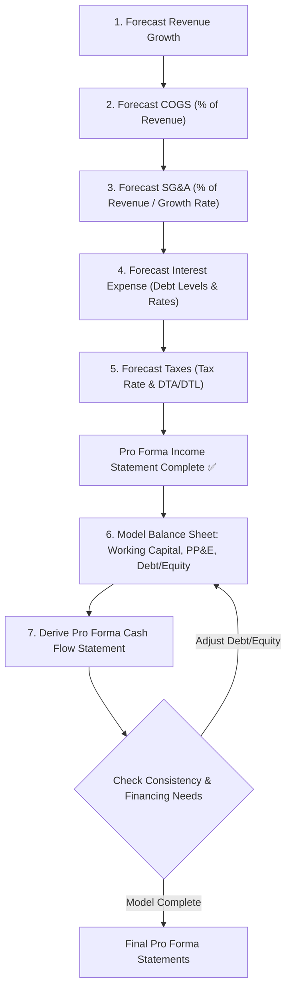

## Reading 38: Introduction to Financial Statement Modeling 🚀

### 🎯 Introduction

Imagine you're an architect designing a building. You wouldn't just start laying bricks randomly\! You'd create a detailed blueprint first, projecting what the final structure will look like. 🏗️ Financial statement modeling is like creating that blueprint for a company's future financial performance. By forecasting revenues, costs, and balance sheet items, analysts build a **pro forma** (projected) picture to estimate a company's value and make investment decisions. This reading shows you the basic steps to build that financial blueprint\!

-----

### Part 1: How Do We Build a Pro Forma Model? 🛠️ (LOS 38.a)

A **sales-based pro forma company model** uses future revenue estimates as the foundation to project the entire set of financial statements (Income Statement, Balance Sheet, Cash Flow Statement). Here’s a typical step-by-step process:

1.  **Estimate Revenue Growth:** Forecast future sales based on factors like market growth, market share, historical trends, or GDP growth. This is your starting point\! 📈
2.  **Estimate Cost of Goods Sold (COGS):** Often projected as a percentage of the forecasted revenue, based on historical margins or expected changes in efficiency/input costs.
3.  **Estimate Selling, General & Administrative (SG\&A) Expenses:** Can be forecast as a percentage of sales, assumed to grow at a certain rate, or broken down into fixed and variable components.
4.  **Estimate Financing Costs:** Project interest expense based on forecasted debt levels and estimated interest rates. Consider planned debt issuance or repayment.
5.  **Estimate Income Tax Expense & Cash Taxes:** Apply an estimated tax rate to pretax income, considering changes in deferred tax assets/liabilities.
6.  **Model the Balance Sheet:**
      * Start with items flowing from the income statement (like retained earnings).
      * Forecast working capital accounts (receivables, inventory, payables) often based on turnover ratios or days outstanding linked to sales or COGS.
      * Project Property, Plant & Equipment (PP\&E) based on historical capital expenditures (capex) and depreciation trends.
      * Forecast debt and equity based on financing needs (identified by the cash flow forecast or balance sheet plug) and company policy.
7.  **Build the Cash Flow Statement:** Derive the projected cash flow statement using the forecasted income statement and the changes in the forecasted balance sheet accounts. Use cash flow adequacy to check if debt/equity forecasts are reasonable.

<!-- end list -->

> [\!TIP]
> **CFA Exam Tip ✍️:** Understand the sequence\! Revenue is the driver. COGS and SG\&A typically follow revenue. Balance sheet items link to income statement activity (e.g., retained earnings) and operational assumptions (e.g., DSO for receivables). The cash flow statement is usually derived last.

-----

### Part 2: Watch Out\! How Biases Affect Forecasts 🧠 (LOS 38.b)

> **💡 MNEMONIC: "OIC-RC" for Common Forecasting Biases**
> - **O**verconfidence (too sure of accuracy)
> - **I**llusion of control (think you can control more than you can)
> - **C**onservatism (anchoring to old views, slow to update)
> - **R**epresentativeness (small samples = big conclusions)
> - **C**onfirmation (seek only supporting evidence)

Analysts are human, and psychological biases can creep into forecasts, making them less accurate. Being aware is the first step to mitigation\!

  * **Overconfidence Bias:** Believing your forecasts are more accurate than they really are. Leads to narrow confidence intervals. Analysts going against consensus may be more prone.
      * *Remedy:* Get critiques from others, review past forecast errors, use scenario analysis.
  * **Illusion of Control Bias:** Thinking you can control outcomes more than you actually can. Often seen when analysts feel they have deep knowledge.
      * *Remedy:* Acknowledge uncertainty, focus on objective data.
  * **Conservatism Bias (Anchoring):** Being slow to update forecasts even when new information warrants it. Anchoring on previous views.
      * *Remedy:* Continually evaluate assumptions, react promptly to new, credible information.
  * **Representativeness Bias:** Overweighting small samples or recent trends, assuming they represent the long-term reality. "This hot streak will last forever\!"
      * *Remedy:* Consider longer time periods, be skeptical of extrapolating short-term trends.
  * **Confirmation Bias:** Seeking out or overweighting information that confirms your existing beliefs, while ignoring contradictory evidence. Especially risky when evaluating management comments.
      * *Remedy:* Actively seek out dissenting opinions, rigorously question information that supports your view.

#### **Global & Local Context 🌍**

  * **Global Example (Confirmation Bias):** During the dot-com bubble, analysts might have focused only on positive news about internet companies, ignoring warning signs because they *wanted* to believe the growth story.
  * **Indian Example (Overconfidence):** An analyst who successfully predicted the rise of a specific Indian tech startup might become overconfident and issue overly optimistic forecasts for similar companies without rigorous analysis, underestimating potential risks.

> [\!TIP]
> **CFA Exam Tip ✍️:** Be able to identify these common behavioral biases from a description of an analyst's forecasting process or thinking. Understand the recommended remedial actions for each bias.

-----

### Part 3: How Does Competition Affect Forecasts? ⚔️ (LOS 38.c)

A company's competitive position, often analyzed using **Porter's Five Forces** (from Reading 44), directly impacts its ability to set prices and control costs, which are key forecast inputs.

  * **High Barriers to Entry:** Allows existing firms more pricing power (higher forecast prices) and potentially stable costs.
  * **Strong Bargaining Power of Suppliers:** May lead to higher forecast COGS or input costs.
  * **Strong Bargaining Power of Buyers:** May limit forecast price increases or force lower prices.
  * **High Threat of Substitutes:** Limits pricing power.
  * **Intense Rivalry:** Puts downward pressure on prices and may increase forecast marketing/SG\&A costs.

Understanding the industry structure helps ground forecasts in economic reality. A forecast assuming high price increases in a highly competitive industry with low barriers to entry is likely unrealistic.

> [\!TIP]
> **CFA Exam Tip ✍️:** You don't need to redo a full Porter analysis here, but understand the *link* between competitive forces and the reasonableness of your price and cost forecasts. Strong competitive position supports higher margins; intense competition pressures them.

-----

### Part 4: Forecasting with Inflation or Deflation 🎈📉 (LOS 38.d)

Changes in price levels affect both revenues and costs.

**Forecasting Sales:**

  * Separate forecasts into **volume** changes and **price** changes.
  * Consider the **elasticity of demand:** Can the company pass cost increases onto customers via higher prices without losing significant volume?  This depends on its pricing power (linked to competition).
  * Analyze competitor price changes.

**Forecasting Costs:**

  * Identify key **input costs** (e.g., oil for airlines, coffee beans for cafes).
  * Assess the company's exposure:
      * Does it use **hedging** (derivatives, fixed-price contracts)? This delays the impact of price changes.
      * Is it **vertically integrated** (owns its suppliers)? This reduces exposure.
  * Estimate how quickly input cost changes flow through to COGS.

**Impact on Margins:** If a company can pass cost increases to customers, its **gross profit amount** might rise (if selling price increases by the same *amount* as cost), but its **gross profit margin** (as a % of sales) will likely fall unless it can increase prices by more than the cost increase.

#### **Example 🧮**

  * Base Year: Sales = 100 units \* `$10`/unit = `$1000`. COGS = 100 units \* `$4`/unit = `$400`. Gross Profit = `$600`. Gross Margin = 60%.
  * Next Year: Input cost rises to `$5`/unit (+ `$1`).
      * **Scenario A (Full Pass-Through):** Price rises to `$11`/unit. Sales = 100 \* `$11` = `$1100`. COGS = 100 \* `$5` = `$500`. Gross Profit = `$600`. Gross Margin = `$600` / `$1100` = **54.5%** (Margin falls).
      * **Scenario B (Partial Pass-Through & Volume Loss):** Price rises to `$10.50`. Sales = 95 units \* `$10.50` = `$997.50`. COGS = 95 \* `$5` = `$475`. Gross Profit = `$522.50`. Gross Margin = `$522.50` / `$997.50` = **52.4%** (Margin falls more).

> [\!TIP]
> **CFA Exam Tip ✍️:** Focus on the pass-through effect. Can the company raise prices to cover cost increases? How will this affect volume? Understand the difference between gross *profit* (absolute amount) and gross *margin* (percentage) when prices change.

-----

### Part 5: Choosing the Right Time Horizon & Looking Beyond 🔭 (LOS 38.e)

How far into the future should you forecast?

#### **5.1 Choosing the Forecast Horizon**

  * **Holding Period:** For buy-side analysts, it might match the expected time horizon for holding the stock.
  * **Cyclical Companies:** Forecast horizon should ideally extend beyond the current cycle phase to estimate **normalized earnings** (mid-cycle earnings).
  * **Company-Specific Factors:** Major events like mergers, acquisitions, or restructurings may require a longer horizon to see the expected benefits realized.
  * **Analyst Limitations:** Forecast accuracy generally decreases further into the future. Many detailed forecasts only go out 3-5 years.

#### **5.2 Projecting Beyond the Short Term**

Detailed forecasts eventually become less reliable. Analysts often transition to broader assumptions:

1.  **Trend Growth:** Assume revenue growth continues at a historical average rate or converges towards the long-run nominal GDP growth rate.
2.  **Terminal Value Estimation:** Used in valuation models (like DCF). Beyond the detailed forecast period, estimate a **terminal value** based on:
      * **Multiples Approach:** Assume the company will trade at some benchmark multiple (e.g., industry average P/E) applied to a terminal year forecast (e.g., EPS in year 5). Ensure the multiple is consistent with long-term growth and risk assumptions.
      * **Discounted Cash Flow (DCF) Approach:** Assume cash flows grow at a constant, sustainable rate indefinitely (like the Gordon Growth Model concept) and calculate the present value.

> [\!TIP]
> **CFA Exam Tip ✍️:** Understand the factors influencing the *choice* of forecast horizon (cyclicality is key). Know the two main methods (multiples, constant growth DCF) for estimating terminal value beyond the detailed forecast period.

-----

### 🧪 Formula Summary

*(Reading 38 is primarily conceptual regarding the modeling *process*; specific calculation formulas for ratios like those in Reading 37 are used *within* the model but not introduced here.)*

-----

> [\!IMPORTANT]
>
> ### 🎯 Quick Exam-Day Pointers
>
>   * **Modeling is Sequential:** Start with revenue, then forecast costs (COGS, SG\&A), then balance sheet items, and derive the cash flow statement last.
>   * **Behavioral Biases are Real:** Know the common biases (Overconfidence, Conservatism, Confirmation, etc.) and how to counteract them. Self-awareness is key\!
>   * **Competition Matters:** Link Porter's Five Forces to your assumptions about future pricing power and cost structures.
>   * **Inflation Impacts Margins:** Focus on the company's ability to pass cost increases to customers and the effect on *percentage* margins vs. absolute profit.
>   * **Horizon Choice:** Consider cyclicality and expected holding period. For cyclical firms, aim to forecast through a full cycle to find "normalized" earnings.
>   * **Terminal Value is Crucial:** Understand the multiples and constant-growth DCF methods used to estimate value beyond the detailed forecast period.