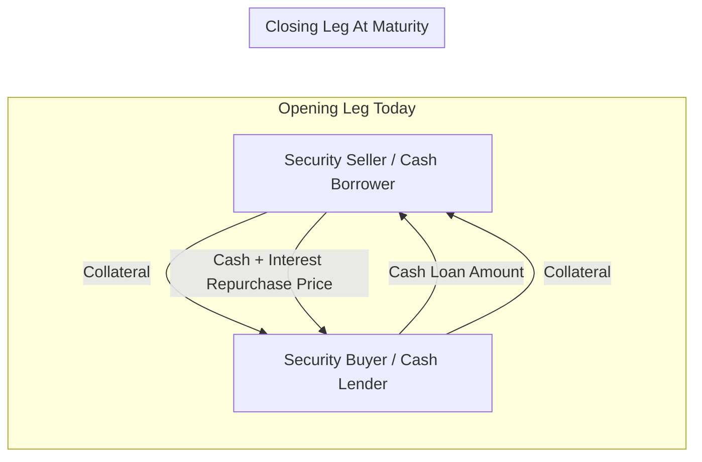

## Reading 50: Fixed-Income Markets for Corporate Issuers 🏢

### 🎯 Introduction

Just like you might need a small loan for a new laptop or a large mortgage for a new house, corporations have different funding needs. For day-to-day operations, they need short-term cash. For building a new factory, they need long-term capital. This reading is a tour of the corporate "loan toolkit." We'll explore the short-term funding options companies use to keep the lights on, and then dive into the world of long-term bonds, highlighting the big differences between how a super-stable company like HDFC Bank borrows versus a riskier, high-growth startup.

-----

### Part 1: How Do Companies Get Short-Term Cash? 💵

Short-term funding is the lifeblood for a company's working capital needs, like paying salaries and buying inventory. The options available depend on whether it's a regular company or a bank.

#### 1.1 For Non-Financial Corporations (e.g., a Car Manufacturer)

  * **Bank Lines of Credit:** An agreement with a bank to borrow funds as needed. They come in three levels of reliability:
    1.  **Uncommitted Line:** A casual offer of credit. The bank can refuse to lend if conditions change. It's flexible but not guaranteed.
    2.  **Committed Line:** A formal, more reliable offer for a specific period. The bank charges a fee for this commitment.
    3.  **Revolving Line of Credit:** The most reliable option, often for several years. It acts like a corporate credit card but comes with more restrictive rules (**covenants**).

  * **Commercial Paper (CP):** 📜  
    This is a short-term, unsecured IOU issued by large corporations with high credit ratings.
    * **Advantage:** It's usually cheaper than borrowing from a bank.
    * **Risk:** It creates **rollover risk**—the risk that the company won't be able to issue new CP to pay off the maturing paper, especially during a crisis. To manage this, companies maintain backup lines of credit with banks.

#### 1.2 For Financial Institutions (e.g., a Bank)

  * **Deposits:** This is their main source of funding, from customer checking and savings accounts to large **Certificates of Deposit (CDs)**.
  * **Interbank Funds:** Simply, banks lending to each other for short periods (overnight to a year). The most common way they do this is through **repurchase agreements (repos)**.
  * **Central Bank Funds Market:** In countries like the US, banks can borrow from other banks' excess reserves held at the central bank to meet their own reserve requirements.
  * **Asset-Backed Commercial Paper (ABCP):** Banks can package up short-term loans (like auto loans) into a separate legal entity (an SPE) and then issue commercial paper backed by the cash flows from those loans.

-----

### Part 2: The Repo Market: A Deep Dive 🔄

A **repurchase agreement (repo)** is a cornerstone of the short-term funding market. Despite its name, it's essentially a short-term, collateralized loan.

**How it works:**

  1.  **Opening Leg:** A borrower "sells" a high-quality security (like a government bond) to a lender in exchange for cash today.
  2.  **Closing Leg:** The borrower promises to "buy back" the same security at a slightly higher price on a future date (often the next day).

The difference between the sale price and the repurchase price is the interest on the loan, known as the **repo rate**.

To protect the lender from a drop in the collateral's value, the loan amount is usually slightly less than the collateral's market value. This difference is known as a **haircut** or **initial margin**. If the collateral's value falls during the loan term, the lender can demand more collateral, called **variation margin**.

**Why use Repos?**

  * **Short-Term Funding:** Banks use repos to finance their trading operations.
  * **Investing Spare Cash:** Companies and funds with extra cash can act as lenders in the repo market to earn a safe, short-term return.
  * **Short Selling:** A hedge fund can use a **reverse repo** to *borrow* a specific security it wants to sell short.

-----

### Part 3: Long-Term Funding: Investment Grade vs. High Yield 🏅 vs. 🚀

When borrowing for the long term, the credit quality of the issuer makes a huge difference in the type of debt they can issue and the terms they must offer.

#### 3.1 Investment Grade Issuers

Think of a large, stable, blue-chip company like Apple or Reliance Industries.

  * **Investor's Main Fear:** Not default, but the risk of a credit rating *downgrade*.
  * **Yield Composition:** The bond's yield is mostly determined by the benchmark risk-free rate. The extra **credit spread** is relatively small.
  * **Covenants:** Have very few restrictive covenants. Investors trust them.
  * **Maturity:** Can issue bonds across a wide range of maturities (e.g., 3, 5, 10, 30 years), giving them flexibility to refinance when conditions are favorable.
  * **Collateral:** Usually issue unsecured debt. No collateral is needed due to their high credit quality.

#### 3.2 High-Yield Issuers

Think of a younger, highly leveraged company, or a company in a cyclical industry.

  * **Investor's Main Fear:** **Default risk** and **loss given default**. What happens if they go bankrupt?
  * **Yield Composition:** The yield is dominated by a very large **credit spread** to compensate investors for the high risk.
  * **Covenants:** Have many restrictive covenants (e.g., limits on dividends, limits on issuing more debt) to protect bondholders.
  * **Maturity:** Typically restricted to shorter maturities, usually 10 years or less, due to higher uncertainty about their long-term prospects.
  * **Collateral & Call Options:** Often required to pledge collateral. They are also more likely to issue **callable bonds**, which gives them the right to repay the debt early if their financial situation improves and they can refinance at a lower cost.

**💡 CFA Exam Tip ✍️:** Know the key differences between **Investment Grade (IG)** and **High Yield (HY)** debt.  
✅ IG investors worry about **downgrades**; ❌ HY investors worry about **default**.  
IG debt has ⬇️ low spreads and few covenants; HY debt has ⬆️ high spreads and many covenants.

-----

### 🧪 Formula Summary

**Repo Purchase Price (Loan Amount):**

$$\text{Purchase Price} = \frac{\text{Market Value of Securities}}{\text{Initial Margin}}$$

**Repo Haircut:**

$$\text{Haircut} = 1 - \frac{1}{\text{Initial Margin}}$$  
or  
$$\frac{\text{Market Value} - \text{Purchase Price}}{\text{Market Value}}$$

**Repurchase Price (Loan + Interest):**

$$\text{Repurchase Price} = \text{Purchase Price} \times \left(1 + \text{Repo Rate} \times \frac{\text{Days}}{360 \text{ or } 365}\right)$$

-----

### 🎯 Quick Exam-Day Pointers

  * **Short-Term Funding:** For stable companies, **Commercial Paper (CP)** is a key tool—it's cheaper than bank loans but has **rollover risk**.
  * **Repo = Collateralized Loan:** A **repo** is a sale and repurchase of a security, but it functions as a short-term loan where the security is collateral. The **repo rate** is the interest.
  * **IG vs. HY is a Core Concept:**
    * **Investment Grade:** ✅ Low risk, ⬇️ low spread, few rules, lots of flexibility.
    * **High Yield:** ❌ High risk, ⬆️ high spread, many rules (**covenants**), less flexibility.
  * **Callable Bonds:** High-yield issuers often use call features so they can refinance on better terms if their credit quality improves.

