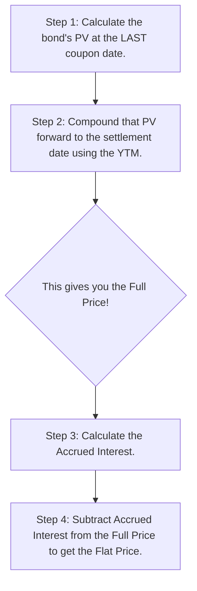
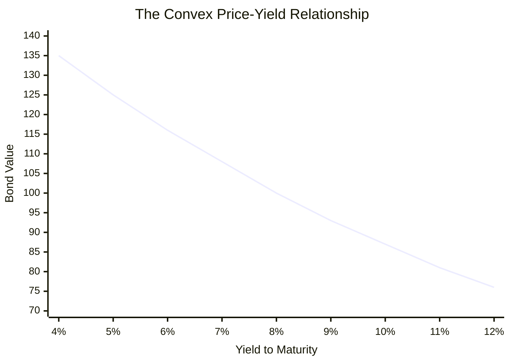
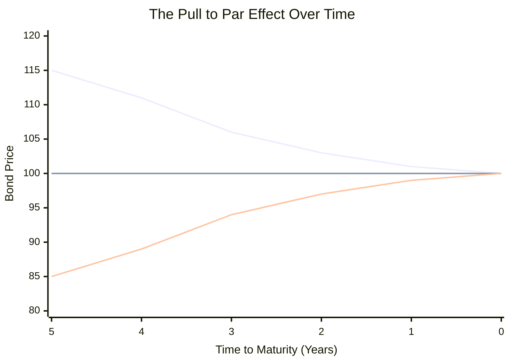

## Reading 52: Fixed-Income Bond Valuation: Prices and Yields

### 🎯 Introduction

Welcome to the heart of fixed income! Think of a bond's price and its yield as two kids on a seesaw. When one goes up, the other must come down. This reading is all about mastering that fundamental relationship. We'll learn how to calculate a bond's fair price using its future cash flows and a given market interest rate, or **Yield to Maturity (YTM)**. We'll also explore what happens to that price when things change and even how to price bonds that don't trade often. Let's get started! 🚀

-----

### Part 1: How Do We Calculate a Bond's Price? 🤔 (LOS 52.a)

A bond is simply a promise to make a series of future cash payments—regular coupons and a final principal repayment. Its price today is just the sum of the present values of all those future payments. The discount rate we use is the bond's **Yield to Maturity (YTM)**, which is the total return you'd get if you held the bond until it matures.

Let's see how this works with some numbers.

#### 1.1 Annual Coupon Bond

Imagine a 5-year bond with a 10% annual coupon and a ₹100 **par value**.

* **If YTM = Coupon Rate (10%)**: The bond's price will be exactly its par value. **Price = ₹100.**
* **If YTM < Coupon Rate (e.g., 8%)**: The bond's coupon is more attractive than what the market offers. Investors will pay more for it. The bond trades at a **premium**. **Price > ₹100.**
* **If YTM > Coupon Rate (e.g., 12%)**: The bond's coupon is less attractive than the market rate. Investors will only buy it at a lower price. The bond trades at a **discount**. **Price < ₹100.**

##### 1.1.1 Calculator Example 🧮

Let's calculate the price for the 5-year, 10% annual coupon bond when the YTM is 8%.

* **N** = 5 (Number of years)
* **I/Y** = 8 (Yield to Maturity)
* **PMT** = 10 (Annual coupon payment)
* **FV** = 100 (Face Value repaid at maturity)
* **CPT PV** = -107.99 (**The price is ₹107.99**)

#### 1.2 Semi-Annual Coupon Bond

Most government and corporate bonds pay coupons twice a year. This changes our calculation slightly. We need to adjust everything for semi-annual periods.

* Double the number of periods (N).
* Halve the annual coupon payment (PMT).
* Halve the annual YTM (I/Y).

##### 1.2.1 Calculator Example 🧮

Let's take the same 5-year, 10% coupon bond, but now it pays semi-annually, and the annual YTM is 8%.

* **N** = 5 × 2 = 10 (Number of semi-annual periods)
* **I/Y** = 8 / 2 = 4 (Semi-annual yield)
* **PMT** = 10 / 2 = 5 (Semi-annual coupon payment)
* **FV** = 100 (Face Value)
* **CPT PV** = -108.11 (**The price is ₹108.11**)

Notice the price is slightly higher than the annual bond because you get cash sooner and it compounds more frequently! 💰

-----

#### 1.3 Between the Coupons: Full Price vs. Flat Price

What happens when you buy a bond between its coupon payment dates? The seller is entitled to the interest that has built up since the last coupon payment. This is called **accrued interest**.

Imagine you're buying a pizza that's delivered every 6 months. If you buy it 3 months in, you have to pay the seller for the 3 months' worth of pizza they've already "owned."

* **Full Price (Dirty Price):** This is what you actually pay. It's the market price plus the accrued interest.
* **Flat Price (Clean Price):** This is the price you see quoted in the market. It does not include accrued interest. This prevents the price from artificially jumping up every day and then dropping on the coupon date.

**Full Price** = **Flat Price** + **Accrued Interest**

Here's how to calculate the price between coupon dates:

💡 CFA Exam Tip ✍️:The exam loves testing the difference between **flat** and **full** price. Always remember: the price you *actually pay* is the full (dirty) price. Financial calculators give you the full price when you value a bond on a non-coupon date, so be prepared to calculate and subtract the accrued interest to find the flat (clean) price. Also, pay attention to the day-count conventions (**30/360** for corporate bonds, **actual/actual** for government bonds).

-----

### Part 2: The Bond Price Seesaw: What Makes It Go Up or Down? ⚖️ (LOS 52.b)

A bond's price is a living thing—it changes based on a few key factors. Understanding these relationships is crucial.

#### 2.1 Price and YTM (The Seesaw)

* **Inverse Relationship:** ✅
  * If market interest rates (YTM) go up 📈, the bond's price goes down 📉.
  * If market interest rates (YTM) go down 📉, the bond's price goes up 📈.

#### 2.2 Price and Coupon Rate

* For a given YTM, a bond with a **higher coupon rate** is less sensitive to interest rate changes. Why? Because you get more of your money back sooner through the chunky coupon payments. A zero-coupon bond is the most sensitive of all!

#### 2.3 Price and Maturity

* The longer the time to maturity, the **more sensitive** the bond's price is to changes in YTM. A 30-year bond's price will swing much more wildly than a 2-year bond's price for the same change in interest rates.

#### 2.4 The Convexity Kicker

* The price-yield relationship isn't a straight line; it's **convex** (curved). This means:
  * For a 1% drop in yield, the price increase is *larger* than the price decrease from a 1% rise in yield. It's a sweet bonus for bondholders!

**💡 Notice the Curve:** See how the line curves? When yields drop from 8% to 7% (1% decrease), the price jumps from ₹100 to ₹108 (**+8%** ⬆️). But when yields rise from 8% to 9% (1% increase), the price only falls from ₹100 to ₹93 (**-7%** ⬇️). That's convexity working in your favor!

#### 2.5 The Inevitable Pull to Par 🧲

No matter if a bond starts its life as a premium or discount bond, as it gets closer to its maturity date, its price will always converge toward its **par value**. Think of par value as a powerful magnet that pulls the bond's price towards it as time runs out.

**💡 See the Magnetic Pull:** Notice how both the premium bond (starting at ₹115) and the discount bond (starting at ₹85) gradually move toward ₹100 as time passes, following a **convex path**. The premium bond decreases at a slower rate as it approaches par, while the discount bond increases at a faster rate initially, then slows down. By maturity (Year 0), both bonds are worth exactly their par value of ₹100. This is the "pull to par" effect—it's inevitable! 🧲

-----

### Part 3: What if a Bond Doesn't Trade? The Art of Matrix Pricing 🖼️ (LOS 52.c)

Many bonds, especially corporate and municipal bonds, don't trade every day. So how do we figure out their price and yield? We use **matrix pricing**.

**Matrix pricing** is a method to estimate the YTM for illiquid bonds by using the yields of similar, frequently traded bonds. It's like estimating the value of your house by looking at the recent sale prices of similar houses in your neighborhood.

The "similar" bonds should have:

* The same credit quality (e.g., A+ rated).
* Similar coupon rates and maturities.

Usually, we find two traded bonds that bracket the maturity of our illiquid bond and use **linear interpolation** to estimate the yield.

#### 3.1 Example: Pricing an Illiquid Bond

Let's say we need to price a 3-year, A+ rated bond. We find the following traded bonds:

* A+ rated, 2-year bond with YTM = 4.3%
* A+ rated, 5-year bond with YTM = 5.2% (average of two similar bonds)

The 3-year bond is one-third of the way between the 2-year and 5-year maturities ( (3-2) / (5-2) = 1/3 ). So we estimate its yield to be one-third of the way between their yields.

$$\text{Estimated 3-Year YTM} = 4.3\% + \frac{1}{3} \times (5.2\% - 4.3\%) = 4.6\%$$

Now we can use this 4.6% YTM to price our 3-year bond!

💡 CFA Exam Tip ✍️:You won't need to do complex matrix pricing, but you absolutely need to understand the concept and how to perform simple linear interpolation. It’s a very practical and testable skill.

-----

### 🧪 Formula Summary

**Price of an Annual Coupon Bond:**

$$PV = \frac{PMT}{(1+YTM)^1} + \frac{PMT}{(1+YTM)^2} + ... + \frac{PMT + FV}{(1+YTM)^N}$$

**Price of a Semi-Annual Coupon Bond:**

$$PV = \frac{PMT/2}{(1+YTM/2)^1} + \frac{PMT/2}{(1+YTM/2)^2} + ... + \frac{PMT/2 + FV}{(1+YTM/2)^{2N}}$$

**Accrued Interest:**

$$AI = \text{Coupon Payment} \times \frac{\text{Days from last coupon to settlement}}{\text{Days in coupon period}}$$

**Full Price (Dirty Price):**

$$\text{Full Price} = \text{Flat Price} + \text{Accrued Interest}$$

### 🎯 Quick Exam-Day Pointers

* **Inverse Relationship is KING:** If you remember one thing, it's that bond prices and yields move in opposite directions. Yields up ⬆️, prices down ⬇️. Simple but powerful.
* **Premium vs. Discount:** A bond trades at a **premium** if its coupon rate > YTM. It trades at a **discount** if its coupon rate < YTM.
* **Longer & Lower is Riskier:** Bonds with **longer maturities** and **lower coupons** are more sensitive to interest rate changes. A 30-year zero-coupon bond is the most volatile of them all.
* **Matrix Pricing is Estimation:** Remember that matrix pricing is a way to *estimate* the yield for bonds that aren't trading. It's an educated guess based on comparable securities.

