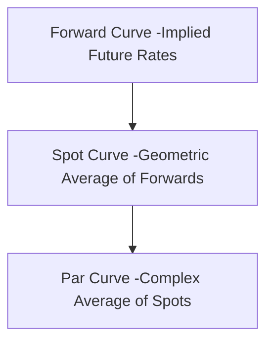

## Reading 55: The Term Structure of Interest Rates: Spot, Par, and Forward Curves 📈

### 🎯 Introduction

Imagine you're booking flights. The price for a flight leaving today is different from a flight leaving in six months, which is different again from one leaving in two years. The **term structure of interest rates** is the financial world's version of this travel itinerary. It describes the relationship between interest rates (or yields) and the time until a loan is repaid (its **term** or **maturity**). This reading unpacks the three most important "maps" of this relationship: the **spot curve**, the **par curve**, and the **forward curve**. Understanding how they relate to each other is key to accurately pricing any fixed-income security.

-----

### Part 1: The Spot Curve: The Purest Rate of All ✨

A **spot rate** is the yield on a zero-coupon bond for a specific maturity. Think of it as the "pure" interest rate for a single payment to be received in the future, stripped of any complexities from coupon payments.

The **spot curve** (also called the **zero curve** or **strip curve**) is a graph plotting these pure spot rates against their respective maturities.

#### 1.1 Valuing a Bond with Spot Rates

Instead of using one single YTM to discount all of a bond's cash flows, the most precise method is to discount *each individual cash flow* by the spot rate corresponding to the date it is received. The sum of these discounted cash flows gives the bond's **no-arbitrage price**.

**No-Arbitrage Price Formula:**

$$\text{Price} = \frac{\text{CPN}_1}{(1+S_1)^1} + \frac{\text{CPN}_2}{(1+S_2)^2} + \dots + \frac{\text{CPN}_N + \text{Principal}}{(1+S_N)^N}$$

where $S_N$ is the N-year spot rate.

* **Example:**
  * We want to price a 3-year, 5% annual coupon bond. The spot rates are:
    * 1-year (S1): 3%
    * 2-year (S2): 4%
    * 3-year (S3): 5%
  * Price = 5/(1.03)^1 + 5/(1.04)^2 + 105/(1.05)^3 = 4.85 + 4.62 + 90.71 = **$100.18**
  * Because each cash flow is discounted at the appropriate market rate for its timing, this price ensures no risk-free arbitrage is possible.

-----

### Part 2: Forward Rates & Par Rates: Implied and Hypothetical Yields 🤔

#### 2.1 Forward Rates: Locking in a Future Rate

A **forward rate** is an interest rate for a loan that will be made at some future date. These are *implied* rates, calculated today based on the spot curve.

  * **Notation:** The notation `1y1y` means the **1-year** interest rate, **1 year from now**. `3y2y` means the **2-year** interest rate, **3 years from now**.
  * **The No-Arbitrage Rule:** The core concept is that you must be indifferent between two strategies. For example, investing for two years at the 2-year spot rate must give the same final return as investing for one year at the 1-year spot rate and simultaneously locking in the `1y1y` forward rate for the second year.

**Key Relationship:**

$$(1 + S_2)^2 = (1 + S_1) \times (1 + 1y1y)$$

This powerful relationship allows us to calculate implied forward rates from known spot rates, and vice-versa.

#### 2.2 Par Rates: The Hypothetical Coupon

The **par curve** is the yield curve that is most often published in the financial press. It's a plot of **par yields** against maturity.

A **par yield** for a specific maturity is the single coupon rate that a *hypothetical* bond would need to have in order to be priced exactly at par (**Price = 100**) given the current spot curve. It's essentially a complex weighted average of the spot rates.

-----

### Part 3: Comparing the Three Curves: Spot vs. Par vs. Forward 🆚

The forward, spot, and par curves are all related. The **forward curve is the fundamental driver**.

Here’s how they stack up in different market environments:

| Yield Curve Shape | Relationship Between Curves | What it Means |
| :--- | :--- | :--- |
| **Upward-Sloping (Normal)** | **Forward > Spot > Par** | The market expects interest rates to rise in the future. The forward curve will be the steepest. |
| **Downward-Sloping (Inverted)**| **Forward < Spot < Par** | The market expects interest rates to fall. The forward curve will be the lowest. |
| **Flat** | **Forward = Spot = Par** | The market expects interest rates to remain constant. All three curves will be identical. |

💡 CFA Exam Tip ✍️:Memorize the relationship for a **normal, upward-sloping yield curve: Forward > Spot > Par**. This is the most commonly tested scenario. The forward curve leads the way, and the other curves are smoother averages that lag behind it.

-----

### 🧪 Formula Summary

**Bond Price using Spot Rates:**

$$\text{Price} = \frac{\text{CF}_1}{(1+S_1)^1} + \frac{\text{CF}_2}{(1+S_2)^2} + \dots$$

**Spot and Forward Rate Relationship:**

$$(1 + S_N)^N = (1 + S_{N-1})^{N-1} \times (1 + \text{Forward Rate for Year N})$$

For 2 years: $$(1 + S_2)^2 = (1 + S_1) \times (1 + 1y1y)$$

**Bond Price using Forward Rates:**

$$\text{Price} = \frac{\text{CF}_1}{(1+S_1)} + \frac{\text{CF}_2}{(1+S_1)(1+1y1y)} + \dots$$

-----

### 🎯 Quick Exam-Day Pointers

* **Spot Rate is Pure:** A **spot rate** is the yield on a zero-coupon bond. It's the most accurate rate for discounting a single future cash flow.
* **Forward Rate is Implied:** A **forward rate** is a future interest rate that can be locked in today, derived from the spot curve using a no-arbitrage formula.
* **Par Rate is Hypothetical:** A **par rate** is the coupon rate a bond would need to trade at par. The **par curve** is what you usually see in the news, but it's derived from the spot curve.
* **The Hierarchy (in a normal market):** **Forward Rates > Spot Rates > Par Rates**. The forward curve is the leader, and the others are smoother, lagging versions.

