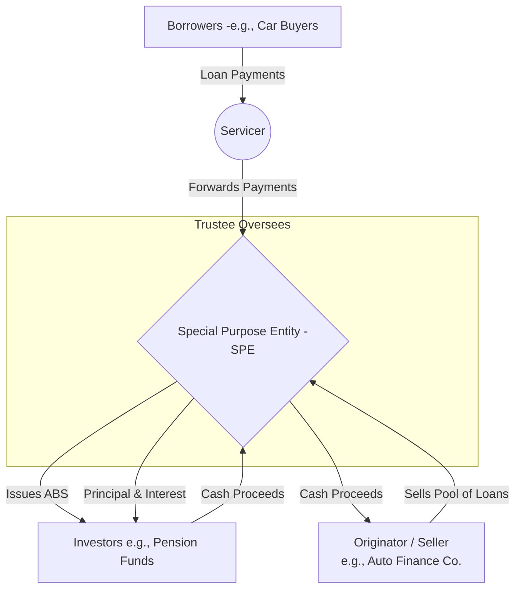

## Reading 63: Fixed-Income Securitization 🧱

🎯 **Introduction**

Imagine a bank like HDFC has made thousands of individual car loans. Each loan is a small, non-tradable asset. A giant investor, like a pension fund, can't be bothered to buy these tiny, individual loans one by one. **Securitization** is the process of financial alchemy that solves this. It's a process that takes a large number of illiquid assets (like car loans or mortgages), bundles them together into a diversified pool, and then issues new, tradable bonds backed by the cash flows from that pool. This reading explains this powerful process, the key players involved, and the benefits it brings to the entire financial system.

-----

### Part 1: Why Bother with Securitization? The Benefits 🏆

Securitization isn't just financial engineering for its own sake; it provides tangible benefits to everyone involved.

#### **Benefits for Issuers (The Original Lenders)**

  * **Recycle Capital & Increase Business** 🔄: An originator (like a bank) can sell a portfolio of existing loans to get cash back immediately. It can then use this fresh capital to make *new* loans, effectively recycling its capital and growing its business without needing to raise more deposits.
  * **Improve Profitability** 💰: The originator often earns fees for creating the loans in the first place and may also be paid a fee for continuing to manage the loan payments (acting as the **servicer**).
  * **Lower Capital Reserves for Banks** 🏦: By selling the loans, a bank removes the assets—and their associated credit risk—from its balance sheet. This means regulators require it to hold less protective capital, freeing up funds for more profitable activities.
  * **Improve Liquidity** 💧: Securitization transforms illiquid, individual loans into cash.

#### **Benefits for Investors**

  * **Tailored Risk and Return** 🎯: The new bonds, called **Asset-Backed Securities (ABS)**, can be sliced into different classes, or **tranches**, each with a different level of risk and return. This allows investors to choose the exact risk profile that suits their needs.
  * **Access to New Asset Classes** diversifying their portfolios.

#### **Benefits for the Economy**

  * **Lower Cost of Borrowing** 💸: By making credit markets more efficient, securitization can lower the interest rates for consumers on things like car loans and mortgages.
  * **Increased Liquidity** 🌊: It creates a liquid market for assets that were previously illiquid, improving the efficiency of the overall financial system.

-----

### Part 2: The Securitization Process: A Step-by-Step Guide ⚙️

The structure of a securitization involves several key parties and a specific flow of assets and cash.

**The Key Players and Their Roles:**

  * **Originator (or Seller):** The company that created the original loans (e.g., the bank that made the mortgages).
  * **Special Purpose Entity (SPE):** This is the heart of the securitization. The originator sells the pool of loans (the **collateral**) to the SPE, which is a separate legal entity created solely for this transaction. This legal separation is crucial.
  * **Bankruptcy Remoteness:** Because the SPE is a separate company, if the originator goes bankrupt, the collateral is safe and legally protected from the originator's creditors. This is the concept of being **bankruptcy remote**.
  * **Issuer:** The SPE is the entity that actually issues the new bonds (the **ABS**) to investors.
  * **Servicer:** This is the company responsible for collecting payments from the original borrowers, sending out statements, and handling delinquencies. Often, the originator continues to act as the servicer for a fee.
  * **Trustee:** A third-party institution (usually a bank) that is appointed to protect the interests of the ABS investors, ensuring the servicer acts appropriately and that cash flows are distributed correctly.

> [\!TIP]
> **CFA Exam Tip ✍️:** The role of the **Special Purpose Entity (SPE)** is a critical concept. You must understand that its legal separation from the originator is what makes the structure **bankruptcy remote**, which is a key benefit that allows the ABS to potentially have a higher credit rating than the originator itself.

-----

### 🧪 Formula Summary

This reading is conceptual and does not contain any formulas to memorize.

-----

> [\!IMPORTANT]
>
> ### 🎯 Quick Exam-Day Pointers
>
>   * **The Core Idea:** Securitization is the process of **pooling** illiquid financial assets and issuing new, tradable securities (**ABS**) backed by the cash flows from that pool.
>   * **The SPE is Everything:** The **Special Purpose Entity (SPE)** is a legally separate entity that buys the assets and issues the ABS.
>   * **Bankruptcy Remote:** This legal separation makes the assets safe from the originator's financial troubles, a concept known as being **bankruptcy remote**.
>   * **Key Benefit for Banks (Issuers):** It allows them to get risky loans off their balance sheet, freeing up capital to make new loans.
>   * **Key Benefit for Investors:** It gives them access to diversified pools of assets and allows them to choose a specific risk-return profile through **tranching**.