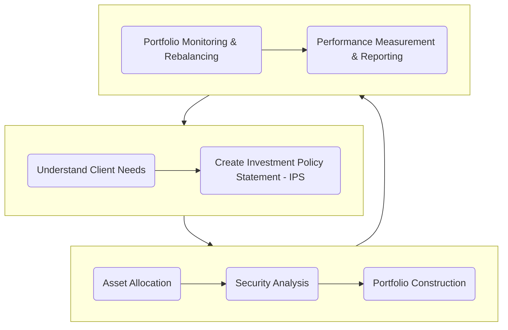

[cite\_start]Portfolio management is the process of creating and maintaining a collection of investments to meet an investor's specific financial goals[cite: 3086]. [cite\_start]It involves a structured, three-step process: planning (creating an Investment Policy Statement), executing (allocating assets and selecting securities), and providing feedback (monitoring and rebalancing the portfolio)[cite: 3212]. [cite\_start]This approach applies to both individual and institutional investors, each with unique needs, and is carried out by the diverse firms within the asset management industry[cite: 3273, 3366].

-----

## 📊 The Portfolio Approach to Investing

The core principle of portfolio management is **diversification**. [cite\_start]Instead of evaluating individual investments in isolation, the portfolio approach assesses each investment based on how it contributes to the overall risk and return of the entire portfolio[cite: 3099].

### Why Diversify?

  - [cite\_start]**Risk Reduction**: The primary benefit of diversification is reducing a portfolio's overall risk (volatility) without necessarily lowering its expected return[cite: 3135]. By combining assets that do not move perfectly together, the poor performance of some investments can be offset by the good performance of others. [cite\_start]This is why it's crucial to "not put all your eggs in one basket"[cite: 3125]. [cite\_start]The Enron case is a classic example where employees with undiversified retirement accounts, heavily invested in company stock, faced financial ruin when the company collapsed[cite: 3124].

  - **Avoiding Disaster**: Holding a single asset exposes an investor to the unique, or **nonsystematic**, risks of that specific company. [cite\_start]A diversified portfolio helps to mitigate these company-specific risks[cite: 3102].

  - [cite\_start]**Important Caveat**: While diversification generally reduces risk, it does not eliminate it, nor does it guarantee protection from losses, especially during severe market crises when correlations between asset classes can increase unexpectedly[cite: 3194].

### Modern Portfolio Theory (MPT)

[cite\_start]Developed by Harry Markowitz, MPT provides the theoretical foundation for diversification[cite: 3202]. [cite\_start]Its main conclusion is that investors should focus on how individual securities are related to one another when building a portfolio[cite: 3203]. [cite\_start]This theory leads to the insight that an asset's risk should be measured by its contribution to a well-diversified portfolio's total risk, which is the basis for the Capital Asset Pricing Model (CAPM)[cite: 3207, 3208].

-----

## 📝 The Portfolio Management Process

The management of a portfolio follows a continuous, three-step process.

### Step 1: The Planning Step

This initial step is foundational and involves two key activities:

1.  [cite\_start]**Understanding the Client's Needs**: A manager must first understand a client's specific objectives (return goals, risk tolerance) and constraints (time horizon, liquidity needs, taxes, etc.)[cite: 3213].
2.  [cite\_start]**Creating an Investment Policy Statement (IPS)**: The IPS is a written document that formalizes the client's objectives and constraints[cite: 3214]. [cite\_start]It serves as a guide for all future investment decisions and as a benchmark for evaluating performance[cite: 3215].

### Step 2: The Execution Step

In this step, the manager translates the IPS into a tangible portfolio.

1.  [cite\_start]**Asset Allocation**: This involves deciding how to distribute the portfolio's assets across broad categories like stocks, bonds, and alternatives[cite: 3223]. [cite\_start]This decision is widely viewed as having the greatest impact on long-term portfolio performance[cite: 3244]. [cite\_start]It can be driven by a **top-down analysis** (starting with macroeconomic forecasts) or a **bottom-up analysis** (starting with individual company fundamentals)[cite: 3230, 3233].
2.  [cite\_start]**Security Analysis**: Analysts research individual securities to identify attractive investment opportunities within each asset class[cite: 3236].
3.  [cite\_start]**Portfolio Construction**: The manager selects specific securities and combines them to build a diversified portfolio that aligns with the asset allocation strategy and the IPS[cite: 3239].

### Step 3: The Feedback Step

This is an ongoing loop to ensure the portfolio remains on track.

1.  [cite\_start]**Portfolio Monitoring and Rebalancing**: The manager regularly monitors the portfolio and rebalances it by selling assets that have become overweight and buying those that are underweight to bring the portfolio back to its target asset allocation[cite: 3258, 3259].
2.  [cite\_start]**Performance Measurement and Reporting**: The portfolio's performance is periodically evaluated against the benchmark specified in the IPS to determine if the client's objectives are being met[cite: 3261].

-----

## 👥 Types of Investors

Investors are broadly categorized as either individual or institutional, each with distinct characteristics.

| Investor Type | Key Characteristics | Time Horizon | Risk Tolerance | Liquidity Needs |
| :--- | :--- | :--- | :--- | :--- |
| **Individual Investors** | [cite\_start]Investing for personal goals (e.g., retirement, education)[cite: 3276]. [cite\_start]Many use **Defined Contribution (DC) plans**, where the *employee* bears the investment risk[cite: 3282]. | Varies | Varies | Varies |
| **Defined Benefit (DB) Plans** | [cite\_start]Company-sponsored pension plans where the *employer* guarantees a specific retirement benefit and bears the investment risk[cite: 3302, 3304]. | Long-term | High | Low (for growing plans) |
| **Endowments & Foundations** | [cite\_start]Funds for non-profits (e.g., universities) with a goal of preserving real capital value while funding operations[cite: 3319, 3324]. | Very long (often perpetual) | High | Low |
| **Banks** | [cite\_start]Invest excess reserves conservatively to earn a return while ensuring they can meet depositor withdrawal requests[cite: 3341]. | Short-term | Low | High |
| **Insurance Companies** | Invest premiums to cover future policy claims. [cite\_start]Life insurers have longer horizons than Property & Casualty (P\&C) insurers[cite: 3344, 3364]. | Varies | Low | High |
| **Sovereign Wealth Funds (SWFs)** | [cite\_start]State-owned investment funds with diverse goals, from budget stabilization to funding future development[cite: 3354]. | Varies | Varies | Varies |

-----

## 🏢 The Asset Management Industry & Pooled Investments

[cite\_start]The asset management industry serves as the link between investors and capital markets[cite: 3090]. [cite\_start]Firms are generally classified as either **buy-side** (asset managers) or **sell-side** (brokers/dealers)[cite: 3373, 3374]. They offer a range of investment products and strategies.

| Investment Product | Key Features | Structure | Trading |
| :--- | :--- | :--- | :--- |
| **Mutual Funds** | [cite\_start]A commingled pool of assets offering diversification and low minimums[cite: 3444, 3449]. | [cite\_start]**Open-End** (most common): Shares created/redeemed daily at NAV[cite: 3461]. [cite\_start]**Closed-End**: Fixed shares trade on an exchange[cite: 3471]. | Once per day at Net Asset Value (NAV) for open-end funds. |
| **Exchange-Traded Funds (ETFs)** | [cite\_start]Funds that trade on exchanges like individual stocks, mostly tracking an index[cite: 3533]. | [cite\_start]Generally open-end funds[cite: 3533]. | [cite\_start]Intraday on an exchange at the market price[cite: 3537]. |
| **Separately Managed Accounts (SMAs)** | [cite\_start]A private portfolio managed for a single individual or institution, allowing for high customization[cite: 3526]. | [cite\_start]Direct ownership of securities[cite: 3527]. | As per manager's decisions. |
| **Hedge Funds** | [cite\_start]Private, less-regulated pools that use leverage, derivatives, and short selling[cite: 3546]. [cite\_start]High minimums and restricted liquidity[cite: 3558]. | [cite\_start]Limited partnerships[cite: 3566]. | Varies; often illiquid. |
| **Private Equity / Venture Capital Funds** | [cite\_start]Funds that buy, optimize, and sell private companies over a long (7-10 year) lifespan[cite: 3559, 3561]. | [cite\_start]Limited partnerships[cite: 3566]. | Very illiquid; long-term lockups. |