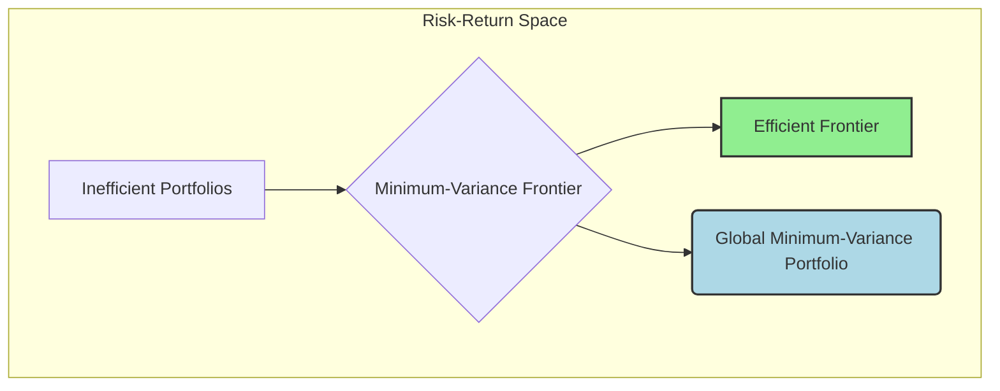

## Reading 83: Portfolio Risk and Return: Part I

### 🎯 Introduction

Welcome, future CFA charterholder\! Imagine you're a master chef crafting a world-class dish. 👨‍🍳 You don't just throw in the most expensive ingredients and hope for the best. Instead, you carefully select ingredients (assets) and combine them in precise proportions (weights) to achieve a perfect balance of flavor (return) and texture (risk).

This reading is your recipe book for portfolio construction. We'll learn why combining a spicy, high-growth stock with a steady, reliable bond can create a more satisfying meal than either ingredient alone. You'll master the art of **diversification** and discover how to build a portfolio that's truly "Michelin-star" worthy\!

-----

### Part 1: What Can History Teach Us About Risk and Return? 📜

Looking at historical data is like studying the great teams of the past. It shows us a fundamental principle of investing: the **risk-return trade-off**.

  * **No Free Lunch 🍔:** Asset classes with the highest average returns have also had the highest risk (standard deviation). For example, **small-cap stocks** have historically been the high-flyers, delivering big returns but with a lot of turbulence. On the other end, **Treasury bills** (T-bills) are super safe, offering low returns with minimal risk.
  * **Returns Aren't Perfectly Behaved 🎢:** In a perfect world, returns would follow a neat bell curve (**normal distribution**). But in reality, they often don't.
      * **Negative Skewness:** Financial markets tend to have more large, sudden drops than large, sudden gains.
      * **Excess Kurtosis (Fatter Tails):** Extreme events (both crashes and huge rallies) happen more often than a normal distribution would predict.
  * **Don't Forget Liquidity\! 💧:** **Liquidity** is how quickly you can sell an asset without a big price drop. It's a major consideration, especially for things like emerging market stocks or low-quality corporate bonds, which can be hard to sell in a pinch.

> [\!TIP]
> **CFA Exam Tip ✍️:** Remember the hierarchy of risk and return: Small-Cap Stocks \> Large-Cap Stocks \> Corporate Bonds \> Government Bonds \> Treasury Bills. This relationship is a cornerstone concept and frequently tested.

-----

### Part 2: What Kind of Investor Are You? 🤔

Your personal attitude towards risk is the starting point for building any portfolio. Finance assumes that most people are **risk-averse**.

A **risk-averse** investor dislikes uncertainty. If offered two investments with the same expected return, they will always choose the one with less risk. This doesn't mean they avoid risk altogether; it just means they need to be paid extra (a higher expected return) to take on more risk.

#### **Indifference Curves: Your Personal "Happy Map" 😊**

An **indifference curve** plots all the combinations of risk and return that give you the same level of satisfaction (or **utility**).

  * They slope upwards because you need more return to compensate for more risk.
  * The steeper your curves, the *more* risk-averse you are. You demand a huge jump in return for even a small step up in risk.
  * The flatter your curves, the *less* risk-averse you are.

#### **The Capital Allocation Line (CAL): Your Menu of Options 🍽️**

The **Capital Allocation Line (CAL)** shows all the possible portfolios you can create by combining a **risk-free asset** (like a US Treasury bond) with a portfolio of risky assets.

Your **optimal portfolio** is the one that lands you on your highest possible indifference curve while still being on the CAL. It's the point of tangency—the perfect blend of what's available (the CAL) and what you want (your indifference curve).

-----

### Part 3: The Secret Sauce of Portfolios: Correlation 🤝

The risk of a portfolio isn't just the average risk of the assets inside it. The magic ingredient is **correlation**, which measures how two assets move together.

  * **Correlation ($\rho$)** is a standardized measure that ranges from -1.0 to +1.0.
      * **+1.0 (Perfect Positive Correlation):** The assets move in perfect lockstep. When one goes up, the other goes up by a proportional amount. There is **NO diversification benefit**.
      * **-1.0 (Perfect Negative Correlation):** The assets are perfect opposites. When one zigs, the other zags. This provides the **MAXIMUM diversification benefit**. You could even build a zero-risk portfolio\!
      * **0 (Uncorrelated):** The movement of one asset tells you nothing about the movement of the other.

The key takeaway is that as long as the correlation between two assets is **less than +1.0**, combining them will reduce the portfolio's total risk. This is the essence of **diversification**.

#### **Theory 🧠**

The risk (standard deviation) of a two-asset portfolio is calculated with this crucial formula:

$$\sigma_{portfolio} = \sqrt{w_A^2\sigma_A^2 + w_B^2\sigma_B^2 + 2w_A w_B \rho_{AB} \sigma_A \sigma_B}$$

Notice that correlation ($\rho_{AB}$) term. The lower the correlation, the smaller the portfolio's standard deviation will be.

#### **Example 🧮**

Let's build a portfolio with two stocks:

  * **Global Tech (Stock A):** Expected Return = 15%, Standard Deviation ($\sigma_A$) = 25%
  * **India Staples (Stock B):** Expected Return = 8%, Standard Deviation ($\sigma_B$) = 15%

We'll invest 50% in each ($w_A = 0.5, w_B = 0.5$). Let's see how the portfolio's risk changes with different correlations.

  * **Case 1: Correlation ($\rho$) = +1.0 (No Diversification)**
    The risk is just a weighted average: $0.5(25\%) + 0.5(15\%) = \mathbf{20.0\%}$

  * **Case 2: Correlation ($\rho$) = +0.2 (Realistic Diversification)**
    Using the full formula:
    $\sigma_p = \sqrt{(0.5^2)(0.25^2) + (0.5^2)(0.15^2) + 2(0.5)(0.5)(0.2)(0.25)(0.15)}$
    $\sigma_p = \sqrt{0.015625 + 0.005625 + 0.00375} = \sqrt{0.025} = \mathbf{15.8\%}$
    Look at that\! The risk dropped from 20% to 15.8% just by combining assets that weren't perfectly correlated. That's the magic of diversification\!

-----

### Part 4: The Efficient Frontier: The Best Portfolios in the Universe ✨

If you plotted every possible portfolio you could create from a set of risky assets, you'd get a graph. The line that traces out the best possible portfolios is called the **efficient frontier**.

  * **Minimum-Variance Frontier:** For any given level of expected return, this is the portfolio with the *least* possible risk. It forms a hook shape.
  * **Efficient Frontier:** This is the top half of the minimum-variance frontier. Why only the top half? Because for any level of risk, these portfolios offer the *highest* possible expected return. No rational investor would choose a portfolio below this line.
  * **Global Minimum-Variance Portfolio:** This is the single point on the far left of the frontier. It's the portfolio with the lowest possible risk out of *all* possible combinations of risky assets.

-----

### 🧪 Formula Summary

  * **Sample Variance:**
    $$s^2 = \frac{\sum_{t=1}^{T}(R_t - \bar{R})^2}{T-1}$$
  * **Sample Covariance:**
    $$\text{Cov}_{1,2} = \frac{\sum_{t=1}^{n}\{[R_{t,1}-\bar{R}_{1}][R_{t,2}-\bar{R}_{2}]\}}{n-1}$$
  * **Correlation:**
    $$\rho_{1,2} = \frac{\text{Cov}_{1,2}}{\sigma_1 \sigma_2}$$
  * **Standard Deviation of a 2-Asset Portfolio:**
    $$\sigma_{portfolio} = \sqrt{w_1^2\sigma_1^2 + w_2^2\sigma_2^2 + 2w_1w_2\rho_{1,2}\sigma_1\sigma_2}$$

-----

> [\!IMPORTANT]
>
> ### 🎯 Quick Exam-Day Pointers
>
>   * **Diversification is your \#1 tool for risk reduction.** It works whenever the correlation between assets is less than +1.0. The lower the correlation, the better\!
>   * The **Efficient Frontier** is the "menu" of the best possible portfolios of risky assets. All rational investors will choose a portfolio that lies on this frontier.
>   * A **more risk-averse** investor has **steeper** indifference curves and will choose a portfolio on the lower-left part of the efficient frontier (lower risk, lower return).
>   * An investor's **optimal portfolio** is the one that combines the risk-free asset with the risky portfolio on the efficient frontier to create the CAL that is tangent to their highest indifference curve.