Of course\! Here is the detailed summary for **Reading 84: Portfolio Risk and Return: Part II**, following the "Global Gold Standard" template.

-----

## Reading 84: Portfolio Risk and Return: Part II

### 🎯 Introduction

Welcome back, future charterholder\! Think of building a powerful investment portfolio like assembling a championship football team. ⚽ You don't just pick 11 star strikers; that would be chaotic\! Instead, you need a balanced team: defenders, midfielders, and strikers.

In this reading, we'll learn how to create that perfect balance. We'll introduce a "super-safe" player—the **risk-free asset** (like a dependable goalkeeper who never makes a mistake)—and see how combining it with our team of "risky" players (stocks) creates a winning strategy. We'll discover the "fair price" for taking on risk using a famous formula called the **CAPM** and learn how to grade our portfolio's performance like a pro sports analyst. Let's get into the game\!

-----

### Part 1: Adding a "Super-Safe" Player to the Team 🥅

Imagine you have a portfolio of stocks, your "Risky Team." It has an expected return but also risk. Now, let's add a **risk-free asset**—think of a government bond like a US Treasury bill or an Indian G-Sec, where the return is practically guaranteed.

By combining these two, we create a new, straight line of investment possibilities. This is the **Capital Allocation Line (CAL)**. But when we combine the risk-free asset with the *best possible* risky portfolio (the one with the highest Sharpe ratio), this line gets a special name: the **Capital Market Line (CML)**.

Under the assumption that all investors have the same expectations (**homogeneous expectations**), everyone agrees on the same optimal risky portfolio, which is simply the **market portfolio** (e.g., an index like the S\&P 500 or Nifty 50).

  * **Lending Portfolios:** If you invest *less than 100%* in the market and put the rest in the risk-free asset, you are "lending" at the risk-free rate. Your portfolio lies on the CML between the risk-free asset and the market portfolio.
  * **Borrowing Portfolios:** Feeling bold? You can *borrow* money at the risk-free rate and invest *more than 100%* of your own capital into the market portfolio. Your portfolio lies on the CML to the right of the market portfolio, offering higher expected returns for higher risk.

> [\!TIP]
> **CFA Exam Tip ✍️:** The CML is a straight line showing the risk-return trade-off for **efficient portfolios only**. The risk measure on the x-axis is **total risk** (standard deviation, σ). Individual stocks or poorly diversified portfolios will always lie *below* the CML.

-----

### Part 2: The Two Flavors of Risk: What We Can Ditch vs. What We're Stuck With ⚖️

The total risk of a stock can be split into two distinct types. Understanding this difference is one of the most important concepts in modern finance\!

```mermaid
graph TD
    A["Total Risk (Standard Deviation)"] --> B[Systematic Risk];
    A --> C[Unsystematic Risk];
    subgraph "Market-Wide Risk 🌍"
        B["Systematic Risk<br>Cannot be diversified away<br>e.g., Recessions, Interest Rate Changes"]
    end
    subgraph "Company-Specific Risk 🏭"
        C["Unsystematic Risk<br>Can be eliminated via diversification<br>e.g., CEO resigns, Factory fire, Drug trial fails"]
    end
    style B fill:#ffcccc,stroke:#333,stroke-width:2px
    style C fill:#cce5ff,stroke:#333,stroke-width:2px
```

  * **Systematic Risk:** This is the **market risk** you can't escape, no matter how many stocks you own. It's driven by broad economic factors. Because it's unavoidable, the market *rewards you* with higher expected returns for taking it on. It's also called **nondiversifiable risk**.
  * **Unsystematic Risk:** This is the **company-specific risk** you *can* eliminate for free just by holding a diversified portfolio (usually around 20-30 stocks is enough). Since you can easily get rid of it, the market **does not reward you** for taking it on. It's also called **diversifiable** or **unique risk**.

The crucial takeaway: An investor should not expect to receive additional return for bearing unsystematic risk because it can be eliminated through diversification at virtually no cost.

-----

### Part 3: Meet Beta (β) and the CAPM 👑

If only systematic risk gets rewarded, we need a way to measure it. That's where **beta (β)** comes in.

**Beta** measures how sensitive a stock's return is to the overall market's return. It is the standardized measure of systematic risk.

  * **β = 1:** The stock moves in sync with the market. If the S\&P 500 rises 10%, the stock tends to rise 10%.
  * **β \> 1:** The stock is more volatile than the market. A 10% market rise might lead to a 15% rise in the stock. Think of cyclical companies like luxury automakers (Ferrari) or tech companies (NVIDIA).
  * **β \< 1:** The stock is less volatile than the market. A 10% market rise might only lead to a 5% rise in the stock. Think of defensive companies like utilities or consumer staples (Hindustan Unilever).

#### **The Security Market Line (SML) & CAPM**

The **Security Market Line (SML)** is the graphical representation of the **Capital Asset Pricing Model (CAPM)**. It shows the required rate of return an investor should expect for any level of systematic risk (beta). Unlike the CML, the SML applies to *all* individual securities and portfolios, whether they are diversified or not.

**The CAPM Formula:**
$$E(R_i) = R_f + \beta_i [E(R_m) - R_f]$$
Where:

* E(Ri) = Expected (or required) return on asset i
* Rf = Risk-free rate
* βi = Beta of asset i
* [E(Rm) - Rf] = Market Risk Premium

#### **Theory 🧠**

The SML is the "fair price" line for risk. Any asset's expected return should fall on this line.

  * **Above the SML:** The asset is **undervalued**. It's expected to deliver a higher return than required for its risk. It's a "buy"\! 🟢
  * **Below the SML:** The asset is **overvalued**. It's expected to deliver a lower return than required for its risk. It's a "sell"\! 🔴
  * **On the SML:** The asset is **fairly valued**.

#### **Example 🧮**

Let's say the risk-free rate (Rf) is 4% and the expected market return E(Rm) is 10%. We are looking at a stock, "Zenith Corp," with a beta (β) of 1.2.

**1. What is the required return for Zenith Corp?**
$$E(R) = 4\% + 1.2(10\% - 4\%) = 4\% + 1.2(6\%) = 4\% + 7.2\% = 11.2\%$$
The SML tells us that for a stock with a beta of 1.2, a return of 11.2% is fair compensation.

**2. An analyst forecasts Zenith Corp will return 13%. Is it a good investment?**
Yes\! The forecasted return (13%) is *higher* than the required return (11.2%). The stock plots *above* the SML, meaning it is **undervalued**.

-----

### Part 4: Grading Your Portfolio Performance 🏆

How do you know if a portfolio manager did a good job? You need to measure their **risk-adjusted performance**. Here are four key tools.

| Ratio | Formula | Risk Measure | Best For |
|-------|----------|--------------|-----------|
| Sharpe Ratio | $$(R_p - R_f)/\sigma_p$$ | Total Risk (σ) | Evaluating a portfolio that represents the investor's entire holding (i.e., it's not well-diversified) |
| M-squared (M²) | Measures what the portfolio *would have earned* if it had the same total risk as the market | Total Risk (σ) | Comparing portfolios to the market. More intuitive than Sharpe ratio as it's stated in percentages |
| Treynor Ratio | $$(R_p - R_f)/\beta_p$$ | Systematic Risk (β) | Evaluating a well-diversified fund that is part of a larger, diversified portfolio |
| Jensen's Alpha (α) | $$R_p - [R_f + \beta_p(R_m - R_f)]$$ | Systematic Risk (β) | Measuring the manager's value-add. A positive alpha means the manager beat the return predicted by the CAPM |

> [\!TIP]
> **CFA Exam Tip ✍️:** Use this simple mnemonic to remember which risk measure to use:
>
>   * **S**harpe uses **S**tandard Deviation.
>   * **T**reynor uses the be**t**a.

-----

### 🧪 Formula Summary

* Capital Asset Pricing Model (CAPM): $$E(R_i) = R_f + \beta_i[E(R_m) - R_f]$$

* Beta (β): $$\beta_i = \frac{Cov_{im}}{\sigma_m^2} = \rho_{im}(\frac{\sigma_i}{\sigma_m})$$

* Sharpe Ratio: $$Sharpe = \frac{R_p - R_f}{\sigma_p}$$

* Treynor Measure: $$Treynor = \frac{R_p - R_f}{\beta_p}$$

* Jensen's Alpha (α): $$\alpha_p = R_p - [R_f + \beta_p(R_m - R_f)]$$

* M-squared (M²): $$M^2 = R_f + \frac{\sigma_M}{\sigma_p}(R_p - R_f)$$

-----

> [\!IMPORTANT]
>
> ### 🎯 Quick Exam-Day Pointers
>
>   * **CML vs. SML is a critical distinction\!** CML uses **total risk (σ)** and applies only to **efficient** portfolios. SML uses **systematic risk (β)** and applies to **all** individual assets and portfolios.
>   * The market only rewards **systematic (nondiversifiable) risk**. You get no extra expected return for taking on unsystematic risk.
>   * A stock plotting **ABOVE** the SML is **UNDERVALUED** (a good deal). A stock plotting **BELOW** the SML is **OVERVALUED** (a bad deal).
>   * When to use which performance measure? If the portfolio is not well-diversified, use **Sharpe/M²**. If it is well-diversified and part of a larger portfolio, use **Treynor/Jensen's Alpha**.