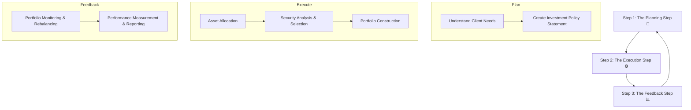

Of course\! Here is the detailed summary for **Reading 85: Portfolio Management: An Overview**, created using the "Global Gold Standard" template.

-----

## Reading 85: Portfolio Management: An Overview

### 🎯 Introduction

Welcome, future charterholder\! Think of a portfolio manager as a top-tier personal trainer for your money. 💪 A great trainer doesn't just hand you a generic workout plan. First, they sit down with you to understand your fitness goals, your current condition, and any limitations you might have (the **Planning Step**). Then, they design a customized exercise and nutrition program just for you (the **Execution Step**). Finally, they constantly monitor your progress, celebrate your wins, and adjust the plan as you get stronger (the **Feedback Step**).

This reading introduces you to this exact three-step process. It's the fundamental framework that governs how professionals manage wealth, ensuring every decision is tailored, strategic, and constantly reviewed. Let's start the workout\!

-----

### Part 1: Why a "Portfolio" is Your Best Friend 🤝

Why not just buy one stock you think is a winner and put all your money in it? The **portfolio perspective** explains why this is a bad idea. It's about evaluating individual investments based on how they contribute to the overall risk and return of your entire portfolio, not in isolation.

The magic word here is **diversification**. By combining different assets (like stocks and bonds from different countries and industries), you can reduce your portfolio's overall risk without necessarily sacrificing expected return.

A handy metric for this is the **diversification ratio**, calculated as the ratio of the risk of an equally weighted portfolio of *n* securities to the risk of a single security selected at random from the *n* securities. A lower ratio means greater risk reduction from diversification.

-----

### Part 2: The Three Steps to Successful Portfolio Management 🔄

The portfolio management process is a continuous cycle with three key steps.

1.  **The Planning Step:** This is the foundation. You work with a client to understand their return objectives, risk tolerance, and any constraints (like liquidity needs or tax situations). All of this is documented in a crucial document called the **Investment Policy Statement (IPS)**. The IPS is the roadmap for the entire journey.
2.  **The Execution Step:** This is where you put the plan into action.
      * **Asset Allocation:** You decide how to split the portfolio among different asset classes (e.g., 60% stocks, 30% bonds, 10% real estate).
      * **Security Selection:** Within each asset class, you choose specific securities that look attractive.
      * **Portfolio Construction:** You build the portfolio that combines your asset allocation and security selection decisions.
3.  **The Feedback Step:** This is the ongoing loop. You monitor the portfolio, **rebalance** it when needed to stick to the plan, and measure its performance against the benchmark defined in the IPS. As the client's life or the market changes, you use this feedback to update the IPS, and the cycle begins again.

-----

### Part 3: Who Are the Players? A Look at Different Investors 🧐

Not all investors are the same. Their goals and constraints determine their investment strategy.

| Investor Type | Risk Tolerance | Investment Horizon | Liquidity Needs | Income Needs | Real-World Example 🌍 |
| :--- | :--- | :--- | :--- | :--- | :--- |
| **Individuals** | Varies | Varies | Varies | Varies | You saving for retirement\! |
| **Banks** | Low | Short | High | Pay interest | HDFC Bank (India), JPMorgan Chase (US) |
| **Endowments** | High | Long | Low | Spending level | Harvard University's endowment |
| **Insurance Co.** | Low | Long | High | Low | Life Insurance Corporation (LIC) of India |
| **Mutual Funds** | Varies | Varies | High | Varies | Vanguard, Franklin Templeton |
| **Pension Plans** | High | Long | Low | Varies | A large corporate pension fund |

#### **A Special Focus: Pension Plans  пенсионный**

#### **Defined Contribution (DC) Plan**

This is the most common type today (like a 401(k) in the US).

  * **Who takes the risk?** The **employee**\! 🙋
  * **How it works:** The employer contributes a certain amount to the employee's retirement account each period. The employee chooses how to invest it and bears all the investment risk. The final retirement amount depends entirely on how the investments perform.
  * **Bottom Line:** The *contribution* is defined, but the final *benefit* is not.

#### **Defined Benefit (DB) Plan**

This is a traditional pension plan.

  * **Who takes the risk?** The **employer**\! 🏢
  * **How it works:** The employer promises to pay the employee a specific, predetermined amount after retirement (e.g., 2% of their final salary for each year of service). The company is responsible for investing the plan's assets to ensure it can meet these future promises.
  * **Bottom Line:** The final *benefit* is defined, and the employer must make the necessary *contributions* to fund it.

-----

### Part 4: A Guide to Investment Products 🛍️

Investors often use **pooled investments** to access professional management and diversification. Here are the most common types:

#### **Mutual Funds**

These are pools of investor money managed by a professional firm.

  * **Open-End Funds:** The most common type. Investors buy shares from and sell shares back to the fund at the **Net Asset Value (NAV)** at the end of each trading day. The number of shares changes daily.
  * **Closed-End Funds:** The fund issues a fixed number of shares in an IPO, which then trade on an exchange like a stock. Their price can be different from their NAV (trading at a premium or discount).

#### **Exchange-Traded Funds (ETFs)**

ETFs are like a hybrid of mutual funds and stocks.

  * They hold a basket of securities, often tracking an index (like the Nifty 50 or S\&P 500).
  * Unlike mutual funds, you can buy and sell them **throughout the day** on a stock exchange at the market price.
  * They typically have lower management fees and are more tax-efficient than traditional mutual funds.

#### **Other Key Vehicles**

  * **Separately Managed Accounts (SMAs):** A portfolio owned by a single investor and managed specifically for their needs. Requires a large amount of capital.
  * **Hedge Funds:** Lightly regulated private pools of capital for wealthy, accredited investors. They use complex strategies and often have high fees.
  * **Private Equity / Venture Capital:** Funds that invest in private companies, aiming to improve them and eventually sell them for a profit through an IPO or sale.

> [\!TIP]
> **CFA Exam Tip ✍️:** Know the key differences between Open-End Mutual Funds and ETFs. The big ones are **intraday trading** (ETFs only), **how shares are created/redeemed**, and typically **lower fees/better tax efficiency** for ETFs.

-----

### 🧪 Formula Summary

* Diversification Ratio: $$DR = \frac{\sigma_p}{\sigma_a}$$

*(Note: This reading is primarily conceptual; the diversification ratio is the main quantitative concept introduced.)*

-----

> [\!IMPORTANT]
>
> ### 🎯 Quick Exam-Day Pointers
>
>   * The **Portfolio Management Process** is a three-step cycle: **Plan, Execute, Feedback**. The **IPS** is the key document created in the planning step.
>   * Know the difference between pension plans cold: In a **Defined Contribution (DC)** plan, the **employee** takes the risk. In a **Defined Benefit (DB)** plan, the **employer** takes the risk.
>   * For investor types, remember the relationship between **time horizon** and **risk tolerance/liquidity needs**. Long horizons (endowments, DB plans) usually mean high risk tolerance and low liquidity needs. Short horizons (banks) mean the opposite.
>   * **ETFs vs. Mutual Funds:** The key difference is that ETFs trade on an exchange throughout the day like stocks, while mutual funds are priced only once a day at NAV.
>   * **Lower Diversification Ratio is Better:** A lower diversification ratio indicates greater risk reduction through diversification, making your portfolio safer compared to holding a single security.