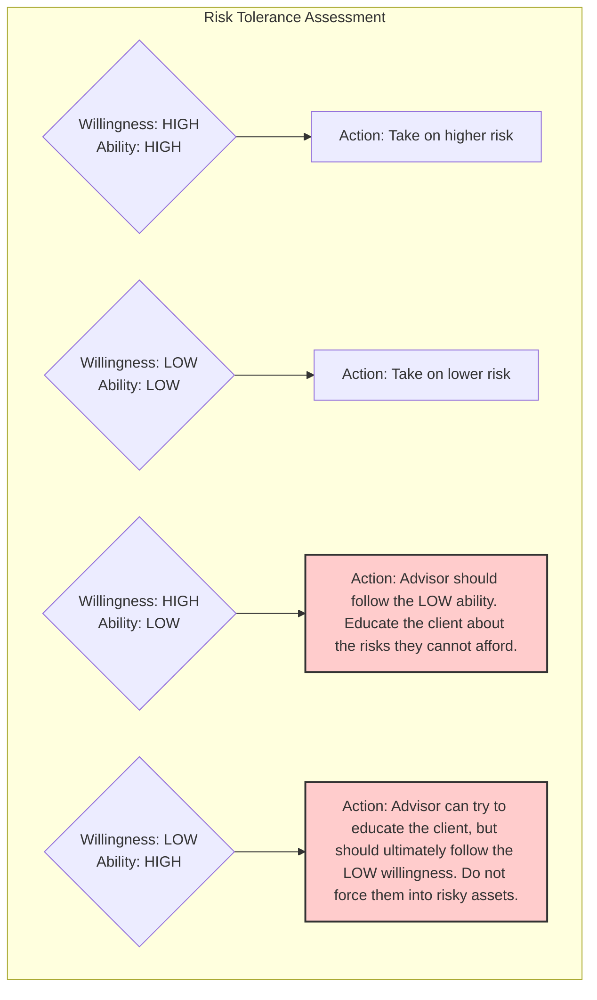

## Reading 86: Basics of Portfolio Planning and Construction

### 🎯 Introduction

Welcome, future charterholder\! Imagine you're about to build your dream house. 🏡 You wouldn't just start digging and laying bricks, would you? Of course not\! You'd start with a detailed blueprint. That blueprint is your master plan, guiding every decision to ensure the final house is safe, functional, and exactly what you dreamed of.

In portfolio management, that blueprint is called the **Investment Policy Statement (IPS)**. It's the single most important document in the entire process. This reading teaches you how to draft that blueprint—defining your client's goals, understanding their limits, and creating a solid foundation for investment success. Let's start building\!

-----

### Part 1: The Blueprint for Success: The Investment Policy Statement (IPS) 📜

An **Investment Policy Statement (IPS)** is a written document that sets out a client's return objectives, risk tolerance, and constraints. It's the roadmap that guides all future investment decisions.

**Why is a written IPS so important?**

  * **It's a Discipline Tool:** It keeps both the client and the manager focused on the long-term plan, preventing emotional decisions during market panic or euphoria. 🧘‍♂️
  * **It's a Communication Tool:** It ensures a mutual understanding of goals and expectations, reducing the chance of misunderstandings later.
  * **It's a Legal Document:** It provides a record of the strategic plan, which can be crucial for accountability and review.

A typical IPS will include:

  * Client description and objectives.
  * Purpose of the IPS.
  * Duties and responsibilities of all parties (manager, client, custodian).
  * Procedures for updating the plan.
  * Investment objectives (risk and return).
  * Investment constraints.
  * The strategic asset allocation plan.
  * The benchmark for performance evaluation.

-----

### Part 2: Defining the Goals: Risk and Return Objectives ⚖️

The heart of the IPS is defining what the client wants to achieve (return) and how much uncertainty they can handle (risk).

#### **Return Objectives**

  * **Absolute Return Objective:** A specific target return, like "achieve an average annual return of 8%."
  * **Relative Return Objective:** A target return relative to a benchmark, like "outperform the Nifty 50 index by 2% annually."

#### **Risk Objectives**

  * **Absolute Risk Objective:** A specific limit on risk, like "never lose more than 10% of the portfolio's value in a calendar year."
  * **Relative Risk Objective:** Risk defined relative to a benchmark, like "the portfolio's standard deviation should be no more than 120% of the benchmark's standard deviation."

#### **Ability vs. Willingness to Take Risk**

This is a critical concept. An investor's overall risk tolerance is a blend of two different things:

  * **Ability to take risk:** This is a *financial* question. How much risk can the client *afford* to take? It depends on their wealth, income, time horizon, and insurance coverage. A young person with a stable, high-paying job has a high ability. A retiree living on a fixed income has a low ability.
  * **Willingness to take risk:** This is a *psychological* question. How much risk is the client *comfortable* with? This is about their personality, beliefs, and past experiences.

<!-- end list -->

> [\!TIP]
> **CFA Exam Tip ✍️:** When there is a conflict between ability and willingness, the advisor should always be guided by the **more conservative** of the two. You can educate a client with high ability but low willingness, but you must not push a client with low ability into high-risk investments, even if they are willing.

-----

### Part 3: Setting the Boundaries: Investment Constraints 🚧

Constraints are the rules of the road that limit the manager's choices. The five major types are:

1.  **Liquidity:** Does the client need access to cash soon? A high liquidity need (e.g., for a down payment on a house in one year) means investing in safe, easily-sold assets.
2.  **Time Horizon:** How long is the investment period? A longer time horizon (e.g., a 25-year-old saving for retirement) allows for more risk-taking. A shorter horizon requires more conservative investments.
3.  **Taxes:** How are investments taxed? This can heavily influence strategy. For example, an investor in a high tax bracket might prefer municipal bonds (which are often tax-free in the US) or growth stocks that generate tax-deferred capital gains over high-dividend stocks.
4.  **Legal and Regulatory:** Are there any specific laws or rules that apply? This is common for trusts or corporate retirement plans which must follow specific regulations (like ERISA in the US).
5.  **Unique Circumstances:** This is a catch-all for everything else. It could be a client's wish to avoid investing in certain industries (e.g., tobacco), a desire to hold a large block of their company's stock, or any other personal preference.

-----

### Part 4: Building the Portfolio: Asset Allocation 🏗️

Once the objectives and constraints are set, it's time to build.

#### **Specifying Asset Classes**

The goal is to choose asset classes that are:

  * **Homogeneous within:** Assets within a class should behave similarly (e.g., all large-cap tech stocks).
  * **Heterogeneous between:** Asset classes should have low correlation with each other to provide good diversification benefits (e.g., Indian stocks vs. US government bonds).

#### **Strategic vs. Tactical Allocation**

  * **Strategic Asset Allocation (SAA):** This is the long-term, baseline target mix of asset classes specified in the IPS (e.g., 60% equities, 40% bonds). It's the core of the portfolio's strategy.
  * **Tactical Asset Allocation (TAA):** This involves making short-term, deliberate deviations from the SAA to capitalize on temporary market opportunities. For example, if you think stocks will outperform bonds over the next six months, you might temporarily shift your allocation to 65% stocks and 35% bonds.
  * **Security Selection:** This is the process of choosing the individual securities *within* each asset class (e.g., picking Reliance and Infosys for your Indian equity allocation).
  * **Risk Budgeting:** This practice involves setting an overall risk limit for the portfolio and then allocating that risk across the strategic, tactical, and security selection decisions.

-----

### Part 5: Investing with a Conscience: ESG Factors 🌱

**Environmental, Social, and Governance (ESG)** considerations can be integrated into the portfolio construction process. This means evaluating companies based on factors like their carbon footprint (E), labor practices (S), and board independence (G).

Common ESG approaches include:

  * **Negative Screening:** Excluding companies or entire industries (e.g., tobacco, weapons) that don't meet your ethical standards.
  * **Positive Screening / Best-in-Class:** Actively selecting companies that are leaders in their industry on ESG metrics.
  * **Impact Investing:** Investing with the specific goal of creating a positive social or environmental impact alongside a financial return.

-----

### 🧪 Formula Summary

This reading is conceptual, focusing on the framework of portfolio planning. There are no mathematical formulas to memorize from this section.

-----

> [\!IMPORTANT]
>
> ### 🎯 Quick Exam-Day Pointers
>
>   * The **Investment Policy Statement (IPS)** is the foundational document of portfolio management. Know its purpose and major components.
>   * Always distinguish between an investor's **ability** to take risk (financial) and their **willingness** to take risk (psychological). The more conservative of the two dictates the strategy.
>   * Memorize the five main constraints: **Liquidity, Time Horizon, Taxes, Legal/Regulatory, and Unique Circumstances**.
>   * Know the difference between **Strategic Asset Allocation** (the long-term plan in the IPS) and **Tactical Asset Allocation** (short-term deviations from the plan).