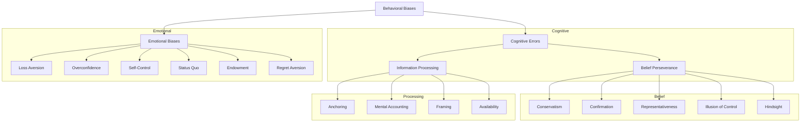

## Reading 87: The Behavioral Biases of Individuals

### 🎯 Introduction

Welcome, future charterholder\! Think of your brain as a super-powerful computer. 🧠 For most tasks, it runs flawlessly, making logical, rational decisions. But when it comes to money—a topic loaded with emotion and uncertainty—this computer can sometimes run into "software bugs." These bugs are **behavioral biases**, predictable mental shortcuts and emotional reactions that can cause even the smartest people to make irrational financial decisions.

Traditional finance assumes we're all perfectly rational robots. **Behavioral finance** acknowledges that we're human. This reading is like running a diagnostic on your own mental software. By understanding these common "bugs," you can learn to debug your decision-making process and protect your portfolio from your own worst enemy: yourself\!

-----

### Part 1: The Two Types of "Bugs": Thinking Errors vs. Feeling Errors 🤔

All behavioral biases can be sorted into two main categories. Understanding the difference is crucial because it tells us how to deal with them.

#### **Cognitive Errors 🧠**

These are errors in **thinking** or reasoning. Your mental software is trying to process information, but it's using faulty logic or incomplete data.

  * **Cause:** Faulty reasoning, memory errors, statistical mistakes.
  * **Analogy:** A calculator with a sticky "7" key. It's trying to do the math right, but the hardware is flawed.
  * **How to Fix:** These can often be corrected with **education, better information, and logical advice**. You can show someone the math, and they might change their mind.

#### **Emotional Biases ❤️**

These are errors driven by **feelings**, impulses, and intuition rather than conscious thought.

  * **Cause:** Feelings like fear, pride, regret, or the desire for security.
  * **Analogy:** A perfectly good calculator that someone refuses to use because they have a "gut feeling" about the answer.
  * **How to Fix:** These are much harder to correct with logic. The best approach is often to **accommodate** the bias by building a framework (like a strict IPS) that minimizes its impact.

-----

### Part 2: A Deep Dive into Our Mental Glitches 🐛

Let's break down the most common biases you'll encounter.

#### **Cognitive Errors: Belief Perseverance (Being Stubborn)**

These biases cause us to cling to our prior beliefs, even when new information says we shouldn't.

  * **Conservatism Bias:** You react too slowly to new information. You stick to your original forecast even when the facts are changing.
  * **Confirmation Bias:** You actively seek out information that confirms your existing beliefs and ignore anything that contradicts them. (e.g., After buying Tesla stock, you only read positive news about the company).
  * **Representativeness Bias:** You make decisions based on stereotypes or simple "rules of thumb." For example, assuming a company is a great investment just because it's in a "hot" industry like AI, without looking at its financials (**base-rate neglect**).
  * **Illusion of Control Bias:** You believe you can control outcomes that are actually random. (e.g., Thinking you have a "lucky" trading account).
  * **Hindsight Bias:** You see past events as having been predictable. (e.g., "I knew the market was going to crash in 2020\!").

#### **Cognitive Errors: Information Processing (Faulty Calculations)**

These biases cause us to misuse or misinterpret information.

  * **Anchoring and Adjustment Bias:** You get "anchored" to an initial piece of information (like a stock's purchase price) and fail to adjust your thinking enough when new information comes along.
  * **Mental Accounting Bias:** You treat different sums of money differently. (e.g., You might gamble with a bonus from work but be very conservative with your regular savings, even though all money is fungible).
  * **Framing Bias:** How information is presented (or "framed") affects your decision. People tend to be risk-averse when a choice is framed as a gain, but risk-seeking when it's framed as a loss.
  * **Availability Bias:** You overestimate the probability of things that are easy to remember or have happened recently. (e.g., After a big news story about a plane crash, people become overly afraid of flying, even though it's statistically very safe).

#### **Emotional Biases (Letting Your Heart Rule Your Head)**

  * **Loss-Aversion Bias:** The pain of a loss feels much stronger than the pleasure of an equal-sized gain. This is why people often hold on to losing stocks for too long—they don't want to "realize" the painful loss.
  * **Overconfidence Bias:** You overestimate your own abilities and the accuracy of your forecasts. This can lead to trading too much and taking on too much risk.
  * **Self-Control Bias:** You prioritize short-term gratification over long-term goals. (e.g., Spending money today instead of saving enough for retirement).
  * **Status Quo Bias:** You prefer to keep things the way they are, even when a change would be beneficial. It's the path of least resistance.
  * **Endowment Bias:** You value something you own more highly than you would if you didn't own it. (e.g., Refusing to sell inherited shares of a family company, even if they're a bad investment for you).
  * **Regret-Aversion Bias:** You're afraid of making a decision that will turn out badly. This can lead to being too conservative or engaging in **herding** (following the crowd) because there's safety in numbers.

> [\!TIP]
> **CFA Exam Tip ✍️:** Pay close attention to the difference between similar biases. **Status Quo** is doing nothing out of inertia. **Regret Aversion** is doing nothing out of fear of making the *wrong* choice. **Conservatism** is clinging to a forecast, while **Anchoring** is clinging to a specific number or price level.

-----

### Part 3: How Biases Create Market Mayhem 🌪️

While behavioral finance can't predict market crashes, it can help explain the investor psychology behind them.

  * **Market Bubbles:** A bubble can be fueled by a potent cocktail of biases. **Overconfidence** and **hindsight bias** make investors believe they can't lose. **Confirmation bias** leads them to ignore warning signs. **Regret aversion** (in the form of FOMO - Fear Of Missing Out) and **herding** pull even skeptical investors in.
  * **Value vs. Growth Anomaly:** Historically, value stocks have often outperformed growth stocks. Behavioral finance suggests this could be because investors get overly excited about glamorous growth stories (**representativeness bias**) and extrapolate recent high growth too far into the future, making those stocks overpriced.

-----

### 🧪 Formula Summary

This reading is purely conceptual and does not contain any mathematical formulas to memorize. It's all about understanding human psychology\!

-----

> [\!IMPORTANT]
>
> ### 🎯 Quick Exam-Day Pointers
>
>   * The most important distinction is **Cognitive vs. Emotional**. Cognitive errors can be fixed with education and better analysis. Emotional biases are harder to fix and usually need to be managed and accommodated within a disciplined plan.
>   * **Loss Aversion** is a powerful emotional bias. Remember: people hate losses about 2.5 times more than they enjoy equivalent gains. This explains why investors hold losers and sell winners too early.
>   * **Overconfidence** is a killer. It leads to excessive trading, poor diversification, and underestimation of risk.
>   * The best defense against all biases is a **disciplined investment process**. Having a well-thought-out Investment Policy Statement (IPS) is your best shield against making emotional, irrational decisions in the heat of the moment.