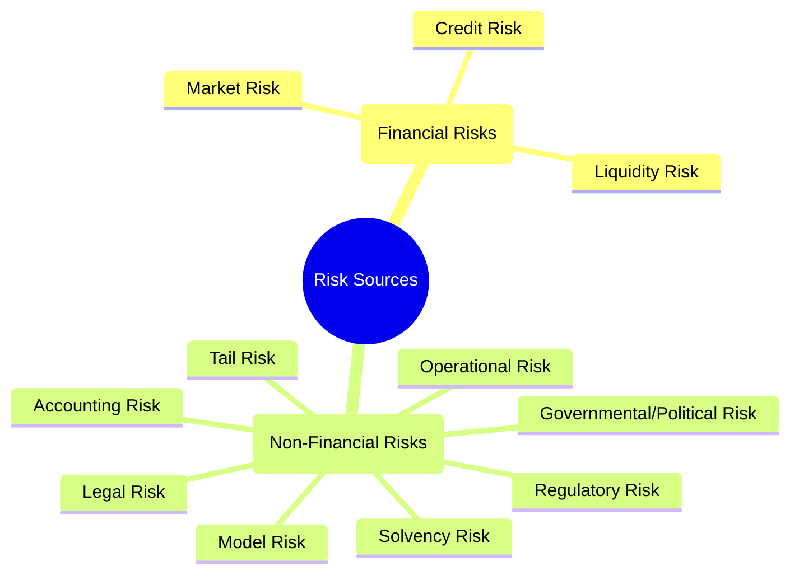
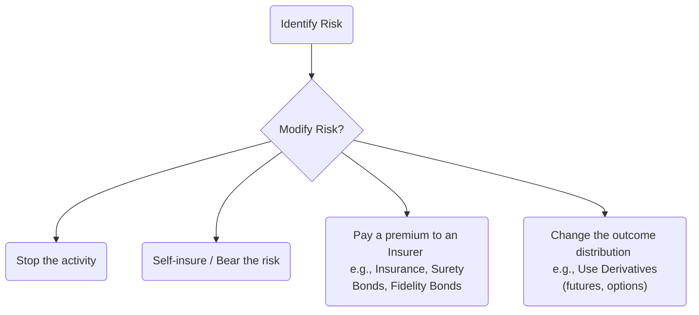

## Reading 88: Introduction to Risk Management 🛡️

### 🎯 Introduction

Welcome, Samurai\! We've spent a lot of time learning how to generate returns. Now, we must learn the other half of the battle: **managing risk**.

Think of risk not as an enemy to be slain, but as a powerful, wild river. You can't stop the river, but you can build dams, divert channels, or even use its power to turn a turbine. Risk management is the art and science of understanding this river, deciding how much of its power you want to engage with, and building the right tools to protect yourself while harnessing its energy.

This reading is the **foundation** for understanding how firms and individuals approach risk. It's not just theory; it's the practical framework that keeps portfolios and companies from collapsing. Let's forge this essential tool\!

-----

### Part 1: The Philosophy and Framework of Risk (LOS 88.a, b, c, d)

Before we can manage risk, we have to define what we're even doing. This section covers the "why" and "what" of risk management.

#### 1.1 What is Risk Management? (LOS 88.a)

First, let's clear up a common misconception.

> **The goal of risk management is NOT to minimize or eliminate all risk**.

Why? Because risk is what generates returns\!  If you eliminate all risk, you're stuck with the risk-free rate.

Instead, risk management is a three-step process:

1.  **Identify the organization's risk tolerance** (How much pain can we *really* handle?).
2.  **Identify and measure the risks** the organization faces (What monsters are in the woods?).
3.  **Modify and monitor these risks** (Decide which monsters to fight, which to avoid, and which to tame).

The ultimate goal is to **align the risks you take with your tolerance for those risks**. You're deciding which risks to take on because you believe you'll be rewarded for them.

#### 1.2 The Risk Management Framework (LOS 88.b)

The "framework" is the scaffolding that holds the whole process together. It’s the set of policies and procedures that ensures risk is managed in a structured way.

An effective framework includes:

  * **Risk Governance:** The top-level policies and oversight.
  * **Risk Tolerance:** Determining the organization's overall appetite.
  * **Risk Identification & Measurement:** Finding and quantifying the risks.
  * **Risk Management & Mitigation:** Deciding what to do about the risks (the "optimal bundle").
  * **Risk Monitoring:** Watching risk exposures over time.
  * **Communication:** Reporting on risk across the organization.
  * **Strategic Risk Analysis:** Aligning risk with the firm's long-term strategy.

**🧠 Samurai Mnemonic: "Good Teams Identify, Manage, Monitor, & Communicate Strategy"**

  * **G**ood = **G**overnance
  * **T**eams = **T**olerance
  * **I**dentify = **I**dentify & Measure
  * **M**anage = **M**anage & Mitigate
  * **M**onitor = **M**onitor
  * **C**ommunicate = **C**ommunicate
  * **S**trategy = **S**trategic Analysis

#### 1.3 Risk Governance vs. Risk Tolerance (LOS 88.c, 88.d)

This is a crucial distinction:

  * **Risk Governance:** This is senior management's job. It's the "tone at the top." It involves setting the *entire strategy* for risk, determining the framework, and providing oversight. Effective governance is **centralized and enterprise-wide**, not stuck in different silos.
  * **Risk Tolerance:** This is the *output* of risk governance. It's the **specific overall amount of risk the organization is willing to take** to pursue its goals. It's the line in the sand. Risk tolerance dictates *all* subsequent risk management decisions.

-----

### Part 2: The "How" - Tools and Techniques (LOS 88.e, f, g)

Now that we have our philosophy, let's look at the tools.

#### 2.1 Risk Budgeting (LOS 88.e)

If **risk tolerance** is your total *amount* of risk, **risk budgeting** is *how you spend it*.

Think of it like a financial budget. You have $1,000 (your tolerance) to "spend" on various "risk units" (like beta, duration, or VaR) to "buy" expected returns. The goal is to allocate your total risk budget to the mix of assets that gives you the highest expected return for that level of risk.

A risk budget can be allocated based on:

  * **Single metrics:** Beta, Value at Risk (VaR), duration, etc.
  * **Asset categories:** 60% of the risk budget to equities, 40% to bonds.
  * **Risk factors:** Allocating risk to interest rate changes, equity market movements, currency risk, etc.

#### 2.2 Sources of Risk: The Rogues' Gallery (LOS 88.f)

To manage risk, you must first identify it. Risks are broadly split into two camps:

**💡 Exam Tip: Individual Risks**

For individuals, two unique non-financial risks are critical:

  * **Mortality Risk:** The risk of dying *too early* before providing for your family. (Solution: Life insurance) .
  * **Longevity Risk:** The risk of living *too long* and outliving your assets. (Solution: Annuities) .

#### 2.3 Measuring Risk: The Toolkit (LOS 88.g)

Here's how we quantify some of those risks:

| Risk Category | Measure | What It Tells You |
| :--- | :--- | :--- |
| **Market Risk** | **Standard Deviation** | Total risk (systematic + unsystematic). |
| | **Beta** | Systematic risk (sensitivity to the market). |
| **Interest Rate Risk** | **Duration** | Sensitivity of a bond's price to interest rate changes. |
| **Derivatives Risk** | **"The Greeks"**  | |
| | **Delta** | Sensitivity to the underlying asset's price. |
| | **Gamma** | Sensitivity of *Delta* to the underlying's price. |
| | **Vega** | Sensitivity to the underlying's *volatility*. |
| | **Rho** | Sensitivity to changes in the *risk-free rate*. |
| **Tail Risk** | **Value at Risk (VaR)** | The **minimum loss** expected over a period at a given probability. |
| | **Conditional VaR (CVaR)** | The *expected* loss, *given that* the loss is worse than the VaR. |

**⚠️ Classic Exam Tripwire: Value at Risk (VaR)**

This is a **critical** definition. If a bank has a 1-day VaR of `$1 million` with 5% probability, what does that mean?

  * It means there is a 5% chance of losing **AT LEAST** `$1 million`.
  * It does **NOT** mean the *maximum* loss is `$1 million`. The loss could be `$10 million`. VaR only tells you the minimum loss for that 5% tail.

#### 2.4 Modifying Risk: The 4 Choices (LOS 88.g)

Once you've measured your risk, you have four main ways to modify it:

  * **Risk Avoidance:** Don't do the risky activity.
  * **Risk Acceptance:** Deciding to bear the risk yourself (self-insurance).
  * **Risk Transfer:** Paying someone (an insurer) to take the risk. This includes insurance policies, **surety bonds** (protects if a *third party* fails) , and **fidelity bonds** (protects from *employee* theft).
  * **Risk Shifting:** Using derivatives (like options or futures) to *change* the distribution of your outcomes, not just transfer the loss.

-----

### 🧪 Formula Summary

This reading is highly qualitative\! There are no complex formulas to memorize. Instead, you **must** know the *definitions* and *concepts* behind the measurements:

  * **VaR:** The *minimum* loss at a given probability.
  * **Beta:** Measures *systematic* risk.
  * **Duration:** Measures *interest rate* risk.
  * **The Greeks (Delta, Gamma, Vega, Rho):** Measure *derivatives* risk.

-----

### 🎯 Quick Exam-Day Pointers

  * **Main Goal:** Risk management is **NOT** risk elimination. It is **optimizing** the risk/return trade-off based on your **risk tolerance**.
  * **Governance vs. Tolerance:** **Governance** is the *process* (by senior management). **Tolerance** is the *level* (the output of governance).
  * **Budgeting:** **Risk Budgeting** is how you *allocate* your risk tolerance to different assets to earn the best return.
  * **Financial vs. Non-Financial:** Know the difference. Financial = Market, Credit, Liquidity. Non-Financial = Everything else (Operational, Legal, Model, Tail, etc.).
  * **Key Definitions:**
      * **Longevity Risk:** Risk of living *too long*.
      * **Mortality Risk:** Risk of dying *too soon*.
      * **VaR:** The **MINIMUM** loss for a given probability.
      * **Risk Transfer:** Paying an insurer (an insurance policy).
      * **Risk Shifting:** Using derivatives (a futures contract).

Would you like me to dive deeper into any of these risk types, such as the "Greeks" or the different non-financial risks?