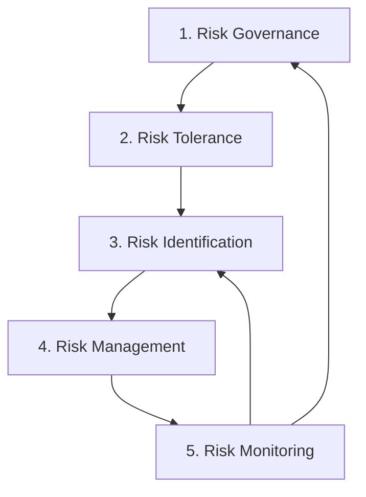

Of course\! Here is the detailed summary for **Reading 88: Introduction to Risk Management**, created using the "Global Gold Standard" template.

-----

## Reading 88: Introduction to Risk Management

### 🎯 Introduction

Welcome, future charterholder\! Imagine you are the captain of a large ship setting sail across the ocean. 🚢 Your goal is to reach a profitable port, but the sea is full of potential storms (risks). A bad captain might try to avoid every cloud, never leaving the safety of the harbor and thus never making a profit. A reckless captain might sail straight into a hurricane.

A *great* captain, however, understands the ship's capabilities (**risk tolerance**), uses advanced weather-tracking to see where the storms are (**identify and measure risk**), and then makes smart decisions—steering around the worst storms, bracing for smaller ones, and sometimes even using the wind from a passing squall to speed up the journey (**modify and monitor risk**).

**Risk management** is the art of being a great captain for your company or portfolio. It's not about avoiding risk; it's about intelligently navigating it to achieve your goals.

-----

### Part 1: The Captain's Rulebook: The Risk Management Framework 🗺️

A **risk management framework** is the comprehensive system an organization uses to manage its risks. It’s the set of processes and policies that form the captain's rulebook.

The process doesn't seek to eliminate all risks. Instead, it aims to manage the firm's risk profile to an optimal level, where the firm is taking smart risks it understands and is rewarded for, while avoiding or reducing risks it is ill-equipped to handle.

**Risk governance** is the top-level oversight, typically by a company's board of directors. They set the organization's overall **risk tolerance**—the total amount of risk the organization is willing to accept in pursuit of its strategic objectives.

-----

### Part 2: Allocating Your Risk: The Risk Budget 💰

Once the overall risk tolerance is set, the firm needs a way to allocate that risk to different activities. This is called **risk budgeting**.

Think of it like a financial budget, but instead of allocating dollars, you're allocating "units of risk." The goal is to spend your risk budget on the activities that are expected to generate the highest return for the risk taken.

A **risk budget** can be based on a single metric (like portfolio beta or Value at Risk) or broken down by various sources of risk (like interest rate risk, equity market risk, and currency risk).

-----

### Part 3: Know Your Enemy: A Guide to Different Risks 🦁

Risks come in many shapes and sizes. The first step in managing them is to properly identify and categorize them.

#### **Financial Risks 📉**

These risks arise directly from financial markets.

  * **Market Risk:** The risk of losses from changes in broad market factors, like stock prices, interest rates, and currency exchange rates. The 2008 global financial crisis was a massive market risk event.
  * **Credit Risk:** The risk that a counterparty will fail to make a promised payment. If you own a bond from a company that goes bankrupt (like Dewan Housing Finance Corporation Limited (DHFL) in India), you've experienced credit risk.
  * **Liquidity Risk:** The risk of not being able to sell an investment quickly at a fair price. Trying to sell a large number of shares in a thinly traded small-cap stock can be a classic example of liquidity risk.

#### **Non-Financial Risks ⚙️**

These risks come from outside the financial markets.

  * **Operational Risk:** The risk of loss from failed internal processes, people, and systems, or from external events. This includes everything from a rogue trader to a catastrophic IT system failure.
  * **Solvency Risk:** The risk that an organization runs out of cash to meet its obligations.
  * **Regulatory Risk:** The risk that a change in laws or regulations will negatively impact an organization.
  * **Legal Risk:** The risk of being sued or facing legal action.
  * **Model Risk:** The risk that financial models used to value assets or measure risk are incorrect or misapplied.
  * **Tail Risk:** The risk that extreme, "black swan" events are more likely than your models predict.
  * **Accounting Risk:** The risk that the firm's accounting policies are judged to be incorrect.

-----

### Part 4: The Toolkit: Measuring and Modifying Risk 🛠️

Once you've identified the risks, you need to measure them and decide what to do about them.

#### **Measuring Risk**

  * **Standard Deviation:** Measures the total volatility of returns.
  * **Beta:** Measures systematic (market) risk.
  * **Duration:** Measures the sensitivity of a bond's price to changes in interest rates.
  * **Value at Risk (VaR):** A famous measure of **tail risk**. A "5% monthly VaR of ₹1 Crore" means there is a 5% chance of losing *at least* ₹1 Crore in a month.
  * **The "Greeks" (for Derivatives):** Measures of sensitivity like **Delta** (to price), **Gamma** (to delta), **Vega** (to volatility), and **Rho** (to interest rates).

#### **Modifying Risk**

You have four main strategies for dealing with an identified risk:

1.  **Risk Avoidance:** Simply choose not to engage in the risky activity. (e.g., A bank decides not to lend to a particularly risky industry).
2.  **Risk Acceptance:** Bear the risk and accept the potential outcomes. This is often done when the potential reward is high or the cost of avoiding the risk is too great. This can include **self-insurance**.
3.  **Risk Transfer:** Pay someone else to take the risk for you. The most common example is buying **insurance**. This also includes surety bonds or fidelity bonds.
4.  **Risk Shifting:** Change the distribution of possible outcomes. This is usually done with **derivatives**. For example, an Indian airline fearing a rise in fuel prices (which are priced in USD) can use futures contracts to lock in a future price, shifting the risk of a price increase to someone else.

> [\!TIP]
> **CFA Exam Tip ✍️:** Be sure to know the difference between **Risk Transfer** and **Risk Shifting**. Transferring risk means getting rid of it by paying a premium (like insurance). Shifting risk means using a financial instrument (like a derivative) to change the nature of your risk exposure, not necessarily eliminating it.

-----

### 🧪 Formula Summary

This reading is conceptual and focuses on the framework and terminology of risk management. There are no mathematical formulas to memorize from this section.

-----

> [|IMPORTANT]
>
> ### 🎯 Quick Exam-Day Pointers
>
>   * The goal of risk management is **NOT to eliminate all risk**. The goal is to manage the firm's total risk to an optimal level that aligns with its strategic goals.
>   * **Risk Governance** starts at the top (Board of Directors) and sets the firm's overall **Risk Tolerance**.
>   * **Risk Budgeting** is the process of allocating the firm's total tolerated risk among different activities or investments.
>   * Know the key **Financial Risks** (Market, Credit, Liquidity) and **Non-Financial Risks** (Operational, Regulatory, etc.).
>   * Remember the four ways to handle risk: **Avoid** it, **Accept** it, **Transfer** it (insurance), or **Shift** it (derivatives).