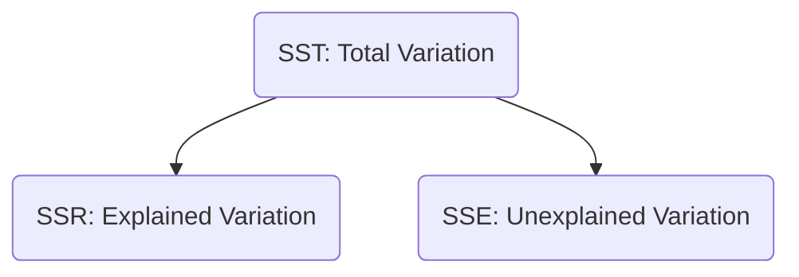

## Reading 10: Simple Linear Regression

### 🎯 Introduction

Welcome, future charterholder\! Imagine you're trying to predict how much ice cream a shop will sell . 🍦 You have a hunch that sales are related to the daily temperature. **Simple Linear Regression** is the statistical tool that lets you formally model this relationship. It draws the "best fit" line through your data to answer two key questions: 1) *How strong* is the relationship between temperature (the **independent variable**) and ice cream sales (the **dependent variable**)?  and 2) If the forecast is 30°C tomorrow, *how many* ice creams should we expect to sell?  This reading is your guide to drawing that line, testing if it's meaningful, and using it to make powerful predictions.

-----

### Part 1: Building the Model: The Line of Best Fit 📈

**Simple linear regression** aims to explain the variation in one variable (the **dependent variable, Y**) using the variation in a single other variable (the **independent variable, X**).

The model is described by a simple equation:

$$Y_i = b_0 + b_1X_i + \epsilon_i$$

Where:

  * $Y_i$ = The actual value of the **dependent variable** for observation `i`.
  * $X_i$ = The value of the **independent variable** for observation `i`.
  * $b_0$ = The **intercept**, the value of Y when X is zero.
  * $b_1$ = The **slope coefficient**, the change in Y for a one-unit change in X.
  * $\epsilon_i$ = The **error term** or **residual**, the part of Y that the model can't explain.

To find the "best fit" line, we use the **least squares criterion**. This method chooses the intercept ($\hat{b}_0$) and slope ($\hat{b}_1$) that **minimize the sum of the squared errors (SSE)**. This is why it's often called **Ordinary Least Squares (OLS)**.

#### 1.1 Interpreting the Coefficients

  * **Intercept ($\hat{b}_0$)**: This is the predicted value of Y when X is.
  * **Slope ($\hat{b}_1$)**: This is the heart of the model. It tells you the predicted change in Y for a one-unit change in X.

#### 1.2 Global & Local Context 🌍

Let's run a regression of the excess returns of a specific stock (e.g., ABC stock) against the excess returns of the market (e.g., the S\&P 500 index). The resulting equation might be:

ABC Return = -0.023 + 0.64(S\&P 500 Return)

  * **Interpretation of Intercept ($\hat{b}_0 = -2.3\%$ or -0.023)**: When the market's excess return is zero, the model predicts that ABC's excess return will be -2.3%.
  * **Interpretation of Slope ($\hat{b}_1 = 0.64$)**: For every 1% increase in the S\&P 500's excess return, the model predicts a 0.64% increase in ABC's excess return. In finance, this slope coefficient is the stock's **beta**\! 

#### 1.3 The Ground Rules: Assumptions of Linear Regression

For our model to be reliable, a few assumptions must hold:

1.  **Linear Relationship**: The relationship between X and Y must be linear.
2.  **Homoskedasticity**: The variance of the residuals must be constant for all values of X. (The opposite is **heteroskedasticity**, where the error variance changes) .
3.  **Independence**: The residuals must be independent of each other (no autocorrelation).
4.  **Normality**: The residuals should be normally distributed.

You can check these assumptions by looking at **residual plots**. If you see a clear pattern (like a curve or a funnel shape), one of the assumptions is likely violated.

**🧠 Memory Aid: The "L.I.N.E." Assumptions**

For your OLS model to be solid, its assumptions must hold the **L.I.N.E.**

  * **L**inear relationship
  * **I**ndependent residuals
  * **N**ormal residuals
  * **E**qual variance of residuals (Homoskedasticity)

-----

### Part 2: Is the Model Any Good? Measuring Fit and Significance 🧐

Once we have our model, we need to know if it's actually useful. We do this using **Analysis of Variance (ANOVA)**  and a few key statistics.

ANOVA breaks down the total variation in the dependent variable (Y) into two parts: the part explained by our model and the part that's left unexplained.

  * **Total Sum of Squares (SST)**: The total variation of the Y-values from their mean.
  * **Regression Sum of Squares (SSR)**: The variation in Y that is *explained* by our model.
  * **Sum of Squared Errors (SSE)**: The variation in Y that is *unexplained* by our model (the residuals).

The fundamental relationship is: **SST = SSR + SSE**. (Mnemonic: "**T**otal **S**uff = **R**egression **S**tuff + **E**rror **S**tuff")

Here is the standard **ANOVA table** you must be able to read. It organizes this entire breakdown.

| Source of Variation | Degrees of Freedom (df) | Sum of Squares (SS) | Mean Sum of Squares (MSS) |
| :--- | :--- | :--- | :--- |
| **Regression** (Explained) | 1 | SSR | MSR = SSR / 1 |
| **Error** (Unexplained) | n - 2 | SSE | MSE = SSE / (n - 2) |
| **Total** | n - 1 | SST | |

#### 2.1 Measures of Goodness-of-Fit

  * **Coefficient of Determination ($R^2$)**: This is the most popular measure of fit. It's the percentage of the total variation in Y that is explained by X.

    

    $$R^2 = \frac{SSR}{SST}$$

    

    An $R^2$ of 0.60 means that 60% of the movement in the dependent variable can be explained by the movement in the independent variable. For a simple linear regression, this is just the correlation coefficient squared ($r^2$).

  * **Standard Error of Estimate (SEE)**: This is the standard deviation of the residuals. A smaller SEE means the model's predictions are more accurate. It is calculated as the square root of the MSE.

#### 2.2 Testing for Significance

Does our independent variable actually have a significant relationship with the dependent variable? We test this with the null hypothesis that the slope coefficient is zero ($H_0: b_1 = 0$).

  * **t-Test**: This tests the significance of an individual coefficient. We calculate a t-statistic:

    

    $$t = \frac{\text{Estimated Coefficient} - \text{Hypothesized Value}}{\text{Standard Error of Coefficient}}$$

    

    If this **t-stat** is larger than the critical t-value (from a t-table with **n-2 degrees of freedom**), we can reject the null and conclude the coefficient is statistically significant.

  * **F-Test**: This tests the overall significance of the *entire model*. For a simple linear regression with only one independent variable, the F-test gives the exact same conclusion as the t-test for the slope.

    

    $$F = \frac{MSR}{MSE}$$

    

    (where MSR is Mean Square Regression and MSE is Mean Square Error from the ANOVA table) .

💡 CFA Exam Tip ✍️: You must be able to read an ANOVA table. Know that **$R^2 = SSR / SST$**  and **$SEE = \sqrt{MSE}$**. Also, remember that for simple linear regression, the F-statistic is just the square of the slope's t-statistic (**$F = t^2$**).

-----

### Part 3: Making Predictions and Exploring New Forms 🔮

The whole point of building a model is to use it\!

#### 3.1 Predicting Y and Creating Intervals

Given a forecast for our independent variable ($X_p$), we can easily calculate the predicted value for Y:

$$\hat{Y} = \hat{b}_0 + \hat{b}_1 X_p$$

But this is just a point estimate. It's more useful to create a **prediction interval**, which gives a range that we're confident the actual future Y value will fall into.

$$\text{Prediction Interval} = \hat{Y} \pm (t_c \times s_f)$$

Where:

  * $t_c$ = The critical t-value (with n-2 df).
  * $s_f$ = The standard error of the forecast.

#### 3.2 Different Functional Forms

What if the relationship isn't a straight line? We can often transform the variables to make it linear. The most common transformation is using the natural logarithm (ln).

  * **Log-Lin Model ($\ln(Y)$ vs. $X$)**: The slope coefficient represents the *relative* change in Y for an *absolute* change in X.
  * **Lin-Log Model ($Y$ vs. $\ln(X)$)**: The slope represents the *absolute* change in Y for a *relative* change in X.
  * **Log-Log Model ($\ln(Y)$ vs. $\ln(X)$)**: The slope represents the *relative* change in Y for a *relative* change in X. This slope is an **elasticity**.

💡 CFA Exam Tip ✍️: The log-log model is important. If you see a regression where both Y and X have been transformed with natural logs, the slope coefficient ($\hat{b}_1$) can be directly interpreted as an elasticity. For example, if $\ln(\text{Demand}) = 2.5 - 1.5\ln(\text{Price})$, the price elasticity of demand is -1.5.

-----

### 🧪 Formula Summary

<b>Regression Model:</b> 
$$Y_i = b_0 + b_1 X_i + \epsilon_i$$

<b>Estimated Regression Line:</b> 
$$\hat{Y}_i = \hat{b}_0 + \hat{b}_1 X_i$$

<b>Slope Coefficient:</b> 
$$\hat{b}_1 = \frac{Cov(X,Y)}{Var(X)}$$

<b>Intercept Coefficient:</b> 
$$\hat{b}_0 = \bar{Y} - \hat{b}_1 \bar{X}$$

<b>Total Variation:</b> 
$$SST = SSR + SSE$$

<b>Coefficient of Determination:</b> 
$$R^2 = \frac{SSR}{SST}$$

<b>t-Statistic for Slope</b> (df = n-2): 
$$t = \frac{\hat{b}_1 - b_1}{s_{\hat{b}_1}}$$

<b>Prediction Interval:</b> 
$$\hat{Y} \pm (t_c \times s_f)$$

-----

### 🎯 Quick Exam-Day Pointers

  * **Interpret the Slope\!** The slope ($\hat{b}_1$) is the most important part of the model. It's the predicted change in Y for a one-unit change in X.
  * **$R^2$ is Explanatory Power.** It tells you what percentage of the dependent variable's movement is explained by the independent variable.
  * **Check for Significance.** Use the **t-statistic** to check if the slope is significantly different from zero. A high t-stat (generally > 2 for a 5% significance test) means the variable is a significant predictor.
  * **Know Your Assumptions.** Remember the **L.I.N.E.** mnemonic. Be able to spot violations like **heteroskedasticity** (funnel shape in residual plot) from a description.
  * **Log-Log = Elasticity.** If both variables are in log form, the slope coefficient is the elasticity.
  * **Know the ANOVA Table.** Be able to find SSR, SSE, SST, MSR, and MSE. Remember $R^2 = SSR / SST$ and $SEE = \sqrt{MSE}$.

