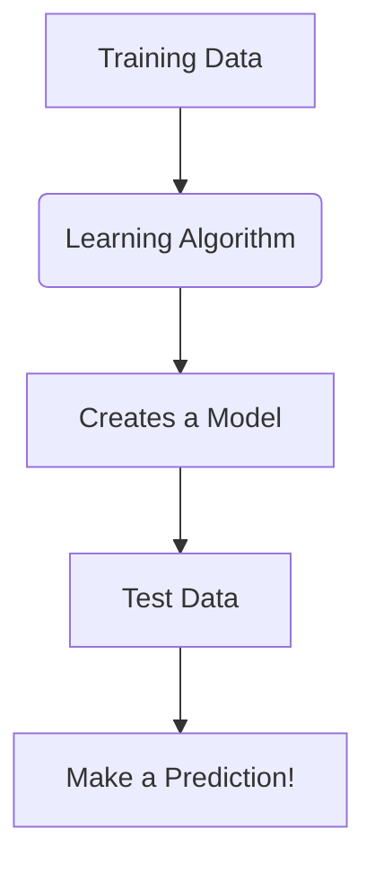

Of course\! Here is a detailed summary for Reading 11.

## Reading 11: Introduction to Big Data Techniques

### 🎯 Introduction

Welcome, future charterholder\! Imagine you're an investment analyst from the past, armed with only a newspaper and a calculator. Now, picture a modern analyst who can see satellite images of every Walmart parking lot, read the sentiment of millions of tweets about a new iPhone, and track real-time shipping movements across the globe. 🛰️📱🚢 That's the power of **Fintech** and **Big Data**. This reading is your introduction to this new world. We'll explore how technology is revolutionizing financial analysis, from the raw data itself to the intelligent machines that help us make sense of it all.

-----

### Part 1: What Exactly is "Fintech"? 🤖

**Fintech** is short for Financial Technology. It refers to any technological development that can be applied to the financial services industry. Think of it as the engine powering modern finance.

The key areas where fintech is making a huge impact for analysts include:

  * Handling massive datasets from countless sources and in various formats.
  * Providing advanced tools like **artificial intelligence** to analyze this data and uncover hidden patterns.

-----

### Part 2: Big Data, AI, and Machine Learning Explained 🤔

These terms are often used together, but they mean different things. Let's break them down.

#### **Big Data: The Three V's**

**Big Data** isn't just "a lot of data." It's a term for all the potentially useful information being generated in the economy, characterized by three key features, known as the "3 V's":

  * **Volume 📦**: The sheer scale of data is enormous and growing exponentially. We're talking terabytes and petabytes now, not just gigabytes.
  * **Velocity 💨**: The speed at which data is generated and communicated. **Low latency** data is real-time (like stock prices), while **high latency** data comes with a lag (like quarterly government reports).
  * **Variety  разнообразие**: Data comes in all shapes and sizes:
      * **Structured**: Neatly organized in spreadsheets or databases (e.g., company financial statements).
      * **Semi-structured**: Has some organization but isn't a neat table (e.g., photos with tags, web page code).
      * **Unstructured**: No predefined organization (e.g., videos, social media posts, news articles).

#### **Artificial Intelligence (AI) and Machine Learning (ML)**

  * **Artificial Intelligence (AI)** is the broader concept of creating computer systems that can simulate human intelligence and perform tasks like planning, problem-solving, and understanding language.
  * **Machine Learning (ML)** is a *subset* of AI. It's the process of "training" a computer to learn from data without being explicitly programmed. The machine identifies patterns and builds a model, which it then uses to make predictions or decisions.

<!-- end list -->

There are two main types of machine learning:

  * **Supervised Learning**: The data is labeled. The machine is given both the inputs and the correct outputs, and it "learns" the relationship between them.
  * **Unsupervised Learning**: The data is *not* labeled. The machine's job is to explore the data and find hidden structures or patterns on its own.

A key challenge in ML is avoiding **overfitting**. This happens when the model learns the training data *too* well, including all its random noise and quirks. An overfit model is great at "predicting the past" but fails when it sees new, real-world data. The opposite, **underfitting**, is when the model is too simple and fails to capture the true underlying patterns.

-----

### Part 3: How is Big Data Used in Investing? 📈

Big Data and AI are not just buzzwords; they are actively being used to gain an investment edge.

#### **Sources of Data**

Analysts are now looking far beyond traditional financial reports. These new **alternative data** sources include:

  * **Corporate Exhaust**: Data generated by a company's own activities (e.g., supply chain data, transaction records).
  * **Internet of Things (IoT)**: Data from sensors on devices, like tracking a fleet of delivery trucks.
  * **Text Analytics**: Analyzing text from news articles, social media, and company filings to gauge sentiment or identify trends. This is done through **Natural Language Processing (NLP)**.

#### **Global & Local Context 🌍**

  * **Global Example**: A hedge fund might use satellite imagery to count the number of cars in the parking lots of major retailers like Walmart or Target around the world. A decrease in cars could be an early signal of slowing sales, giving the fund an edge before official earnings are released.
  * **Indian Example**: An analyst in India might use **text analytics** to scrape social media and news sites for sentiment on a newly launched car by Tata Motors. A surge in positive mentions could lead to an upward revision of sales forecasts.

#### **Key Applications**

  * **Improving Analyst Forecasts**: Using alternative data to get a more accurate and timely picture of a company's performance.
  * **Algorithmic Trading**: Using automated, pre-programmed rules to execute trades. This can be used to execute large orders efficiently or for **high-frequency trading (HFT)**, which aims to profit from tiny, intraday price discrepancies.

> [\!TIP]
> **CFA Exam Tip ✍️:** For the exam, focus on the definitions and distinctions. You must know the 3 V's of Big Data (Volume, Velocity, Variety) and the difference between **supervised** (labeled data) and **unsupervised** (unlabeled data) machine learning. Also, understand the risk of **overfitting**—when a model is too complex and performs poorly on new data.

-----

### 🧪 Formula Summary

This is a conceptual reading, so there are no mathematical formulas to memorize.

-----

> [\!IMPORTANT]
>
> ### 🎯 Quick Exam-Day Pointers
>
>   * **Fintech = Tech + Finance.** It's the application of technology to the financial industry.
>   * **The 3 V's of Big Data:** **V**olume (how much), **V**elocity (how fast), and **V**ariety (what kind).
>   * **AI is the goal, ML is the method.** **Machine Learning** is a type of **Artificial Intelligence** where computers learn from data.
>   * **Supervised vs. Unsupervised.** **Supervised** learning uses labeled data (you know the right answers). **Unsupervised** uses unlabeled data (the machine finds its own patterns).
>   * **Beware of Overfitting\!** An overfit model looks great on historical data but fails in the real world because it has memorized noise instead of learning the true signal.
>   * **Think Beyond Financials.** Big Data in finance is all about using **alternative data** (satellites, social media, etc.) to get an information edge.