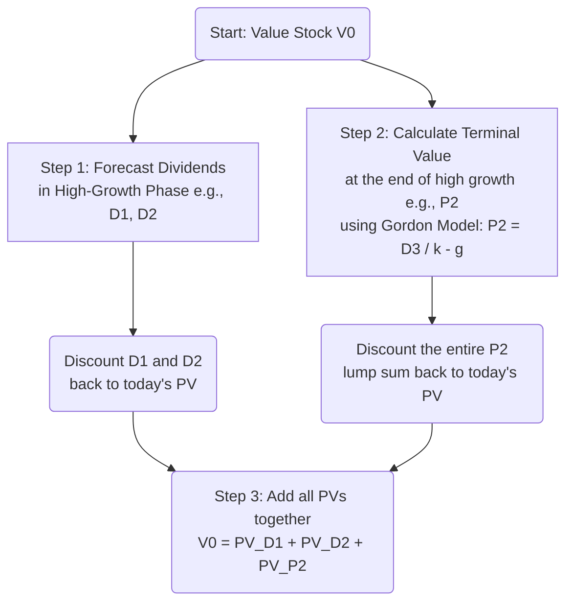

## Reading 2: The Time Value of Money in Finance ⏳

### 🎯 Introduction

Welcome, future charterholder, to the single most important concept in finance. This is it. The bedrock. The "karate kata" from which all other moves are built.

The **Time Value of Money (TVM)** is the simple, powerful idea that a dollar today is worth more than a dollar tomorrow. Why? Because you can invest that dollar today and watch it grow. This reading is your toolkit for "time travel"—learning how to perfectly value any future cash flow (a bond payment, a company's dividend) in today's terms.

Let's sharpen our pencils (and warm up our calculators)—this is the foundation of valuation.

-----

### Part 1: Your Calculator is Your Sword ⚔️ (Warm-Up)

You cannot and *will not* solve these problems by hand on the exam. You **must** master your financial calculator (TI BA II Plus or HP 12C).

**🧠 Mnemonic: Your 5 TVM Keys**
Think: **"N-I/Y-PV-PMT-FV"**

  * **N** = **N**umber of Periods (e.g., 10 years annual = 10; 10 years semi-annual = 20)
  * **I/Y** = **I**nterest Rate *per Period* (e.g., 8% annual = 8; 8% semi-annual = 4)
  * **PV** = **P**resent **V**alue (Cash *outflow* is negative, *inflow* is positive) 
  * **PMT** = **P**ay**m**en**t** (The recurring, equal cash flow)
  * **FV** = **F**uture **V**alue (The lump sum at the end)

**CRITICAL SETUP: THE SCHWESER WAY**
All examples in the SchweserNotes (and this summary) assume you've made one crucial setting:

> **Set P/Y = 1** (Payments Per Year = 1) 
>
> \* **How:** [2nd] [P/Y] $\rightarrow$ 1 [ENTER] $\rightarrow$ [2nd] [QUIT] 
>
>   * **Why:** This forces you to handle the periods yourself. **N** becomes the *total number of periods*, and **I/Y** becomes the *interest rate per period*. This simplifies complex problems and prevents errors.

**BGN vs. END Mode (The Annuity Switch):**
Your calculator defaults to **END** mode, assuming payments happen at the *end* of each period. This is called an **Ordinary Annuity**.
If a problem states payments happen at the *beginning* of the period, you must switch to **BGN** mode (for an **Annuity Due**).

  * **How:** [2nd] [BGN] $\rightarrow$ [2nd] [SET] $\rightarrow$ [2nd] [QUIT]. (A "BGN" will appear on your screen). **Remember to switch it back to END when you're done\!**

-----

### Part 2: The Core Concepts: Single Sums & Annuities (LOS 2.a)

#### 2.1 Single Sums (Zero-Coupon Bonds)

This is about moving a *single* amount of money through time. A **zero-coupon bond** is a perfect example: you pay a price today (PV) and get the face value (FV) at maturity.

  * **Future Value (FV):** $FV = PV \times (1 + r)^t$ 
  * **Present Value (PV):** $PV = \frac{FV}{(1 + r)^t}$ 

#### 2.2 Annuities (Loans, Coupons, & Savings)

An **annuity** is a stream of *equal cash flows* (PMT) for a *fixed number of periods* (N).

  * **Present Value of an Annuity:** What is this stream worth today? This is used to value a bond's coupons or determine a loan's principal.
    $$PV = PMT \times \left[ \frac{1 - (1 + r)^{-t}}{r} \right]$$
  * **Future Value of an Annuity:** What will this stream be worth in the future? This is used for retirement savings.
    $$FV = PMT \times \left[ \frac{(1+r)^t - 1}{r} \right]$$

#### 2.3 Perpetuities (Preferred Stock)

A **perpetuity** is a special annuity that pays a fixed amount (PMT) **forever**. **Preferred stock**, with its fixed dividend, is often valued this way.

  * **Present Value of a Perpetuity:**
    $$PV_{\text{Perpetuity}} = \frac{PMT}{r}$$ 

-----

### Part 3: Applying TVM to Securities (LOS 2.a)

#### 3.1 Fixed-Income (Bonds)

A standard **fixed-coupon bond** is just two TVM components added together:

1.  **PV of an Annuity** (the stream of future coupon payments)
2.  **PV of a Single Sum** (the future face value, or "par," paid at maturity)

**Example:** Value a 10-year, $1,000 face value bond with a 10% annual coupon. The market discount rate (yield) is 8%.

  * **N** = 10
  * **I/Y** = 8
  * **PMT** = 100 (10% of $1,000) 
  * **FV** = 1000 
  * **CPT PV** = **-$1,134.20** 

**💡 The Bond See-Saw: Price vs. Yield**
This is a fundamental concept. Bond prices and yields move in **opposite directions**.

  * If Market Yield < Coupon Rate (8% < 10%) $\rightarrow$ Bond Price > Par (Premium) 
  * If Market Yield > Coupon Rate $\rightarrow$ Bond Price < Par (Discount)
  * If Market Yield = Coupon Rate $\rightarrow$ Bond Price = Par

#### 3.2 Equity (Stocks)

Stocks are harder to value: their cash flows (dividends) are uncertain and they have no maturity date. We use **Dividend Discount Models (DDMs)**.

  * **Constant Growth DDM (Gordon Growth Model):** Assumes dividends grow at a **constant rate ($g$)** forever.
    $$V_0 = \frac{D_1}{k_e - g}$$

      * $V_0$ = Value of the stock today
      * $D_1$ = Expected dividend *next year* ($D_0 \times (1+g)$) 
      * $k_e$ = Required return on equity (the discount rate)
      * $g$ = The constant growth rate

  * **Multistage DDM:** More realistic. Assumes a short "supernormal" growth phase, followed by a stable "terminal" growth phase (which uses the Gordon model).

<!-- end list -->

-----

### Part 4: Working Backwards: Implied Returns (LOS 2.b)

Sometimes we *know* the price and cash flows, but need to find the market's implied discount rate.

  * **For Bonds: Yield-to-Maturity (YTM):** This is the `I/Y` that makes the PV of all future cash flows equal to the current market price. You *always* solve this with your calculator.
  * **For Stocks: Implied Return or Growth:** We just rearrange the Gordon Growth Model.
      * **Implied Required Return ($k_e$):**
        $$k_e = \frac{D_1}{V_0} + g$$
        (Required Return = Dividend Yield + Growth Rate) 
      * **Implied Growth Rate ($g$):**
        $$g = k_e - \frac{D_1}{V_0}$$

-----

### Part 5: The Law of One Price: No-Arbitrage (LOS 2.c)

This section is built on two powerful ideas:

1.  **Cash Flow Additivity Principle:** The PV of a portfolio is just the sum of the PVs of its individual assets/cash flows.
2.  **No-Arbitrage Principle:** This is the "no free lunch" law. It states that two assets with the *exact same* future cash flows **must** have the same price today. If they don't, you can make a risk-free profit.

This principle is the bedrock for pricing forwards and options.

  * **Implied Forward Interest Rates:** A 2-year investment must have the same return as a 1-year investment rolled over into a second 1-year investment at a rate locked in today (the **forward rate**).
  * **Forward Exchange Rates:** The relationship between spot and forward FX rates is locked in by the interest rates of the two currencies. This is **interest rate parity**.
    $$\frac{\text{Forward}}{\text{Spot}} = \frac{1 + r_{\text{price currency}}}{1 + r_{\text{base currency}}}$$ 
  * **Option Pricing (Binomial Model):** We can create a **risk-free hedge portfolio** by combining a specific number of shares of the stock with a written call option. This portfolio has the *same* value whether the stock goes up or down. Since its future payoff is certain, its PV must be that payoff discounted at the **risk-free rate**, which lets us solve for the option's price.

-----

### 🧪 Formula Summary

**PV of a Single Sum:**
$$PV = \frac{FV}{(1 + r)^t}$$ 

**FV of a Single Sum:**
$$FV = PV \times (1 + r)^t$$ 

**PV of an Ordinary Annuity:**
$$PV = PMT \times \left[ \frac{1 - (1 + r)^{-t}}{r} \right]$$

**FV of an Ordinary Annuity:**
$$FV = PMT \times \left[ \frac{(1+r)^t - 1}{r} \right]$$

**PV of a Perpetuity:**
$$PV = \frac{PMT}{r}$$ 

**Gordon Growth Model (Stock Value):**
$$V_0 = \frac{D_1}{k_e - g}$$ 

**Implied Required Return on Equity:**
$$k_e = \frac{D_1}{V_0} + g$$ 

**No-Arbitrage FX Forward Rate:**
$$Forward = Spot \times \frac{1 + r_{\text{price}}}{1 + r_{\text{base}}}$$ 

-----

### 🎯 Quick Exam-Day Pointers

  * **P/Y = 1, ALWAYS\!** Set your calculator to P/Y=1 and manage `N` and `I/Y` manually. It's safer.
  * **SIGN CONVENTION:** Cash *outflows* (what you pay, like buying a bond or making a loan payment) are **negative PV** or **negative PMT**. Cash *inflows* (what you receive, like coupons or face value) are **positive**.
  * **BGN vs. END:** Check if the problem mentions payments at the **beginning** of a period (an annuity *due*). If it does, switch your calculator to **BGN** mode. If not, leave it in **END** mode (ordinary annuity).
  * **BOND SEE-SAW:** This is a fundamental truth. Bond prices and yields move in **opposite directions**.
  * **GORDON MODEL IS KEY:** The formula $V_0 = D_1 / (k-g)$ and its rearrangement $k = (D_1/V_0) + g$ are tested constantly. Know them cold.
  * **NO FREE LUNCH:** The **no-arbitrage principle** is the logic behind forward rate and FX calculations. Understand that identical future cash flows must have identical present values.

