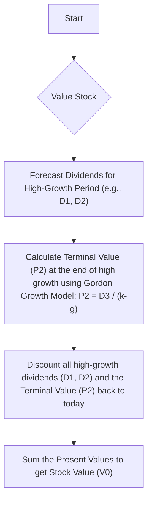

## Reading 2: The Time Value of Money in Finance

### 🎯 Introduction

Welcome, future charterholder\! Imagine you have a magical seed. 🌱 You can either keep it as a seed today or plant it and watch it grow into a massive, fruit-bearing tree in the future. Which is more valuable? The tree, of course\! The **Time Value of Money (TVM)** is the same idea: money you have today is worth more than the same amount of money in the future because you can invest it and make it grow. This reading is your ultimate gardener's guide. We'll learn how to calculate exactly what that future tree (future cash) is worth today (present value) for everything from simple bonds to complex stocks. Let's start digging\!

-----

### Part 1: How Do We Value Future Cash? The Art of Discounting 💰

The core of finance is valuing assets, and the value of any asset is simply the **present value (PV)** of all the cash it's expected to give you in the future. The process of finding that present value is called **discounting**.

The basic formulas are:

  * **Future Value (FV)**: $FV = PV(1+r)^t$
  * **Present Value (PV)**: $PV = \frac{FV}{(1+r)^t}$

Let's see how this applies to different types of securities.

#### **Fixed-Income Securities (Bonds)**

Think of a bond as a formal loan. You lend money, and in return, you get interest payments and your original loan amount back.

  * **Zero-Coupon Bond**: This is the simplest bond. It pays no interest. You buy it at a discount today and get its full face value back at maturity. The interest is the difference between what you paid and what you get back.
  * **Fixed-Coupon Bond**: This is the classic bond. It pays a fixed interest payment (the **coupon**) every period (usually annually or semi-annually) and repays the principal (**face value**) at maturity.
  * **Perpetuity**: A super rare bond that never matures\! It pays a fixed coupon forever. Its value is incredibly simple to calculate:
    $$PV\_{Perpetuity} = \frac{\text{Payment}}{r}$$

#### **Example 🧮**

Let's value a 10-year, ₹1,000 face value bond from an Indian company like Reliance Industries. It pays a 10% annual coupon, and the required yield (the market's discount rate, `r`) is 8%.

  * **N** = 10 (years)
  * **I/Y** = 8% (the discount rate)
  * **PMT** = ₹100 (10% of ₹1,000)
  * **FV** = ₹1,000 (the face value returned at the end)

Using a financial calculator, you'd compute **PV**.
`CPT PV` -\> **-₹1,134.20**

The bond is worth ₹1,134.20 today. Because the coupon rate (10%) is higher than the market yield (8%), the bond trades at a premium (above its face value).

#### **Global & Local Context 🌍**

A US Treasury bond is a classic example of a fixed-coupon bond, considered one of the safest investments globally. A **zero-coupon bond** is like a US Treasury STRIP. In India, a government bond (G-Sec) also works like a fixed-coupon bond. The concept of a **perpetuity** is rare, but some bonds issued in the UK, called consols, have this feature.

#### **Equity Securities (Stocks)**

Stocks are trickier because their cash flows (dividends) are not guaranteed and they have no maturity date. We use **dividend discount models (DDMs)** to estimate their value.

  * **Constant Dividend Model**: If we assume a company will pay the same dividend forever (like a **preferred stock**), we can value it as a perpetuity.

  * **Constant Growth DDM (Gordon Growth Model)**: This is a cornerstone of equity valuation. It assumes dividends will grow at a constant rate (`g`) forever.
    $$V_0 = \frac{D_1}{k_e - g_c}$$
    Where:

      * $V_0$ = Value of the stock today
      * $D_1$ = Expected dividend *next year*
      * $k_e$ = Required return on equity
      * $g_c$ = Constant growth rate of dividends

  * **Multistage DDM**: This is more realistic. It assumes a company goes through different growth phases: a high-growth "supernormal" period, followed by a stable, mature growth rate forever. You calculate the PV of dividends in the high-growth phase and then use the Gordon Growth Model for the stable phase.

<!-- end list -->

> [\!TIP]
> **CFA Exam Tip ✍️:** The relationship between a bond's price and its yield is **inverse**. If the market interest rate (yield) goes up, the bond's price goes down. If the yield goes down, the price goes up. This is a fundamental concept you *must* know.

-----

### Part 2: Working Backwards: What's the Implied Return? 🕵️‍♂️

Sometimes, we know the price of an asset and its cash flows, but we want to figure out the **implied return** (or yield) the market is demanding. This just means rearranging our PV formulas to solve for `r`.

#### For Bonds

For a bond, the implied return is its **yield to maturity (YTM)**. This is the single discount rate that makes the present value of all future cash flows (coupons + principal) equal to the bond's current market price. You almost always solve for this using a financial calculator.

**Example 🧮**: Our ₹1,000 face value, 10-year, 10% coupon bond is now trading at ₹1,085. What is its YTM?

  * **N** = 10
  * **PV** = -1,085 (what you pay)
  * **PMT** = 100
  * **FV** = 1,000
    `CPT I/Y` -\> **8.69%**

The implied return, or YTM, is 8.69%.

#### For Stocks

For a stock, we can use the market price to back out the **implied required return** or the **implied growth rate**. Using the Gordon Growth Model:

  * **Implied Required Return ($k_e$)**: $$k_e = \frac{D_1}{V_0} + g_c$$
    This is a hugely important formula\! It says the required return on a stock is its **dividend yield** ($D_1/V_0$) plus its **growth rate**.

  * **Implied Growth Rate ($g_c$)**: $$g_c = k_e - \frac{D_1}{V_0}$$

#### **Global & Local Context 🌍**

An analyst covering Apple Inc. might observe its current stock price, forecast its next dividend, and assume a long-term growth rate. By plugging these into the formula, they can calculate the market's **implied required return** on Apple stock. Similarly, an analyst in India could do the same for a company like Infosys to see what return investors are implicitly demanding.

-----

### Part 3: The Law of One Price: No-Arbitrage and Its Magic Tricks ✨

The **cash flow additivity principle** is a simple but powerful idea: the present value of a stream of cash flows is just the sum of the present values of each individual cash flow. This leads to the **no-arbitrage principle**, also known as the "law of one price." It states that two assets (or portfolios) with the exact same future cash flows must have the same price today. If they don't, an **arbitrage** opportunity exists to make a risk-free profit.

This principle is the bedrock for pricing many financial instruments.

  * **Implied Forward Interest Rates**: A 2-year investment should have the same return whether you buy a 2-year bond today, or you buy a 1-year bond today and simultaneously lock in a rate for another 1-year bond a year from now. This "locked-in" future rate is the **implied forward rate**. If the rates don't align, arbitrage is possible.
    $$(1+S_2)^2 = (1+S_1)(1+1y1y)$$
    (Where $S_2$ is the 2-year spot rate, $S_1$ is the 1-year spot rate, and $1y1y$ is the 1-year forward rate one year from now).

  * **Forward Exchange Rates**: The relationship between spot and forward exchange rates is determined by the interest rates of the two currencies involved. This is known as **interest rate parity**. If it doesn't hold, you could borrow in the low-interest-rate currency, convert it, invest it in the high-interest-rate currency, and lock in a forward rate to convert it back for a risk-free profit.
    $$\frac{Forward}{Spot} = \frac{1 + r_{price~currency}}{1 + r_{base~currency}}$$

  * **Option Pricing (Binomial Model)**: This model values an option by creating a risk-free portfolio. You combine a specific number of shares of the underlying stock (long) and an option (short) in such a way that the portfolio's value is the same no matter if the stock price goes up or down. Since the future value is certain, its present value must be that future value discounted at the risk-free rate. This allows us to solve for the option's price today.

> [\!TIP]
> **CFA Exam Tip ✍️:** You don't need to be an expert on arbitrage strategies for Level 1, but you *must* understand the concept of no-arbitrage. Questions will test your ability to use the no-arbitrage formulas for forward rates and FX rates to find the correct price or rate.

-----

### 🧪 Formula Summary

  * **Present Value (PV)**: $$PV = \frac{FV}{(1+r)^t}$$
  * **PV of a Perpetuity**: $$PV = \frac{Payment}{r}$$
  * **Gordon Growth Model (Stock Value)**: $$V_0 = \frac{D_1}{k_e - g_c}$$
  * **Implied Required Return on Equity**: $$k_e = \frac{D_1}{V_0} + g_c$$
  * **Implied Forward Interest Rate Relation**: $$(1+S_2)^2 = (1+S_1)(1+1y1y)$$
  * **No-Arbitrage Forward Exchange Rate**: $$Forward = Spot \times \frac{1 + r_{price~currency}}{1 + r_{base~currency}}$$

-----

> [\!IMPORTANT]
>
> ### 🎯 Quick Exam-Day Pointers
>
>   * **Valuation is PV\!** The value of ANY asset is the present value of its expected future cash flows, discounted at a rate that reflects its risk. This is the central idea of this reading.
>   * **Calculator is Your Best Friend:** Master the TVM keys on your financial calculator (N, I/Y, PV, PMT, FV) and the cash flow (CF) worksheet. You do not have time to solve these problems by hand. Remember to use opposite signs for inflows (what you get) and outflows (what you pay).
TODO - know the Begin and END concept in calculator for Annuity
>   * **Price vs. Yield is a See-Saw:** Bond prices and yields move in opposite directions. This relationship is fundamental.
>   * **Gordon Growth Model is a Must-Know:** The formula $V_0 = D_1 / (k-g)$ and its rearrangement $k = (D_1/V_0) + g$ are tested frequently. Know what each variable means and how to solve for any of them.
>   * **No Free Lunch:** The **no-arbitrage principle** is the logic behind forward rate and FX calculations. Understand that identical future cash flows must have identical present values.