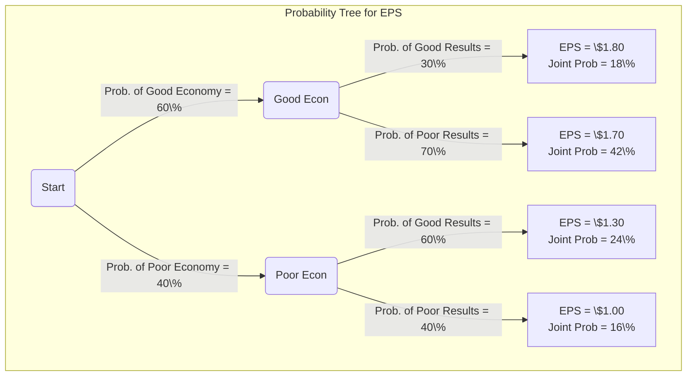

## Reading 4: Probability Trees and Conditional Expectations

### 🎯 Introduction

Welcome, future charterholder! Imagine you're a detective trying to solve a case. 🕵️‍♂️ You start with some initial beliefs about what might have happened (<b>prior probabilities</b>). As new clues and evidence come in (<b>new information</b>), you don't just guess; you systematically update your beliefs to get closer to the truth. This reading teaches you how to be that financial detective. We'll learn how to map out all possible future scenarios using <b>probability trees</b>, calculate the most likely outcome (<b>expected value</b>), and most importantly, use <b>Bayes' formula</b> to intelligently update our forecasts as new market information arrives. Let's start gathering the clues!

-----

### Part 1: What's the Most Likely Outcome? Expected Value & Volatility 🎲

Instead of just one possible future, we often face several potential outcomes, each with a different probability. The <b>expected value</b> is the probability-weighted average of all these possible outcomes. It's your best guess for the future, balancing the likelihood of each scenario.

  * <b>Expected Value, E(X)</b>: The long-run average value if you could repeat the "experiment" many times.
    
    

    $$E(X) = \sum P(x_i)x_i = P(x_1)x_1 + P(x_2)x_2 + ... + P(x_n)x_n$$
    

    
  * <b>Variance ($\sigma^2$) and Standard Deviation ($\sigma$)</b>: These measure the dispersion, or <b>volatility</b>, of the outcomes around the expected value. A high variance means the potential outcomes are very spread out (more risk), while a low variance means they are tightly clustered around the average (less risk).

#### 1.1 Theory 🧠

Unlike calculating variance for a <i>historical sample</i> where you divide by <code>n-1</code>, when you have a <i>forward-looking probability model</i>, you don't use <code>n-1</code>. Instead, you use the probabilities themselves as weights.

<b>Variance from a Probability Model</b>:

$$\sigma^2 = \sum P(x_i)[x_i - E(X)]^2$$

This is the probability-weighted sum of the squared deviations from the expected value.

#### 1.1.1 Example 🧮

Let's forecast the returns for a tech stock like Tata Consultancy Services (TCS) based on the state of the economy.

| Economic Scenario | Probability | Return (R_A) |
| :--- | :---: | :---: |
| Boom | 30% | 20% |
| Normal | 50% | 12% |
| Slow | 20% | 5% |

  1.  <b>Calculate Expected Return E(R)</b>:
      

      $$E(R) = (0.30 \times 20\%) + (0.50 \times 12\%) + (0.20 \times 5\%) = 6\% + 6\% + 1\% = \mathbf{13\%}$$
      

  2.  <b>Calculate Variance ($\sigma^2$)</b>:
      

      <ul>
        <li>Boom: 0.30 × (20% − 13%)² = 0.30 × (7%)² = 0.00147</li>
        <li>Normal: 0.50 × (12% − 13%)² = 0.50 × (−1%)² = 0.00005</li>
        <li>Slow: 0.20 × (5% − 13%)² = 0.20 × (−8%)² = 0.00128</li>
        <li><b>Variance</b> = 0.00147 + 0.00005 + 0.00128 = <b>0.00280</b></li>
      </ul>
      

  3.  <b>Calculate Standard Deviation ($\sigma$)</b>:
      

      $$\sigma = \sqrt{0.00280} = \mathbf{5.29\%}$$
      

### Part 2: Mapping the Future: Probability Trees & Conditional Expectations 🌳

A <b>probability tree</b> is a fantastic visual tool for mapping out sequential events and their probabilities. It helps you see all possible paths the future might take and calculate the probability of each final outcome.

To find the <b>joint probability</b> of any final outcome, you just multiply the probabilities along its path. For example, the probability of a good economy <i>and</i> good company results is <b>$60\% \times 30\% = 18\%$</b>.

The overall <b>expected value</b> is the sum of each outcome multiplied by its joint probability:

$$E(\mathrm{EPS}) = (0.18 \times 1.80) + (0.42 \times 1.70) + (0.24 \times 1.30) + (0.16 \times 1.00) = 1.51$$

(So EPS = \$1.51.)

#### 2.1 Conditional Expectations 🤔

<b>Conditional expectations</b> are expected values that are contingent on a specific event having already happened. It's an updated forecast.

  * <b>Global Example</b>: What is the expected return on Apple stock, <i>given that</i> the US Federal Reserve just raised interest rates? This new piece of information changes our forecast.
  * <b>Indian Example</b>: What is the expected EPS for a bank like HDFC Bank, <i>given that</i> the RBI has just announced a new, stricter lending regulation? The announcement updates our expectation.

-----

#### 2.2 Global & Local Context 🌍

- <b>Global:</b> Central banks' decisions (like the Fed raising rates) can shift expected returns for entire markets.
- <b>Local:</b> RBI regulations directly impact Indian banks' forecasts, showing how context updates expectations.

### Part 3: The Detective's Formula: Updating Beliefs with Bayes' Formula 💡
This is where you become a true financial detective. <b>Bayes' formula</b> updates your prior belief about an event after observing new evidence.

<b>Symbolic formula:</b>

$$P(\text{Event} \mid \text{New Info}) = \frac{P(\text{New Info} \mid \text{Event}) \times P(\text{Event})}{P(\text{New Info})}$$

<b>Worded formula:</b>
Updated probability of the event given the new information = (likelihood of seeing the new information if the event is true × prior probability of the event) divided by (total probability of seeing the new information under all possible events).

Put another way:
Updated belief = (How consistent the evidence is with the event × how likely the event was originally) ÷ (how likely the evidence is overall).

#### 3.1 Theory 🧠

An analyst believes there's a <b>60%</b> chance the economy will outperform (Event) and a <b>40%</b> chance it will underperform.

  * If it outperforms, there's a <b>70%</b> chance a certain stock will go up (New Info | Event).
  * If it underperforms, there's only a <b>20%</b> chance the stock will go up (New Info | Event).

<b>Question</b>: The stock just went up (New Info)! What is the new, updated probability that the economy is outperforming?

#### 3.1.1 Example & Calculation 🧮

  1. <b>Find the Prior Probabilities.</b>
      - P(Outperform) = 60%
      - P(Underperform) = 40%

  2. <b>Find the Joint Probabilities of the "New Info" happening.</b>
      - P(Stock Up AND Outperform) = P(Up | Outperform) × P(Outperform) = 70% × 60% = 42%
      - P(Stock Up AND Underperform) = P(Up | Underperform) × P(Underperform) = 20% × 40% = 8%

  3. <b>Find the Unconditional Probability of the "New Info".</b>
      This is the total probability that the stock would go up, regardless of the economy. Just add the joint probabilities from Step 2.
      - P(Stock Up) = P(Up AND Outperform) + P(Up AND Underperform) = 42% + 8% = 50%

  4. <b>Apply Bayes' Formula.</b>
      We want to find P(Outperform | Stock Up).
      

      $$P(\text{Outperform | Stock Up}) = \frac{P(\text{Up AND Outperform})}{P(\text{Up})} = \frac{0.42}{0.50} = \mathbf{84\%}$$
      

  5. <b>Conclusion</b>: Our initial belief was a 60% chance of an outperforming economy. After seeing the new evidence (the stock went up), we've updated our belief to a much more confident <b>84%</b>.

💡 CFA Exam Tip ✍️: Bayes' formula questions on the exam can look intimidating. Don't panic! The best way to solve them is to draw a quick probability tree. It helps you visualize the paths and easily calculate the joint probabilities needed for the numerator and the total probability for the denominator.

-----

### 🧪 Formula Summary

<b>Expected Value</b>:
$$E(X) = \sum P(x_i)x_i$$

<b>Variance (from a probability model)</b>:
$$\sigma^2(X) = \sum P(x_i)[x_i - E(X)]^2$$

<b>Bayes' Formula (for two events A and B)</b>:
$$P(A|B) = \frac{P(B|A)}{P(B)} \times P(A)$$

-----

### 🎯 Quick Exam-Day Pointers

* <b>Expected Value is a Weighted Average.</b> It's your single best guess, calculated by weighting each possible outcome by its probability.
* <b>Probability Trees are Your Friend.</b> Use them to visually map out scenarios. To get the final probability of any branch, multiply the probabilities along the path.
* <b>Variance is Different for Samples vs. Models.</b> For forward-looking probability models, you use the probabilities as weights to calculate variance—you <b>DO NOT</b> divide by <code>n-1</code>.
* <b>Bayes' Formula = Updating Your Priors.</b> It's the formal way to answer: "Now that I know <i>this</i>, what is the probability of <i>that</i>?"
* <b>Solve Bayes' with a Tree!</b> The easiest way to handle a Bayes' question is to draw a tree, find the probability of all paths where the "new information" occurs, and use the formula: <b>(Probability of your desired path) / (Sum of probabilities of ALL paths where the new info occurs)</b>.

