## Reading 5: Portfolio Mathematics

### 🎯 Introduction

Welcome, future charterholder\! Think of building a portfolio like being a DJ mixing a track. 🎧 You don't just play one song at full volume. You blend different tracks (assets) together. Some have a strong beat (high return, high risk), while others provide a smooth baseline (low return, low risk). The magic happens when you see how they interact (**correlation**). Combining them in the right proportions (**weights**) creates a mix that's much more dynamic and enjoyable (a better risk-return profile) than any single track on its own. This reading is your mixing board—it gives you the math to create the perfect portfolio playlist\!

-----

### Part 1: The Portfolio Recipe: Expected Return & Risk 🧑‍🍳

The two most important characteristics of any portfolio are its expected return (the reward) and its standard deviation (the risk).

#### **Portfolio Expected Return: The Simple Part**

Calculating the **expected return of a portfolio** is straightforward. It's just the weighted average of the expected returns of the individual assets inside it.

$$E(R_p) = w_A E(R_A) + w_B E(R_B) + ... + w_n E(R_n)$$

#### **Portfolio Risk: The Magic of Covariance ✨**

This is where it gets interesting\! The risk (variance or standard deviation) of a portfolio is **NOT** just the weighted average of the individual asset risks. It also depends critically on how the assets move together, which we measure using **covariance** and **correlation**.

  * **Covariance**: A measure of how two variables move together. A positive covariance means they tend to move in the same direction. A negative covariance means they tend to move in opposite directions.
  * **Correlation**: A standardized version of covariance that always ranges from -1 to +1, making it much easier to interpret.

The formula for the variance of a two-asset portfolio is crucial:
$$\sigma_p^2 = w_A^2\sigma_A^2 + w_B^2\sigma_B^2 + 2w_A w_B Cov_{AB}$$

Or, using correlation ($\rho_{AB}$):
$$\sigma_p^2 = w_A^2\sigma_A^2 + w_B^2\sigma_B^2 + 2w_A w_B \rho_{AB} \sigma_A \sigma_B$$

```mermaid
graph TD
    subgraph "Portfolio Variance Components"
  A["Risk of Asset A<br/>(w<sub>A</sub><sup>2</sup> × &sigma;<sub>A</sub><sup>2</sup>)"]
  B["Risk of Asset B<br/>(w<sub>B</sub><sup>2</sup> × &sigma;<sub>B</sub><sup>2</sup>)"]
  C{"Interaction Effect<br/>(2 × w<sub>A</sub> × w<sub>B</sub> × Cov<sub>AB</sub>)"}
    end
    A --> D["Total Portfolio Risk"];
    B --> D;
    C --> D;
```

That "Interaction Effect" is the heart of diversification\! The lower the correlation, the smaller this term is, and the lower the total portfolio risk.

#### **Global & Local Context 🌍**

Imagine you create a portfolio with two stocks:

1.  **A high-growth Indian tech company** like Zomato. Its returns are likely volatile and tied to the Indian economy.
2.  **A stable U.S. consumer goods company** like Johnson & Johnson. Its returns are less volatile and driven by global consumer demand.

Because these two companies are driven by different economic factors, their returns will likely have a low **correlation**. By combining them, the ups and downs can partially cancel each other out, leading to a smoother ride (lower portfolio standard deviation) than if you had invested in only one.

-----

### Part 2: Calculating Covariance from a Forecast 🔮

Sometimes you don't have historical data, but you do have a **joint probability function**—a table showing the probabilities of different return combinations for two assets under various "states" of the world (e.g., Boom, Normal, Slow).

#### **Theory & Calculation 🧮**

Let's say we have the following joint probability table for Asset A and Asset B:

| Scenario | Joint Probability | $R_A$ | $R_B$ |
| :--- | :---: | :---: | :---: |
| Boom | 30% | 20% | 30% |
| Normal | 50% | 12% | 10% |
| Slow | 20% | 5% | 0% |

To calculate the covariance of returns:

**Step 1: Calculate the Expected Return for each asset.**

  * $E(R_A) = (0.3)(0.20) + (0.5)(0.12) + (0.2)(0.05) = 13\%$
  * $E(R_B) = (0.3)(0.30) + (0.5)(0.10) + (0.2)(0.00) = 14\%$

**Step 2: Apply the Covariance Formula.**
The formula is the probability-weighted sum of the product of the deviations from the mean for each state.
$$Cov(R_A, R_B) = \sum P(R_{A_i}, R_{B_i})[R_{A_i} - E(R_A)][R_{B_i} - E(R_B)]$$

  * **Boom**: $0.30 \times (0.20 - 0.13) \times (0.30 - 0.14) = 0.00336$
  * **Normal**: $0.50 \times (0.12 - 0.13) \times (0.10 - 0.14) = 0.00020$
  * **Slow**: $0.20 \times (0.05 - 0.13) \times (0.00 - 0.14) = 0.00224$

**Step 3: Sum the results.**

  * **Covariance** = $0.00336 + 0.00020 + 0.00224 = \mathbf{0.0058}$

> [\!TIP]
> **CFA Exam Tip ✍️:** The key to these problems is being systematic. First, calculate the expected returns for each asset individually. Then, carefully go through each scenario, multiplying the probability by the product of the two assets' deviations from their respective means.

-----

### Part 3: Playing It Safe: Shortfall Risk and Roy's Safety-First Criterion 🛡️

What if you're an investor who is more concerned with avoiding a disaster than with maximizing returns? This is where **shortfall risk** comes in.

  * **Shortfall Risk**: The risk that a portfolio's return will fall below a minimum acceptable level, known as the **threshold level** ($R_L$).
  * **Roy's Safety-First Criterion**: This is a simple rule for selecting the best portfolio. It says to choose the portfolio that **minimizes the probability of falling below the threshold level**.

If we assume returns are normally distributed, this is the same as choosing the portfolio that **maximizes the Safety-First Ratio (SFR)**.

The SFR tells you how many standard deviations "cushion" you have above your minimum required return. The higher the SFR, the safer the portfolio in the context of your goal.

$$SFR = \frac{E(R_P) - R_L}{\sigma_P}$$

```mermaid
graph TD
    A["Start: Need to choose a portfolio"] --> B{"What is my minimum acceptable return (R_L)?"};
    B --> C["Calculate the Safety-First Ratio (SFR) for each portfolio option"];
    C --> D{"Which portfolio has the highest SFR?"};
    D --> E["Select that Portfolio ✅"];
```

#### **Global & Local Context 🌍**

A pension fund in Europe has a legal obligation to earn at least a 3% return to meet its liabilities. This 3% is their **threshold level** ($R_L$). When choosing between different asset allocation strategies, the fund manager will use **Roy's safety-first criterion**. They will calculate the **SFR** for each potential portfolio and choose the one with the highest ratio, as it offers the highest probability of meeting or exceeding their 3% target. Similarly, a retiree in India who needs a minimum return of 5% to cover their living expenses would use the same principle to select the safest mutual fund for their needs.

> [\!TIP]
> **CFA Exam Tip ✍️:** The goal is to **MAXIMIZE** the Safety-First Ratio. The exam will often give you three portfolio choices with their expected returns and standard deviations, along with a minimum required return. Your job is to calculate the SFR for all three and pick the winner.

-----

### 🧪 Formula Summary

  * **Portfolio Expected Return (2-Asset)**: $$E(R_p) = w_A E(R_A) + w_B E(R_B)$$
  * **Portfolio Variance (2-Asset, using Correlation)**: $$\sigma_p^2 = w_A^2\sigma_A^2 + w_B^2\sigma_B^2 + 2w_A w_B \rho_{AB} \sigma_A \sigma_B$$
  * **Covariance (from Joint Probability)**: $$Cov(R_A, R_B) = \sum P(R_{A_i}, R_{B_i})[R_{A_i} - E(R_A)][R_{B_i} - E(R_B)]$$
  * **Roy's Safety-First Ratio (SFR)**: $$SFR = \frac{E(R_P) - R_L}{\sigma_P}$$

-----

> [\!IMPORTANT]
>
> ### 🎯 Quick Exam-Day Pointers
>
>   * **Return is Simple, Risk is Complex.** Portfolio return is a simple weighted average. Portfolio risk is NOT; it's reduced by combining assets with low correlation. This is the essence of **diversification**.
>   * **Covariance Drives Risk.** The variance/standard deviation of a portfolio is more influenced by the *covariance* between its assets than by their individual variances, especially in a well-diversified portfolio.
>   * **Safety-First = Maximize the Ratio.** To minimize the probability of falling short of a goal, you must choose the portfolio with the **highest** Safety-First Ratio.
>   * **Understand the SFR Formula.** It's a reward-to-risk ratio. The "reward" is the excess return above your minimum target ($E(R_P) - R_L$), and the "risk" is the portfolio's standard deviation ($\sigma_P$).