## Reading 8: Hypothesis Testing

### 🎯 Introduction

Welcome, future charterholder\! Imagine you're a detective in a courtroom drama. 🏛️ A claim has been made—for example, "This mutual fund has an average return of zero." Your job is to challenge that claim. The starting assumption, the "innocent until proven guilty," is called the **null hypothesis** ($H_0$). You then gather evidence (your sample data) and perform a statistical test. If your evidence is strong enough (a high test statistic), you can "reject the null hypothesis" and declare that the fund's return is likely not zero. If the evidence is weak, you "fail to reject" it, meaning you didn't have enough proof. This reading is your guide to conducting these financial trials, from setting up the case to making the final verdict\!

-----

### Part 1: The Rules of the Courtroom: Hypothesis Testing Basics ⚖️

**Hypothesis testing** is a formal procedure for deciding between two competing statements about a population parameter. The process follows a clear set of steps.

```mermaid
graph TD
    A["1. State the Hypotheses (Null & Alternative)"] --> B["2. Choose the Test Statistic (e.g., z-stat, t-stat)"];
    B --> C["3. Set the Significance Level (α)"];
    C --> D["4. State the Decision Rule (Critical Value)"];
    D --> E["5. Collect Data & Calculate the Test Statistic"];
    E --> F["6. Make a Decision: Reject or Fail to Reject H₀"];
```

  * **Null Hypothesis ($H\_0$)**: This is the initial belief or the "statement of no effect" that you are trying to disprove. It **always** includes the "equal to" sign (=, ≤, or ≥). Example: $H\_0: \mu = 0$.
  * **Alternative Hypothesis ($H\_a$)**: This is what you conclude if you reject the null. It's usually what you're trying to prove. Example: $H\_a: \mu \neq 0$.

### Mnemonic: Hungry Tigers Always Roam Catching Deer

Hungry Tigers Always Roam Catching Deer — Hypotheses → Test → Alpha → Rule → Compute → Decision

- Hypotheses: state H₀ and Hₐ  
- Test: choose the test statistic (z, t, χ², F)  
- Alpha: set the significance level (α)  
- Rule: state the decision rule / critical value  
- Compute: collect data and calculate the test statistic  
- Decision: reject or fail to reject H₀

#### **Making a Decision: Test Statistic vs. Critical Value**

Your **test statistic** is calculated from your sample data. It measures how far your sample result is from the value claimed in the null hypothesis.

$$\frac{\text{Sample Statistic} - \text{Hypothesized Value}}{\text{Standard Error of the Sample Statistic}}$$

The **critical value** is your threshold for proof. It's determined by your chosen **significance level ($\alpha$)**, which is the probability of making a Type I error. Common levels are 5% (0.05) or 1% (0.01). If your test statistic is more extreme than your critical value, you have enough evidence to reject the null hypothesis.

#### **Errors in Judgment: Type I and Type II Errors**

Just like in a real trial, you can make mistakes.

| Decision | True Condition: $H\_0$ is True | True Condition: $H\_0$ is False |
| :--- | :--- | :--- |
| **Do not reject $H\_0$** | Correct Decision ✅ (Confidence = 1-α) | **Type II Error** ❌ (Letting a guilty person go free) |
| **Reject $H\_0$** | **Type I Error** ❌ (Convicting an innocent person) | Correct Decision ✅ (**Power of the Test**) |

  * **Type I Error**: Rejecting a true null hypothesis. The probability of this is your **significance level, $\alpha$**.
  * **Type II Error**: Failing to reject a false null hypothesis. The probability of this is $\beta$.
  * **Power of a Test**: Correctly rejecting a false null hypothesis. This is what you want\! **Power = 1 - $\beta$**.

There's a trade-off: decreasing your chance of a Type I error (e.g., moving from $\alpha=5\%$ to $\alpha=1\%$) makes it harder to reject the null, which *increases* your chance of a Type II error and *reduces* the power of your test.

> [\!TIP]
> **CFA Exam Tip ✍️:** The exam will definitely test the relationship between Type I, Type II, and Power. Remember: for a given sample size, **Power and Type I error ($\alpha$) move together**. If you increase your significance level (e.g., from 1% to 5%), you make it easier to reject the null, which increases the power of the test but also increases the chance of a Type I error.

-----

### Part 2: Choosing Your Weapon: Types of Hypothesis Tests ⚔️

Different questions require different statistical tools. Here are the main tests you need to know for Level 1.

| Hypothesis Test of... | Use as Test Statistic | With Degrees of Freedom (df): |
| :--- | :--- | :--- |
| **One** population **mean** | t-statistic (or z-statistic for large n) | $n-1$ |
| **Two** population **means** | t-statistic | Varies ($n\_1+n\_2-2$ or more complex) |
| **One** population **variance** | Chi-square statistic ($\chi^2$) | $n-1$ |
| **Two** population **variances** | F-statistic | $n\_1-1$ (numerator), $n\_2-1$ (denominator) |

#### **Tests for Population Means (t-tests)**

  * **Test of a Single Mean**: Used to test if a population mean is equal to a specific value.
      * *Question*: "Is the average monthly return of this fund significantly different from zero?"
  * **Test for Difference in Means (Independent Samples)**: Used to compare the means of two separate, independent groups.
      * *Question*: "Is the average return of growth stocks different from the average return of value stocks?"
  * **Paired Comparisons Test (Dependent Samples)**: Used for "before and after" tests on the same group, or when two samples are related.
      * *Question*: "Did the average beta of companies in the Indian telecom sector change *after* the introduction of 5G?"

#### **Tests for Population Variances ($\chi^2$ and F-tests)**

  * **Chi-Square ($\chi^2$) Test**: Used to test if the variance of a single population is equal to a specific value.
      * *Question*: "An ETF prospectus claims its annual return volatility (standard deviation) is 15%. Based on our sample from the last 3 years, is this claim still valid?"
  * **F-Test**: Used to compare the variances of two independent populations.
      * *Question*: "Is the volatility of earnings for the Indian IT industry the same as the volatility of earnings for the US IT industry?"

> [\!TIP]
> **CFA Exam Tip ✍️:** You are **not** expected to memorize the complex formulas for the difference-in-means t-tests. Instead, focus on **identifying which test is appropriate for a given scenario**. If the question involves two separate groups (e.g., men vs. women, US vs. India), it's a difference-in-means test. If it involves a "before-and-after" on a single group, it's a paired comparisons test.

-----

### Part 3: Parametric vs. Nonparametric Tests: Picky vs. Flexible Tools 🛠️

  * **Parametric Tests** (like the t-test, F-test, and $\chi^2$-test) are powerful but picky. They rely on **assumptions** about the population's distribution, most commonly that the population is **normally distributed**. If the assumptions hold, these tests are the most powerful.

  * **Nonparametric Tests** are the flexible "multi-tools" of statistics. They make few or no assumptions about the population's distribution. You would use a nonparametric test when:

    1.  The assumptions for a parametric test are violated (e.g., the data is clearly not normal).
    2.  The data are **ranks** (ordinal) instead of values (e.g., ranking mutual funds from 1st to 10th based on performance).
    3.  The hypothesis itself doesn't involve a parameter (e.g., testing if data is random).

While less powerful than parametric tests when assumptions are met, they are essential when your data doesn't play by the normal rules.

-----

> [\!IMPORTANT]
>
> ### 🎯 Quick Exam-Day Pointers
>
>   * **$H_0$ Always Has the "Equals" Sign.** The null hypothesis is what you assume to be true and try to reject. It always contains some form of equality (=, ≤, ≥).
>   * **Reject if Extreme.** You reject the null hypothesis if your calculated **test statistic** falls in the "rejection region"—that is, it's more extreme than your **critical value**.
>   * **Know Your Errors.** A **Type I error** (probability = $\alpha$) is rejecting a true null. A **Type II error** (probability = $\beta$) is failing to reject a false null. **Power** = 1 - $\beta$.
>   * **Match the Test to the Question\!**
>       * Question about a **mean**? -\> **t-test**.
>       * Question about a single **variance**? -\> **Chi-square test**.
>       * Question comparing two **variances**? -\> **F-test**.
>   * **Parametric tests need assumptions** (especially normality). **Nonparametric tests** are used when those assumptions fail or the data isn't suited for them.